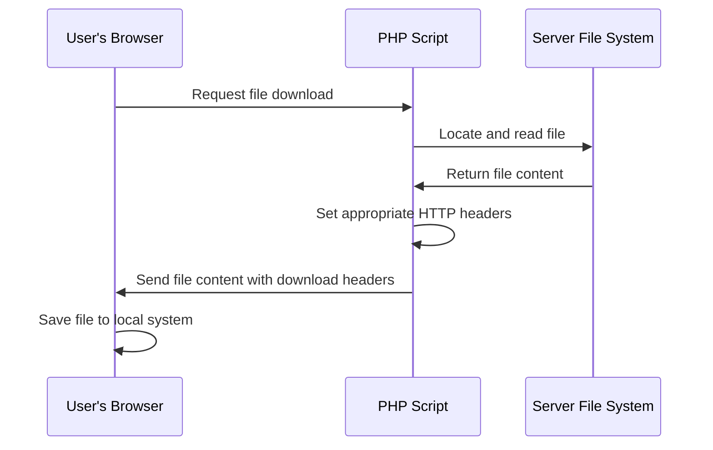

# PHP File Download

## Introduction

When building web applications, you often need to allow users to download files from your server. Whether it's downloading a generated PDF report, an image, a spreadsheet, or any other file type, PHP provides several methods to implement file download functionality.

In this tutorial, you'll learn how to create file download scripts in PHP, handle different file types, and implement security measures to ensure safe file downloads.

## Understanding File Downloads

When a user clicks on a download link, the browser needs to know that the response should be treated as a downloadable file rather than content to display. This is achieved using specific HTTP headers that PHP can generate.

The file download process generally works like this:



## Basic File Download in PHP

Let's start with a simple example of a PHP script that allows users to download a file:

```php
<?php
// Define the file path
$file = 'documents/sample.pdf';

// Check if file exists
if (file_exists($file)) {
    // Define headers
    header('Content-Description: File Transfer');
    header('Content-Type: application/pdf');
    header('Content-Disposition: attachment; filename="'.basename($file).'"');
    header('Expires: 0');
    header('Cache-Control: must-revalidate');
    header('Pragma: public');
    header('Content-Length: ' . filesize($file));
    
    // Clear output buffer
    ob_clean();
    flush();
    
    // Read the file and output its contents
    readfile($file);
    exit;
}
else {
    echo "The file does not exist.";
}
?>
```

### Key Components Explained:

1. **File Path**: Specify the location of the file on your server.
2. **File Existence Check**: Verify that the file exists before attempting to download it.
3. **HTTP Headers**:
   - `Content-Description`: Describes what's being sent.
   - `Content-Type`: Specifies the MIME type of the file.
   - `Content-Disposition`: Instructs the browser to download the file with the specified name.
   - `Expires`, `Cache-Control`, and `Pragma`: Control caching behavior.
   - `Content-Length`: Tells the browser the size of the file.
4. **Output Buffer Clearing**: `ob_clean()` and `flush()` help ensure no extra content is sent.
5. **File Reading**: `readfile()` reads the file and outputs its content to the browser.

## Handling Different File Types

Different file types require different Content-Type headers. Here's how to handle common file types:

```php
<?php
function downloadFile($file) {
    if (file_exists($file)) {
        // Get file extension
        $extension = strtolower(pathinfo($file, PATHINFO_EXTENSION));
        
        // Define content types for common extensions
        $contentTypes = [
            'pdf'  => 'application/pdf',
            'zip'  => 'application/zip',
            'jpg'  => 'image/jpeg',
            'png'  => 'image/png',
            'txt'  => 'text/plain',
            'doc'  => 'application/msword',
            'docx' => 'application/vnd.openxmlformats-officedocument.wordprocessingml.document',
            'xls'  => 'application/vnd.ms-excel',
            'xlsx' => 'application/vnd.openxmlformats-officedocument.spreadsheetml.sheet',
            'csv'  => 'text/csv'
        ];
        
        // Set content type based on file extension
        $contentType = isset($contentTypes[$extension]) ? $contentTypes[$extension] : 'application/octet-stream';
        
        // Set headers
        header('Content-Description: File Transfer');
        header("Content-Type: $contentType");
        header('Content-Disposition: attachment; filename="'.basename($file).'"');
        header('Expires: 0');
        header('Cache-Control: must-revalidate');
        header('Pragma: public');
        header('Content-Length: ' . filesize($file));
        
        // Clear output buffer
        ob_clean();
        flush();
        
        // Read file
        readfile($file);
        exit;
    } else {
        return false;
    }
}

// Usage
if (isset($_GET['file'])) {
    $file = 'uploads/' . $_GET['file'];
    if (!downloadFile($file)) {
        echo "File not found.";
    }
}
?>
```

In this example, we've created a reusable function that automatically detects the file type based on its extension and sets the appropriate content type. If the extension isn't in our list, it defaults to `application/octet-stream`, which is a generic binary file type that will trigger a download.

## Forcing a File to Download

Sometimes, even for file types that browsers typically display (like images or PDFs), you want to force the browser to download the file rather than display it. The key to this is the `Content-Disposition` header:

```php
// Force download (will not display in browser)
header('Content-Disposition: attachment; filename="'.basename($file).'"');

// Allow browser to display if possible
header('Content-Disposition: inline; filename="'.basename($file).'"');
```

## Creating Dynamic Files for Download

Sometimes you need to generate files on-the-fly rather than serving existing files. Here's an example that creates a CSV file dynamically:

```php
<?php
// Create a CSV file dynamically
function generateCSV() {
    // Sample data
    $data = [
        ['ID', 'Name', 'Email'],
        [1, 'John Doe', 'john@example.com'],
        [2, 'Jane Smith', 'jane@example.com'],
        [3, 'Bob Johnson', 'bob@example.com']
    ];
    
    // Set headers for download
    header('Content-Type: text/csv');
    header('Content-Disposition: attachment; filename="users.csv"');
    
    // Create a file pointer connected to the output stream
    $output = fopen('php://output', 'w');
    
    // Output each row of the data
    foreach ($data as $row) {
        fputcsv($output, $row);
    }
    
    // Close the file pointer
    fclose($output);
    exit;
}

// Call the function
generateCSV();
?>
```

### Output:
```
ID,Name,Email
1,"John Doe",john@example.com
2,"Jane Smith",jane@example.com
3,"Bob Johnson",bob@example.com
```

## Security Considerations

File downloads can introduce security risks if not properly implemented. Here are some best practices:

### 1. Validate and Sanitize Input

Never trust user input directly when determining file paths:

```php
<?php
// Bad - vulnerable to path traversal
$file = $_GET['file'];

// Better - restrict to specific directory and validate
$filename = basename($_GET['file']);
$file = 'safe_download_directory/' . $filename;

// Check that the file is actually in the intended directory
$realPath = realpath($file);
$downloadDir = realpath('safe_download_directory');
if ($realPath === false || strpos($realPath, $downloadDir) !== 0) {
    die("Invalid file request");
}
?>
```

### 2. Limit Access to Authorized Files

Create a system to determine which files a user is allowed to download:

```php
<?php
function canDownloadFile($userId, $fileId) {
    // Example logic - in a real app, you'd check a database
    $allowedFiles = [
        1 => [101, 102, 103], // User 1 can access files 101, 102, 103
        2 => [101, 104]       // User 2 can access files 101, 104
    ];
    
    return isset($allowedFiles[$userId]) && in_array($fileId, $allowedFiles[$userId]);
}

// Usage
$userId = getUserIdFromSession(); // Get logged-in user's ID
$fileId = (int)$_GET['file_id'];  // Get requested file ID

if (canDownloadFile($userId, $fileId)) {
    // Get file path from file ID (e.g., from database)
    $filePath = getFilePathFromId($fileId);
    // Proceed with download
    // ...
} else {
    http_response_code(403); // Forbidden
    echo "You don't have permission to download this file.";
}
?>
```

### 3. Use Tokens for Download Links

For extra security, especially for sensitive files, use temporary tokens:

```php
<?php
// Generate a download token
function generateDownloadToken($fileId, $expiryTime = 3600) {
    $secret = 'your-secret-key';
    $expires = time() + $expiryTime;
    $data = $fileId . '|' . $expires;
    $token = hash_hmac('sha256', $data, $secret) . '|' . $expires . '|' . $fileId;
    return $token;
}

// Validate a download token
function validateDownloadToken($token) {
    $secret = 'your-secret-key';
    $parts = explode('|', $token);
    
    if (count($parts) !== 3) {
        return false;
    }
    
    list($signature, $expires, $fileId) = $parts;
    
    // Check if token has expired
    if (time() > $expires) {
        return false;
    }
    
    // Verify signature
    $data = $fileId . '|' . $expires;
    $expectedSignature = hash_hmac('sha256', $data, $secret);
    
    if ($signature !== $expectedSignature) {
        return false;
    }
    
    return $fileId;
}

// Create a download link
$token = generateDownloadToken(123);
$downloadUrl = "download.php?token=" . urlencode($token);

// In download.php
if (isset($_GET['token'])) {
    $fileId = validateDownloadToken($_GET['token']);
    if ($fileId !== false) {
        // Get file path from file ID
        $filePath = getFilePathFromId($fileId);
        // Proceed with download
        // ...
    } else {
        echo "Invalid or expired download link.";
    }
}
?>
```

## Practical Example: Download Manager

Let's create a simple file download manager that lists available files and provides secure download links:

```php
<?php
// download-manager.php

// Function to generate a secure download token
function generateDownloadToken($filePath, $expiryTime = 3600) {
    $secret = 'your-secret-key';
    $expires = time() + $expiryTime;
    $data = $filePath . '|' . $expires;
    return hash_hmac('sha256', $data, $secret) . '|' . $expires . '|' . $filePath;
}

// List of available files (in a real app, this might come from a database)
$availableFiles = [
    [
        'id' => 1,
        'name' => 'Sample PDF',
        'path' => 'documents/sample.pdf',
        'size' => '2.5 MB',
        'type' => 'PDF'
    ],
    [
        'id' => 2,
        'name' => 'User Guide',
        'path' => 'documents/user-guide.docx',
        'size' => '1.8 MB',
        'type' => 'Word Document'
    ],
    [
        'id' => 3,
        'name' => 'Monthly Report',
        'path' => 'documents/report.xlsx',
        'size' => '4.2 MB',
        'type' => 'Excel Spreadsheet'
    ]
];
?>

<!DOCTYPE html>
<html lang="en">
<head>
    <meta charset="UTF-8">
    <meta name="viewport" content="width=device-width, initial-scale=1.0">
    <title>File Download Manager</title>
    <style>
        body { font-family: Arial, sans-serif; margin: 20px; }
        table { width: 100%; border-collapse: collapse; }
        th, td { padding: 10px; text-align: left; border-bottom: 1px solid #ddd; }
        th { background-color: #f2f2f2; }
        .download-btn { 
            display: inline-block;
            padding: 5px 10px;
            background-color: #4CAF50;
            color: white;
            text-decoration: none;
            border-radius: 4px;
        }
    </style>
</head>
<body>
    <h1>Available Files</h1>
    
    <table>
        <thead>
            <tr>
                <th>File Name</th>
                <th>Type</th>
                <th>Size</th>
                <th>Action</th>
            </tr>
        </thead>
        <tbody>
            <?php foreach ($availableFiles as $file): ?>
                <tr>
                    <td><?php echo htmlspecialchars($file['name']); ?></td>
                    <td><?php echo htmlspecialchars($file['type']); ?></td>
                    <td><?php echo htmlspecialchars($file['size']); ?></td>
                    <td>
                        <?php
                        $token = generateDownloadToken($file['path']);
                        $downloadUrl = "download.php?token=" . urlencode($token);
                        ?>
                        <a href="<?php echo $downloadUrl; ?>" class="download-btn">Download</a>
                    </td>
                </tr>
            <?php endforeach; ?>
        </tbody>
    </table>
</body>
</html>
```

And here's the corresponding download script:

```php
<?php
// download.php

// Function to validate a download token
function validateDownloadToken($token) {
    $secret = 'your-secret-key';
    $parts = explode('|', $token);
    
    if (count($parts) !== 3) {
        return false;
    }
    
    list($signature, $expires, $filePath) = $parts;
    
    // Check if token has expired
    if (time() > $expires) {
        return false;
    }
    
    // Verify signature
    $data = $filePath . '|' . $expires;
    $expectedSignature = hash_hmac('sha256', $data, $secret);
    
    if ($signature !== $expectedSignature) {
        return false;
    }
    
    return $filePath;
}

// Function to download a file
function downloadFile($file) {
    if (file_exists($file)) {
        // Get file extension
        $extension = strtolower(pathinfo($file, PATHINFO_EXTENSION));
        
        // Define content types for common extensions
        $contentTypes = [
            'pdf'  => 'application/pdf',
            'zip'  => 'application/zip',
            'jpg'  => 'image/jpeg',
            'png'  => 'image/png',
            'txt'  => 'text/plain',
            'doc'  => 'application/msword',
            'docx' => 'application/vnd.openxmlformats-officedocument.wordprocessingml.document',
            'xls'  => 'application/vnd.ms-excel',
            'xlsx' => 'application/vnd.openxmlformats-officedocument.spreadsheetml.sheet',
            'csv'  => 'text/csv'
        ];
        
        // Set content type based on file extension
        $contentType = isset($contentTypes[$extension]) ? $contentTypes[$extension] : 'application/octet-stream';
        
        // Set headers
        header('Content-Description: File Transfer');
        header("Content-Type: $contentType");
        header('Content-Disposition: attachment; filename="'.basename($file).'"');
        header('Expires: 0');
        header('Cache-Control: must-revalidate');
        header('Pragma: public');
        header('Content-Length: ' . filesize($file));
        
        // Clear output buffer
        ob_clean();
        flush();
        
        // Read file
        readfile($file);
        exit;
    } else {
        return false;
    }
}

// Main download logic
if (isset($_GET['token'])) {
    $filePath = validateDownloadToken($_GET['token']);
    if ($filePath !== false) {
        if (!downloadFile($filePath)) {
            http_response_code(404);
            echo "File not found.";
        }
    } else {
        http_response_code(403);
        echo "Invalid or expired download link.";
    }
} else {
    http_response_code(400);
    echo "No download token provided.";
}
?>
```

This implementation:
1. Lists available files with secure download links
2. Uses time-limited tokens to protect the downloads
3. Handles different file types appropriately
4. Implements security checks to prevent unauthorized access

## Sending Files With Custom Names

Sometimes you want the downloaded file to have a different name than the one stored on the server:

```php
<?php
$file = 'documents/report_20240303.pdf';
$customName = 'Annual_Report_2024.pdf';

header('Content-Disposition: attachment; filename="'.$customName.'"');
```

## Tracking Downloads

For analytics purposes, you might want to track file downloads:

```php
<?php
function trackDownload($fileId, $userId) {
    // In a real application, you would log to a database
    $logFile = 'download_logs.txt';
    $timestamp = date('Y-m-d H:i:s');
    $logEntry = "$timestamp | User ID: $userId | File ID: $fileId
";
    
    file_put_contents($logFile, $logEntry, FILE_APPEND);
}

// Usage in download script
if ($filePath = validateDownloadToken($_GET['token'])) {
    $userId = getUserIdFromSession(); // Get current user ID
    $fileId = getFileIdFromPath($filePath); // Get file ID from path
    
    // Track the download
    trackDownload($fileId, $userId);
    
    // Proceed with download
    downloadFile($filePath);
}
?>
```

## Summary

In this tutorial, you've learned how to:

1. Create basic file download functionality in PHP
2. Handle different file types with appropriate content types
3. Force files to download rather than display in the browser
4. Generate dynamic files for download
5. Implement security measures to protect your downloads
6. Create a practical file download manager
7. Customize filenames and track downloads

File downloads are an essential part of many web applications, and PHP provides all the tools you need to implement this functionality securely and efficiently.

## Additional Resources

- [PHP Manual: readfile()](https://www.php.net/manual/en/function.readfile.php)
- [PHP Manual: HTTP Headers](https://www.php.net/manual/en/function.header.php)
- [MIME Types List](https://developer.mozilla.org/en-US/docs/Web/HTTP/Basics_of_HTTP/MIME_types/Common_types)

## Exercises

1. Create a simple image gallery with download buttons for each image.
2. Implement a file uploader that allows users to upload files and then download them later.
3. Build a PDF generator that creates a custom report and offers it for download.
4. Extend the download manager example to include user authentication.
5. Create a rate-limiting system that prevents users from downloading too many files within a certain time period.