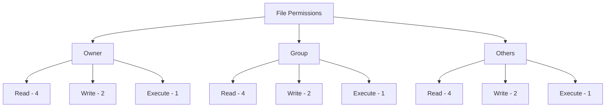

# PHP File Permissions

## Introduction

When working with files in PHP, understanding file permissions is crucial for both functionality and security. File permissions control who can read, write, or execute files on your server. Incorrect permissions can lead to security vulnerabilities or prevent your PHP scripts from working properly.

In this tutorial, we'll explore how PHP interacts with file permissions on servers, how to check and modify permissions, and best practices to secure your web applications.

## Understanding File Permissions

### Permission Basics

In Unix-like operating systems (which most web servers run on), file permissions are organized into three groups:

1. **Owner**: The user who owns the file
2. **Group**: The group the file belongs to
3. **Others**: Everyone else

For each group, there are three types of permissions:

1. **Read (r)**: Permission to view the file contents
2. **Write (w)**: Permission to modify the file
3. **Execute (x)**: Permission to run the file as a program

### Numeric Representation

File permissions are often represented as a 3-digit number, where each digit corresponds to the permissions for owner, group, and others respectively:

- **4**: Read permission
- **2**: Write permission
- **1**: Execute permission

These values are added together to get the permission for each group. For example:

- **7** (4+2+1): Read, write, and execute
- **6** (4+2): Read and write
- **5** (4+1): Read and execute
- **4** (4): Read only

A complete permission set might look like `755`, which means:
- Owner: Read (4) + Write (2) + Execute (1) = 7
- Group: Read (4) + Execute (1) = 5
- Others: Read (4) + Execute (1) = 5

### Visual Representation



## Checking File Permissions in PHP

PHP provides functions to check the current permissions of a file. Let's look at some examples:

### Using fileperms()

The `fileperms()` function returns the permissions for a file:

```php
<?php
$filename = 'example.txt';

// Get the file permissions
$perms = fileperms($filename);

// Convert to octal (base-8) representation
$octal_perms = substr(sprintf('%o', $perms), -4);

echo "Permissions for $filename: $octal_perms";
?>
```

**Output:**
```
Permissions for example.txt: 0644
```

### Using is_readable(), is_writable(), and is_executable()

PHP provides convenient functions to check specific permissions:

```php
<?php
$filename = 'example.txt';

if (file_exists($filename)) {
    echo "File exists<br>";
    
    if (is_readable($filename)) {
        echo "File is readable<br>";
    } else {
        echo "File is not readable<br>";
    }
    
    if (is_writable($filename)) {
        echo "File is writable<br>";
    } else {
        echo "File is not writable<br>";
    }
    
    if (is_executable($filename)) {
        echo "File is executable<br>";
    } else {
        echo "File is not executable<br>";
    }
} else {
    echo "File does not exist";
}
?>
```

**Output:**
```
File exists
File is readable
File is writable
File is not executable
```

## Changing File Permissions in PHP

To modify file permissions, PHP provides the `chmod()` function, which works similarly to the Unix chmod command.

### Basic chmod() Usage

```php
<?php
$filename = 'example.txt';

// Change permissions to 644 (Owner: read+write, Group: read, Others: read)
if (chmod($filename, 0644)) {
    echo "Permissions changed successfully";
} else {
    echo "Failed to change permissions";
}
?>
```

**Note:** The leading `0` is important as it indicates an octal (base-8) number.

### Setting Different Permission Levels

```php
<?php
// Create a new file
$filename = 'new_file.txt';
file_put_contents($filename, 'This is a test file.');

// Set different permissions for different scenarios
echo "Current permissions: " . substr(sprintf('%o', fileperms($filename)), -4) . "<br>";

// Make file readable and writable by owner only (600)
chmod($filename, 0600);
echo "After chmod 600: " . substr(sprintf('%o', fileperms($filename)), -4) . "<br>";

// Make file readable by everyone, writable by owner (644)
chmod($filename, 0644);
echo "After chmod 644: " . substr(sprintf('%o', fileperms($filename)), -4) . "<br>";

// Make file readable, writable, executable by owner, readable by others (744)
chmod($filename, 0744);
echo "After chmod 744: " . substr(sprintf('%o', fileperms($filename)), -4) . "<br>";
?>
```

**Output:**
```
Current permissions: 0644
After chmod 600: 0600
After chmod 644: 0644
After chmod 744: 0744
```

## Common Permission Scenarios for PHP Applications

Different files in your application may require different permission levels. Here are some common scenarios:

### 1. Regular PHP Files (644)

Regular PHP files that contain your code should typically have 644 permissions:
- Owner can read and write (modify the code)
- Group and others can only read (execute permission for PHP files is handled by the web server)

```php
<?php
// Set appropriate permissions for a PHP file
chmod('script.php', 0644);
?>
```

### 2. Directories (755)

Directories need the execute permission to allow users to access files inside them:

```php
<?php
// Set appropriate permissions for a directory
chmod('uploads', 0755);
?>
```

### 3. Upload Directories (777 with caution)

If your PHP script needs to write to a directory (e.g., for file uploads), you might need more permissive settings:

```php
<?php
// Create an uploads directory with appropriate permissions
if (!file_exists('uploads')) {
    mkdir('uploads', 0755);
    echo "Created uploads directory<br>";
}

// Check if PHP can write to the directory
if (is_writable('uploads')) {
    echo "PHP can write to the uploads directory";
} else {
    echo "PHP cannot write to the uploads directory";
    
    // WARNING: Use 777 only when absolutely necessary and with proper security measures
    // chmod('uploads', 0777);
}
?>
```

**Warning:** Setting `777` permissions (read, write, execute for everyone) is generally not recommended for security reasons. It's better to configure your web server to run PHP under the same user that owns the files.

## Practical Example: File Upload System

Let's create a complete example of a file upload system that properly handles permissions:

```php
<?php
// Define the upload directory
$uploadDir = 'uploads/';

// Create the directory if it doesn't exist with proper permissions
if (!file_exists($uploadDir)) {
    if (mkdir($uploadDir, 0755)) {
        echo "Created uploads directory with secure permissions<br>";
    } else {
        die("Failed to create uploads directory");
    }
}

// Process the file upload
if ($_SERVER['REQUEST_METHOD'] === 'POST' && isset($_FILES['userfile'])) {
    // Get the file information
    $tmpName = $_FILES['userfile']['tmp_name'];
    $fileName = basename($_FILES['userfile']['name']);
    $targetFile = $uploadDir . $fileName;
    
    // Move the uploaded file to our uploads directory
    if (move_uploaded_file($tmpName, $targetFile)) {
        echo "File uploaded successfully<br>";
        
        // Set secure permissions on the uploaded file (644 is a good default)
        if (chmod($targetFile, 0644)) {
            echo "Set secure permissions on the file<br>";
        } else {
            echo "Warning: Could not set permissions on the file<br>";
        }
        
        // Show file information
        echo "File: " . htmlspecialchars($fileName) . "<br>";
        echo "Size: " . filesize($targetFile) . " bytes<br>";
        echo "Permissions: " . substr(sprintf('%o', fileperms($targetFile)), -4) . "<br>";
    } else {
        echo "Error uploading file";
    }
}
?>

<!-- HTML form for file upload -->
<form enctype="multipart/form-data" method="post">
    <input type="file" name="userfile">
    <input type="submit" value="Upload">
</form>
```

## Security Considerations

### Minimum Necessary Permissions

Always follow the principle of least privilege. Set permissions to the minimum level necessary for your application to function:

- PHP files: 644 (rw-r--r--)
- Directories: 755 (rwxr-xr-x)
- Configuration files with sensitive data: 600 (rw-------)

### Avoid Default Upload Directories

Create custom upload directories outside the web root when possible, or use .htaccess rules to prevent direct access to uploaded files.

```php
<?php
// Create a secure upload directory
$uploadDir = '../secure_uploads/'; // Outside the web root
if (!file_exists($uploadDir)) {
    mkdir($uploadDir, 0755, true);
}

// Create .htaccess file to prevent direct access
$htaccess = $uploadDir . '.htaccess';
if (!file_exists($htaccess)) {
    file_put_contents($htaccess, "Deny from all
");
    chmod($htaccess, 0644);
}
?>
```

### Check Server Configuration

Remember that PHP runs with the permissions of the web server user (often www-data, apache, or nginx). This user must have appropriate access to the files and directories your script needs to work with.

## Troubleshooting Permission Issues

Common permission-related errors in PHP include:

1. **"Permission denied"**: The PHP process doesn't have sufficient permissions.
2. **"Failed to open stream"**: PHP can't read or write to a file.

Here's a troubleshooting script to help diagnose permission issues:

```php
<?php
function check_path_permissions($path) {
    echo "<h3>Checking: " . htmlspecialchars($path) . "</h3>";
    
    // Check if path exists
    if (!file_exists($path)) {
        echo "Path does not exist<br>";
        return;
    }
    
    // Get file info
    echo "Type: " . (is_file($path) ? "File" : "Directory") . "<br>";
    echo "Owner: " . posix_getpwuid(fileowner($path))['name'] . "<br>";
    echo "Group: " . posix_getgrgid(filegroup($path))['name'] . "<br>";
    echo "Permissions: " . substr(sprintf('%o', fileperms($path)), -4) . "<br>";
    
    // Check read/write/execute permissions
    echo "PHP can read: " . (is_readable($path) ? "Yes" : "No") . "<br>";
    echo "PHP can write: " . (is_writable($path) ? "Yes" : "No") . "<br>";
    echo "PHP can execute: " . (is_executable($path) ? "Yes" : "No") . "<br>";
    
    // Get PHP's user
    echo "<br>PHP is running as user: " . exec('whoami') . "<br>";
    echo "Server software: " . $_SERVER['SERVER_SOFTWARE'] . "<br>";
}

// Test a few paths
check_path_permissions('.');  // Current directory
check_path_permissions('./index.php');  // A PHP file
check_path_permissions('./uploads');  // Upload directory
?>
```

## Summary

Understanding file permissions is essential for PHP developers to create secure and functional web applications. In this tutorial, we covered:

- The basics of file permission systems (user, group, others)
- How to check file permissions using PHP functions
- How to modify permissions with chmod()
- Common permission scenarios for PHP applications
- Security considerations and best practices
- Troubleshooting permission-related issues

By applying these concepts, you'll be able to properly manage file access in your PHP applications, ensuring they're both functional and secure.

## Additional Resources

- [PHP Manual: chmod](https://www.php.net/manual/en/function.chmod.php)
- [PHP Manual: File System Functions](https://www.php.net/manual/en/ref.filesystem.php)
- [Linux File Permissions Explained](https://www.linux.com/training-tutorials/understanding-linux-file-permissions/)

## Exercises

1. Create a script that checks and displays the permissions of all files in a directory.
2. Build a simple file manager that allows users to view permissions and change them (with appropriate security measures).
3. Implement a secure upload system that automatically sets the correct permissions for different file types.
4. Research and implement a function that recursively changes permissions for all files in a directory structure.