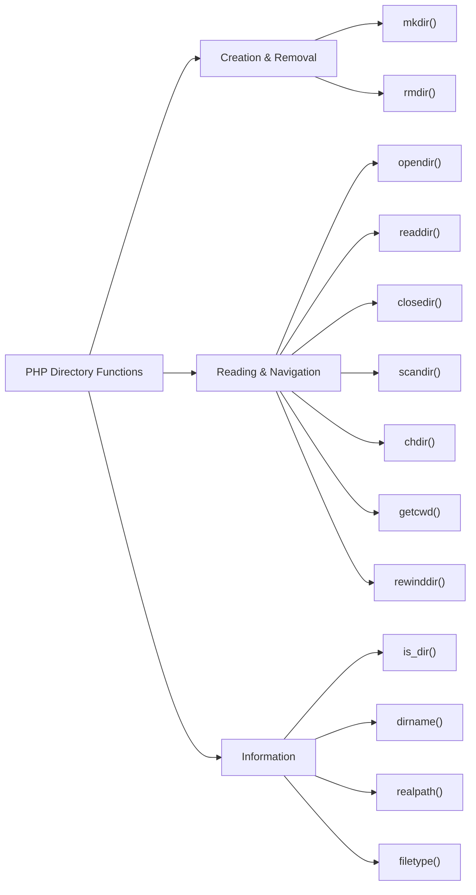

# PHP Directory Functions

## Introduction

When developing PHP applications, you'll often need to interact with the file system, particularly directories. PHP provides a powerful set of built-in functions that allow you to create, read, navigate, and manipulate directories on your server. These directory functions are essential tools for tasks like file management, content organization, and system administration.

In this guide, we'll explore the most commonly used PHP directory functions, understand how they work, and see how to implement them in real-world applications. By the end, you'll be comfortable working with directories in your PHP projects.

## Basic Directory Operations

### Checking If a Directory Exists

Before performing operations on a directory, it's often necessary to check if it exists. PHP provides the `is_dir()` function for this purpose.

```php
<?php
$directory = "uploads";

if (is_dir($directory)) {
    echo "The directory '$directory' exists.";
} else {
    echo "The directory '$directory' does not exist.";
}
?>
```

**Output (if directory doesn't exist):**
```
The directory 'uploads' does not exist.
```

### Creating a Directory

To create a new directory, use the `mkdir()` function. This function requires permissions to be set, typically using octal notation.

```php
<?php
$directory = "uploads";

// Create directory with permissions 0755 (commonly used)
if (!is_dir($directory)) {
    if (mkdir($directory, 0755)) {
        echo "Directory '$directory' created successfully.";
    } else {
        echo "Failed to create directory '$directory'.";
    }
} else {
    echo "Directory '$directory' already exists.";
}
?>
```

**Output (if successful):**
```
Directory 'uploads' created successfully.
```

The second parameter (`0755`) specifies the permissions:
- Owner: read, write, execute (7)
- Group: read, execute (5)
- Others: read, execute (5)

You can also create nested directories by using the recursive parameter:

```php
<?php
$nestedDirectory = "uploads/images/products";

// Create nested directories
if (!is_dir($nestedDirectory)) {
    if (mkdir($nestedDirectory, 0755, true)) {
        echo "Nested directories created successfully.";
    } else {
        echo "Failed to create nested directories.";
    }
}
?>
```

### Removing a Directory

To remove a directory, use the `rmdir()` function. Note that this function can only remove empty directories.

```php
<?php
$directory = "old_uploads";

if (is_dir($directory)) {
    if (rmdir($directory)) {
        echo "Directory '$directory' removed successfully.";
    } else {
        echo "Failed to remove directory. Make sure it's empty.";
    }
} else {
    echo "Directory does not exist.";
}
?>
```

**Output (if successful):**
```
Directory 'old_uploads' removed successfully.
```

## Reading Directory Contents

### Opening and Reading a Directory

PHP provides functions to open and read the contents of a directory:

```php
<?php
$directory = "uploads";

if (is_dir($directory)) {
    // Open the directory
    if ($handle = opendir($directory)) {
        echo "Files in directory '$directory':<br>";
        
        // Read directory contents
        while (($file = readdir($handle)) !== false) {
            // Skip . and .. entries
            if ($file != "." && $file != "..") {
                echo "$file<br>";
            }
        }
        
        // Close the directory handle
        closedir($handle);
    }
} else {
    echo "Directory does not exist.";
}
?>
```

**Output example:**
```
Files in directory 'uploads':
image1.jpg
document.pdf
config.txt
```

### Using scandir()

A simpler alternative is to use the `scandir()` function, which returns an array of all files and directories:

```php
<?php
$directory = "uploads";

if (is_dir($directory)) {
    $files = scandir($directory);
    
    echo "Files in directory '$directory':<br>";
    foreach ($files as $file) {
        // Skip . and .. entries
        if ($file != "." && $file != "..") {
            echo "$file<br>";
        }
    }
} else {
    echo "Directory does not exist.";
}
?>
```

### Getting Detailed Information

For more detailed information about files in a directory, you can combine directory functions with file functions:

```php
<?php
$directory = "uploads";

if (is_dir($directory)) {
    $files = scandir($directory);
    
    echo "<table border='1'>
            <tr>
                <th>Name</th>
                <th>Type</th>
                <th>Size (bytes)</th>
                <th>Last Modified</th>
            </tr>";
    
    foreach ($files as $file) {
        // Skip . and .. entries
        if ($file != "." && $file != "..") {
            $path = $directory . "/" . $file;
            $type = is_dir($path) ? "Directory" : "File";
            $size = is_file($path) ? filesize($path) : "-";
            $lastModified = date("Y-m-d H:i:s", filemtime($path));
            
            echo "<tr>
                    <td>$file</td>
                    <td>$type</td>
                    <td>$size</td>
                    <td>$lastModified</td>
                  </tr>";
        }
    }
    
    echo "</table>";
} else {
    echo "Directory does not exist.";
}
?>
```

## Directory Navigation

### Getting the Current Directory

To get the current working directory, use the `getcwd()` function:

```php
<?php
// Get current working directory
$currentDir = getcwd();
echo "Current working directory: $currentDir";
?>
```

**Output example:**
```
Current working directory: /var/www/html/myproject
```

### Changing Directories

You can change the current working directory using the `chdir()` function:

```php
<?php
// Display current directory
echo "Current directory: " . getcwd() . "<br>";

// Change to a different directory
if (chdir("../")) {
    echo "Changed to parent directory: " . getcwd() . "<br>";
} else {
    echo "Failed to change directory.<br>";
}
?>
```

## Advanced Directory Operations

### Recursive Directory Processing

When working with large directory structures, you might need to process directories recursively. Here's an example of a function that lists all files in a directory and its subdirectories:

```php
<?php
function listDirectoryContents($directory, $indent = 0) {
    if (!is_dir($directory)) {
        return false;
    }
    
    $files = scandir($directory);
    
    foreach ($files as $file) {
        if ($file != "." && $file != "..") {
            $path = $directory . "/" . $file;
            
            // Indent based on directory depth
            echo str_repeat("&nbsp;&nbsp;", $indent);
            
            if (is_dir($path)) {
                echo "📁 $file/<br>";
                // Recursively process subdirectory
                listDirectoryContents($path, $indent + 1);
            } else {
                echo "📄 $file<br>";
            }
        }
    }
    
    return true;
}

// Usage example
$rootDirectory = "project";
echo "<h3>Directory Contents:</h3>";
listDirectoryContents($rootDirectory);
?>
```

### Copying a Directory with Its Contents

PHP doesn't have a built-in function to copy an entire directory with its contents. Here's a custom function to accomplish this:

```php
<?php
function copyDirectory($source, $destination) {
    // Create destination directory if it doesn't exist
    if (!is_dir($destination)) {
        mkdir($destination, 0755, true);
    }
    
    // Open the source directory
    $dir = opendir($source);
    
    // Loop through the files in source directory
    while (($file = readdir($dir)) !== false) {
        if ($file != '.' && $file != '..') {
            $srcPath = $source . '/' . $file;
            $destPath = $destination . '/' . $file;
            
            if (is_dir($srcPath)) {
                // Recursively copy subdirectories
                copyDirectory($srcPath, $destPath);
            } else {
                // Copy files
                copy($srcPath, $destPath);
            }
        }
    }
    
    closedir($dir);
    return true;
}

// Usage example
$source = "original";
$destination = "backup";

if (copyDirectory($source, $destination)) {
    echo "Directory copied successfully!";
} else {
    echo "Failed to copy directory.";
}
?>
```

## Real-World Applications

### File Upload System

Here's an example of how directory functions can be used in a file upload system:

```php
<?php
// Define upload directory
$uploadDir = "uploads/" . date("Y/m/d/");

// Create date-based directory structure if it doesn't exist
if (!is_dir($uploadDir)) {
    mkdir($uploadDir, 0755, true);
}

// Process file upload
if ($_SERVER["REQUEST_METHOD"] === "POST" && isset($_FILES["file"])) {
    $file = $_FILES["file"];
    
    // Check for errors
    if ($file["error"] === UPLOAD_ERR_OK) {
        $fileName = basename($file["name"]);
        $targetPath = $uploadDir . $fileName;
        
        // Move the uploaded file to target location
        if (move_uploaded_file($file["tmp_name"], $targetPath)) {
            echo "File uploaded successfully to: $targetPath";
        } else {
            echo "Error moving uploaded file.";
        }
    } else {
        echo "Upload error: " . $file["error"];
    }
}
?>

<!-- Upload form -->
<form action="" method="post" enctype="multipart/form-data">
    <input type="file" name="file">
    <button type="submit">Upload</button>
</form>
```

### Simple File Manager

Here's a basic file manager example that uses directory functions:

```php
<?php
// Define the root directory
$rootDir = "files";
$currentDir = $rootDir;

// Handle directory navigation
if (isset($_GET["dir"]) && $_GET["dir"] != "") {
    $requestedDir = $_GET["dir"];
    
    // Validate directory path to prevent directory traversal attacks
    if (strpos($requestedDir, "..") === false && is_dir($requestedDir) && 
        strpos(realpath($requestedDir), realpath($rootDir)) === 0) {
        $currentDir = $requestedDir;
    }
}

// Get current directory contents
$files = scandir($currentDir);

// Display current path
$relativePath = str_replace($rootDir, "", $currentDir);
$pathParts = explode("/", trim($relativePath, "/"));
echo "<h2>File Manager</h2>";
echo "<p><strong>Current location:</strong> ";
echo "<a href='?dir=$rootDir'>Root</a> / ";

$breadcrumb = $rootDir;
foreach ($pathParts as $part) {
    if (!empty($part)) {
        $breadcrumb .= "/$part";
        echo "<a href='?dir=$breadcrumb'>$part</a> / ";
    }
}
echo "</p>";

// Display directory contents
echo "<table border='1' cellpadding='5'>
        <tr>
            <th>Name</th>
            <th>Type</th>
            <th>Size</th>
            <th>Modified</th>
        </tr>";

// Add parent directory link if not in root
if ($currentDir != $rootDir) {
    $parentDir = dirname($currentDir);
    echo "<tr>
            <td><a href='?dir=$parentDir'>..</a></td>
            <td>Directory</td>
            <td>-</td>
            <td>-</td>
          </tr>";
}

// List files and directories
foreach ($files as $file) {
    if ($file != "." && $file != "..") {
        $path = $currentDir . "/" . $file;
        $isDir = is_dir($path);
        
        echo "<tr>
                <td>";
        
        if ($isDir) {
            echo "<a href='?dir=$path'>$file/</a>";
        } else {
            echo $file;
        }
        
        echo "</td>
                <td>" . ($isDir ? "Directory" : "File") . "</td>
                <td>" . ($isDir ? "-" : filesize($path) . " bytes") . "</td>
                <td>" . date("Y-m-d H:i:s", filemtime($path)) . "</td>
              </tr>";
    }
}

echo "</table>";
?>
```

## Directory Function Reference

Here's a quick reference of the most common PHP directory functions:



| Function     | Description                                    |
|--------------|------------------------------------------------|
| `is_dir()`   | Checks if the path is a directory              |
| `mkdir()`    | Creates a directory                            |
| `rmdir()`    | Removes a directory (must be empty)            |
| `opendir()`  | Opens a directory for reading                  |
| `readdir()`  | Reads entries from a directory handle          |
| `closedir()` | Closes a directory handle                      |
| `scandir()`  | Returns an array of files and directories      |
| `getcwd()`   | Gets the current working directory             |
| `chdir()`    | Changes the current directory                  |
| `dirname()`  | Returns the directory path component of a path |
| `realpath()` | Returns the absolute path                      |

## Summary

PHP directory functions provide powerful tools for managing directories and files on your server. In this guide, we've covered:

- How to check if a directory exists using `is_dir()`
- Creating directories with `mkdir()`, including nested directories
- Removing directories with `rmdir()`
- Reading directory contents with `opendir()`, `readdir()`, and `scandir()`
- Navigating directories with `getcwd()` and `chdir()`
- Advanced operations like recursive directory processing
- Real-world applications including file uploaders and simple file managers

Mastering these directory functions will help you build more robust and feature-rich PHP applications that can effectively manage files and directories.

## Additional Resources and Exercises

### Exercises

1. **Build a Directory Size Calculator**: Write a script that calculates the total size of all files in a directory and its subdirectories.

2. **Create a Directory Backup Tool**: Create a script that automatically backs up a specified directory to another location, including all subdirectories and files.

3. **Implement a File Type Counter**: Write a function that counts how many files of each type (by extension) exist in a directory and its subdirectories.

4. **Build a Directory Synchronization Tool**: Create a script that synchronizes two directories, copying new or updated files from one to the other.

### Additional Resources

- [PHP Manual: Directory Functions](https://www.php.net/manual/en/ref.dir.php)
- [PHP Manual: Filesystem Functions](https://www.php.net/manual/en/ref.filesystem.php)
- [PHP The Right Way](https://phptherightway.com/)
- [PHP Security: Directory Traversal Attacks](https://www.owasp.org/index.php/Path_Traversal)