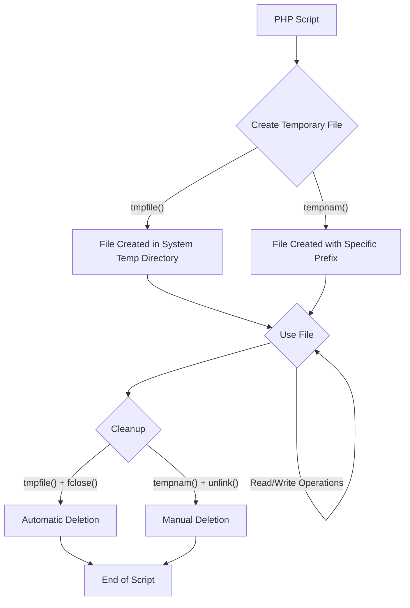

# PHP Temporary Files

## Introduction

Temporary files are an essential part of many PHP applications, providing a way to store data briefly during script execution without committing to permanent storage. Whether you're processing uploads, generating reports, or handling large datasets, understanding how to work with temporary files is a valuable skill for PHP developers.

In this tutorial, we'll explore PHP's built-in functions for creating and managing temporary files, best practices for their use, and practical examples to demonstrate their application in real-world scenarios.

## What Are Temporary Files?

Temporary files are files created to store data for a short period of time. They are typically:

- Automatically deleted after they are no longer needed
- Created in a designated temporary directory on the server
- Given unique names to avoid conflicts
- Used for intermediary processing tasks

PHP provides several functions to work with temporary files efficiently, making it easy to incorporate them into your applications.

## Creating Temporary Files in PHP

### Using `tmpfile()`

The simplest way to create a temporary file in PHP is using the `tmpfile()` function:

```php
<?php
// Create a temporary file
$temp_file = tmpfile();

if ($temp_file) {
    // Write some data to the file
    fwrite($temp_file, "This is some temporary data");
    
    // Get file information
    $meta_data = stream_get_meta_data($temp_file);
    $file_path = $meta_data['uri'];
    
    echo "Temporary file created at: " . $file_path . "<br>";
    
    // Read the data back
    fseek($temp_file, 0);
    $content = fread($temp_file, 1024);
    echo "Content: " . $content . "<br>";
    
    // The file will be automatically deleted when the script ends
    // or when you explicitly close it
    fclose($temp_file);
    echo "Temporary file closed and removed";
} else {
    echo "Failed to create temporary file";
}
?>
```

**Output:**
```
Temporary file created at: /tmp/phpXXXXXX
Content: This is some temporary data
Temporary file closed and removed
```

When you use `tmpfile()`, PHP:
1. Creates a file with a unique name in the system's temporary directory
2. Returns a file handle that you can use with file functions like `fwrite()` and `fread()`
3. Automatically deletes the file when the script ends or when you call `fclose()`

### Using `tempnam()`

For more control over where the temporary file is created and its naming, you can use the `tempnam()` function:

```php
<?php
// Specify directory and prefix
$temp_dir = sys_get_temp_dir();
$file_prefix = "myapp_";

// Create a temporary file with the specified prefix
$temp_file_path = tempnam($temp_dir, $file_prefix);

if ($temp_file_path) {
    echo "Temporary file created: " . $temp_file_path . "<br>";
    
    // Open the file for writing
    $handle = fopen($temp_file_path, "w");
    fwrite($handle, "This is data in a named temporary file");
    fclose($handle);
    
    // Read the data back
    $content = file_get_contents($temp_file_path);
    echo "Content: " . $content . "<br>";
    
    // You need to manually delete this file when done
    unlink($temp_file_path);
    echo "Temporary file deleted";
} else {
    echo "Failed to create temporary file";
}
?>
```

**Output:**
```
Temporary file created: /tmp/myapp_X1Y2Z3
Content: This is data in a named temporary file
Temporary file deleted
```

Unlike `tmpfile()`, when using `tempnam()`:
1. You get the file path as a string, not a file handle
2. You must manually open the file for reading/writing
3. You need to manually delete the file when finished using `unlink()`
4. You can specify the directory and a prefix for the filename

## Handling File Uploads with Temporary Files

When users upload files to your PHP application, the files are initially stored in a temporary location. Here's how to handle file uploads using PHP's temporary file mechanism:

```php
<?php
// Check if a file was uploaded
if ($_SERVER['REQUEST_METHOD'] === 'POST' && isset($_FILES['uploaded_file'])) {
    $file = $_FILES['uploaded_file'];
    
    if ($file['error'] === UPLOAD_ERR_OK) {
        // The file was uploaded successfully and is in a temporary location
        $temp_path = $file['tmp_name'];
        $original_name = $file['name'];
        $file_size = $file['size'];
        $file_type = $file['type'];
        
        echo "File uploaded successfully<br>";
        echo "Temporary path: " . $temp_path . "<br>";
        echo "Original name: " . $original_name . "<br>";
        echo "Size: " . $file_size . " bytes<br>";
        echo "Type: " . $file_type . "<br>";
        
        // Process the file
        // For example, read its content
        $content = file_get_contents($temp_path);
        echo "First 100 characters: " . substr($content, 0, 100) . "<br>";
        
        // Move the file to a permanent location if needed
        $upload_dir = "uploads/";
        if (!is_dir($upload_dir)) {
            mkdir($upload_dir, 0755, true);
        }
        
        $new_path = $upload_dir . basename($original_name);
        if (move_uploaded_file($temp_path, $new_path)) {
            echo "File saved permanently to: " . $new_path;
        } else {
            echo "Failed to save the file permanently";
        }
    } else {
        // Handle upload errors
        $error_messages = [
            UPLOAD_ERR_INI_SIZE => "The file exceeds the upload_max_filesize directive in php.ini",
            UPLOAD_ERR_FORM_SIZE => "The file exceeds the MAX_FILE_SIZE directive in the HTML form",
            UPLOAD_ERR_PARTIAL => "The file was only partially uploaded",
            UPLOAD_ERR_NO_FILE => "No file was uploaded",
            UPLOAD_ERR_NO_TMP_DIR => "Missing a temporary folder",
            UPLOAD_ERR_CANT_WRITE => "Failed to write file to disk",
            UPLOAD_ERR_EXTENSION => "A PHP extension stopped the file upload"
        ];
        
        echo "Upload failed: " . ($error_messages[$file['error']] ?? "Unknown error");
    }
}
?>

<!-- HTML form for file upload -->
<form method="POST" enctype="multipart/form-data">
    <input type="file" name="uploaded_file">
    <button type="submit">Upload</button>
</form>
```

When a file is uploaded:
1. PHP automatically creates a temporary file to store the uploaded content
2. Information about the file is available in the `$_FILES` superglobal
3. The temporary file is deleted when the script finishes execution
4. You must use `move_uploaded_file()` to save the file permanently

## Practical Uses for Temporary Files

### Example 1: Processing Large CSV Files

When dealing with large CSV files, temporary files can help manage memory efficiently:

```php
<?php
// Function to process a large CSV file
function process_large_csv($csv_path) {
    // Create a temporary file for the processed data
    $temp_file = tmpfile();
    $meta_data = stream_get_meta_data($temp_file);
    $temp_path = $meta_data['uri'];
    
    echo "Processing CSV and writing results to: " . $temp_path . "<br>";
    
    // Open the original CSV
    $handle = fopen($csv_path, "r");
    if ($handle) {
        // Process each line
        $row_count = 0;
        $total_value = 0;
        
        // Write headers to the temp file
        fwrite($temp_file, "Row,Value,IsAboveAverage
");
        
        // First pass: calculate the average
        $values = [];
        while (($data = fgetcsv($handle)) !== false) {
            if (isset($data[1]) && is_numeric($data[1])) {
                $values[] = (float)$data[1];
                $total_value += (float)$data[1];
            }
            $row_count++;
        }
        
        $average = count($values) > 0 ? $total_value / count($values) : 0;
        echo "Average value: " . $average . "<br>";
        
        // Reset the file pointer for the second pass
        rewind($handle);
        
        // Second pass: process each row and write to temp file
        $row_num = 0;
        while (($data = fgetcsv($handle)) !== false) {
            $row_num++;
            if ($row_num == 1) continue; // Skip header row
            
            if (isset($data[1]) && is_numeric($data[1])) {
                $value = (float)$data[1];
                $is_above_avg = $value > $average ? "Yes" : "No";
                fwrite($temp_file, "$row_num,$value,$is_above_avg
");
            }
        }
        fclose($handle);
        
        // Read back the processed data
        fseek($temp_file, 0);
        echo "<pre>";
        // Show the first 5 lines of the processed file
        for ($i = 0; $i < 5; $i++) {
            echo fgets($temp_file);
        }
        echo "</pre>";
        
        // Now you could do something with the processed data
        // For example, email it as an attachment or provide a download link
        
        fclose($temp_file); // This will delete the temporary file
        echo "Processing complete and temporary file removed";
    }
}

// Example usage with a sample CSV file
$csv_path = "data.csv";
// You would need to have a data.csv file or modify this path
if (file_exists($csv_path)) {
    process_large_csv($csv_path);
} else {
    echo "CSV file not found: " . $csv_path;
}
?>
```

### Example 2: Image Processing

Temporary files are useful when processing images:

```php
<?php
// Function to create a thumbnail
function create_thumbnail($source_image, $max_width = 200, $max_height = 200) {
    // Get image info
    $image_info = getimagesize($source_image);
    if (!$image_info) {
        return false;
    }
    
    $width = $image_info[0];
    $height = $image_info[1];
    $type = $image_info[2];
    
    // Calculate new dimensions while maintaining aspect ratio
    if ($width > $height) {
        $new_width = $max_width;
        $new_height = intval($height * $max_width / $width);
    } else {
        $new_height = $max_height;
        $new_width = intval($width * $max_height / $height);
    }
    
    // Create a temporary file for the thumbnail
    $temp_file = tempnam(sys_get_temp_dir(), "thumb_");
    
    // Create the thumbnail based on the image type
    switch ($type) {
        case IMAGETYPE_JPEG:
            $source = imagecreatefromjpeg($source_image);
            $thumbnail = imagecreatetruecolor($new_width, $new_height);
            imagecopyresampled($thumbnail, $source, 0, 0, 0, 0, $new_width, $new_height, $width, $height);
            imagejpeg($thumbnail, $temp_file, 90);
            break;
            
        case IMAGETYPE_PNG:
            $source = imagecreatefrompng($source_image);
            $thumbnail = imagecreatetruecolor($new_width, $new_height);
            // Preserve transparency
            imagealphablending($thumbnail, false);
            imagesavealpha($thumbnail, true);
            imagecopyresampled($thumbnail, $source, 0, 0, 0, 0, $new_width, $new_height, $width, $height);
            imagepng($thumbnail, $temp_file, 9);
            break;
            
        case IMAGETYPE_GIF:
            $source = imagecreatefromgif($source_image);
            $thumbnail = imagecreatetruecolor($new_width, $new_height);
            // Preserve transparency
            $transparent = imagecolorallocatealpha($thumbnail, 0, 0, 0, 127);
            imagecolortransparent($thumbnail, $transparent);
            imagefill($thumbnail, 0, 0, $transparent);
            imagecopyresampled($thumbnail, $source, 0, 0, 0, 0, $new_width, $new_height, $width, $height);
            imagegif($thumbnail, $temp_file);
            break;
            
        default:
            return false;
    }
    
    // Clean up
    imagedestroy($source);
    imagedestroy($thumbnail);
    
    return $temp_file;
}

// Example usage
if (isset($_GET['image']) && file_exists($_GET['image'])) {
    $image_path = $_GET['image'];
    $thumbnail_path = create_thumbnail($image_path);
    
    if ($thumbnail_path) {
        echo "Thumbnail created at: " . $thumbnail_path . "<br>";
        
        // Display the original and thumbnail
        echo "<h3>Original Image</h3>";
        echo "<br>";
        
        echo "<h3>Thumbnail</h3>";
        $data = file_get_contents($thumbnail_path);
        $base64 = base64_encode($data);
        
        // Get MIME type
        $image_info = getimagesize($thumbnail_path);
        $mime_type = $image_info['mime'];
        
        echo "<br>";
        
        // Clean up the temporary file
        unlink($thumbnail_path);
        echo "Temporary thumbnail file removed";
    } else {
        echo "Failed to create thumbnail";
    }
} else {
    echo "Please specify an image with the 'image' parameter";
}
?>
```

## Best Practices for Working with Temporary Files

When working with temporary files in PHP, follow these best practices to ensure your code is secure and efficient:

### 1. Always Check for Errors

```php
$temp_file = tmpfile();
if ($temp_file === false) {
    // Handle the error
    die("Could not create temporary file");
}
```

### 2. Clean Up After Yourself

With `tmpfile()`, files are automatically deleted when closed or when the script ends. With `tempnam()`, you need to manually delete files:

```php
$temp_file_path = tempnam(sys_get_temp_dir(), "prefix_");
// ...use the file...
// Remember to delete it when done
if (file_exists($temp_file_path)) {
    unlink($temp_file_path);
}
```

### 3. Use `register_shutdown_function()` for Safety

To ensure temporary files are deleted even if your script crashes:

```php
<?php
$temp_files = [];

function create_temp_file() {
    global $temp_files;
    $path = tempnam(sys_get_temp_dir(), "myapp_");
    $temp_files[] = $path;
    return $path;
}

function cleanup_temp_files() {
    global $temp_files;
    foreach ($temp_files as $file) {
        if (file_exists($file)) {
            unlink($file);
            echo "Cleaned up: $file<br>";
        }
    }
}

// Register the cleanup function to run when the script ends
register_shutdown_function('cleanup_temp_files');

// Now create and use temporary files
$file1 = create_temp_file();
$file2 = create_temp_file();

file_put_contents($file1, "Some data");
file_put_contents($file2, "More data");

echo "Created temporary files:<br>";
echo "$file1<br>";
echo "$file2<br>";

// Even if the script crashes here, the files will be cleaned up
// Uncomment the line below to test
// trigger_error("Simulated fatal error", E_USER_ERROR);
?>
```

### 4. Be Mindful of Permissions

Ensure your web server has appropriate permissions for the temporary directory:

```php
<?php
$temp_dir = sys_get_temp_dir();
if (!is_writable($temp_dir)) {
    die("Temporary directory is not writable: $temp_dir");
}

echo "Temporary directory is writable: $temp_dir";
?>
```

### 5. Use Unique File Names

When creating multiple temporary files, ensure they have unique names:

```php
<?php
function get_unique_temp_file($prefix = 'temp_') {
    return tempnam(sys_get_temp_dir(), $prefix . uniqid('', true) . '_');
}

$file1 = get_unique_temp_file('process_');
$file2 = get_unique_temp_file('process_');

echo "File 1: $file1<br>";
echo "File 2: $file2<br>";

// Clean up
unlink($file1);
unlink($file2);
?>
```

## Understanding Temporary File Directories

PHP uses a specific directory for temporary files, which can be configured in your `php.ini` file. Here's how you can check and work with this configuration:

```php
<?php
// Get the configured temporary directory
$configured_temp_dir = ini_get('upload_tmp_dir');
echo "Configured temp dir (upload_tmp_dir): " . ($configured_temp_dir ?: "Not set") . "<br>";

// Get the system's default temp directory
$sys_temp_dir = sys_get_temp_dir();
echo "System temp directory: $sys_temp_dir<br>";

// Check if it's writable
if (is_writable($sys_temp_dir)) {
    echo "The temporary directory is writable<br>";
} else {
    echo "The temporary directory is NOT writable<br>";
}

// Show temp directory space
if (function_exists('disk_free_space')) {
    $free_space = disk_free_space($sys_temp_dir);
    $free_space_mb = round($free_space / (1024 * 1024), 2);
    echo "Free space in temp directory: $free_space_mb MB<br>";
}
?>
```

## Using Temporary Files with Streams

PHP's streams API provides an advanced way to work with temporary files:

```php
<?php
// Create a memory-based temporary "file"
$temp = fopen("php://temp", "r+");
fwrite($temp, "This is stored in memory initially");
fwrite($temp, " but will be moved to a temporary file if it gets too large");

// Get the current position
$pos = ftell($temp);
echo "Data size: $pos bytes<br>";

// Read the data back
rewind($temp);
$data = fread($temp, $pos);
echo "Data: $data<br>";

fclose($temp);
?>
```

The `php://temp` stream is particularly useful because:
1. It stores small amounts of data in memory for speed
2. It automatically switches to a disk-based temporary file if the data exceeds a certain size
3. It's deleted automatically when closed

## Temporary Directories

Sometimes you need a whole temporary directory, not just a file:

```php
<?php
/**
 * Create a temporary directory
 * @param string $base_dir Base directory where to create the temp dir
 * @param string $prefix Prefix for the directory name
 * @return string|false The path to the created directory or false on failure
 */
function create_temp_directory($base_dir = null, $prefix = 'temp_') {
    // Use system temp dir if no base dir provided
    if ($base_dir === null) {
        $base_dir = sys_get_temp_dir();
    }
    
    // Ensure base directory exists and is writable
    if (!is_dir($base_dir) || !is_writable($base_dir)) {
        return false;
    }
    
    // Try to create a unique directory name
    $attempts = 0;
    do {
        $unique = uniqid($prefix, true);
        $temp_dir = $base_dir . DIRECTORY_SEPARATOR . $unique;
        $attempts++;
    } while (file_exists($temp_dir) && $attempts < 50);
    
    // Create the directory
    if (mkdir($temp_dir, 0755)) {
        return $temp_dir;
    }
    
    return false;
}

/**
 * Recursively delete a directory and its contents
 * @param string $dir Directory to delete
 * @return bool Success or failure
 */
function remove_directory($dir) {
    if (!is_dir($dir)) {
        return false;
    }
    
    $files = array_diff(scandir($dir), ['.', '..']);
    foreach ($files as $file) {
        $path = $dir . DIRECTORY_SEPARATOR . $file;
        if (is_dir($path)) {
            remove_directory($path);
        } else {
            unlink($path);
        }
    }
    
    return rmdir($dir);
}

// Create a temporary directory
$temp_dir = create_temp_directory();

if ($temp_dir) {
    echo "Temporary directory created: $temp_dir<br>";
    
    // Create some files in the directory
    file_put_contents($temp_dir . DIRECTORY_SEPARATOR . "file1.txt", "Content of file 1");
    file_put_contents($temp_dir . DIRECTORY_SEPARATOR . "file2.txt", "Content of file 2");
    
    // Create a subdirectory
    mkdir($temp_dir . DIRECTORY_SEPARATOR . "subdir");
    file_put_contents($temp_dir . DIRECTORY_SEPARATOR . "subdir" . DIRECTORY_SEPARATOR . "file3.txt", "Content of file 3");
    
    // List the contents
    echo "Files created in the temporary directory:<br>";
    $iterator = new RecursiveIteratorIterator(
        new RecursiveDirectoryIterator($temp_dir, RecursiveDirectoryIterator::SKIP_DOTS),
        RecursiveIteratorIterator::SELF_FIRST
    );
    
    foreach ($iterator as $file) {
        $relative_path = str_replace($temp_dir . DIRECTORY_SEPARATOR, '', $file);
        echo $relative_path . "<br>";
    }
    
    // Clean up
    if (remove_directory($temp_dir)) {
        echo "Temporary directory and all its contents removed successfully";
    } else {
        echo "Failed to remove temporary directory";
    }
} else {
    echo "Failed to create temporary directory";
}
?>
```

## How Temporary Files Work in PHP: A Visual Explanation



## Summary

Temporary files in PHP are a powerful tool for handling data processing, file uploads, and various tasks that require intermediate storage. By using PHP's built-in functions like `tmpfile()` and `tempnam()`, you can create and manage temporary files efficiently.

Key takeaways from this tutorial:
- Use `tmpfile()` for simple temporary file handling with automatic cleanup
- Use `tempnam()` when you need more control over file naming and location
- Always check for errors when creating temporary files
- Ensure proper cleanup, especially when using `tempnam()`
- Consider using stream wrappers like `php://temp` for memory-efficient operations
- Implement proper error handling and security measures

## Additional Resources and Exercises

### Further Reading
- [PHP File System Functions Documentation](https://www.php.net/manual/en/book.filesystem.php)
- [PHP Streams Documentation](https://www.php.net/manual/en/book.stream.php)
- [PHP Upload Handling Documentation](https://www.php.net/manual/en/features.file-upload.php)

### Exercises

1. **Basic Exercise**: Create a script that generates a temporary file, writes the current date and time to it, reads it back, and then ensures it's properly deleted.

2. **Intermediate Exercise**: Implement a file upload system that stores uploads in temporary files, validates them (checks file type, size, etc.), and then moves valid files to a permanent location.

3. **Advanced Exercise**: Create a class that manages a pool of temporary files and directories, tracking their creation and ensuring they're all cleaned up when the script finishes execution.

4. **Challenge Exercise**: Build a simple file conversion tool that accepts an uploaded CSV file, converts it to JSON format using a temporary file for processing, and then offers the JSON file for download.