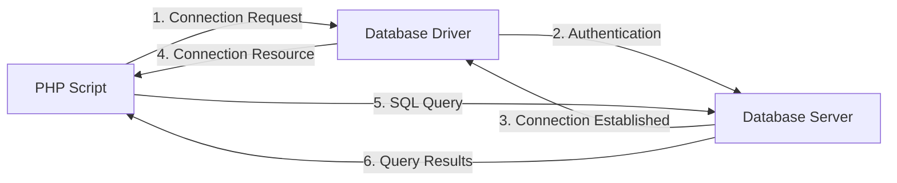

# PHP Database Introduction

## What are Databases in Web Development?

Databases are essential components of dynamic websites and web applications. They allow you to store, organize, retrieve, and manipulate large amounts of data efficiently. When you build websites that need to remember information (like user accounts, product listings, or blog posts), databases provide the perfect solution.

In this tutorial, we'll explore how PHP interacts with databases, with a focus on MySQL/MariaDB - one of the most popular database systems used with PHP.

## Why Connect PHP to Databases?

Before diving into the technical details, let's understand why connecting PHP to databases is so important:

1. **Data Persistence**: Store information that needs to remain available between user sessions
2. **Scalability**: Handle large amounts of structured data efficiently
3. **Data Security**: Control access to sensitive information
4. **Dynamic Content**: Create websites that display different content based on user preferences or actions
5. **Separation of Concerns**: Keep your data separate from your application code

## Database Management Systems (DBMS)

A Database Management System is software that manages databases. Popular DBMS options that work well with PHP include:

- **MySQL/MariaDB**: Open-source, widely used, excellent documentation
- **PostgreSQL**: Advanced open-source DBMS with powerful features
- **SQLite**: Lightweight, file-based database system
- **Microsoft SQL Server**: Enterprise-level DBMS
- **Oracle**: Enterprise-level DBMS for large applications

For this introduction, we'll focus on MySQL/MariaDB, as it's the most commonly used database system with PHP.

## The Database Connection Process

Here's a visual representation of how PHP connects to a database:



## Setting Up Your Environment

Before you can connect to a database from PHP, you need:

1. A web server with PHP installed
2. A database server (like MySQL)
3. The appropriate PHP database extension enabled

Most modern development environments like XAMPP, WAMP, MAMP, or Laravel Homestead include these components already configured.

## PHP Database Extensions

PHP offers several ways to connect to databases:

1. **MySQLi Extension** (MySQL Improved) - Specifically for MySQL databases
2. **PDO (PHP Data Objects)** - A database-agnostic approach that works with multiple database types

Both have their advantages, but PDO is generally recommended for new projects because it supports multiple database types and offers prepared statements for better security.

## Making Your First Database Connection

Let's look at how to connect to a MySQL database using both methods:

### Connection with MySQLi (Procedural Style)

```php
<?php
// Database credentials
$servername = "localhost";
$username = "username";
$password = "password";
$dbname = "myDB";

// Create connection
$conn = mysqli_connect($servername, $username, $password, $dbname);

// Check connection
if (!$conn) {
    die("Connection failed: " . mysqli_connect_error());
}
echo "Connected successfully!";

// Close connection when done
mysqli_close($conn);
?>
```

**Output if successful:**
```
Connected successfully!
```

**Output if connection fails:**
```
Connection failed: [Error message will appear here]
```

### Connection with MySQLi (Object-Oriented Style)

```php
<?php
// Database credentials
$servername = "localhost";
$username = "username";
$password = "password";
$dbname = "myDB";

// Create connection
$conn = new mysqli($servername, $username, $password, $dbname);

// Check connection
if ($conn->connect_error) {
    die("Connection failed: " . $conn->connect_error);
}
echo "Connected successfully!";

// Close connection when done
$conn->close();
?>
```

### Connection with PDO

```php
<?php
// Database credentials
$servername = "localhost";
$username = "username";
$password = "password";
$dbname = "myDB";

try {
    // Create connection
    $conn = new PDO("mysql:host=$servername;dbname=$dbname", $username, $password);
    
    // Set error mode to exception
    $conn->setAttribute(PDO::ATTR_ERRMODE, PDO::ERRMODE_EXCEPTION);
    
    echo "Connected successfully!";
} catch(PDOException $e) {
    echo "Connection failed: " . $e->getMessage();
}

// Connection is automatically closed when the script ends
// But you can close it explicitly with:
// $conn = null;
?>
```

## Choosing Between MySQLi and PDO

Here's a comparison to help you decide which extension to use:

| Feature | MySQLi | PDO |
|---------|--------|-----|
| Database Support | MySQL only | Multiple databases |
| API | Procedural & OO | Object-oriented only |
| Named Parameters | No | Yes |
| Object Mapping | No | Yes |
| Prepared Statements | Yes | Yes |
| Stored Procedures | Yes | Yes |
| Multiple Statements | Yes | Most database drivers |

For beginners, PDO is often recommended because:
1. It works with 12+ different databases
2. It uses the same methods regardless of which database you're using
3. It provides a more secure way to write SQL queries using prepared statements
4. It's generally more feature-rich

## Basic Database Operations

Once connected, you'll usually perform these basic operations (often called CRUD):

1. **Create** (INSERT) - Add new records to a database
2. **Read** (SELECT) - Retrieve data from a database
3. **Update** (UPDATE) - Modify existing records
4. **Delete** (DELETE) - Remove records from a database

### Example: Reading Data from a Database

Let's see how to retrieve data from a table called "users":

```php
<?php
// PDO connection code (from earlier example)
// ...

try {
    // Create connection
    $conn = new PDO("mysql:host=$servername;dbname=$dbname", $username, $password);
    $conn->setAttribute(PDO::ATTR_ERRMODE, PDO::ERRMODE_EXCEPTION);
    
    // Prepare and execute the query
    $stmt = $conn->prepare("SELECT id, firstname, lastname, email FROM users");
    $stmt->execute();
    
    // Set the resulting array to associative
    $result = $stmt->setFetchMode(PDO::FETCH_ASSOC);
    
    // Display the results
    echo "<h2>User List</h2>";
    echo "<table border='1'>";
    echo "<tr><th>ID</th><th>First Name</th><th>Last Name</th><th>Email</th></tr>";
    
    foreach($stmt->fetchAll() as $row) {
        echo "<tr>";
        echo "<td>" . $row['id'] . "</td>";
        echo "<td>" . $row['firstname'] . "</td>";
        echo "<td>" . $row['lastname'] . "</td>";
        echo "<td>" . $row['email'] . "</td>";
        echo "</tr>";
    }
    echo "</table>";
} catch(PDOException $e) {
    echo "Error: " . $e->getMessage();
}

$conn = null;
?>
```

**Sample Output:**
```
User List
-----------------------------
ID | First Name | Last Name | Email
-----------------------------
1  | John       | Doe       | john@example.com
2  | Jane       | Smith     | jane@example.com
3  | Bob        | Johnson   | bob@example.com
```

## Database Security: Preventing SQL Injection

One of the most critical aspects of database programming is security. SQL injection is a common attack technique where malicious SQL code is inserted into queries.

### Unsafe Way (DO NOT USE):

```php
<?php
// VULNERABLE CODE - NEVER USE THIS IN PRODUCTION
$username = $_POST['username']; // User input
$query = "SELECT * FROM users WHERE username = '$username'";
// If $username contains: ' OR '1'='1
// The query becomes: SELECT * FROM users WHERE username = '' OR '1'='1'
// This would return all users!
?>
```

### Safe Way Using Prepared Statements:

```php
<?php
// Using PDO prepared statements
try {
    $conn = new PDO("mysql:host=$servername;dbname=$dbname", $username, $password);
    $conn->setAttribute(PDO::ATTR_ERRMODE, PDO::ERRMODE_EXCEPTION);
    
    // Prepare statement with placeholder
    $stmt = $conn->prepare("SELECT * FROM users WHERE username = :username");
    
    // Bind parameters
    $stmt->bindParam(':username', $_POST['username']);
    
    // Execute query
    $stmt->execute();
    
    // Process results...
    
} catch(PDOException $e) {
    echo "Error: " . $e->getMessage();
}
?>
```

## Real-World Example: Simple User Registration System

Let's create a practical example of a simple user registration system:

```php
<?php
// Database connection details
$servername = "localhost";
$username = "username";
$password = "password";
$dbname = "myWebsite";

// Function to safely register a new user
function registerUser($email, $username, $password) {
    global $servername, $username as $db_username, $password as $db_password, $dbname;
    
    try {
        // Create connection
        $conn = new PDO("mysql:host=$servername;dbname=$dbname", $db_username, $db_password);
        $conn->setAttribute(PDO::ATTR_ERRMODE, PDO::ERRMODE_EXCEPTION);
        
        // Hash the password
        $hashed_password = password_hash($password, PASSWORD_DEFAULT);
        
        // Check if username already exists
        $check = $conn->prepare("SELECT COUNT(*) FROM users WHERE username = :username OR email = :email");
        $check->bindParam(':username', $username);
        $check->bindParam(':email', $email);
        $check->execute();
        
        if ($check->fetchColumn() > 0) {
            return "Username or email already exists.";
        }
        
        // Prepare SQL statement
        $stmt = $conn->prepare("INSERT INTO users (email, username, password, registration_date) 
                                VALUES (:email, :username, :password, NOW())");
        
        // Bind parameters
        $stmt->bindParam(':email', $email);
        $stmt->bindParam(':username', $username);
        $stmt->bindParam(':password', $hashed_password);
        
        // Execute query
        $stmt->execute();
        
        return "Registration successful!";
    } catch(PDOException $e) {
        return "Error: " . $e->getMessage();
    }
}

// Example usage
if ($_SERVER["REQUEST_METHOD"] == "POST") {
    $result = registerUser($_POST['email'], $_POST['username'], $_POST['password']);
    echo $result;
}
?>

<!-- HTML Registration Form -->
<form method="post" action="<?php echo htmlspecialchars($_SERVER["PHP_SELF"]); ?>">
    <h2>Register Account</h2>
    <div>
        <label for="email">Email:</label>
        <input type="email" name="email" required>
    </div>
    <div>
        <label for="username">Username:</label>
        <input type="text" name="username" required>
    </div>
    <div>
        <label for="password">Password:</label>
        <input type="password" name="password" required>
    </div>
    <div>
        <input type="submit" value="Register">
    </div>
</form>
```

This example demonstrates:
1. Connecting to a database
2. Using prepared statements to prevent SQL injection
3. Checking if a username/email already exists
4. Properly hashing passwords
5. Inserting new records
6. Error handling

## Common Database Functions in PHP

Here are some common database functions you'll use frequently:

### For MySQLi (Procedural)

| Function | Description |
|----------|-------------|
| mysqli_connect() | Opens a connection to a MySQL database |
| mysqli_query() | Executes an SQL query |
| mysqli_fetch_assoc() | Fetches a result row as an associative array |
| mysqli_fetch_array() | Fetches a result row as an associative, numeric array, or both |
| mysqli_num_rows() | Returns the number of rows in a result set |
| mysqli_error() | Returns the last error description |
| mysqli_close() | Closes a previously opened database connection |

### For PDO

| Method | Description |
|--------|-------------|
| PDO::__construct() | Creates a PDO instance representing a connection |
| PDO::prepare() | Prepares a statement for execution |
| PDOStatement::execute() | Executes a prepared statement |
| PDOStatement::fetch() | Fetches the next row from a result set |
| PDOStatement::fetchAll() | Fetches all rows from a result set |
| PDOStatement::rowCount() | Returns the number of rows affected by the last statement |
| PDO::lastInsertId() | Returns the ID of the last inserted row |

## Summary

In this introduction to PHP databases, we've covered:

1. The importance of databases in web development
2. Different database management systems that work with PHP
3. PHP's database extensions: MySQLi and PDO
4. How to establish database connections
5. Basic database operations
6. SQL injection prevention
7. A practical example of a user registration system

Databases are fundamental to creating dynamic websites. While there's much more to learn, this introduction gives you the foundation needed to start incorporating databases into your PHP projects.

## Additional Resources

To continue learning about PHP and databases, check out these resources:

- [PHP Manual: MySQLi Extension](https://www.php.net/manual/en/book.mysqli.php)
- [PHP Manual: PDO Extension](https://www.php.net/manual/en/book.pdo.php)
- [MySQL Documentation](https://dev.mysql.com/doc/)
- [W3Schools PHP MySQL Tutorial](https://www.w3schools.com/php/php_mysql_intro.asp)

## Exercises

1. Create a simple database with a "products" table that has fields for id, name, description, price, and category.
2. Write a PHP script that connects to your database and displays all products in an HTML table.
3. Create a form that allows adding new products to the database.
4. Implement a search feature that lets users find products by name or category.
5. Add functionality to update and delete products.

By practicing these exercises, you'll gain hands-on experience with PHP database operations and improve your skills in web development.