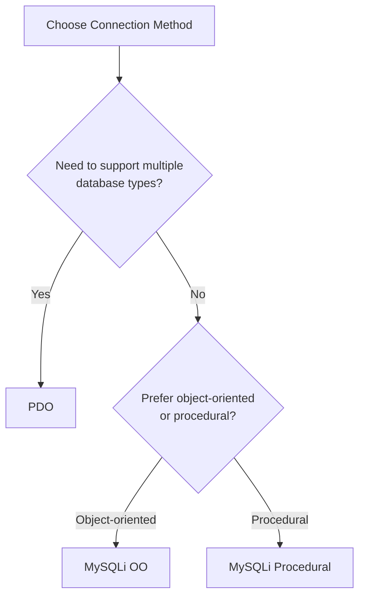
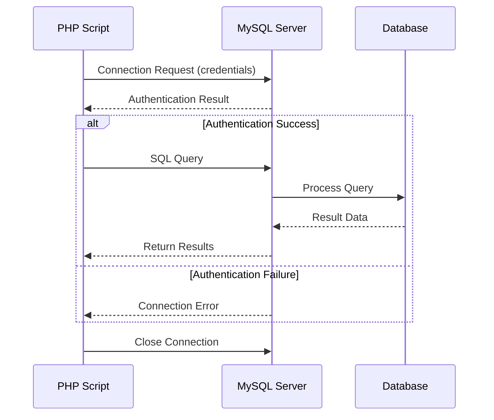

# PHP MySQL Connection

## Introduction

Connecting PHP to MySQL is a fundamental skill for developing dynamic web applications. This connection allows your PHP scripts to interact with a MySQL database, enabling you to store, retrieve, update, and delete data. This capability transforms static websites into dynamic, data-driven applications.

In this tutorial, you'll learn:
- Why PHP and MySQL work so well together
- Different methods to establish a connection
- How to execute queries and handle results
- Best practices for secure database connections

## Why Use PHP with MySQL?

PHP and MySQL are commonly used together because:

1. **Compatibility**: Both technologies are designed to work seamlessly together
2. **Open-source**: Both are free to use and have large community support
3. **Performance**: The combination offers excellent performance for web applications
4. **Flexibility**: They can handle various types of web projects, from simple blogs to complex e-commerce sites

## Prerequisites

Before connecting to MySQL with PHP, ensure you have:

- PHP installed (version 5.6 or higher recommended)
- MySQL server installed and running
- Database credentials (hostname, username, password, database name)
- Basic understanding of PHP syntax
- Basic knowledge of SQL queries

## Database Connection Methods

PHP offers two main approaches to connect to MySQL databases:

1. **MySQLi (MySQL Improved)** - Available since PHP 5
2. **PDO (PHP Data Objects)** - A database abstraction layer

Let's explore both methods.

## Connecting with MySQLi

MySQLi provides an object-oriented interface (as well as a procedural one) for interacting with MySQL.

### Procedural MySQLi Connection

```php
<?php
// Connection variables
$servername = "localhost";
$username = "root";
$password = "your_password";
$dbname = "your_database";

// Create connection
$conn = mysqli_connect($servername, $username, $password, $dbname);

// Check connection
if (!$conn) {
    die("Connection failed: " . mysqli_connect_error());
}
echo "Connected successfully!";

// Close connection
mysqli_close($conn);
?>
```

**Output (if successful):**
```
Connected successfully!
```

### Object-Oriented MySQLi Connection

```php
<?php
// Connection variables
$servername = "localhost";
$username = "root";
$password = "your_password";
$dbname = "your_database";

// Create connection
$conn = new mysqli($servername, $username, $password, $dbname);

// Check connection
if ($conn->connect_error) {
    die("Connection failed: " . $conn->connect_error);
}
echo "Connected successfully!";

// Close connection
$conn->close();
?>
```

## Connecting with PDO

PDO offers a more versatile approach as it supports multiple database systems, not just MySQL.

```php
<?php
// Connection variables
$servername = "localhost";
$username = "root";
$password = "your_password";
$dbname = "your_database";

try {
    // Create connection
    $conn = new PDO("mysql:host=$servername;dbname=$dbname", $username, $password);
    
    // Set the PDO error mode to exception
    $conn->setAttribute(PDO::ATTR_ERRMODE, PDO::ERRMODE_EXCEPTION);
    
    echo "Connected successfully!";
} catch(PDOException $e) {
    echo "Connection failed: " . $e->getMessage();
}

// Connection is automatically closed when the script ends
// But you can close it explicitly:
$conn = null;
?>
```

## MySQLi vs PDO: Which One to Choose?

Here's a comparison to help you decide:



**PDO advantages:**
- Works with multiple database systems
- Consistent error handling with exceptions
- Named parameters in prepared statements
- Generally more features and flexibility

**MySQLi advantages:**
- Slightly better performance with MySQL
- Offers both procedural and object-oriented interfaces
- Built specifically for MySQL

For beginners, either option is fine, but PDO offers more versatility for future projects.

## Executing Queries

Once connected, you can execute SQL queries to interact with your database.

### Using MySQLi (Object-Oriented)

```php
<?php
// Connection setup
$servername = "localhost";
$username = "root";
$password = "your_password";
$dbname = "your_database";

$conn = new mysqli($servername, $username, $password, $dbname);

if ($conn->connect_error) {
    die("Connection failed: " . $conn->connect_error);
}

// Execute query - Create a users table
$sql = "CREATE TABLE IF NOT EXISTS users (
    id INT(6) UNSIGNED AUTO_INCREMENT PRIMARY KEY,
    firstname VARCHAR(30) NOT NULL,
    lastname VARCHAR(30) NOT NULL,
    email VARCHAR(50) UNIQUE,
    registration_date TIMESTAMP DEFAULT CURRENT_TIMESTAMP
)";

if ($conn->query($sql) === TRUE) {
    echo "Table 'users' created successfully or already exists<br>";
} else {
    echo "Error creating table: " . $conn->error . "<br>";
}

// Insert data
$sql = "INSERT INTO users (firstname, lastname, email) 
        VALUES ('John', 'Doe', 'john@example.com')";

if ($conn->query($sql) === TRUE) {
    echo "New record created successfully<br>";
} else {
    echo "Error: " . $sql . "<br>" . $conn->error;
}

$conn->close();
?>
```

**Output:**
```
Table 'users' created successfully or already exists
New record created successfully
```

### Using PDO

```php
<?php
// Connection setup
$servername = "localhost";
$username = "root";
$password = "your_password";
$dbname = "your_database";

try {
    $conn = new PDO("mysql:host=$servername;dbname=$dbname", $username, $password);
    $conn->setAttribute(PDO::ATTR_ERRMODE, PDO::ERRMODE_EXCEPTION);
    
    // Create table
    $sql = "CREATE TABLE IF NOT EXISTS users (
        id INT(6) UNSIGNED AUTO_INCREMENT PRIMARY KEY,
        firstname VARCHAR(30) NOT NULL,
        lastname VARCHAR(30) NOT NULL,
        email VARCHAR(50) UNIQUE,
        registration_date TIMESTAMP DEFAULT CURRENT_TIMESTAMP
    )";
    
    $conn->exec($sql);
    echo "Table 'users' created successfully or already exists<br>";
    
    // Insert data
    $sql = "INSERT INTO users (firstname, lastname, email) 
            VALUES ('Jane', 'Smith', 'jane@example.com')";
    
    $conn->exec($sql);
    echo "New record created successfully<br>";
    
} catch(PDOException $e) {
    echo $sql . "<br>" . $e->getMessage();
}

$conn = null;
?>
```

## Retrieving Data from Database

### Using MySQLi

```php
<?php
// Connection setup
$servername = "localhost";
$username = "root";
$password = "your_password";
$dbname = "your_database";

$conn = new mysqli($servername, $username, $password, $dbname);

if ($conn->connect_error) {
    die("Connection failed: " . $conn->connect_error);
}

// SELECT query
$sql = "SELECT id, firstname, lastname, email FROM users";
$result = $conn->query($sql);

if ($result->num_rows > 0) {
    // Output data of each row
    echo "<table border='1'>
    <tr>
        <th>ID</th>
        <th>First Name</th>
        <th>Last Name</th>
        <th>Email</th>
    </tr>";
    
    while($row = $result->fetch_assoc()) {
        echo "<tr>
            <td>" . $row["id"] . "</td>
            <td>" . $row["firstname"] . "</td>
            <td>" . $row["lastname"] . "</td>
            <td>" . $row["email"] . "</td>
        </tr>";
    }
    echo "</table>";
} else {
    echo "0 results";
}

$conn->close();
?>
```

### Using PDO

```php
<?php
// Connection setup
$servername = "localhost";
$username = "root";
$password = "your_password";
$dbname = "your_database";

try {
    $conn = new PDO("mysql:host=$servername;dbname=$dbname", $username, $password);
    $conn->setAttribute(PDO::ATTR_ERRMODE, PDO::ERRMODE_EXCEPTION);
    
    // SELECT query
    $stmt = $conn->prepare("SELECT id, firstname, lastname, email FROM users");
    $stmt->execute();
    
    // Set the resulting array to associative
    $result = $stmt->setFetchMode(PDO::FETCH_ASSOC);
    
    $rows = $stmt->fetchAll();
    
    if (count($rows) > 0) {
        echo "<table border='1'>
        <tr>
            <th>ID</th>
            <th>First Name</th>
            <th>Last Name</th>
            <th>Email</th>
        </tr>";
        
        foreach($rows as $row) {
            echo "<tr>
                <td>" . $row["id"] . "</td>
                <td>" . $row["firstname"] . "</td>
                <td>" . $row["lastname"] . "</td>
                <td>" . $row["email"] . "</td>
            </tr>";
        }
        echo "</table>";
    } else {
        echo "0 results";
    }
} catch(PDOException $e) {
    echo "Error: " . $e->getMessage();
}

$conn = null;
?>
```

## Using Prepared Statements

Prepared statements help prevent SQL injection attacks by separating SQL logic from data.

### MySQLi Prepared Statement

```php
<?php
// Connection setup
$servername = "localhost";
$username = "root";
$password = "your_password";
$dbname = "your_database";

$conn = new mysqli($servername, $username, $password, $dbname);

if ($conn->connect_error) {
    die("Connection failed: " . $conn->connect_error);
}

// Prepare statement
$stmt = $conn->prepare("INSERT INTO users (firstname, lastname, email) VALUES (?, ?, ?)");
$stmt->bind_param("sss", $firstname, $lastname, $email);

// Set parameters and execute
$firstname = "Robert";
$lastname = "Johnson";
$email = "robert@example.com";
$stmt->execute();

echo "New record created successfully";

$stmt->close();
$conn->close();
?>
```

### PDO Prepared Statement

```php
<?php
// Connection setup
$servername = "localhost";
$username = "root";
$password = "your_password";
$dbname = "your_database";

try {
    $conn = new PDO("mysql:host=$servername;dbname=$dbname", $username, $password);
    $conn->setAttribute(PDO::ATTR_ERRMODE, PDO::ERRMODE_EXCEPTION);
    
    // Prepare statement
    $stmt = $conn->prepare("INSERT INTO users (firstname, lastname, email) VALUES (:firstname, :lastname, :email)");
    
    // Bind parameters
    $stmt->bindParam(':firstname', $firstname);
    $stmt->bindParam(':lastname', $lastname);
    $stmt->bindParam(':email', $email);
    
    // Set parameters and execute
    $firstname = "Michael";
    $lastname = "Williams";
    $email = "michael@example.com";
    $stmt->execute();
    
    echo "New record created successfully";
} catch(PDOException $e) {
    echo "Error: " . $e->getMessage();
}

$conn = null;
?>
```

## Real-World Example: User Registration Form

Here's a simple user registration form that saves data to a MySQL database:

```php
<?php
// Process form submission
if ($_SERVER["REQUEST_METHOD"] == "POST") {
    // Connection setup
    $servername = "localhost";
    $username = "root";
    $password = "your_password";
    $dbname = "your_database";
    
    try {
        $conn = new PDO("mysql:host=$servername;dbname=$dbname", $username, $password);
        $conn->setAttribute(PDO::ATTR_ERRMODE, PDO::ERRMODE_EXCEPTION);
        
        // Prepare statement
        $stmt = $conn->prepare("INSERT INTO users (firstname, lastname, email) VALUES (:firstname, :lastname, :email)");
        
        // Bind and execute
        $stmt->execute([
            ':firstname' => $_POST["firstname"],
            ':lastname' => $_POST["lastname"],
            ':email' => $_POST["email"]
        ]);
        
        $message = "Registration successful!";
    } catch(PDOException $e) {
        $message = "Error: " . $e->getMessage();
    }
    
    $conn = null;
}
?>

<!DOCTYPE html>
<html>
<head>
    <title>User Registration</title>
    <style>
        body { font-family: Arial, sans-serif; margin: 20px; }
        .form-group { margin-bottom: 15px; }
        label { display: block; margin-bottom: 5px; }
        input[type=text], input[type=email] { width: 300px; padding: 8px; }
        .message { margin-top: 20px; padding: 10px; background-color: #f0f0f0; }
    </style>
</head>
<body>
    <h2>User Registration</h2>
    
    <?php if (isset($message)) { ?>
        <div class="message"><?php echo $message; ?></div>
    <?php } ?>
    
    <form method="post" action="<?php echo htmlspecialchars($_SERVER["PHP_SELF"]); ?>">
        <div class="form-group">
            <label for="firstname">First Name:</label>
            <input type="text" id="firstname" name="firstname" required>
        </div>
        
        <div class="form-group">
            <label for="lastname">Last Name:</label>
            <input type="text" id="lastname" name="lastname" required>
        </div>
        
        <div class="form-group">
            <label for="email">Email:</label>
            <input type="email" id="email" name="email" required>
        </div>
        
        <div class="form-group">
            <input type="submit" value="Register">
        </div>
    </form>
</body>
</html>
```

## Connection Flow

Here's a visualization of the PHP-MySQL connection process:



## Best Practices for PHP MySQL Connections

1. **Use Environment Variables**: Store database credentials in environment variables or a configuration file outside the web root.

```php
<?php
// Using a config file
require_once 'config.php';
$conn = new mysqli(DB_HOST, DB_USER, DB_PASS, DB_NAME);
?>
```

2. **Always Use Prepared Statements**: This prevents SQL injection attacks.

3. **Handle Errors Gracefully**: Catch exceptions and provide user-friendly error messages.

4. **Close Connections**: Always close your database connections after use.

5. **Use Connection Pooling**: For high-traffic applications, consider connection pooling.

6. **Limit Database Privileges**: Your connection user should only have the privileges it needs.

7. **Optimize Queries**: Write efficient SQL queries to reduce database load.

## Troubleshooting Common Connection Issues

### Connection Errors

1. **"Access denied for user"**:
   - Check username and password
   - Verify user privileges

2. **"Could not connect to server"**:
   - Check if MySQL server is running
   - Verify hostname or IP address
   - Check firewall settings

3. **"Unknown database"**:
   - Verify database name exists
   - Check spelling

4. **"Too many connections"**:
   - Increase `max_connections` in MySQL configuration
   - Make sure connections are being closed

## Summary

Connecting PHP to MySQL is an essential skill for building dynamic web applications. In this tutorial, you've learned:

- Different methods to connect PHP to MySQL (MySQLi and PDO)
- How to execute queries and retrieve data
- Using prepared statements for security
- Best practices for database connections
- Troubleshooting common connection issues

With these skills, you can now create database-driven PHP applications that store and retrieve data efficiently and securely.

## Exercises

1. Create a PHP script that connects to MySQL and displays all tables in a database.
2. Build a simple todo list application that stores tasks in a MySQL database.
3. Modify the user registration example to include input validation and password hashing.
4. Create a PHP class that handles database connections and provides methods for common operations.
5. Implement a search form that queries a MySQL database and displays filtered results.

## Additional Resources

- [PHP Manual: MySQLi](https://www.php.net/manual/en/book.mysqli.php)
- [PHP Manual: PDO](https://www.php.net/manual/en/book.pdo.php)
- [MySQL Documentation](https://dev.mysql.com/doc/)
- [W3Schools PHP MySQL Tutorial](https://www.w3schools.com/php/php_mysql_intro.asp)
- [PHP The Right Way: Databases](https://phptherightway.com/#databases)