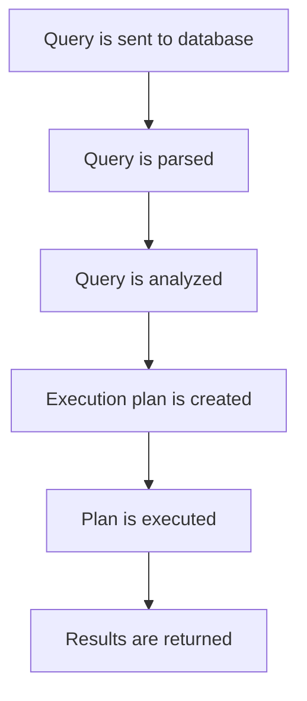

# PHP Query Optimization

## Introduction

Database operations are often the most resource-intensive parts of web applications. As your PHP application grows, inefficient database queries can lead to slow page loads, poor user experience, and increased server costs. Query optimization is the process of improving your database queries to make them execute faster and consume fewer resources.

In this guide, we'll explore various techniques to optimize your PHP database queries, focusing primarily on MySQL (the most common database used with PHP), but the principles apply to most relational database systems.

## Why Query Optimization Matters

Before diving into optimization techniques, let's understand why query optimization is critical:

1. **Improved User Experience**: Faster queries = faster page loads = happier users
2. **Reduced Server Load**: Efficient queries consume fewer server resources
3. **Better Scalability**: Optimized applications can handle more users and data
4. **Cost Savings**: Less server resources = lower hosting costs

When a database query is slow, it can bottleneck your entire application. Let's learn how to identify and fix these bottlenecks.

## Understanding Query Execution

To optimize queries, you need to understand how the database executes them. Here's a simplified view of how MySQL processes a query:



The execution plan determines how the database will retrieve the data you're requesting. A good execution plan can make the difference between a query that takes milliseconds and one that takes seconds or even minutes.

## Basic Optimization Techniques

### 1. Use Proper Indexing

Indexes are the most powerful tool for query optimization. Think of an index like a book's table of contents—it helps the database find data without scanning the entire table.

```php
// Creating an index in MySQL using PHP
$conn = new mysqli("localhost", "username", "password", "database");

// Add an index to the 'email' column in the 'users' table
$sql = "CREATE INDEX idx_email ON users(email)";
$conn->query($sql);

// Now queries that filter by email will be much faster
$result = $conn->query("SELECT * FROM users WHERE email = 'user@example.com'");
```

**When to use indexes:**
- Columns used in WHERE clauses
- Columns used in JOIN conditions
- Columns used in ORDER BY or GROUP BY

**Index considerations:**
- Indexes speed up reads but slow down writes (INSERT, UPDATE, DELETE)
- Don't over-index your tables—each index consumes space and resources
- Composite indexes (multiple columns) can be useful for complex queries

### 2. SELECT Only What You Need

Retrieving unnecessary data wastes resources. Always specify exactly which columns you need rather than using `SELECT *`.

```php
// Bad practice
$badQuery = "SELECT * FROM products WHERE category = 'electronics'";

// Good practice
$goodQuery = "SELECT id, name, price FROM products WHERE category = 'electronics'";

// Example usage
$conn = new mysqli("localhost", "username", "password", "database");
$result = $conn->query($goodQuery);

while ($row = $result->fetch_assoc()) {
    echo "Product: {$row['name']}, Price: \${$row['price']}<br>";
}
```

### 3. LIMIT Your Result Set

If you only need a certain number of rows, use the LIMIT clause to restrict the result set.

```php
// Example: Showing the latest 10 blog posts
$query = "SELECT title, date, excerpt FROM blog_posts ORDER BY date DESC LIMIT 10";

$conn = new mysqli("localhost", "username", "password", "database");
$result = $conn->query($query);

while ($row = $result->fetch_assoc()) {
    echo "<h3>{$row['title']}</h3>";
    echo "<p>Posted on: {$row['date']}</p>";
    echo "<p>{$row['excerpt']}</p>";
}
```

### 4. Use Prepared Statements

Prepared statements not only improve security but can also enhance performance when executing the same query multiple times with different parameters.

```php
// Example: Inserting multiple records efficiently
$conn = new mysqli("localhost", "username", "password", "database");

$stmt = $conn->prepare("INSERT INTO logs (user_id, action, timestamp) VALUES (?, ?, NOW())");
$stmt->bind_param("is", $userId, $action);

// Reuse the prepared statement with different values
$userId = 101;
$action = "login";
$stmt->execute();

$userId = 102;
$action = "view_page";
$stmt->execute();

$userId = 103;
$action = "logout";
$stmt->execute();

$stmt->close();
```

## Intermediate Optimization Techniques

### 1. Analyze Your Queries with EXPLAIN

The `EXPLAIN` statement is a powerful tool that shows how MySQL executes your queries. It helps identify inefficient queries and missing indexes.

```php
// Example: Using EXPLAIN to analyze a query
$conn = new mysqli("localhost", "username", "password", "database");

$query = "SELECT users.name, orders.order_date 
          FROM users 
          JOIN orders ON users.id = orders.user_id 
          WHERE orders.status = 'completed'";

$explainResult = $conn->query("EXPLAIN " . $query);

echo "<h3>Query Execution Plan:</h3>";
echo "<pre>";
while ($row = $explainResult->fetch_assoc()) {
    print_r($row);
}
echo "</pre>";
```

The output will show information about:
- Which tables are being accessed and in what order
- Which indexes are being used
- How many rows are examined
- The type of join being performed

If you see terms like "full table scan" or a large number of examined rows, your query might need optimization.

### 2. Optimize JOINs

JOINs can be expensive operations. Here are some tips for optimizing them:

- Always JOIN on indexed columns
- Use INNER JOIN instead of LEFT JOIN when possible
- Keep the number of JOINed tables to a minimum
- Consider denormalizing data that's frequently accessed together

```php
// Example: Optimized JOIN with indexed columns
$query = "SELECT p.name, c.category_name 
          FROM products p
          INNER JOIN categories c ON p.category_id = c.id
          WHERE p.price > 100
          ORDER BY p.name
          LIMIT 20";
```

### 3. Use Database Caching

For queries that return the same results repeatedly, consider implementing caching:

```php
// Example: Simple query caching with file cache
function getCachedCategories($conn, $cacheTime = 3600) {
    $cacheFile = 'cache/categories.json';
    
    // Check if cache exists and is fresh
    if (file_exists($cacheFile) && (time() - filemtime($cacheFile) < $cacheTime)) {
        return json_decode(file_get_contents($cacheFile), true);
    }
    
    // Cache doesn't exist or is stale, query the database
    $result = $conn->query("SELECT id, name FROM categories ORDER BY name");
    $categories = [];
    
    while ($row = $result->fetch_assoc()) {
        $categories[] = $row;
    }
    
    // Save to cache
    if (!is_dir('cache')) {
        mkdir('cache');
    }
    file_put_contents($cacheFile, json_encode($categories));
    
    return $categories;
}

// Usage
$conn = new mysqli("localhost", "username", "password", "database");
$categories = getCachedCategories($conn);

foreach ($categories as $category) {
    echo "<option value='{$category['id']}'>{$category['name']}</option>";
}
```

## Advanced Optimization Techniques

### 1. Database Query Pagination

For large datasets, implement pagination to improve performance:

```php
// Example: Efficient pagination
$page = isset($_GET['page']) ? (int)$_GET['page'] : 1;
$itemsPerPage = 20;
$offset = ($page - 1) * $itemsPerPage;

$conn = new mysqli("localhost", "username", "password", "database");

// Get total count (can be cached)
$countResult = $conn->query("SELECT COUNT(*) as total FROM products WHERE category_id = 5");
$totalCount = $countResult->fetch_assoc()['total'];
$totalPages = ceil($totalCount / $itemsPerPage);

// Get page data
$result = $conn->query("SELECT id, name, price FROM products 
                        WHERE category_id = 5 
                        ORDER BY name 
                        LIMIT $itemsPerPage OFFSET $offset");

// Display products
while ($product = $result->fetch_assoc()) {
    echo "<div class='product'>";
    echo "<h3>{$product['name']}</h3>";
    echo "<p>Price: \${$product['price']}</p>";
    echo "</div>";
}

// Display pagination links
echo "<div class='pagination'>";
for ($i = 1; $i <= $totalPages; $i++) {
    echo "<a href='?page=$i'" . ($page == $i ? " class='active'" : "") . ">$i</a> ";
}
echo "</div>";
```

### 2. Using Database Transactions

For operations that involve multiple queries that need to succeed or fail together, use transactions:

```php
// Example: Using transactions for multiple operations
$conn = new mysqli("localhost", "username", "password", "database");

// Start transaction
$conn->begin_transaction();

try {
    // Create order
    $conn->query("INSERT INTO orders (user_id, total, order_date) 
                  VALUES (101, 150.00, NOW())");
    $orderId = $conn->insert_id;
    
    // Add order items
    $conn->query("INSERT INTO order_items (order_id, product_id, quantity, price) 
                  VALUES ($orderId, 5, 2, 45.00)");
    $conn->query("INSERT INTO order_items (order_id, product_id, quantity, price) 
                  VALUES ($orderId, 8, 1, 60.00)");
    
    // Update inventory
    $conn->query("UPDATE products SET stock = stock - 2 WHERE id = 5");
    $conn->query("UPDATE products SET stock = stock - 1 WHERE id = 8");
    
    // Commit the transaction
    $conn->commit();
    echo "Order processed successfully!";
    
} catch (Exception $e) {
    // Something went wrong, rollback changes
    $conn->rollback();
    echo "Error processing order: " . $e->getMessage();
}
```

### 3. Query Optimization with Database Design

Sometimes, the best way to optimize queries is to revisit your database design:

- Consider denormalization for frequently accessed data
- Use appropriate data types (e.g., INT for IDs instead of VARCHAR)
- Create summary or aggregate tables for complex reports
- Consider using database views for common complex queries

```php
// Example: Using a summary table for reporting
// Instead of calculating totals on every request:

// Create and maintain a summary table (updated via cron job or triggers)
$conn->query("CREATE TABLE order_summaries (
    date DATE PRIMARY KEY,
    total_orders INT,
    total_revenue DECIMAL(10,2)
)");

// Then queries become much simpler and faster
$result = $conn->query("SELECT date, total_revenue 
                        FROM order_summaries 
                        WHERE date >= DATE_SUB(CURDATE(), INTERVAL 30 DAY)
                        ORDER BY date");
```

## Common Query Optimization Mistakes

### 1. Using Functions in WHERE Clauses

Functions in WHERE clauses can prevent the use of indexes:

```php
// Bad practice: Function in WHERE clause
$badQuery = "SELECT * FROM users WHERE YEAR(registration_date) = 2023";

// Good practice: Rewrite to use direct column comparison
$goodQuery = "SELECT * FROM users WHERE registration_date >= '2023-01-01' AND registration_date < '2024-01-01'";
```

### 2. Using Subqueries Instead of JOINs

In many cases, JOINs perform better than subqueries:

```php
// Often slower with subquery
$subqueryExample = "SELECT p.name, p.price 
                    FROM products p 
                    WHERE p.category_id IN (SELECT id FROM categories WHERE active = 1)";

// Usually faster with JOIN
$joinExample = "SELECT p.name, p.price 
                FROM products p 
                JOIN categories c ON p.category_id = c.id 
                WHERE c.active = 1";
```

### 3. Not Using Database-specific Features

PHP works with many different database systems, and each has its own optimization features. Don't be afraid to use database-specific optimizations:

```php
// MySQL-specific optimization example: Using INSERT ... ON DUPLICATE KEY UPDATE
$query = "INSERT INTO product_views (product_id, view_count) 
          VALUES (101, 1)
          ON DUPLICATE KEY UPDATE view_count = view_count + 1";

$conn->query($query);
```

## Performance Monitoring and Profiling

To continuously improve your database performance, implement monitoring:

```php
// Simple query execution time measurement
function executeAndMeasure($conn, $query) {
    $start = microtime(true);
    $result = $conn->query($query);
    $executionTime = microtime(true) - $start;
    
    echo "Query took {$executionTime} seconds to execute<br>";
    return $result;
}

// Usage
$conn = new mysqli("localhost", "username", "password", "database");
$result = executeAndMeasure($conn, "SELECT * FROM large_table WHERE complex_condition = 1");
```

For more advanced profiling, consider tools like:

- MySQL's slow query log
- APM (Application Performance Monitoring) tools like New Relic or Datadog
- PHP profiling tools like Xdebug or Blackfire

## Real-world Example: Optimizing a Product Search

Let's put everything together with a real-world example of optimizing a product search feature:

```php
// Original unoptimized query
function searchProductsUnoptimized($conn, $keyword, $page = 1) {
    $start = microtime(true);
    
    $result = $conn->query("
        SELECT * FROM products 
        WHERE name LIKE '%$keyword%' 
        OR description LIKE '%$keyword%'
        ORDER BY name
    ");
    
    $products = [];
    while ($row = $result->fetch_assoc()) {
        $products[] = $row;
    }
    
    $time = microtime(true) - $start;
    return ['products' => $products, 'time' => $time];
}

// Optimized version
function searchProductsOptimized($conn, $keyword, $page = 1) {
    $start = microtime(true);
    $itemsPerPage = 20;
    $offset = ($page - 1) * $itemsPerPage;
    
    // Prepare the statement to prevent SQL injection
    $stmt = $conn->prepare("
        SELECT id, name, price, image_url, stock 
        FROM products 
        WHERE MATCH(name, description) AGAINST(? IN BOOLEAN MODE)
        ORDER BY name
        LIMIT ? OFFSET ?
    ");
    
    // Add wildcards for partial matching
    $searchTerm = "*$keyword*";
    $stmt->bind_param("sii", $searchTerm, $itemsPerPage, $offset);
    $stmt->execute();
    
    $result = $stmt->get_result();
    $products = [];
    while ($row = $result->fetch_assoc()) {
        $products[] = $row;
    }
    
    // Get total count for pagination
    $countStmt = $conn->prepare("
        SELECT COUNT(*) as total 
        FROM products 
        WHERE MATCH(name, description) AGAINST(? IN BOOLEAN MODE)
    ");
    $countStmt->bind_param("s", $searchTerm);
    $countStmt->execute();
    $totalCount = $countStmt->get_result()->fetch_assoc()['total'];
    
    $time = microtime(true) - $start;
    return [
        'products' => $products, 
        'time' => $time,
        'total' => $totalCount,
        'pages' => ceil($totalCount / $itemsPerPage)
    ];
}

// Usage example
$conn = new mysqli("localhost", "username", "password", "database");

// First, make sure we have a FULLTEXT index
$conn->query("ALTER TABLE products ADD FULLTEXT(name, description)");

// Compare performance
$unoptimized = searchProductsUnoptimized($conn, "smartphone");
$optimized = searchProductsOptimized($conn, "smartphone");

echo "Unoptimized search took {$unoptimized['time']} seconds<br>";
echo "Optimized search took {$optimized['time']} seconds<br>";
echo "Performance improvement: " . round(($unoptimized['time'] - $optimized['time']) / $unoptimized['time'] * 100) . "%";
```

The optimized version:
1. Uses FULLTEXT indexing instead of wildcard LIKE searches
2. Implements pagination
3. Only selects needed columns
4. Uses prepared statements
5. Returns metadata for pagination

## Summary

Query optimization is an essential skill for PHP developers working with databases. In this guide, we've covered:

- Basic optimization techniques (indexing, selective column retrieval, LIMIT)
- Intermediate techniques (EXPLAIN, JOIN optimization, caching)
- Advanced techniques (pagination, transactions, database design)
- Common mistakes to avoid
- Performance monitoring and profiling
- A real-world example

By applying these techniques, you can significantly improve the performance of your PHP applications, providing a better user experience while reducing server load and costs.

## Additional Resources

- [MySQL Optimization Documentation](https://dev.mysql.com/doc/refman/8.0/en/optimization.html)
- [PHP PDO Performance Tips](https://www.php.net/manual/en/pdo.prepared-statements.php)
- [Database Indexing Strategies](https://use-the-index-luke.com/)

## Exercises

1. Take an existing PHP application and use EXPLAIN to identify slow queries.
2. Implement a caching system for frequently accessed data.
3. Refactor a query that uses SELECT * to only select needed columns.
4. Create appropriate indexes for a table based on the queries that access it.
5. Implement pagination for a list that currently displays all records at once.