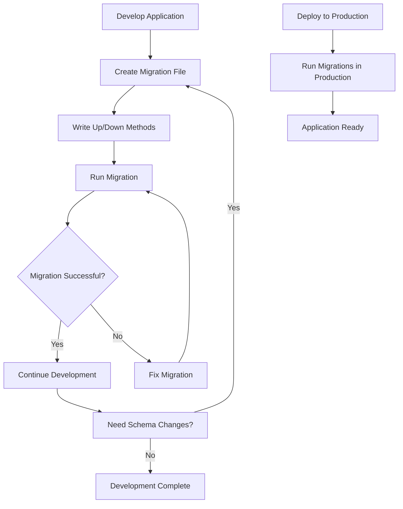

# PHP Database Migration

## Introduction

Database migration is a crucial aspect of modern web development that allows developers to manage and version control database schema changes. Think of migrations as a way to "version control" your database structure, just like you use Git to version control your code.

In PHP applications, database migrations provide a systematic approach to evolve your database schema over time while maintaining data integrity. They are especially important when:

- Working in teams where multiple developers need to stay in sync
- Deploying applications across different environments (development, staging, production)
- Tracking changes to database structure over the application's lifetime
- Needing to roll back database changes when issues arise

This tutorial will introduce you to the concept of database migrations in PHP, show you how to implement them using popular frameworks and libraries, and provide practical examples to get you started.

## What is a Database Migration?

A database migration is a programmatic way to make changes to your database schema. These changes might include:

- Creating, modifying, or dropping tables
- Adding, altering, or removing columns
- Creating or modifying indexes
- Adding constraints
- Seeding initial data

Migrations are typically written as code files that contain two main operations:
- **Up migration**: Code that applies the changes to the database
- **Down migration**: Code that reverts those changes (rollback)

## Migration Tools in PHP

Several PHP frameworks and libraries offer migration capabilities:

1. **Laravel/Illuminate Database**: Laravel's migration system is widely used even outside Laravel projects
2. **Doctrine Migrations**: Compatible with Doctrine ORM and usable in Symfony
3. **Phinx**: A standalone PHP database migrations library
4. **Propel ORM**: Includes migration functionality 

For this tutorial, we'll focus on Laravel migrations and Phinx as they're beginner-friendly options.

## Basic Migration Structure

Let's look at the typical structure of a migration file:

```php
<?php
use Illuminate\Database\Migrations\Migration;
use Illuminate\Database\Schema\Blueprint;
use Illuminate\Support\Facades\Schema;

class CreateUsersTable extends Migration
{
    /**
     * Run the migrations.
     */
    public function up(): void
    {
        Schema::create('users', function (Blueprint $table) {
            $table->id();
            $table->string('name');
            $table->string('email')->unique();
            $table->timestamp('email_verified_at')->nullable();
            $table->string('password');
            $table->rememberToken();
            $table->timestamps();
        });
    }

    /**
     * Reverse the migrations.
     */
    public function down(): void
    {
        Schema::dropIfExists('users');
    }
}
```

This migration:
- Creates a new table called `users` when run (`up` method)
- Drops the `users` table when rolled back (`down` method)

## Getting Started with Migrations in Laravel

### Installation

If you're using Laravel, migrations come built-in. If you're not using the full framework, you can install the database component:

```bash
composer require illuminate/database
```

### Creating a Migration

To create a migration:

```bash
# In Laravel
php artisan make:migration create_products_table

# The generated file will be in database/migrations folder
# with a timestamp prefix, e.g., 2023_08_25_182415_create_products_table.php
```

### Writing Migration Operations

Let's create a products table:

```php
<?php
use Illuminate\Database\Migrations\Migration;
use Illuminate\Database\Schema\Blueprint;
use Illuminate\Support\Facades\Schema;

class CreateProductsTable extends Migration
{
    public function up(): void
    {
        Schema::create('products', function (Blueprint $table) {
            $table->id();
            $table->string('name');
            $table->text('description')->nullable();
            $table->decimal('price', 8, 2);
            $table->integer('stock')->default(0);
            $table->boolean('is_active')->default(true);
            $table->timestamps();
        });
    }

    public function down(): void
    {
        Schema::dropIfExists('products');
    }
}
```

### Running Migrations

To apply migrations:

```bash
# Run all pending migrations
php artisan migrate

# Output:
# Migrating: 2023_08_25_182415_create_products_table
# Migrated: 2023_08_25_182415_create_products_table
```

### Rolling Back Migrations

To undo migrations:

```bash
# Roll back the last batch of migrations
php artisan migrate:rollback

# Roll back all migrations
php artisan migrate:reset

# Roll back all migrations and run them again
php artisan migrate:refresh
```

## Getting Started with Phinx (Standalone Option)

Phinx is a great option if you're not using a framework but still want robust migrations.

### Installation

```bash
composer require robmorgan/phinx
```

### Configuration

Create a `phinx.php` file in your project root:

```php
<?php
return [
    'paths' => [
        'migrations' => '%%PHINX_CONFIG_DIR%%/db/migrations',
        'seeds' => '%%PHINX_CONFIG_DIR%%/db/seeds'
    ],
    'environments' => [
        'default_migration_table' => 'phinxlog',
        'default_environment' => 'development',
        'development' => [
            'adapter' => 'mysql',
            'host' => 'localhost',
            'name' => 'development_db',
            'user' => 'root',
            'pass' => '',
            'port' => '3306',
            'charset' => 'utf8',
        ]
    ],
    'version_order' => 'creation'
];
```

### Creating a Migration

```bash
vendor/bin/phinx create CreateProductsTable
```

This will create a migration file in your migrations directory.

### Writing Migration Operations

Edit the generated file:

```php
<?php
use Phinx\Migration\AbstractMigration;

class CreateProductsTable extends AbstractMigration
{
    public function change()
    {
        $table = $this->table('products');
        $table->addColumn('name', 'string', ['limit' => 255])
              ->addColumn('description', 'text', ['null' => true])
              ->addColumn('price', 'decimal', ['precision' => 8, 'scale' => 2])
              ->addColumn('stock', 'integer', ['default' => 0])
              ->addColumn('is_active', 'boolean', ['default' => true])
              ->addColumn('created_at', 'timestamp', ['default' => 'CURRENT_TIMESTAMP'])
              ->addColumn('updated_at', 'timestamp', ['null' => true])
              ->addIndex(['name'], ['unique' => true])
              ->create();
    }
}
```

### Running Migrations

```bash
vendor/bin/phinx migrate -e development
```

### Rolling Back Migrations

```bash
vendor/bin/phinx rollback -e development
```

## Common Migration Operations

Here are some common operations you might need in your migrations:

### Creating Tables

```php
// Laravel
Schema::create('categories', function (Blueprint $table) {
    $table->id();
    $table->string('name');
    $table->string('slug')->unique();
    $table->timestamps();
});

// Phinx
$table = $this->table('categories');
$table->addColumn('name', 'string', ['limit' => 255])
      ->addColumn('slug', 'string', ['limit' => 255])
      ->addColumn('created_at', 'timestamp', ['default' => 'CURRENT_TIMESTAMP'])
      ->addColumn('updated_at', 'timestamp', ['null' => true])
      ->addIndex(['slug'], ['unique' => true])
      ->create();
```

### Adding Columns to Existing Tables

```php
// Laravel
Schema::table('users', function (Blueprint $table) {
    $table->string('phone_number')->nullable()->after('email');
});

// Phinx
$table = $this->table('users');
$table->addColumn('phone_number', 'string', ['limit' => 15, 'null' => true])
      ->update();
```

### Modifying Columns

```php
// Laravel
Schema::table('products', function (Blueprint $table) {
    $table->string('name', 100)->change();
});

// Phinx
$table = $this->table('products');
$table->changeColumn('name', 'string', ['limit' => 100])
      ->update();
```

### Removing Columns

```php
// Laravel
Schema::table('users', function (Blueprint $table) {
    $table->dropColumn('phone_number');
});

// Phinx
$table = $this->table('users');
$table->removeColumn('phone_number')
      ->update();
```

### Adding Foreign Keys

```php
// Laravel
Schema::table('products', function (Blueprint $table) {
    $table->unsignedBigInteger('category_id')->after('id');
    $table->foreign('category_id')->references('id')->on('categories');
});

// Phinx
$table = $this->table('products');
$table->addColumn('category_id', 'integer', ['after' => 'id'])
      ->addForeignKey('category_id', 'categories', 'id', ['delete' => 'CASCADE', 'update' => 'CASCADE'])
      ->update();
```

## Real-World Example: E-commerce Database Schema

Let's create a simple e-commerce database schema using migrations. We'll need:

1. Categories table
2. Products table (with foreign key to categories)
3. Orders table
4. Order items table (connecting orders and products)

Here's how we'd implement this with Laravel migrations:

### Step 1: Create Categories Table

```php
<?php
use Illuminate\Database\Migrations\Migration;
use Illuminate\Database\Schema\Blueprint;
use Illuminate\Support\Facades\Schema;

class CreateCategoriesTable extends Migration
{
    public function up(): void
    {
        Schema::create('categories', function (Blueprint $table) {
            $table->id();
            $table->string('name');
            $table->string('slug')->unique();
            $table->text('description')->nullable();
            $table->timestamps();
        });
    }

    public function down(): void
    {
        Schema::dropIfExists('categories');
    }
}
```

### Step 2: Create Products Table with Category Relationship

```php
<?php
use Illuminate\Database\Migrations\Migration;
use Illuminate\Database\Schema\Blueprint;
use Illuminate\Support\Facades\Schema;

class CreateProductsTable extends Migration
{
    public function up(): void
    {
        Schema::create('products', function (Blueprint $table) {
            $table->id();
            $table->foreignId('category_id')->constrained();
            $table->string('name');
            $table->string('slug')->unique();
            $table->text('description')->nullable();
            $table->decimal('price', 8, 2);
            $table->integer('stock')->default(0);
            $table->boolean('is_active')->default(true);
            $table->timestamps();
        });
    }

    public function down(): void
    {
        Schema::dropIfExists('products');
    }
}
```

### Step 3: Create Orders Table

```php
<?php
use Illuminate\Database\Migrations\Migration;
use Illuminate\Database\Schema\Blueprint;
use Illuminate\Support\Facades\Schema;

class CreateOrdersTable extends Migration
{
    public function up(): void
    {
        Schema::create('orders', function (Blueprint $table) {
            $table->id();
            $table->string('order_number')->unique();
            $table->string('customer_name');
            $table->string('customer_email');
            $table->text('shipping_address');
            $table->decimal('total_amount', 10, 2);
            $table->string('status')->default('pending');
            $table->timestamps();
        });
    }

    public function down(): void
    {
        Schema::dropIfExists('orders');
    }
}
```

### Step 4: Create Order Items Table

```php
<?php
use Illuminate\Database\Migrations\Migration;
use Illuminate\Database\Schema\Blueprint;
use Illuminate\Support\Facades\Schema;

class CreateOrderItemsTable extends Migration
{
    public function up(): void
    {
        Schema::create('order_items', function (Blueprint $table) {
            $table->id();
            $table->foreignId('order_id')->constrained()->onDelete('cascade');
            $table->foreignId('product_id')->constrained();
            $table->integer('quantity');
            $table->decimal('unit_price', 8, 2);
            $table->decimal('subtotal', 10, 2);
            $table->timestamps();
        });
    }

    public function down(): void
    {
        Schema::dropIfExists('order_items');
    }
}
```

### Running the E-commerce Migrations

The migrations should be run in the correct order to prevent foreign key constraint issues:

```bash
php artisan migrate
```

Laravel will automatically run them in the correct order (based on timestamp prefixes).

## Database Migration Flow

Here's a visualization of the typical database migration workflow:



## Best Practices for Database Migrations

1. **Make migrations reversible**: Always implement both `up()` and `down()` methods.
2. **Keep migrations small and focused**: Each migration should do one thing well.
3. **Use descriptive names**: Name migration files clearly to understand their purpose.
4. **Test migrations**: Before deploying, test both applying and rolling back migrations.
5. **Don't modify existing migrations**: Once a migration is shared with others, create a new migration for changes.
6. **Use foreign key constraints**: They help maintain data integrity.
7. **Include data migrations when necessary**: Sometimes you need to migrate data, not just schema.
8. **Version control your migrations**: Keep them in your repository.

## Handling Data Migration

Sometimes you need to migrate data, not just schema. Here's how to handle that:

```php
<?php
use Illuminate\Database\Migrations\Migration;
use Illuminate\Support\Facades\DB;

class MigrateOldPricesToNewFormat extends Migration
{
    public function up(): void
    {
        // Update all prices from integers (cents) to decimals (dollars)
        DB::table('products')->get()->each(function ($product) {
            DB::table('products')
                ->where('id', $product->id)
                ->update([
                    'price' => $product->price / 100
                ]);
        });
    }

    public function down(): void
    {
        // Convert back to cents if needed
        DB::table('products')->get()->each(function ($product) {
            DB::table('products')
                ->where('id', $product->id)
                ->update([
                    'price' => $product->price * 100
                ]);
        });
    }
}
```

## Seeding Database with Initial Data

Migrations handle structure changes, but seeders handle initial data:

```php
<?php
use Illuminate\Database\Seeder;
use Illuminate\Support\Facades\DB;

class CategoriesTableSeeder extends Seeder
{
    public function run(): void
    {
        DB::table('categories')->insert([
            [
                'name' => 'Electronics',
                'slug' => 'electronics',
                'created_at' => now(),
                'updated_at' => now()
            ],
            [
                'name' => 'Clothing',
                'slug' => 'clothing',
                'created_at' => now(),
                'updated_at' => now()
            ],
            [
                'name' => 'Books',
                'slug' => 'books',
                'created_at' => now(),
                'updated_at' => now()
            ]
        ]);
    }
}
```

Run seeders with:

```bash
php artisan db:seed --class=CategoriesTableSeeder
```

## Managing Migrations Across Environments

When working with multiple environments, consider:

1. **Environment-specific configuration**: Store connection details in `.env` files
2. **Migration status tracking**: Use `php artisan migrate:status` to see what's been run
3. **Production deployments**: Always back up production database before migrating
4. **Testing migrations**: Run in testing/staging environment first

## Troubleshooting Common Migration Issues

### Migration Failed to Run

**Symptom**: Migration fails with SQL errors

**Solutions**:
- Check SQL syntax in your migration
- Ensure the database user has sufficient privileges
- Verify that referenced tables/columns exist

### Foreign Key Constraints Fail

**Symptom**: Migration fails with foreign key constraint errors

**Solutions**:
- Ensure migrations run in the correct order
- Make sure parent tables are created before child tables
- Use the `$table->foreignId('parent_id')->nullable()->constrained()` pattern during transitions

### Schema Out of Sync

**Symptom**: Local and production schemas differ

**Solutions**:
- Use `php artisan migrate:status` to check what's been run
- Consider a full reset and migration in development (`migrate:fresh`)
- Implement data backup strategies for critical environments

## Summary

Database migrations in PHP applications provide a structured approach to evolving your database schema over time. They allow for:

- Version control of database structures
- Consistent database states across development environments
- Automated database setup and updates
- Safe rollbacks when issues arise

By implementing database migrations in your PHP projects, you can build more robust applications with better teamwork capabilities and simpler deployment processes.

## Further Learning Resources

1. [Laravel Database Migrations Documentation](https://laravel.com/docs/migrations)
2. [Phinx Documentation](https://book.cakephp.org/phinx/en/latest/)
3. [Doctrine Migrations Documentation](https://www.doctrine-project.org/projects/doctrine-migrations/en/latest/index.html)
4. [Database Version Control Strategies](https://martinfowler.com/articles/evodb.html)

## Exercises

1. Create a blog database schema with tables for posts, categories, tags, and comments using migrations.
2. Write a migration that adds a new column to an existing table, then write another that modifies that column.
3. Create a data migration that updates values in an existing table based on certain conditions.
4. Design a migration strategy for adding a user roles and permissions system to an existing application.
5. Implement a migration that creates a many-to-many relationship between two existing tables.