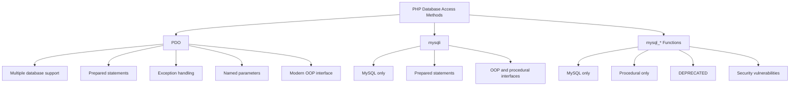

# PHP PDO Introduction

## What is PDO?

PDO (PHP Data Objects) is a database connection abstraction library for PHP applications. It provides a consistent interface for accessing databases in PHP, regardless of which database you're using.

Unlike older approaches such as the `mysqli` extension (which works only with MySQL databases), PDO allows you to work with multiple database systems using the same code structure.

## Why Use PDO?

PDO offers several advantages over traditional database interaction methods:

1. **Database Independence** - Write code that works with different database types by changing only the connection string
2. **Security** - PDO provides prepared statements that help prevent SQL injection attacks
3. **Error Handling** - Better exception-based error handling
4. **Object-Oriented Interface** - Modern, consistent API for all supported databases
5. **Named Parameters** - Makes your queries more readable and maintainable

## Supported Databases

PDO supports many popular database systems, including:

- MySQL
- PostgreSQL
- SQLite
- Microsoft SQL Server
- Oracle
- IBM DB2
- Firebird
- And more!

## Setting Up PDO

### Requirements

Before you begin, ensure that:
- You have PHP 5.1 or higher installed (PDO is built into PHP since version 5.1)
- The PDO driver for your database is enabled

### Connecting to a Database

The basic syntax for creating a PDO connection:

```php
<?php
try {
    $pdo = new PDO('driver:host=hostname;dbname=database', 'username', 'password', [options]);
    $pdo->setAttribute(PDO::ATTR_ERRMODE, PDO::ERRMODE_EXCEPTION);
    echo "Connected successfully";
} catch(PDOException $e) {
    echo "Connection failed: " . $e->getMessage();
}
?>
```

Let's look at real examples for different databases:

#### MySQL Connection Example

```php
<?php
try {
    $host = 'localhost';
    $dbname = 'my_database';
    $username = 'root';
    $password = 'password';
    
    $pdo = new PDO("mysql:host=$host;dbname=$dbname", $username, $password);
    
    // Set error mode to exceptions
    $pdo->setAttribute(PDO::ATTR_ERRMODE, PDO::ERRMODE_EXCEPTION);
    
    echo "Connected successfully to MySQL database!";
} catch(PDOException $e) {
    echo "Connection failed: " . $e->getMessage();
}
?>
```

#### SQLite Connection Example

```php
<?php
try {
    // For an SQLite database, just specify the database file path
    $pdo = new PDO('sqlite:/path/to/database.sqlite');
    
    $pdo->setAttribute(PDO::ATTR_ERRMODE, PDO::ERRMODE_EXCEPTION);
    
    echo "Connected successfully to SQLite database!";
} catch(PDOException $e) {
    echo "Connection failed: " . $e->getMessage();
}
?>
```

## Basic Database Operations with PDO

### 1. Executing Simple Queries

```php
<?php
try {
    // Create connection
    $pdo = new PDO("mysql:host=localhost;dbname=my_database", "username", "password");
    $pdo->setAttribute(PDO::ATTR_ERRMODE, PDO::ERRMODE_EXCEPTION);
    
    // Execute a simple query
    $sql = "SELECT * FROM users";
    $stmt = $pdo->query($sql);
    
    // Fetch all results as an associative array
    $users = $stmt->fetchAll(PDO::FETCH_ASSOC);
    
    // Display results
    foreach($users as $user) {
        echo "Name: " . $user['name'] . ", Email: " . $user['email'] . "<br>";
    }
} catch(PDOException $e) {
    echo "Error: " . $e->getMessage();
}
?>
```

**Output:**
```
Name: John Doe, Email: john@example.com
Name: Jane Smith, Email: jane@example.com
Name: Bob Johnson, Email: bob@example.com
```

### 2. Using Prepared Statements

Prepared statements help prevent SQL injection attacks by separating SQL logic from the data being inserted.

```php
<?php
try {
    $pdo = new PDO("mysql:host=localhost;dbname=my_database", "username", "password");
    $pdo->setAttribute(PDO::ATTR_ERRMODE, PDO::ERRMODE_EXCEPTION);
    
    // Prepare a statement with placeholders
    $stmt = $pdo->prepare("SELECT * FROM users WHERE age > ? AND city = ?");
    
    // Execute with values
    $stmt->execute([25, 'New York']);
    
    // Fetch all results
    $users = $stmt->fetchAll(PDO::FETCH_ASSOC);
    
    foreach($users as $user) {
        echo "Name: " . $user['name'] . ", Age: " . $user['age'] . ", City: " . $user['city'] . "<br>";
    }
} catch(PDOException $e) {
    echo "Error: " . $e->getMessage();
}
?>
```

**Output:**
```
Name: John Doe, Age: 30, City: New York
Name: Lisa Wang, Age: 28, City: New York
```

### 3. Named Parameters

PDO allows you to use named parameters instead of question marks for better readability:

```php
<?php
try {
    $pdo = new PDO("mysql:host=localhost;dbname=my_database", "username", "password");
    $pdo->setAttribute(PDO::ATTR_ERRMODE, PDO::ERRMODE_EXCEPTION);
    
    // Prepare with named parameters
    $stmt = $pdo->prepare("SELECT * FROM products WHERE price < :max_price AND category = :category");
    
    // Bind values to named parameters
    $stmt->execute([
        ':max_price' => 50,
        ':category' => 'Electronics'
    ]);
    
    // Fetch results
    $products = $stmt->fetchAll(PDO::FETCH_ASSOC);
    
    foreach($products as $product) {
        echo "Product: " . $product['name'] . ", Price: $" . $product['price'] . "<br>";
    }
} catch(PDOException $e) {
    echo "Error: " . $e->getMessage();
}
?>
```

**Output:**
```
Product: Wireless Mouse, Price: $24.99
Product: USB Cable, Price: $9.99
Product: Webcam, Price: $49.99
```

## CRUD Operations with PDO

Let's walk through the common database operations (Create, Read, Update, Delete) with PDO:

### Create (INSERT)

```php
<?php
try {
    $pdo = new PDO("mysql:host=localhost;dbname=my_database", "username", "password");
    $pdo->setAttribute(PDO::ATTR_ERRMODE, PDO::ERRMODE_EXCEPTION);
    
    // Prepare an insert statement
    $stmt = $pdo->prepare("INSERT INTO users (name, email, age) VALUES (:name, :email, :age)");
    
    // Bind parameters and execute
    $stmt->execute([
        ':name' => 'Mark Wilson',
        ':email' => 'mark@example.com',
        ':age' => 35
    ]);
    
    // Get the ID of the newly inserted row
    $lastId = $pdo->lastInsertId();
    
    echo "New user added successfully! ID: " . $lastId;
} catch(PDOException $e) {
    echo "Error: " . $e->getMessage();
}
?>
```

**Output:**
```
New user added successfully! ID: 7
```

### Read (SELECT)

We've already seen examples of SELECT operations. Here's another example using different fetch methods:

```php
<?php
try {
    $pdo = new PDO("mysql:host=localhost;dbname=my_database", "username", "password");
    $pdo->setAttribute(PDO::ATTR_ERRMODE, PDO::ERRMODE_EXCEPTION);
    
    // Prepare a statement
    $stmt = $pdo->prepare("SELECT * FROM users WHERE id = :id");
    
    // Execute with a specific ID
    $stmt->execute([':id' => 5]);
    
    // Fetch a single row
    $user = $stmt->fetch(PDO::FETCH_ASSOC);
    
    if ($user) {
        echo "User found: " . $user['name'] . " (Email: " . $user['email'] . ")";
    } else {
        echo "No user found with that ID.";
    }
} catch(PDOException $e) {
    echo "Error: " . $e->getMessage();
}
?>
```

**Output:**
```
User found: Jane Smith (Email: jane@example.com)
```

### Update (UPDATE)

```php
<?php
try {
    $pdo = new PDO("mysql:host=localhost;dbname=my_database", "username", "password");
    $pdo->setAttribute(PDO::ATTR_ERRMODE, PDO::ERRMODE_EXCEPTION);
    
    // Prepare update statement
    $stmt = $pdo->prepare("UPDATE users SET email = :email, age = :age WHERE id = :id");
    
    // Execute with parameters
    $stmt->execute([
        ':email' => 'newemail@example.com',
        ':age' => 36,
        ':id' => 3
    ]);
    
    // Get number of affected rows
    $count = $stmt->rowCount();
    
    echo $count . " record(s) updated successfully!";
} catch(PDOException $e) {
    echo "Error: " . $e->getMessage();
}
?>
```

**Output:**
```
1 record(s) updated successfully!
```

### Delete (DELETE)

```php
<?php
try {
    $pdo = new PDO("mysql:host=localhost;dbname=my_database", "username", "password");
    $pdo->setAttribute(PDO::ATTR_ERRMODE, PDO::ERRMODE_EXCEPTION);
    
    // Prepare delete statement
    $stmt = $pdo->prepare("DELETE FROM users WHERE id = :id");
    
    // Execute with ID parameter
    $stmt->execute([':id' => 7]);
    
    // Get number of affected rows
    $count = $stmt->rowCount();
    
    echo $count . " record(s) deleted successfully!";
} catch(PDOException $e) {
    echo "Error: " . $e->getMessage();
}
?>
```

**Output:**
```
1 record(s) deleted successfully!
```

## PDO Transaction Support

Transactions allow you to perform multiple database operations and commit them only if all operations succeed. If any operation fails, you can roll back all changes.

```php
<?php
try {
    $pdo = new PDO("mysql:host=localhost;dbname=my_database", "username", "password");
    $pdo->setAttribute(PDO::ATTR_ERRMODE, PDO::ERRMODE_EXCEPTION);
    
    // Start a transaction
    $pdo->beginTransaction();
    
    // Execute multiple queries
    $pdo->exec("INSERT INTO orders (customer_id, total) VALUES (5, 150.00)");
    $orderId = $pdo->lastInsertId();
    
    $pdo->exec("INSERT INTO order_items (order_id, product_id, quantity) VALUES ($orderId, 10, 2)");
    $pdo->exec("UPDATE inventory SET stock = stock - 2 WHERE product_id = 10");
    
    // If we get here, commit the changes
    $pdo->commit();
    
    echo "Order processed successfully!";
} catch(PDOException $e) {
    // An error occurred, roll back the transaction
    $pdo->rollBack();
    
    echo "Transaction failed: " . $e->getMessage();
}
?>
```

## PDO vs. mysqli vs. mysql_* Functions

Let's visually compare these different PHP database access methods:



## Best Practices with PDO

1. **Always use prepared statements** to prevent SQL injection attacks.
2. **Enable exception mode** with `PDO::ATTR_ERRMODE, PDO::ERRMODE_EXCEPTION` for better error handling.
3. **Use transactions** for multiple related operations.
4. **Close connections** when done (setting variables to null).
5. **Use connection pooling** in high-traffic applications.
6. **Don't store sensitive credentials** directly in your code; use environment variables or configuration files.

## Complete Real-World Example: User Registration System

Let's build a simple user registration system with PDO:

```php
<?php
// config.php - Store configuration
$config = [
    'db' => [
        'host' => 'localhost',
        'name' => 'my_app',
        'user' => 'app_user',
        'pass' => 'secure_password',
        'options' => [
            PDO::ATTR_ERRMODE => PDO::ERRMODE_EXCEPTION,
            PDO::ATTR_DEFAULT_FETCH_MODE => PDO::FETCH_ASSOC,
            PDO::ATTR_EMULATE_PREPARES => false
        ]
    ]
];

// database.php - Database connection class
class Database {
    private static $instance = null;
    private $connection;
    
    private function __construct($config) {
        $dsn = "mysql:host={$config['host']};dbname={$config['name']};charset=utf8mb4";
        
        try {
            $this->connection = new PDO($dsn, $config['user'], $config['pass'], $config['options']);
        } catch (PDOException $e) {
            die("Connection failed: " . $e->getMessage());
        }
    }
    
    public static function getInstance($config) {
        if (self::$instance === null) {
            self::$instance = new self($config);
        }
        return self::$instance;
    }
    
    public function getConnection() {
        return $this->connection;
    }
}

// user.php - User model
class User {
    private $db;
    
    public function __construct($db) {
        $this->db = $db;
    }
    
    public function register($name, $email, $password) {
        // Check if email already exists
        if ($this->emailExists($email)) {
            return false;
        }
        
        // Hash the password
        $hashedPassword = password_hash($password, PASSWORD_DEFAULT);
        
        // Insert new user
        $stmt = $this->db->prepare(
            "INSERT INTO users (name, email, password, created_at) 
             VALUES (:name, :email, :password, NOW())"
        );
        
        return $stmt->execute([
            ':name' => $name,
            ':email' => $email,
            ':password' => $hashedPassword
        ]);
    }
    
    private function emailExists($email) {
        $stmt = $this->db->prepare("SELECT id FROM users WHERE email = :email LIMIT 1");
        $stmt->execute([':email' => $email]);
        
        return $stmt->fetch() !== false;
    }
    
    public function login($email, $password) {
        $stmt = $this->db->prepare("SELECT id, name, password FROM users WHERE email = :email LIMIT 1");
        $stmt->execute([':email' => $email]);
        
        $user = $stmt->fetch();
        
        if ($user && password_verify($password, $user['password'])) {
            // Password is correct
            return [
                'id' => $user['id'],
                'name' => $user['name'],
                'email' => $email
            ];
        }
        
        return false;
    }
}

// Example usage:
try {
    // Initialize database connection
    $db = Database::getInstance($config['db'])->getConnection();
    
    // Create user object
    $userModel = new User($db);
    
    // Register a new user
    if ($userModel->register('John Smith', 'john@example.com', 'secure123')) {
        echo "User registered successfully!<br>";
    } else {
        echo "Registration failed. Email might already exist.<br>";
    }
    
    // Login attempt
    $loggedInUser = $userModel->login('john@example.com', 'secure123');
    
    if ($loggedInUser) {
        echo "Login successful! Welcome, " . $loggedInUser['name'] . "!";
    } else {
        echo "Login failed. Invalid credentials.";
    }
} catch (PDOException $e) {
    echo "Error: " . $e->getMessage();
}
?>
```

## Summary

In this introduction to PHP PDO, we've covered:

- What PDO is and why it's beneficial
- How to establish database connections using PDO
- Basic CRUD operations (Create, Read, Update, Delete)
- Using prepared statements to prevent SQL injection
- Working with named parameters for better code readability
- Transaction support for ensuring data integrity
- A real-world example of building a user registration system

PDO provides a secure, flexible, and efficient way to interact with databases in PHP. By using PDO, you can write more maintainable and database-agnostic code that is protected against common security vulnerabilities.

## Further Resources and Exercises

### Resources
- [PHP Official PDO Documentation](https://www.php.net/manual/en/book.pdo.php)
- [PHP PDO Reference](https://www.php.net/manual/en/pdo.reference.php)
- [PHP PDO Connection Options](https://www.php.net/manual/en/pdo.setattribute.php)

### Exercises

1. **Basic Connection**
   - Create a PDO connection to a database of your choice
   - Test the connection with a simple query

2. **Create a Product Management System**
   - Build a simple CRUD application for managing products
   - Include fields for name, description, price, and category
   - Implement list, add, edit, and delete functionality

3. **Advanced: Build a Mini Blog System**
   - Create tables for posts, users, and comments
   - Implement user registration and authentication
   - Allow users to create posts and leave comments
   - Use transactions when appropriate

4. **Database Migration Tool**
   - Build a simple PHP script that can execute SQL scripts to update a database schema
   - Include support for recording which migrations have been run
   - Implement both "up" and "down" migrations