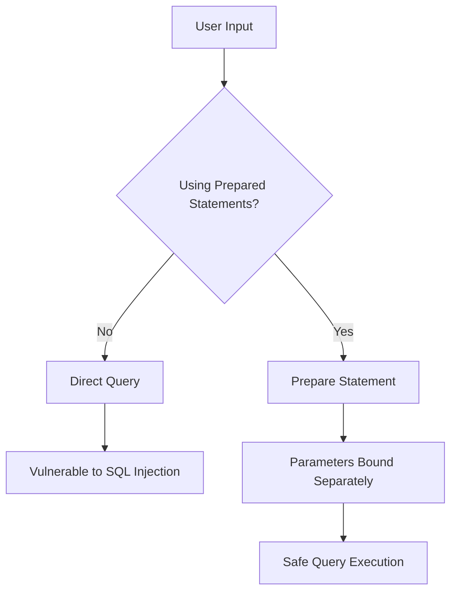

# PHP Database Queries

## Introduction

Database interaction is a fundamental skill for PHP developers. Whether you're building a blog, e-commerce site, or social network, the ability to store and retrieve data efficiently is essential. In this tutorial, we'll explore how to perform database queries in PHP, focusing on both the MySQLi and PDO (PHP Data Objects) approaches.

By the end of this tutorial, you'll understand how to:
- Connect to a MySQL database
- Execute simple SELECT, INSERT, UPDATE, and DELETE queries
- Prepare and execute parameterized queries
- Handle query results
- Avoid common security pitfalls

## Prerequisites

Before we begin, you should have:
- Basic understanding of PHP syntax
- A working PHP environment (local or hosted)
- MySQL database server installed and running
- Fundamental knowledge of SQL

## Database Connection Methods

PHP offers two main approaches for connecting to MySQL databases:

1. **MySQLi (MySQL Improved)** - An extension specifically for MySQL databases
2. **PDO (PHP Data Objects)** - A database-agnostic interface that works with multiple database types

Let's explore both methods:

### Connecting with MySQLi

```php
<?php
// MySQLi Object-Oriented approach
$servername = "localhost";
$username = "root";
$password = "password";
$dbname = "myDatabase";

// Create connection
$conn = new mysqli($servername, $username, $password, $dbname);

// Check connection
if ($conn->connect_error) {
    die("Connection failed: " . $conn->connect_error);
}
echo "Connected successfully";
?>
```

### Connecting with PDO

```php
<?php
// PDO approach
$servername = "localhost";
$username = "root";
$password = "password";
$dbname = "myDatabase";

try {
    $conn = new PDO("mysql:host=$servername;dbname=$dbname", $username, $password);
    // Set the PDO error mode to exception
    $conn->setAttribute(PDO::ATTR_ERRMODE, PDO::ERRMODE_EXCEPTION);
    echo "Connected successfully";
} catch(PDOException $e) {
    echo "Connection failed: " . $e->getMessage();
}
?>
```

## Basic Query Operations

Let's look at the four fundamental database operations: SELECT, INSERT, UPDATE, and DELETE.

### SELECT Queries - Retrieving Data

The SELECT query retrieves data from the database.

#### Using MySQLi:

```php
<?php
// Assume $conn is our established MySQLi connection

// Simple SELECT query
$sql = "SELECT id, firstname, lastname FROM users";
$result = $conn->query($sql);

if ($result->num_rows > 0) {
    // Output data of each row
    while($row = $result->fetch_assoc()) {
        echo "ID: " . $row["id"] . " - Name: " . $row["firstname"] . " " . $row["lastname"] . "<br>";
    }
} else {
    echo "0 results";
}
?>
```

**Output:**
```
ID: 1 - Name: John Doe
ID: 2 - Name: Jane Smith
ID: 3 - Name: Bob Johnson
```

#### Using PDO:

```php
<?php
// Assume $conn is our established PDO connection

// Simple SELECT query
$stmt = $conn->prepare("SELECT id, firstname, lastname FROM users");
$stmt->execute();

// Fetch data using associative array
while ($row = $stmt->fetch(PDO::FETCH_ASSOC)) {
    echo "ID: " . $row["id"] . " - Name: " . $row["firstname"] . " " . $row["lastname"] . "<br>";
}
?>
```

### INSERT Queries - Adding Data

INSERT queries add new records to the database.

#### Using MySQLi:

```php
<?php
// Assume $conn is our established MySQLi connection

// Simple INSERT query
$sql = "INSERT INTO users (firstname, lastname, email) 
        VALUES ('Alice', 'Wonder', 'alice@example.com')";

if ($conn->query($sql) === TRUE) {
    echo "New record created successfully";
    echo "Last inserted ID: " . $conn->insert_id;
} else {
    echo "Error: " . $sql . "<br>" . $conn->error;
}
?>
```

**Output:**
```
New record created successfully
Last inserted ID: 4
```

#### Using PDO:

```php
<?php
// Assume $conn is our established PDO connection

try {
    // Simple INSERT query
    $sql = "INSERT INTO users (firstname, lastname, email) 
            VALUES ('Charlie', 'Brown', 'charlie@example.com')";
    
    $conn->exec($sql);
    echo "New record created successfully";
    echo "Last inserted ID: " . $conn->lastInsertId();
} catch(PDOException $e) {
    echo $sql . "<br>" . $e->getMessage();
}
?>
```

### UPDATE Queries - Modifying Data

UPDATE queries modify existing records in the database.

#### Using MySQLi:

```php
<?php
// Assume $conn is our established MySQLi connection

// Simple UPDATE query
$sql = "UPDATE users SET lastname='Smith' WHERE id=2";

if ($conn->query($sql) === TRUE) {
    echo "Record updated successfully";
} else {
    echo "Error updating record: " . $conn->error;
}
?>
```

**Output:**
```
Record updated successfully
```

#### Using PDO:

```php
<?php
// Assume $conn is our established PDO connection

try {
    // Simple UPDATE query
    $sql = "UPDATE users SET email='bob.johnson@example.com' WHERE id=3";
    
    // Prepare statement
    $stmt = $conn->prepare($sql);
    
    // Execute the query
    $stmt->execute();
    
    // Echo a message to say the UPDATE succeeded
    echo $stmt->rowCount() . " records UPDATED successfully";
} catch(PDOException $e) {
    echo $sql . "<br>" . $e->getMessage();
}
?>
```

### DELETE Queries - Removing Data

DELETE queries remove records from the database.

#### Using MySQLi:

```php
<?php
// Assume $conn is our established MySQLi connection

// Simple DELETE query
$sql = "DELETE FROM users WHERE id=3";

if ($conn->query($sql) === TRUE) {
    echo "Record deleted successfully";
} else {
    echo "Error deleting record: " . $conn->error;
}
?>
```

**Output:**
```
Record deleted successfully
```

#### Using PDO:

```php
<?php
// Assume $conn is our established PDO connection

try {
    // SQL statement
    $sql = "DELETE FROM users WHERE id=4";

    // Use exec() because no results are returned
    $conn->exec($sql);
    echo "Record deleted successfully";
} catch(PDOException $e) {
    echo $sql . "<br>" . $e->getMessage();
}
?>
```

## Prepared Statements for Safer Queries

Prepared statements are a critical security feature that helps prevent SQL injection attacks. They separate SQL logic from data, ensuring user input is treated as data rather than executable code.

### Why Use Prepared Statements?



### Prepared Statements with MySQLi

```php
<?php
// Assume $conn is our established MySQLi connection

// Prepare and bind
$stmt = $conn->prepare("INSERT INTO users (firstname, lastname, email) VALUES (?, ?, ?)");
$stmt->bind_param("sss", $firstname, $lastname, $email);

// Set parameters and execute
$firstname = "David";
$lastname = "Miller";
$email = "david@example.com";
$stmt->execute();

echo "New record created successfully";

// You can reuse the statement with new values
$firstname = "Mary";
$lastname = "Wilson";
$email = "mary@example.com";
$stmt->execute();

echo "Second record created successfully";

$stmt->close();
?>
```

**Output:**
```
New record created successfully
Second record created successfully
```

### Prepared Statements with PDO

```php
<?php
// Assume $conn is our established PDO connection

try {
    // Prepare statement
    $stmt = $conn->prepare("INSERT INTO users (firstname, lastname, email) 
                            VALUES (:firstname, :lastname, :email)");
    
    // Bind parameters
    $stmt->bindParam(':firstname', $firstname);
    $stmt->bindParam(':lastname', $lastname);
    $stmt->bindParam(':email', $email);
    
    // Insert a row
    $firstname = "Richard";
    $lastname = "Davis";
    $email = "richard@example.com";
    $stmt->execute();
    
    // Insert another row with different values
    $firstname = "Susan";
    $lastname = "Garcia";
    $email = "susan@example.com";
    $stmt->execute();
    
    echo "New records created successfully";
} catch(PDOException $e) {
    echo "Error: " . $e->getMessage();
}
?>
```

## Handling Query Results

Let's look at different ways to handle SELECT query results.

### Fetching Results with MySQLi

```php
<?php
// Assume $conn is our established MySQLi connection

$sql = "SELECT id, firstname, lastname FROM users WHERE lastname='Smith'";
$result = $conn->query($sql);

// Method 1: Fetch as an associative array
if ($result->num_rows > 0) {
    while($row = $result->fetch_assoc()) {
        echo "ID: " . $row["id"] . " - Name: " . $row["firstname"] . " " . $row["lastname"] . "<br>";
    }
}

// Method 2: Fetch as an enumerated array
$result = $conn->query($sql);
if ($result->num_rows > 0) {
    while($row = $result->fetch_array()) {
        echo "ID: " . $row[0] . " - Name: " . $row[1] . " " . $row[2] . "<br>";
    }
}

// Method 3: Fetch as an object
$result = $conn->query($sql);
if ($result->num_rows > 0) {
    while($row = $result->fetch_object()) {
        echo "ID: " . $row->id . " - Name: " . $row->firstname . " " . $row->lastname . "<br>";
    }
}
?>
```

### Fetching Results with PDO

```php
<?php
// Assume $conn is our established PDO connection

$stmt = $conn->prepare("SELECT id, firstname, lastname FROM users WHERE lastname = :lastname");
$lastname = "Smith";
$stmt->bindParam(':lastname', $lastname);
$stmt->execute();

// Method 1: Fetch as an associative array
echo "Fetch as associative array:<br>";
$stmt->execute();
while ($row = $stmt->fetch(PDO::FETCH_ASSOC)) {
    echo "ID: " . $row["id"] . " - Name: " . $row["firstname"] . " " . $row["lastname"] . "<br>";
}

// Method 2: Fetch as an enumerated array
echo "<br>Fetch as enumerated array:<br>";
$stmt->execute();
while ($row = $stmt->fetch(PDO::FETCH_NUM)) {
    echo "ID: " . $row[0] . " - Name: " . $row[1] . " " . $row[2] . "<br>";
}

// Method 3: Fetch as an object
echo "<br>Fetch as object:<br>";
$stmt->execute();
while ($row = $stmt->fetch(PDO::FETCH_OBJ)) {
    echo "ID: " . $row->id . " - Name: " . $row->firstname . " " . $row->lastname . "<br>";
}

// Method 4: Fetch all results at once
echo "<br>Fetch all results at once:<br>";
$stmt->execute();
$users = $stmt->fetchAll(PDO::FETCH_ASSOC);
foreach ($users as $user) {
    echo "ID: " . $user["id"] . " - Name: " . $user["firstname"] . " " . $user["lastname"] . "<br>";
}
?>
```

**Output:**
```
Fetch as associative array:
ID: 2 - Name: Jane Smith

Fetch as enumerated array:
ID: 2 - Name: Jane Smith

Fetch as object:
ID: 2 - Name: Jane Smith

Fetch all results at once:
ID: 2 - Name: Jane Smith
```

## Real-World Example: User Registration System

Let's create a simple user registration system that demonstrates the concepts we've learned.

```php
<?php
// Database connection setup
$servername = "localhost";
$username = "root";
$password = "password";
$dbname = "myWebsite";

try {
    $conn = new PDO("mysql:host=$servername;dbname=$dbname", $username, $password);
    $conn->setAttribute(PDO::ATTR_ERRMODE, PDO::ERRMODE_EXCEPTION);
    
    // Process form submission
    if ($_SERVER["REQUEST_METHOD"] == "POST") {
        // Collect input data
        $username = $_POST['username'];
        $email = $_POST['email'];
        $password = $_POST['password'];
        
        // Validate input (simplified)
        if (empty($username) || empty($email) || empty($password)) {
            echo "All fields are required!";
        } else {
            // Check if username already exists
            $stmt = $conn->prepare("SELECT id FROM users WHERE username = :username");
            $stmt->bindParam(':username', $username);
            $stmt->execute();
            
            if ($stmt->rowCount() > 0) {
                echo "Username already taken!";
            } else {
                // Hash the password
                $hashed_password = password_hash($password, PASSWORD_DEFAULT);
                
                // Insert the new user
                $stmt = $conn->prepare("INSERT INTO users (username, email, password, registration_date) 
                                       VALUES (:username, :email, :password, NOW())");
                $stmt->bindParam(':username', $username);
                $stmt->bindParam(':email', $email);
                $stmt->bindParam(':password', $hashed_password);
                $stmt->execute();
                
                echo "Registration successful! User ID: " . $conn->lastInsertId();
            }
        }
    }
} catch(PDOException $e) {
    echo "Error: " . $e->getMessage();
}

// Close connection
$conn = null;
?>

<!-- HTML Registration Form -->
<form method="post" action="<?php echo htmlspecialchars($_SERVER["PHP_SELF"]); ?>">
    <h2>Register New User</h2>
    <div>
        <label>Username:</label>
        <input type="text" name="username">
    </div>
    <div>
        <label>Email:</label>
        <input type="email" name="email">
    </div>
    <div>
        <label>Password:</label>
        <input type="password" name="password">
    </div>
    <div>
        <input type="submit" value="Register">
    </div>
</form>
```

## Common Mistakes and Best Practices

### Common Mistakes

1. **Not using prepared statements**
   - Vulnerable to SQL injection attacks
   - Hard to maintain and debug

2. **Not closing database connections**
   - Can lead to resource leaks
   - May reach maximum connection limit

3. **Fetching too much data**
   - Poor performance
   - Unnecessary memory usage

4. **Not handling errors properly**
   - Makes debugging difficult
   - Poor user experience

### Best Practices

1. **Always use prepared statements**
   ```php
   // Incorrect
   $sql = "SELECT * FROM users WHERE username = '$username'";
   
   // Correct
   $stmt = $conn->prepare("SELECT * FROM users WHERE username = :username");
   $stmt->bindParam(':username', $username);
   ```

2. **Limit query results when possible**
   ```php
   // Better performance with LIMIT
   $stmt = $conn->prepare("SELECT * FROM users LIMIT 10");
   ```

3. **Select only the columns you need**
   ```php
   // Inefficient
   $stmt = $conn->prepare("SELECT * FROM users");
   
   // More efficient
   $stmt = $conn->prepare("SELECT id, username, email FROM users");
   ```

4. **Use transactions for multiple related queries**
   ```php
   try {
       $conn->beginTransaction();
       
       // Multiple queries...
       
       $conn->commit();
   } catch(Exception $e) {
       $conn->rollBack();
       throw $e;
   }
   ```

5. **Close connections when done**
   ```php
   // MySQLi
   $conn->close();
   
   // PDO
   $conn = null;
   ```

## MySQLi vs. PDO: Which to Choose?

Here's a comparison to help you decide:

| Feature | MySQLi | PDO |
|---------|--------|-----|
| Database support | MySQL only | Multiple databases |
| API | Procedural & OOP | OOP only |
| Named parameters | No | Yes |
| Error handling | Functions / Properties | Exception-based |
| Prepared statements | Yes | Yes |
| Multiple statements | Yes | Most drivers |

**Recommendation:**
- Use **PDO** if your application might need to support different databases
- Use **MySQLi** if you're only working with MySQL and prefer both procedural and object-oriented approaches

## Summary

In this tutorial, we've covered:

1. Connecting to MySQL databases using both MySQLi and PDO
2. Performing basic CRUD operations (SELECT, INSERT, UPDATE, DELETE)
3. Using prepared statements to prevent SQL injection
4. Handling query results in various formats
5. Implementing a real-world example (user registration system)
6. Best practices for database operations in PHP

PHP's database capabilities are powerful and flexible. As you become more comfortable with these concepts, you'll be able to build more complex applications that efficiently interact with databases.

## Exercises for Practice

1. Create a simple blog system with posts and comments tables
2. Build a product inventory system with CRUD operations
3. Implement a user login system with session management
4. Create a search feature that queries the database based on user input
5. Build a paged result system that uses LIMIT and OFFSET

## Additional Resources

- [PHP Manual: MySQLi](https://www.php.net/manual/en/book.mysqli.php)
- [PHP Manual: PDO](https://www.php.net/manual/en/book.pdo.php)
- [MySQL Documentation](https://dev.mysql.com/doc/)
- [SQL Tutorial](https://www.w3schools.com/sql/)
- [PHP Security Best Practices](https://phptherightway.com/#security)