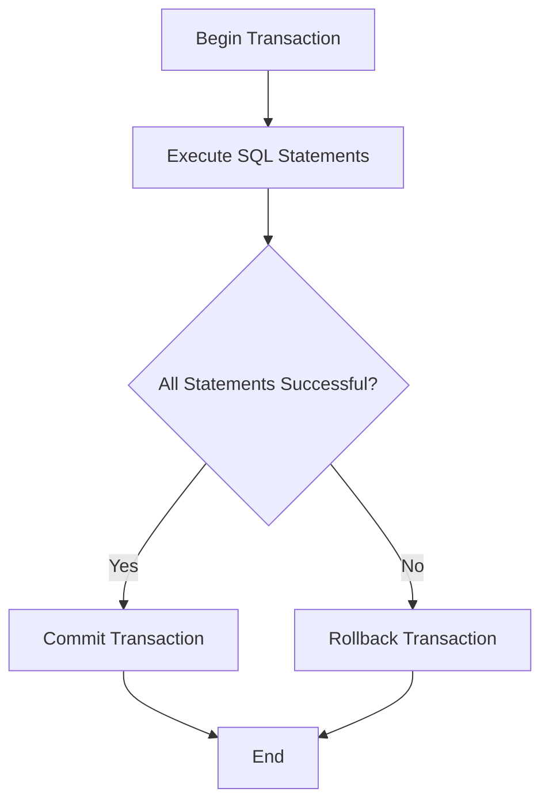

# PHP Transactions

## Introduction

Database transactions are a fundamental concept in database management systems that allow you to execute multiple operations as a single unit of work. In simple terms, a transaction is a sequence of one or more SQL statements that are executed together as a single operation. Either all the statements in a transaction succeed, or none of them take effect.

Think of a bank transfer: when you transfer money from one account to another, two operations need to happen:
1. Deduct money from the first account
2. Add money to the second account

If only one of these operations succeeds while the other fails, you end up with inconsistent data. Transactions prevent this by ensuring either both operations succeed or both fail.

In this tutorial, we'll learn how to implement transactions in PHP using both the PDO and MySQLi extensions.

## Key Transaction Concepts

Before diving into the code, let's understand some key concepts:

### ACID Properties

Transactions follow ACID properties:

- **Atomicity**: All operations in a transaction succeed or all fail (all-or-nothing)
- **Consistency**: The database remains in a consistent state before and after the transaction
- **Isolation**: Transactions operate independently without interference
- **Durability**: Once a transaction is committed, the changes are permanent

### Transaction Workflow

A typical transaction follows this workflow:



## Implementing Transactions with PDO

PDO (PHP Data Objects) provides a consistent interface for working with databases in PHP. Here's how to implement transactions using PDO:

### Basic PDO Transaction Example

```php
<?php
try {
    // Connect to database
    $pdo = new PDO('mysql:host=localhost;dbname=mybank', 'username', 'password');
    
    // Configure PDO to throw exceptions on error
    $pdo->setAttribute(PDO::ATTR_ERRMODE, PDO::ERRMODE_EXCEPTION);
    
    // Begin transaction
    $pdo->beginTransaction();
    
    // First query - withdraw money from account1
    $stmt1 = $pdo->prepare("UPDATE accounts SET balance = balance - ? WHERE account_id = ?");
    $stmt1->execute([100.00, 123]);
    
    // Second query - deposit money to account2
    $stmt2 = $pdo->prepare("UPDATE accounts SET balance = balance + ? WHERE account_id = ?");
    $stmt2->execute([100.00, 456]);
    
    // If no exceptions occurred, commit the transaction
    $pdo->commit();
    echo "Transaction completed successfully!";
    
} catch (Exception $e) {
    // An error occurred, rollback the transaction
    if ($pdo->inTransaction()) {
        $pdo->rollBack();
    }
    echo "Transaction failed: " . $e->getMessage();
}
?>
```

In this example:
1. We start a transaction with `beginTransaction()`
2. Execute multiple SQL statements
3. If all succeed, we commit the changes with `commit()`
4. If an error occurs, we roll back with `rollBack()`

### Real-world Example: Online Shop Order System

Here's a more complex example for an online shop:

```php
<?php
try {
    $pdo = new PDO('mysql:host=localhost;dbname=myshop', 'username', 'password');
    $pdo->setAttribute(PDO::ATTR_ERRMODE, PDO::ERRMODE_EXCEPTION);
    
    // Begin transaction
    $pdo->beginTransaction();
    
    // Insert new order into orders table
    $stmt1 = $pdo->prepare("INSERT INTO orders (customer_id, order_date, total_amount) VALUES (?, NOW(), ?)");
    $stmt1->execute([42, 159.99]);
    
    // Get the new order ID
    $orderId = $pdo->lastInsertId();
    
    // Insert order items (multiple products)
    $items = [
        ['product_id' => 101, 'quantity' => 2, 'price' => 49.99],
        ['product_id' => 205, 'quantity' => 1, 'price' => 60.01]
    ];
    
    $stmt2 = $pdo->prepare("INSERT INTO order_items (order_id, product_id, quantity, price) VALUES (?, ?, ?, ?)");
    
    foreach ($items as $item) {
        $stmt2->execute([
            $orderId, 
            $item['product_id'], 
            $item['quantity'], 
            $item['price']
        ]);
        
        // Update inventory (reduce stock)
        $stmt3 = $pdo->prepare("UPDATE products SET stock = stock - ? WHERE product_id = ?");
        $stmt3->execute([$item['quantity'], $item['product_id']]);
        
        // Check if we have enough stock
        $stmt4 = $pdo->prepare("SELECT stock FROM products WHERE product_id = ?");
        $stmt4->execute([$item['product_id']]);
        $currentStock = $stmt4->fetchColumn();
        
        if ($currentStock < 0) {
            // Not enough stock available
            throw new Exception("Not enough stock for product ID: " . $item['product_id']);
        }
    }
    
    // If everything is okay, commit the transaction
    $pdo->commit();
    echo "Order placed successfully! Order ID: $orderId";
    
} catch (Exception $e) {
    // An error occurred, rollback the transaction
    if ($pdo->inTransaction()) {
        $pdo->rollBack();
    }
    echo "Order failed: " . $e->getMessage();
}
?>
```

This example demonstrates a complete order process where:
1. We create a new order
2. Add multiple items to the order
3. Update inventory for each item
4. Check if we have enough stock
5. If anything fails, we roll back all changes

## Implementing Transactions with MySQLi

If you're using MySQLi instead of PDO, the transaction syntax is slightly different:

```php
<?php
// Connect to the database
$mysqli = new mysqli('localhost', 'username', 'password', 'mybank');

// Check connection
if ($mysqli->connect_error) {
    die('Connection failed: ' . $mysqli->connect_error);
}

// Turn off autocommit to start transaction
$mysqli->autocommit(FALSE);

// Flag to track success
$success = true;

// First operation
$result1 = $mysqli->query("UPDATE accounts SET balance = balance - 100.00 WHERE account_id = 123");
if (!$result1) {
    $success = false;
    echo "Error in first operation: " . $mysqli->error;
}

// Second operation
$result2 = $mysqli->query("UPDATE accounts SET balance = balance + 100.00 WHERE account_id = 456");
if (!$result2) {
    $success = false;
    echo "Error in second operation: " . $mysqli->error;
}

// Check if both operations were successful
if ($success) {
    // Commit transaction
    if ($mysqli->commit()) {
        echo "Transaction completed successfully!";
    } else {
        echo "Transaction commit failed: " . $mysqli->error;
    }
} else {
    // Rollback transaction
    $mysqli->rollback();
    echo "Transaction failed, changes rolled back.";
}

// Close connection
$mysqli->close();
?>
```

In MySQLi:
1. We disable autocommit with `autocommit(FALSE)`
2. Execute our SQL statements and check for errors
3. Commit with `commit()` if successful
4. Roll back with `rollback()` if any errors occur

## Transaction Isolation Levels

Databases support different isolation levels that control how transactions interact with each other:

```php
<?php
// PDO example of setting isolation level
$pdo = new PDO('mysql:host=localhost;dbname=mydb', 'username', 'password');
$pdo->exec("SET TRANSACTION ISOLATION LEVEL READ COMMITTED");
$pdo->beginTransaction();
// ... transaction code ...
$pdo->commit();
?>
```

Common isolation levels include:

1. **READ UNCOMMITTED**: Lowest isolation level, allows dirty reads
2. **READ COMMITTED**: Prevents dirty reads
3. **REPEATABLE READ**: Prevents dirty and non-repeatable reads (MySQL default)
4. **SERIALIZABLE**: Highest isolation level, prevents all concurrency issues

## Best Practices for PHP Transactions

Here are some best practices to follow when working with transactions:

1. **Keep transactions short**: Long-running transactions can block other operations
2. **Only include necessary operations**: Include only the SQL statements that need to be atomic
3. **Handle errors properly**: Always include proper error handling with try-catch blocks
4. **Check if in transaction before rollback**: Use `inTransaction()` in PDO to check if rollback is needed
5. **Choose appropriate isolation levels**: Different applications need different isolation levels
6. **Test with concurrent access**: Make sure your transactions handle concurrent access correctly

## Common Transaction Pitfalls

Watch out for these common issues:

1. **Not checking for errors**: Always check for errors after each operation
2. **Forgetting to disable autocommit**: In MySQLi, you need to disable autocommit explicitly
3. **Transaction deadlocks**: When multiple transactions wait for each other
4. **Too broad transactions**: Including too many operations in a single transaction

## Summary

Transactions are a powerful feature in database systems that help maintain data integrity by ensuring multiple operations succeed or fail as a unit. In PHP, you can implement transactions using either PDO or MySQLi.

Key points to remember:
- Transactions follow ACID properties
- Use `beginTransaction()`, `commit()`, and `rollBack()` in PDO
- Use `autocommit(FALSE)`, `commit()`, and `rollback()` in MySQLi
- Always include proper error handling
- Keep transactions focused and short

By using transactions correctly, you can build more reliable applications that maintain data consistency even when errors occur.

## Exercises

1. Create a simple banking system that transfers money between accounts using transactions.
2. Modify the online shop example to also handle customer points (add points when an order is placed).
3. Implement a transaction that handles multiple related tables (e.g., creating a user, their profile, and initial settings).
4. Create a function that accepts an array of SQL statements and executes them as a transaction.
5. Research and implement a solution for handling transaction deadlocks in PHP.

## Additional Resources

- [PHP PDO Documentation](https://www.php.net/manual/en/book.pdo.php)
- [PHP MySQLi Documentation](https://www.php.net/manual/en/book.mysqli.php)
- [MySQL Transaction Documentation](https://dev.mysql.com/doc/refman/8.0/en/commit.html)
- [Understanding Database Transactions](https://www.postgresql.org/docs/current/tutorial-transactions.html)
- [ACID Properties in Detail](https://www.geeksforgeeks.org/acid-properties-in-dbms/)