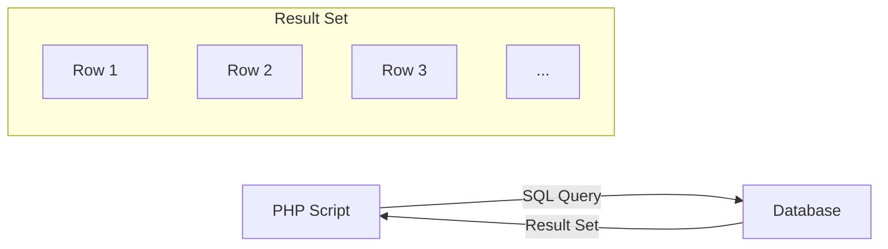

# PHP Result Sets

## Introduction

When you query a database using PHP, the database returns your data in what's called a **result set**. Think of a result set as a container that holds all the records matching your query. Working with these result sets effectively is essential for building dynamic, data-driven websites and applications.

In this tutorial, we'll explore how to:
- Retrieve data from databases using PHP
- Navigate through result sets
- Extract and process data from result sets
- Use different result handling methods for various scenarios

## What Is a Result Set?

A result set is a collection of rows returned by a database in response to a SELECT query. When you execute a query that retrieves data from a database table, the database management system (DBMS) gathers all matching rows and sends them back to your PHP script as a result set.

Here's a visualization of how result sets work:



## Fetching Data with MySQLi

PHP offers several ways to work with databases. We'll focus on the MySQLi extension, which is a commonly used method for connecting to MySQL databases.

### Basic Steps to Retrieve Data

Let's break down the process of working with result sets:

```php
<?php
// 1. Connect to the database
$conn = new mysqli("localhost", "username", "password", "database_name");

// 2. Check connection
if ($conn->connect_error) {
    die("Connection failed: " . $conn->connect_error);
}

// 3. Execute a query
$sql = "SELECT id, firstname, lastname FROM users";
$result = $conn->query($sql);

// 4. Process the result set
if ($result->num_rows > 0) {
    // Loop through each row
    while($row = $result->fetch_assoc()) {
        echo "ID: " . $row["id"] . " - Name: " . $row["firstname"] . " " . $row["lastname"] . "<br>";
    }
} else {
    echo "0 results";
}

// 5. Close the connection
$conn->close();
?>
```

### Understanding the Result Object

When you execute a query with `$conn->query()`, it returns a result object that contains all the data retrieved from the database. This object provides several methods for working with the data:

- `num_rows`: Returns the number of rows in the result set
- `fetch_assoc()`: Returns the current row as an associative array
- `fetch_row()`: Returns the current row as a numeric array
- `fetch_array()`: Returns the current row as both numeric and associative arrays
- `fetch_object()`: Returns the current row as an object

## Different Methods for Fetching Results

Let's explore the different ways to extract data from a result set:

### 1. fetch_assoc()

The `fetch_assoc()` method returns the current row as an associative array, where column names are used as keys.

```php
<?php
$result = $conn->query("SELECT id, username, email FROM users");

while($row = $result->fetch_assoc()) {
    echo "Username: " . $row["username"] . "<br>";
    echo "Email: " . $row["email"] . "<br><br>";
}
?>
```

**Output:**
```
Username: john_doe
Email: john@example.com

Username: jane_smith
Email: jane@example.com
```

### 2. fetch_row()

The `fetch_row()` method returns the current row as a numeric array, where columns are indexed starting from 0.

```php
<?php
$result = $conn->query("SELECT id, username, email FROM users");

while($row = $result->fetch_row()) {
    echo "ID: " . $row[0] . "<br>";
    echo "Username: " . $row[1] . "<br>";
    echo "Email: " . $row[2] . "<br><br>";
}
?>
```

**Output:**
```
ID: 1
Username: john_doe
Email: john@example.com

ID: 2
Username: jane_smith
Email: jane@example.com
```

### 3. fetch_array()

The `fetch_array()` method is versatile as it allows you to access row data using both numeric indices and column names.

```php
<?php
$result = $conn->query("SELECT id, username, email FROM users");

while($row = $result->fetch_array(MYSQLI_BOTH)) {
    echo "Using column name: " . $row["username"] . "<br>";
    echo "Using numeric index: " . $row[1] . "<br><br>";
}
?>
```

**Output:**
```
Using column name: john_doe
Using numeric index: john_doe

Using column name: jane_smith
Using numeric index: jane_smith
```

The `fetch_array()` method accepts these constants:
- `MYSQLI_ASSOC`: Same as fetch_assoc()
- `MYSQLI_NUM`: Same as fetch_row()
- `MYSQLI_BOTH`: Both numeric and associative (default)

### 4. fetch_object()

The `fetch_object()` method returns the current row as an object, where column names become properties.

```php
<?php
$result = $conn->query("SELECT id, username, email FROM users");

while($row = $result->fetch_object()) {
    echo "Username: " . $row->username . "<br>";
    echo "Email: " . $row->email . "<br><br>";
}
?>
```

**Output:**
```
Username: john_doe
Email: john@example.com

Username: jane_smith
Email: jane@example.com
```

## Practical Example: Building a User Dashboard

Let's create a practical example of a user dashboard that displays information from a database.

```php
<?php
// Database connection
$conn = new mysqli("localhost", "username", "password", "userdb");
if ($conn->connect_error) {
    die("Connection failed: " . $conn->connect_error);
}

// Retrieve users with active status
$sql = "SELECT id, username, email, registration_date, 
        last_login FROM users WHERE status='active' ORDER BY last_login DESC";
$result = $conn->query($sql);
?>

<!DOCTYPE html>
<html>
<head>
    <title>User Dashboard</title>
    <style>
        table { border-collapse: collapse; width: 100%; }
        th, td { padding: 8px; text-align: left; border-bottom: 1px solid #ddd; }
        tr:hover { background-color: #f5f5f5; }
    </style>
</head>
<body>
    <h1>Active Users Dashboard</h1>
    
    <p>Total active users: <?php echo $result->num_rows; ?></p>
    
    <?php if($result->num_rows > 0): ?>
        <table>
            <tr>
                <th>ID</th>
                <th>Username</th>
                <th>Email</th>
                <th>Registered</th>
                <th>Last Login</th>
            </tr>
            
            <?php while($user = $result->fetch_assoc()): ?>
                <tr>
                    <td><?php echo $user["id"]; ?></td>
                    <td><?php echo $user["username"]; ?></td>
                    <td><?php echo $user["email"]; ?></td>
                    <td><?php echo date("M d, Y", strtotime($user["registration_date"])); ?></td>
                    <td><?php echo date("M d, Y H:i", strtotime($user["last_login"])); ?></td>
                </tr>
            <?php endwhile; ?>
        </table>
    <?php else: ?>
        <p>No active users found.</p>
    <?php endif; ?>
    
    <?php $conn->close(); ?>
</body>
</html>
```

## Working with Large Result Sets

When dealing with large amounts of data, it's important to consider performance. Here are some techniques:

### 1. Limiting Results

```php
// Retrieve only 10 records
$sql = "SELECT * FROM products ORDER BY price DESC LIMIT 10";
$result = $conn->query($sql);
```

### 2. Pagination

```php
<?php
// Set up pagination
$results_per_page = 10;
$page = isset($_GET['page']) ? (int)$_GET['page'] : 1;
$offset = ($page - 1) * $results_per_page;

// Get paginated results
$sql = "SELECT * FROM products ORDER BY name LIMIT $offset, $results_per_page";
$result = $conn->query($sql);

// Get total count for pagination links
$total_sql = "SELECT COUNT(*) AS count FROM products";
$total_result = $conn->query($total_sql);
$total_row = $total_result->fetch_assoc();
$total_pages = ceil($total_row['count'] / $results_per_page);

// Display results
while($row = $result->fetch_assoc()) {
    echo $row["name"] . " - $" . $row["price"] . "<br>";
}

// Display pagination links
echo "<div class='pagination'>";
for($i = 1; $i <= $total_pages; $i++) {
    echo "<a href='?page=$i'" . ($page == $i ? " class='active'" : "") . ">$i</a> ";
}
echo "</div>";
?>
```

### 3. Using Free Result

For very large result sets, it's good practice to free the result when you're done with it:

```php
<?php
$result = $conn->query("SELECT * FROM large_table");

// Process data
while($row = $result->fetch_assoc()) {
    // Do something with the row
}

// Free the result set
$result->free();

// Continue with other queries
$another_result = $conn->query("SELECT * FROM another_table");
?>
```

## PDO: An Alternative Approach

While we've focused on MySQLi, another popular method is PHP Data Objects (PDO). Here's how you can work with result sets using PDO:

```php
<?php
try {
    // Connect to database
    $pdo = new PDO("mysql:host=localhost;dbname=testdb", "username", "password");
    $pdo->setAttribute(PDO::ATTR_ERRMODE, PDO::ERRMODE_EXCEPTION);
    
    // Execute query
    $stmt = $pdo->query("SELECT id, name, email FROM users");
    
    // Fetch all results at once
    $users = $stmt->fetchAll(PDO::FETCH_ASSOC);
    
    // Loop through results
    foreach($users as $user) {
        echo "Name: " . $user["name"] . ", Email: " . $user["email"] . "<br>";
    }
    
    // Or fetch one row at a time
    $stmt = $pdo->query("SELECT id, name FROM products");
    while($row = $stmt->fetch(PDO::FETCH_ASSOC)) {
        echo "Product: " . $row["name"] . "<br>";
    }
    
} catch(PDOException $e) {
    echo "Error: " . $e->getMessage();
}
?>
```

PDO offers some advantages:
- Works with multiple database types
- Provides prepared statements for better security
- Offers various fetch modes

## Common Mistakes and How to Avoid Them

When working with PHP result sets, beginners often encounter these issues:

### 1. Not Checking if Results Exist

```php
<?php
// Wrong approach (may cause errors)
$result = $conn->query("SELECT * FROM users WHERE username='john'");
$user = $result->fetch_assoc();
echo $user["email"]; // Error if no user found!

// Better approach
$result = $conn->query("SELECT * FROM users WHERE username='john'");
if($result->num_rows > 0) {
    $user = $result->fetch_assoc();
    echo $user["email"];
} else {
    echo "User not found";
}
?>
```

### 2. Trying to Loop Through Empty Results

```php
<?php
// This can cause unexpected behavior if no results
$result = $conn->query("SELECT * FROM empty_table");
while($row = $result->fetch_assoc()) {
    // Code here won't run if no results
}

// Better approach:
if($result->num_rows > 0) {
    while($row = $result->fetch_assoc()) {
        // Process rows
    }
} else {
    echo "No results found";
}
?>
```

### 3. Not Sanitizing User Input

Always use prepared statements when working with user input:

```php
<?php
// Unsafe way
$username = $_GET['username'];
$result = $conn->query("SELECT * FROM users WHERE username='$username'");

// Safe way using prepared statements
$stmt = $conn->prepare("SELECT * FROM users WHERE username=?");
$stmt->bind_param("s", $_GET['username']);
$stmt->execute();
$result = $stmt->get_result();
while($row = $result->fetch_assoc()) {
    // Process data safely
}
?>
```

## Summary

Working with result sets in PHP is fundamental to building dynamic, data-driven applications. In this tutorial, we've covered:

- What result sets are and how they work
- Different methods for fetching data from result sets
- Practical examples showing real-world applications
- How to handle large result sets efficiently
- Common mistakes and best practices

By mastering result sets, you'll be able to build more powerful PHP applications that effectively manage and display database data.

## Exercises

To reinforce your understanding, try these exercises:

1. **Basic Query**: Create a script that retrieves and displays all records from a "products" table showing the product name, price, and category.

2. **Filtered Results**: Modify your script to only show products with a price greater than $20.

3. **Sorting**: Add functionality to let users sort the results by price (ascending or descending).

4. **Pagination**: Implement a pagination system to display 5 products per page.

5. **Advanced**: Create a product search form that allows users to search by name and filter by category, displaying results in a formatted table.

## Additional Resources

- [PHP Manual: MySQLi](https://www.php.net/manual/en/book.mysqli.php)
- [PHP Manual: PDO](https://www.php.net/manual/en/book.pdo.php)
- [W3Schools PHP MySQL Tutorial](https://www.w3schools.com/php/php_mysql_intro.asp)
- [Mozilla Developer Network: HTML Tables](https://developer.mozilla.org/en-US/docs/Web/HTML/Element/table)
- [SQL Tutorial](https://www.w3schools.com/sql/)