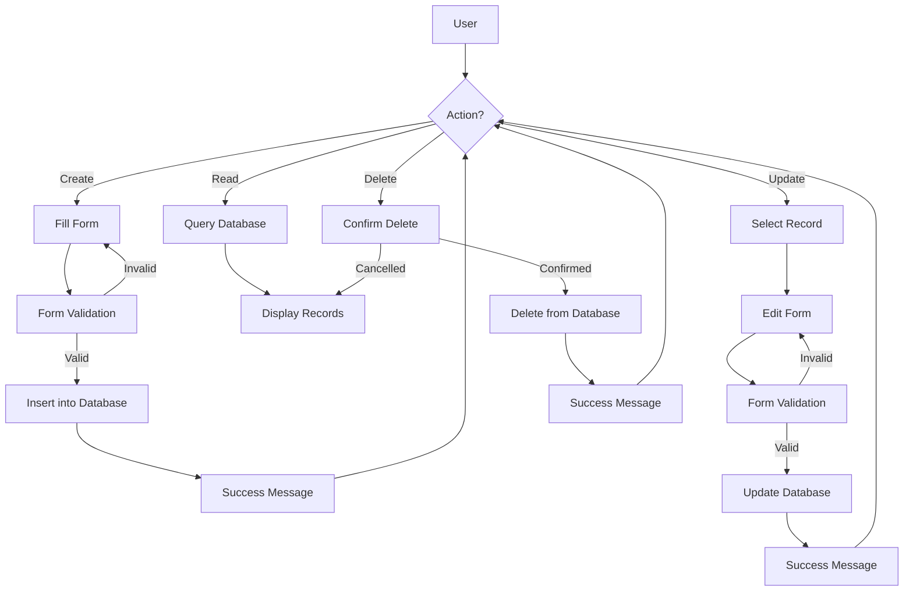

# PHP CRUD Operations

## Introduction

CRUD is an acronym that stands for **C**reate, **R**ead, **U**pdate, and **D**elete - the four basic operations you can perform on any database. When building web applications with PHP and MySQL, understanding CRUD operations is essential as they form the foundation of nearly all database interactions.

In this tutorial, we'll walk through how to implement each CRUD operation using PHP with MySQL. You'll learn how to:

- Create new records in a database
- Read existing records from a database
- Update existing records in a database
- Delete records from a database

By the end of this guide, you'll be able to build a simple but complete database-driven application that manages data effectively.

## Prerequisites

Before you begin, make sure you have:

- Basic knowledge of PHP
- A web server with PHP installed (like XAMPP, WAMP, or MAMP)
- MySQL database server
- Understanding of HTML forms

## Setting Up Your Database

Let's start by creating a simple database and table to work with. We'll create a `users` table for our examples.

```sql
CREATE DATABASE php_crud_demo;

USE php_crud_demo;

CREATE TABLE users (
    id INT AUTO_INCREMENT PRIMARY KEY,
    name VARCHAR(100) NOT NULL,
    email VARCHAR(100) NOT NULL UNIQUE,
    phone VARCHAR(15),
    created_at TIMESTAMP DEFAULT CURRENT_TIMESTAMP
);
```

## Database Connection

First, we need to establish a connection to our database. Let's create a file named `db_connection.php`:

```php
<?php
// Database credentials
$servername = "localhost";
$username = "root";
$password = ""; // Use your actual password
$dbname = "php_crud_demo";

// Create connection
$conn = new mysqli($servername, $username, $password, $dbname);

// Check connection
if ($conn->connect_error) {
    die("Connection failed: " . $conn->connect_error);
}

// Optional: Set charset to ensure proper encoding
$conn->set_charset("utf8mb4");
?>
```

Now, we can include this file in all our scripts to connect to the database.

## 1. Create Operation

The Create operation allows us to insert new records into our database. Let's implement a simple form to add a new user.

### HTML Form (create.php)

```php
<?php include 'db_connection.php'; ?>
<!DOCTYPE html>
<html>
<head>
    <title>Add New User</title>
    <link rel="stylesheet" href="https://stackpath.bootstrapcdn.com/bootstrap/4.5.2/css/bootstrap.min.css">
</head>
<body>
    <div class="container mt-5">
        <h2>Add New User</h2>
        
        <?php
        // Process form submission
        if ($_SERVER["REQUEST_METHOD"] == "POST") {
            // Collect form data
            $name = $_POST['name'];
            $email = $_POST['email'];
            $phone = $_POST['phone'];
            
            // Validate input
            if (empty($name) || empty($email)) {
                echo "<div class='alert alert-danger'>Name and email are required fields!</div>";
            } else {
                // Prepare SQL statement to prevent SQL injection
                $stmt = $conn->prepare("INSERT INTO users (name, email, phone) VALUES (?, ?, ?)");
                $stmt->bind_param("sss", $name, $email, $phone);
                
                // Execute statement
                if ($stmt->execute()) {
                    echo "<div class='alert alert-success'>New user added successfully!</div>";
                } else {
                    echo "<div class='alert alert-danger'>Error: " . $stmt->error . "</div>";
                }
                
                // Close statement
                $stmt->close();
            }
        }
        ?>
        
        <form method="post" action="<?php echo htmlspecialchars($_SERVER["PHP_SELF"]); ?>">
            <div class="form-group">
                <label for="name">Name:</label>
                <input type="text" class="form-control" id="name" name="name" required>
            </div>
            
            <div class="form-group">
                <label for="email">Email:</label>
                <input type="email" class="form-control" id="email" name="email" required>
            </div>
            
            <div class="form-group">
                <label for="phone">Phone:</label>
                <input type="text" class="form-control" id="phone" name="phone">
            </div>
            
            <button type="submit" class="btn btn-primary">Submit</button>
        </form>
    </div>
</body>
</html>
```

### Key Concepts in Create Operation

1. **Form Handling**: We collect data through HTML forms.
2. **Input Validation**: Always validate user input before processing.
3. **Prepared Statements**: We use prepared statements to prevent SQL injection attacks.
4. **Feedback**: We provide feedback to the user about the result of their action.

## 2. Read Operation

The Read operation allows us to retrieve and display data from the database. Let's create a page to display all users.

### Displaying All Records (read.php)

```php
<?php include 'db_connection.php'; ?>
<!DOCTYPE html>
<html>
<head>
    <title>View Users</title>
    <link rel="stylesheet" href="https://stackpath.bootstrapcdn.com/bootstrap/4.5.2/css/bootstrap.min.css">
</head>
<body>
    <div class="container mt-5">
        <h2>Users List</h2>
        
        <table class="table table-bordered">
            <thead>
                <tr>
                    <th>ID</th>
                    <th>Name</th>
                    <th>Email</th>
                    <th>Phone</th>
                    <th>Created At</th>
                    <th>Actions</th>
                </tr>
            </thead>
            <tbody>
                <?php
                // Prepare and execute query
                $sql = "SELECT * FROM users ORDER BY id DESC";
                $result = $conn->query($sql);
                
                if ($result->num_rows > 0) {
                    // Output data of each row
                    while($row = $result->fetch_assoc()) {
                        echo "<tr>";
                        echo "<td>" . $row["id"] . "</td>";
                        echo "<td>" . htmlspecialchars($row["name"]) . "</td>";
                        echo "<td>" . htmlspecialchars($row["email"]) . "</td>";
                        echo "<td>" . htmlspecialchars($row["phone"]) . "</td>";
                        echo "<td>" . $row["created_at"] . "</td>";
                        echo "<td>
                                <a href='update.php?id=" . $row["id"] . "' class='btn btn-sm btn-info'>Edit</a>
                                <a href='delete.php?id=" . $row["id"] . "' class='btn btn-sm btn-danger' onclick='return confirm(\"Are you sure?\")'>Delete</a>
                              </td>";
                        echo "</tr>";
                    }
                } else {
                    echo "<tr><td colspan='6' class='text-center'>No users found</td></tr>";
                }
                ?>
            </tbody>
        </table>
        
        <a href="create.php" class="btn btn-primary">Add New User</a>
    </div>
</body>
</html>
```

### Reading a Single Record

Often, you'll need to retrieve a single record based on an ID:

```php
<?php
include 'db_connection.php';

// Check if ID parameter exists
if (isset($_GET['id']) && !empty($_GET['id'])) {
    $id = $_GET['id'];
    
    // Prepare statement
    $stmt = $conn->prepare("SELECT * FROM users WHERE id = ?");
    $stmt->bind_param("i", $id);
    
    // Execute and get result
    $stmt->execute();
    $result = $stmt->get_result();
    
    if ($result->num_rows === 1) {
        $user = $result->fetch_assoc();
        // Now you can use $user array to access the user's data
        // e.g., $user['name'], $user['email'], etc.
    } else {
        echo "User not found";
    }
    
    $stmt->close();
} else {
    echo "Invalid request";
}
?>
```

### Key Concepts in Read Operation

1. **Query Execution**: We execute SQL SELECT queries to retrieve data.
2. **Result Handling**: We process the returned data set.
3. **Output Escaping**: We use `htmlspecialchars()` to prevent XSS attacks.
4. **Pagination**: For large data sets, consider adding pagination (not shown in this example).

## 3. Update Operation

The Update operation allows us to modify existing records. Let's create a form to edit user information.

### Update Form and Processing (update.php)

```php
<?php include 'db_connection.php'; ?>
<!DOCTYPE html>
<html>
<head>
    <title>Edit User</title>
    <link rel="stylesheet" href="https://stackpath.bootstrapcdn.com/bootstrap/4.5.2/css/bootstrap.min.css">
</head>
<body>
    <div class="container mt-5">
        <h2>Edit User</h2>
        
        <?php
        // Check if ID parameter exists
        if (!isset($_GET['id']) || empty($_GET['id'])) {
            echo "<div class='alert alert-danger'>Invalid request</div>";
            exit;
        }
        
        $id = $_GET['id'];
        
        // Process form submission
        if ($_SERVER["REQUEST_METHOD"] == "POST") {
            // Collect form data
            $name = $_POST['name'];
            $email = $_POST['email'];
            $phone = $_POST['phone'];
            
            // Validate input
            if (empty($name) || empty($email)) {
                echo "<div class='alert alert-danger'>Name and email are required fields!</div>";
            } else {
                // Prepare SQL statement
                $stmt = $conn->prepare("UPDATE users SET name=?, email=?, phone=? WHERE id=?");
                $stmt->bind_param("sssi", $name, $email, $phone, $id);
                
                // Execute statement
                if ($stmt->execute()) {
                    echo "<div class='alert alert-success'>User updated successfully!</div>";
                } else {
                    echo "<div class='alert alert-danger'>Error: " . $stmt->error . "</div>";
                }
                
                // Close statement
                $stmt->close();
            }
        }
        
        // Retrieve current user data
        $stmt = $conn->prepare("SELECT * FROM users WHERE id = ?");
        $stmt->bind_param("i", $id);
        $stmt->execute();
        $result = $stmt->get_result();
        
        if ($result->num_rows !== 1) {
            echo "<div class='alert alert-danger'>User not found</div>";
            exit;
        }
        
        $user = $result->fetch_assoc();
        $stmt->close();
        ?>
        
        <form method="post" action="<?php echo htmlspecialchars($_SERVER["PHP_SELF"] . "?id=" . $id); ?>">
            <div class="form-group">
                <label for="name">Name:</label>
                <input type="text" class="form-control" id="name" name="name" 
                    value="<?php echo htmlspecialchars($user['name']); ?>" required>
            </div>
            
            <div class="form-group">
                <label for="email">Email:</label>
                <input type="email" class="form-control" id="email" name="email" 
                    value="<?php echo htmlspecialchars($user['email']); ?>" required>
            </div>
            
            <div class="form-group">
                <label for="phone">Phone:</label>
                <input type="text" class="form-control" id="phone" name="phone" 
                    value="<?php echo htmlspecialchars($user['phone']); ?>">
            </div>
            
            <button type="submit" class="btn btn-primary">Update</button>
            <a href="read.php" class="btn btn-secondary">Cancel</a>
        </form>
    </div>
</body>
</html>
```

### Key Concepts in Update Operation

1. **Form Pre-filling**: We retrieve the current data and pre-fill the form.
2. **Conditional Processing**: We check if the request is for viewing the form or processing it.
3. **Validation**: We validate input before updating.
4. **Safe Updates**: We use prepared statements for the UPDATE query.

## 4. Delete Operation

The Delete operation removes records from the database. Let's implement a simple delete script.

### Delete Processing (delete.php)

```php
<?php
include 'db_connection.php';

// Check if ID parameter exists
if (isset($_GET['id']) && !empty($_GET['id'])) {
    $id = $_GET['id'];
    
    // Prepare statement
    $stmt = $conn->prepare("DELETE FROM users WHERE id = ?");
    $stmt->bind_param("i", $id);
    
    // Execute statement
    if ($stmt->execute()) {
        // Redirect to read page with success message
        header("Location: read.php?msg=deleted");
        exit;
    } else {
        echo "Error deleting record: " . $stmt->error;
    }
    
    // Close statement
    $stmt->close();
} else {
    echo "Invalid request";
}

// Close connection
$conn->close();
?>
```

To handle the success message in read.php, add this code at the beginning of the page:

```php
<?php if (isset($_GET['msg']) && $_GET['msg'] === 'deleted'): ?>
    <div class="alert alert-success">User deleted successfully!</div>
<?php endif; ?>
```

### Key Concepts in Delete Operation

1. **Confirmation**: Using JavaScript to confirm deletion (in the read.php page).
2. **Safe Deletion**: Using prepared statements for the DELETE query.
3. **Redirection**: Redirecting back to the listing page after deletion.
4. **Feedback**: Providing feedback about the operation's result.

## CRUD Flow Diagram

Here's a diagram showing the typical flow of CRUD operations in a PHP application:



## Best Practices for PHP CRUD Operations

1. **Always Validate Input**: Never trust user input; always validate and sanitize.
2. **Use Prepared Statements**: Protect against SQL injection attacks.
3. **Implement Error Handling**: Provide meaningful error messages and log errors.
4. **Implement Access Control**: Ensure only authorized users can perform certain operations.
5. **Use Transactions**: For complex operations that involve multiple queries.
6. **Follow DRY Principle**: Don't Repeat Yourself; reuse code where possible.

## Creating a Complete CRUD Application

Now that we've covered each operation individually, let's see how they all fit together in a complete application structure:

```
php_crud_demo/
├── db_connection.php   # Database connection file
├── create.php          # Create new records
├── read.php            # Display all records
├── update.php          # Update existing records
├── delete.php          # Delete records
└── styles.css          # Optional CSS file
```

## Real-World Example: User Management System

Our example above actually forms a simple user management system, which is a common real-world application of CRUD operations. Here are other practical examples where CRUD is essential:

1. **Blog Systems**: Managing posts, comments, and categories
2. **E-commerce Platforms**: Managing products, orders, and customers
3. **Task Management**: Creating, viewing, updating, and deleting tasks
4. **Content Management Systems**: Managing pages, media, and users

## Summary

In this tutorial, we've covered the fundamentals of CRUD operations in PHP with MySQL:

- **Create**: Adding new records to the database
- **Read**: Retrieving and displaying data from the database
- **Update**: Modifying existing database records
- **Delete**: Removing records from the database

We implemented each operation with proper validation, security measures, and user feedback, resulting in a fully functional user management system.

By mastering these basic operations, you've laid the groundwork for developing more complex database-driven applications. CRUD operations form the backbone of most web applications, and understanding them thoroughly is essential for any PHP developer.

## Exercises

To reinforce your learning, try these exercises:

1. Add pagination to the `read.php` page to show only 10 users per page.
2. Implement search functionality to find users by name or email.
3. Add file upload functionality to allow users to have profile pictures.
4. Create a role-based system where only administrators can delete users.
5. Add sorting functionality to the user list.

## Additional Resources

- [PHP Manual: Database Extensions](https://www.php.net/manual/en/refs.database.php)
- [MySQL Documentation](https://dev.mysql.com/doc/)
- [PHP Data Objects (PDO)](https://www.php.net/manual/en/book.pdo.php) - An alternative approach to database connections
- [W3Schools PHP MySQL Tutorial](https://www.w3schools.com/php/php_mysql_intro.asp)
- [PHP Security Best Practices](https://phptherightway.com/#security)