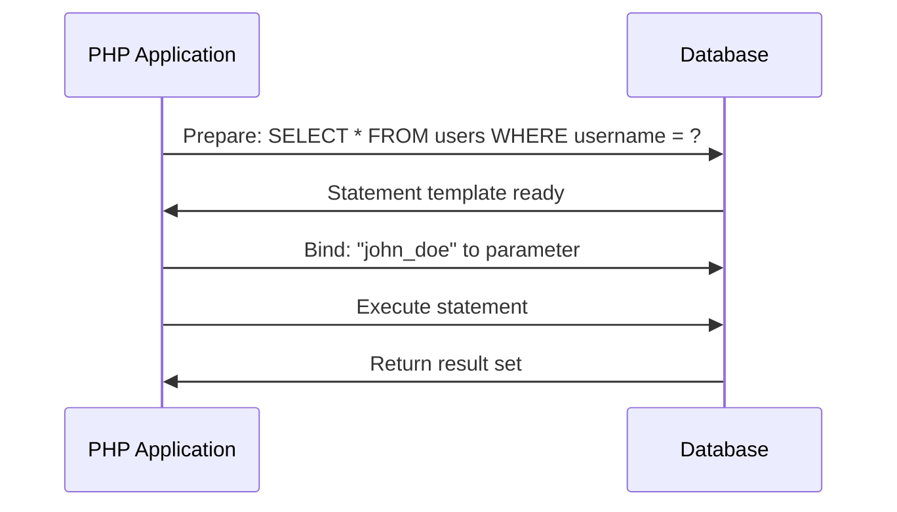

# PHP Query Building

## Introduction

When working with databases in PHP applications, one of the most critical skills is properly building and executing database queries. Query building is the process of constructing SQL statements programmatically, allowing your application to interact with the database in a secure and efficient manner.

In this tutorial, we'll explore different approaches to building database queries in PHP, from basic string concatenation (and its dangers) to more advanced and secure methods like prepared statements and query builders. By the end of this guide, you'll understand how to create robust database interactions that protect your application from common vulnerabilities like SQL injection.

## Why Query Building Matters

Before diving into techniques, let's understand why proper query building is crucial:

1. **Security**: Prevents SQL injection attacks that could compromise your entire database
2. **Maintainability**: Makes your code easier to read and maintain
3. **Performance**: Well-structured queries perform better and can be optimized
4. **Flexibility**: Allows dynamic query creation based on user input or application state

## Basic Query Building (Not Recommended)

The most straightforward way to build a query is by concatenating strings. However, this approach is **highly vulnerable** to SQL injection attacks and should never be used in production code.

```php
// DON'T DO THIS - Vulnerable to SQL injection
$username = $_POST['username'];
$query = "SELECT * FROM users WHERE username = '$username'";
$result = mysqli_query($connection, $query);
```

**Why is this dangerous?**

If a malicious user inputs something like `admin' OR '1'='1`, your query becomes:

```sql
SELECT * FROM users WHERE username = 'admin' OR '1'='1'
```

This would return all users in the database, potentially allowing unauthorized access.

## Prepared Statements with MySQLi

Prepared statements separate the SQL logic from the data, making your queries secure against SQL injection. Here's how to use them with MySQLi:

```php
// Connection setup
$mysqli = new mysqli("localhost", "username", "password", "database");

// Prepared statement
$stmt = $mysqli->prepare("SELECT * FROM users WHERE username = ?");

// Bind parameters
$username = $_POST['username'];
$stmt->bind_param("s", $username);  // "s" indicates a string parameter

// Execute the statement
$stmt->execute();

// Get results
$result = $stmt->get_result();
while ($row = $result->fetch_assoc()) {
    echo "User ID: " . $row['id'] . ", Name: " . $row['name'] . "<br>";
}

// Close statement and connection
$stmt->close();
$mysqli->close();
```

**Input:**
```
$_POST['username'] = "john_doe"
```

**Output:**
```
User ID: 42, Name: John Doe
```

### How Prepared Statements Work



## PDO Prepared Statements

PHP Data Objects (PDO) provides a database-agnostic way to work with databases. Here's how to use prepared statements with PDO:

```php
try {
    // Connection setup
    $pdo = new PDO("mysql:host=localhost;dbname=database", "username", "password");
    $pdo->setAttribute(PDO::ATTR_ERRMODE, PDO::ERRMODE_EXCEPTION);
    
    // Prepare statement
    $stmt = $pdo->prepare("SELECT * FROM users WHERE email = :email AND status = :status");
    
    // Bind parameters
    $params = [
        ':email' => $_POST['email'],
        ':status' => 'active'
    ];
    
    // Execute with parameters
    $stmt->execute($params);
    
    // Fetch results
    $users = $stmt->fetchAll(PDO::FETCH_ASSOC);
    
    // Display results
    foreach ($users as $user) {
        echo "User: " . $user['username'] . "<br>";
    }
} catch (PDOException $e) {
    echo "Error: " . $e->getMessage();
}
```

**Input:**
```
$_POST['email'] = "user@example.com"
```

**Output:**
```
User: jane_smith
```

### Named vs. Positional Parameters

PDO supports both named parameters (`:email`) and positional parameters (`?`):

```php
// Named parameters
$stmt = $pdo->prepare("SELECT * FROM products WHERE category = :category AND price < :price");
$stmt->execute([':category' => 'electronics', ':price' => 500]);

// Positional parameters
$stmt = $pdo->prepare("SELECT * FROM products WHERE category = ? AND price < ?");
$stmt->execute(['electronics', 500]);
```

Named parameters are often preferred as they make the code more readable and less prone to errors when dealing with multiple parameters.

## Building Dynamic Queries

Often, you'll need to build queries dynamically based on user input or application state. Here's a secure way to do it:

```php
try {
    $pdo = new PDO("mysql:host=localhost;dbname=database", "username", "password");
    $pdo->setAttribute(PDO::ATTR_ERRMODE, PDO::ERRMODE_EXCEPTION);
    
    // Base query
    $sql = "SELECT * FROM products WHERE 1=1";
    $params = [];
    
    // Add conditions based on available filters
    if (!empty($_GET['category'])) {
        $sql .= " AND category = :category";
        $params[':category'] = $_GET['category'];
    }
    
    if (isset($_GET['min_price'])) {
        $sql .= " AND price >= :min_price";
        $params[':min_price'] = $_GET['min_price'];
    }
    
    if (isset($_GET['max_price'])) {
        $sql .= " AND price <= :max_price";
        $params[':max_price'] = $_GET['max_price'];
    }
    
    // Add sorting
    if (!empty($_GET['sort'])) {
        // Whitelist allowed sort columns to prevent SQL injection
        $allowedSortColumns = ['name', 'price', 'date_added'];
        if (in_array($_GET['sort'], $allowedSortColumns)) {
            $sql .= " ORDER BY " . $_GET['sort'];
            
            // Handle sort direction
            if (!empty($_GET['order']) && in_array(strtoupper($_GET['order']), ['ASC', 'DESC'])) {
                $sql .= " " . strtoupper($_GET['order']);
            } else {
                $sql .= " ASC"; // Default sort direction
            }
        }
    }
    
    // Prepare and execute
    $stmt = $pdo->prepare($sql);
    $stmt->execute($params);
    
    // Fetch and process results
    $products = $stmt->fetchAll(PDO::FETCH_ASSOC);
    
    // Output (simplified)
    foreach ($products as $product) {
        echo $product['name'] . ": $" . $product['price'] . "<br>";
    }
    
} catch (PDOException $e) {
    echo "Error: " . $e->getMessage();
}
```

**Input:**
```
$_GET = [
    'category' => 'electronics',
    'min_price' => 100,
    'sort' => 'price',
    'order' => 'desc'
]
```

**Output:**
```
4K Ultra HD TV: $1499.99
Gaming Laptop: $1299.99
Smartphone: $899.99
Tablet: $599.99
Wireless Headphones: $199.99
```

## Using Query Builders

For complex applications, using a dedicated query builder can make your code more maintainable. Many PHP frameworks include query builders, but you can also use standalone libraries like [Doctrine DBAL](https://www.doctrine-project.org/projects/dbal.html) or [Laravel's Query Builder](https://laravel.com/docs/database/queries).

Here's an example using a simplified custom query builder:

```php
class QueryBuilder {
    private $pdo;
    private $table;
    private $conditions = [];
    private $params = [];
    private $orderBy = [];
    private $limit = null;
    private $offset = null;
    
    public function __construct(PDO $pdo) {
        $this->pdo = $pdo;
    }
    
    public function table($table) {
        $this->table = $table;
        return $this;
    }
    
    public function where($column, $operator, $value) {
        $param = ':' . count($this->params);
        $this->conditions[] = "$column $operator $param";
        $this->params[$param] = $value;
        return $this;
    }
    
    public function orderBy($column, $direction = 'ASC') {
        $this->orderBy[] = "$column $direction";
        return $this;
    }
    
    public function limit($limit, $offset = 0) {
        $this->limit = $limit;
        $this->offset = $offset;
        return $this;
    }
    
    public function get() {
        $sql = "SELECT * FROM {$this->table}";
        
        if (!empty($this->conditions)) {
            $sql .= " WHERE " . implode(' AND ', $this->conditions);
        }
        
        if (!empty($this->orderBy)) {
            $sql .= " ORDER BY " . implode(', ', $this->orderBy);
        }
        
        if ($this->limit !== null) {
            $sql .= " LIMIT {$this->limit}";
            
            if ($this->offset !== null) {
                $sql .= " OFFSET {$this->offset}";
            }
        }
        
        $stmt = $this->pdo->prepare($sql);
        $stmt->execute($this->params);
        return $stmt->fetchAll(PDO::FETCH_ASSOC);
    }
}

// Usage example
try {
    $pdo = new PDO("mysql:host=localhost;dbname=database", "username", "password");
    $pdo->setAttribute(PDO::ATTR_ERRMODE, PDO::ERRMODE_EXCEPTION);
    
    $query = new QueryBuilder($pdo);
    $results = $query->table('products')
        ->where('category', '=', 'electronics')
        ->where('price', '>=', 100)
        ->where('in_stock', '=', true)
        ->orderBy('price', 'DESC')
        ->limit(5)
        ->get();
        
    foreach ($results as $product) {
        echo $product['name'] . ": $" . $product['price'] . "<br>";
    }
    
} catch (PDOException $e) {
    echo "Error: " . $e->getMessage();
}
```

## INSERT, UPDATE and DELETE Operations

Prepared statements work for all types of SQL operations, not just SELECT queries:

### INSERT Example

```php
try {
    $pdo = new PDO("mysql:host=localhost;dbname=database", "username", "password");
    $pdo->setAttribute(PDO::ATTR_ERRMODE, PDO::ERRMODE_EXCEPTION);
    
    $stmt = $pdo->prepare("
        INSERT INTO products (name, description, price, category, in_stock) 
        VALUES (:name, :description, :price, :category, :in_stock)
    ");
    
    $params = [
        ':name' => 'Wireless Earbuds',
        ':description' => 'High-quality wireless earbuds with noise cancellation',
        ':price' => 129.99,
        ':category' => 'electronics',
        ':in_stock' => true
    ];
    
    $stmt->execute($params);
    
    echo "Product inserted with ID: " . $pdo->lastInsertId();
    
} catch (PDOException $e) {
    echo "Error: " . $e->getMessage();
}
```

### UPDATE Example

```php
try {
    $pdo = new PDO("mysql:host=localhost;dbname=database", "username", "password");
    $pdo->setAttribute(PDO::ATTR_ERRMODE, PDO::ERRMODE_EXCEPTION);
    
    $stmt = $pdo->prepare("
        UPDATE products 
        SET price = :price, in_stock = :in_stock 
        WHERE id = :id
    ");
    
    $params = [
        ':price' => 109.99, // New price
        ':in_stock' => false, // Out of stock
        ':id' => 42 // Product ID
    ];
    
    $stmt->execute($params);
    
    echo "Updated " . $stmt->rowCount() . " product(s)";
    
} catch (PDOException $e) {
    echo "Error: " . $e->getMessage();
}
```

### DELETE Example

```php
try {
    $pdo = new PDO("mysql:host=localhost;dbname=database", "username", "password");
    $pdo->setAttribute(PDO::ATTR_ERRMODE, PDO::ERRMODE_EXCEPTION);
    
    $stmt = $pdo->prepare("DELETE FROM products WHERE id = :id");
    $stmt->execute([':id' => 42]);
    
    if ($stmt->rowCount() > 0) {
        echo "Product successfully deleted";
    } else {
        echo "Product not found";
    }
    
} catch (PDOException $e) {
    echo "Error: " . $e->getMessage();
}
```

## Best Practices for Query Building in PHP

1. **Always use prepared statements** to prevent SQL injection attacks
2. **Use PDO** over MySQLi when possible for database portability
3. **Validate and sanitize input** before using it in queries
4. **Use query builders** for complex dynamic queries
5. **Whitelist** allowable values for column names and sort directions
6. **Handle errors gracefully** using try-catch blocks
7. **Use transactions** for operations that require multiple queries
8. **Limit the amount of data** returned by using LIMIT and pagination
9. **Index your database** properly to optimize query performance
10. **Log and monitor** database operations for debugging and security

## Transactions for Multiple Operations

When you need to perform multiple database operations that should succeed or fail together, use transactions:

```php
try {
    $pdo = new PDO("mysql:host=localhost;dbname=database", "username", "password");
    $pdo->setAttribute(PDO::ATTR_ERRMODE, PDO::ERRMODE_EXCEPTION);
    
    // Start transaction
    $pdo->beginTransaction();
    
    // Operation 1: Insert order
    $orderStmt = $pdo->prepare("
        INSERT INTO orders (user_id, total_amount, status) 
        VALUES (:user_id, :total_amount, :status)
    ");
    $orderStmt->execute([
        ':user_id' => 123,
        ':total_amount' => 249.98,
        ':status' => 'pending'
    ]);
    $orderId = $pdo->lastInsertId();
    
    // Operation 2: Insert order items
    $itemStmt = $pdo->prepare("
        INSERT INTO order_items (order_id, product_id, quantity, price) 
        VALUES (:order_id, :product_id, :quantity, :price)
    ");
    
    // Item 1
    $itemStmt->execute([
        ':order_id' => $orderId,
        ':product_id' => 42,
        ':quantity' => 2,
        ':price' => 99.99
    ]);
    
    // Item 2
    $itemStmt->execute([
        ':order_id' => $orderId,
        ':product_id' => 56,
        ':quantity' => 1,
        ':price' => 49.99
    ]);
    
    // If we get here, commit the changes
    $pdo->commit();
    
    echo "Order #$orderId created successfully";
    
} catch (PDOException $e) {
    // Roll back the transaction if something failed
    $pdo->rollback();
    echo "Error: " . $e->getMessage();
}
```

## SQL Injection Prevention Checklist

To ensure your application is protected against SQL injection:

✅ Use prepared statements with parameter binding  
✅ Validate all input data (type, length, format)  
✅ Whitelist allowed values for column names and table names  
✅ Use ORM or query builders for complex queries  
✅ Apply the principle of least privilege to database accounts  
✅ Keep your PHP and database systems updated  
❌ Never use string concatenation to build queries  
❌ Never trust user input in any form  

## Summary

Proper query building is essential for creating secure, efficient, and maintainable PHP applications. In this tutorial, we've covered:

1. The dangers of basic string concatenation for queries
2. How to use prepared statements with MySQLi and PDO
3. Techniques for building dynamic queries securely
4. Creating a simple query builder
5. Handling INSERT, UPDATE and DELETE operations
6. Using transactions for complex operations
7. Best practices for preventing SQL injection

By following these techniques and best practices, you'll be able to build robust PHP applications that interact with databases securely and efficiently.

## Exercises

1. Create a simple CRUD interface for a products table using PDO prepared statements
2. Build a dynamic search form that allows filtering by multiple criteria
3. Implement pagination for a list of database records
4. Create a simple query builder class that supports JOIN operations
5. Implement a transaction that handles a user registration process with multiple tables

## Additional Resources

- [PHP PDO Documentation](https://www.php.net/manual/en/book.pdo.php)
- [OWASP SQL Injection Prevention Cheat Sheet](https://cheatsheetseries.owasp.org/cheatsheets/SQL_Injection_Prevention_Cheat_Sheet.html)
- [Doctrine DBAL Documentation](https://www.doctrine-project.org/projects/doctrine-dbal/en/latest/)
- [Laravel Query Builder Documentation](https://laravel.com/docs/database/queries)