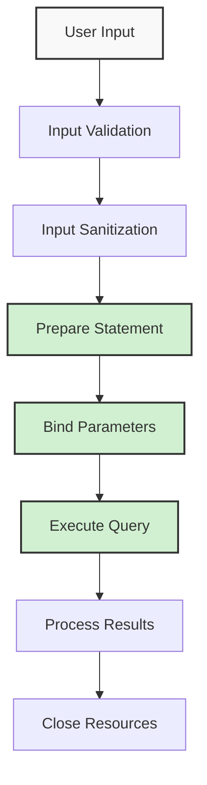

# PHP Database Security

## Introduction

Database security is a critical aspect of web development. When building PHP applications that interact with databases, implementing proper security measures is essential to protect sensitive data from unauthorized access and malicious attacks. This guide will introduce you to the fundamental concepts of PHP database security, with a focus on preventing common vulnerabilities like SQL injection.

As websites store increasingly sensitive information—from user credentials to personal data and payment details—securing database connections becomes not just good practice, but a necessary responsibility.

## Common Database Security Threats

Before diving into protection mechanisms, let's understand the main security threats your PHP applications face:

### SQL Injection

SQL injection is one of the most common and dangerous attacks against database-driven applications. It occurs when an attacker inserts malicious SQL code into queries through user input fields.

Consider this vulnerable code example:

```php
// Vulnerable code - DO NOT USE
$username = $_POST['username'];
$query = "SELECT * FROM users WHERE username = '$username'";
$result = mysqli_query($connection, $query);
```

If an attacker enters `' OR '1'='1` as the username, the resulting query becomes:

```sql
SELECT * FROM users WHERE username = '' OR '1'='1'
```

This condition is always true, potentially allowing access to all records in the users table!

### Other Common Threats

- **Mass Assignment**: When attackers modify query parameters to update or access unauthorized data
- **Excessive Privileges**: Database users with more permissions than necessary
- **Unencrypted Sensitive Data**: Storing passwords or personal information without encryption
- **Insecure Database Configuration**: Default settings that leave databases vulnerable

## Preventing SQL Injection

### 1. Using Prepared Statements

Prepared statements separate SQL logic from the data, making SQL injection impossible. Here's how to implement them:

#### MySQLi Prepared Statements

```php
// Connection setup
$conn = new mysqli("localhost", "username", "password", "database_name");

// Prepare statement
$stmt = $conn->prepare("SELECT * FROM users WHERE username = ? AND password = ?");

// Bind parameters
$stmt->bind_param("ss", $username, $password_hash);

// Set parameters
$username = $_POST['username'];
$password_hash = password_hash($_POST['password'], PASSWORD_DEFAULT);

// Execute statement
$stmt->execute();

// Get results
$result = $stmt->get_result();
if($result->num_rows > 0) {
    $user = $result->fetch_assoc();
    echo "Welcome, " . $user['username'] . "!";
} else {
    echo "Invalid login credentials.";
}

// Close statement and connection
$stmt->close();
$conn->close();
```

#### PDO Prepared Statements

```php
try {
    // Connection setup
    $conn = new PDO("mysql:host=localhost;dbname=database_name", "username", "password");
    
    // Set error mode
    $conn->setAttribute(PDO::ATTR_ERRMODE, PDO::ERRMODE_EXCEPTION);
    
    // Prepare statement
    $stmt = $conn->prepare("SELECT * FROM users WHERE username = :username");
    
    // Bind parameters
    $stmt->bindParam(':username', $username);
    
    // Set parameters
    $username = $_POST['username'];
    
    // Execute statement
    $stmt->execute();
    
    // Fetch results
    $users = $stmt->fetchAll();
    
    foreach($users as $user) {
        echo "User: " . $user['username'] . "<br>";
    }
} catch(PDOException $e) {
    echo "Error: " . $e->getMessage();
} finally {
    // Close connection
    $conn = null;
}
```

### 2. Input Validation and Sanitization

Always validate and sanitize user input before using it in database operations:

```php
// Validate input type
if(!is_numeric($_POST['user_id'])) {
    die("Invalid user ID format");
}

// Sanitize input for database
$username = mysqli_real_escape_string($conn, $_POST['username']);

// Validate email format
$email = filter_input(INPUT_POST, 'email', FILTER_VALIDATE_EMAIL);
if(!$email) {
    die("Invalid email format");
}
```

### 3. Using Database Abstraction Layers

Database abstraction layers can provide additional security by handling parameter binding and escaping automatically:

```php
// Example using Laravel's Eloquent ORM
$users = DB::table('users')
            ->where('status', 'active')
            ->where('age', '>', 18)
            ->get();
```

## Secure Database Configuration

### 1. Principle of Least Privilege

Create database users with only the permissions they need:

```sql
-- Create a user that can only SELECT (read-only)
CREATE USER 'reader'@'localhost' IDENTIFIED BY 'secure_password';
GRANT SELECT ON database_name.* TO 'reader'@'localhost';

-- Create a user that can SELECT, INSERT, and UPDATE but not DELETE
CREATE USER 'app_user'@'localhost' IDENTIFIED BY 'another_secure_password';
GRANT SELECT, INSERT, UPDATE ON database_name.* TO 'app_user'@'localhost';
```

### 2. Securing Connection Details

Never hardcode database credentials in your PHP files. Instead:

```php
// Store credentials in a separate file outside the web root
// config.php (stored in a secure location)
<?php
define('DB_HOST', 'localhost');
define('DB_USER', 'username');
define('DB_PASS', 'password');
define('DB_NAME', 'database_name');
?>

// In your application file
require_once('/secure/path/to/config.php');
$conn = new mysqli(DB_HOST, DB_USER, DB_PASS, DB_NAME);
```

Better yet, use environment variables:

```php
// Using environment variables
$conn = new mysqli(
    getenv('DB_HOST') ?: 'localhost',
    getenv('DB_USER'),
    getenv('DB_PASS'),
    getenv('DB_NAME')
);
```

## Password Security

### Proper Password Hashing

Never store plain-text passwords in your database. Always use secure hashing:

```php
// Hashing a password
$password = $_POST['password'];
$hashed_password = password_hash($password, PASSWORD_DEFAULT);

// Store $hashed_password in the database

// Later, to verify:
if(password_verify($_POST['password'], $hashed_password_from_db)) {
    echo "Password is correct!";
} else {
    echo "Incorrect password!";
}
```

## PHP Security Workflow

Here's a visual representation of a secure database workflow in PHP:



## Real-World Example: Registration and Login System

Let's build a secure user registration and login system:

### User Registration

```php
// connection.php - Store this outside web root
<?php
$servername = getenv('DB_HOST') ?: "localhost";
$username = getenv('DB_USER') ?: "app_user";
$password = getenv('DB_PASS') ?: "secure_password";
$dbname = getenv('DB_NAME') ?: "myapp";

try {
    $conn = new PDO("mysql:host=$servername;dbname=$dbname", $username, $password);
    $conn->setAttribute(PDO::ATTR_ERRMODE, PDO::ERRMODE_EXCEPTION);
} catch(PDOException $e) {
    die("Connection failed: " . $e->getMessage());
}
?>

// register.php
<?php
require_once('/secure/path/to/connection.php');

// Validate and sanitize inputs
$username = filter_input(INPUT_POST, 'username', FILTER_SANITIZE_STRING);
$email = filter_input(INPUT_POST, 'email', FILTER_VALIDATE_EMAIL);
$password = $_POST['password'];

// Validate input
if(!$username || !$email || strlen($password) < 8) {
    die("Invalid input data");
}

try {
    // Check if username exists
    $check_stmt = $conn->prepare("SELECT id FROM users WHERE username = :username");
    $check_stmt->bindParam(':username', $username);
    $check_stmt->execute();
    
    if($check_stmt->rowCount() > 0) {
        die("Username already exists");
    }
    
    // Hash password
    $password_hash = password_hash($password, PASSWORD_DEFAULT);
    
    // Insert new user
    $stmt = $conn->prepare("INSERT INTO users (username, email, password) VALUES (:username, :email, :password)");
    $stmt->bindParam(':username', $username);
    $stmt->bindParam(':email', $email);
    $stmt->bindParam(':password', $password_hash);
    
    $stmt->execute();
    echo "Registration successful!";
} catch(PDOException $e) {
    echo "Error: " . $e->getMessage();
}

$conn = null;
?>
```

### User Login

```php
// login.php
<?php
require_once('/secure/path/to/connection.php');
session_start();

// Validate input
$username = filter_input(INPUT_POST, 'username', FILTER_SANITIZE_STRING);
$password = $_POST['password'];

if(!$username || !$password) {
    die("Please enter both username and password");
}

try {
    // Prepare statement
    $stmt = $conn->prepare("SELECT id, username, password FROM users WHERE username = :username");
    $stmt->bindParam(':username', $username);
    $stmt->execute();
    
    if($stmt->rowCount() == 1) {
        $user = $stmt->fetch(PDO::FETCH_ASSOC);
        
        // Verify password
        if(password_verify($password, $user['password'])) {
            // Success - Set session variables
            $_SESSION['user_id'] = $user['id'];
            $_SESSION['username'] = $user['username'];
            
            echo "Login successful! Welcome, " . $_SESSION['username'];
        } else {
            echo "Invalid password";
        }
    } else {
        echo "User not found";
    }
} catch(PDOException $e) {
    echo "Error: " . $e->getMessage();
}

$conn = null;
?>
```

## Additional Security Measures

### 1. Parameterized Database Schema

Use proper data types and constraints:

```sql
CREATE TABLE users (
    id INT NOT NULL AUTO_INCREMENT PRIMARY KEY,
    username VARCHAR(50) NOT NULL UNIQUE,
    email VARCHAR(100) NOT NULL UNIQUE,
    password VARCHAR(255) NOT NULL,
    created_at TIMESTAMP DEFAULT CURRENT_TIMESTAMP,
    is_active BOOLEAN DEFAULT true
);
```

### 2. Limiting Query Results

Avoid returning excessive data:

```php
// Limit number of results
$stmt = $conn->prepare("SELECT id, username FROM users LIMIT 10");

// Pagination example
$page = isset($_GET['page']) ? (int)$_GET['page'] : 1;
$per_page = 10;
$offset = ($page - 1) * $per_page;

$stmt = $conn->prepare("SELECT id, username FROM users LIMIT :offset, :per_page");
$stmt->bindParam(':offset', $offset, PDO::PARAM_INT);
$stmt->bindParam(':per_page', $per_page, PDO::PARAM_INT);
```

### 3. Error Handling

Implement proper error handling without exposing sensitive information:

```php
try {
    // Database operations
} catch(Exception $e) {
    // Log the real error for administrators
    error_log("Database error: " . $e->getMessage());
    
    // Show generic message to users
    echo "An error occurred. Please try again later.";
}
```

## Summary

Securing your PHP database interactions is essential for protecting your application and user data. Key takeaways include:

1. **Always use prepared statements** to prevent SQL injection
2. **Validate and sanitize all user inputs** before using them in queries
3. **Implement proper password hashing** for storing user credentials
4. **Follow the principle of least privilege** for database users
5. **Secure your database credentials** using configuration files or environment variables
6. **Implement proper error handling** that doesn't expose sensitive information

By following these practices, you can significantly reduce the risk of security breaches in your PHP applications.

## Exercises

1. Convert the following vulnerable query to use prepared statements:
   ```php
   $search = $_GET['search'];
   $query = "SELECT * FROM products WHERE name LIKE '%$search%'";
   ```

2. Create a secure database configuration file that uses environment variables.

3. Implement a secure password reset feature that uses token-based authentication.

## Additional Resources

- [PHP Manual: MySQLi Prepared Statements](https://www.php.net/manual/en/mysqli.quickstart.prepared-statements.php)
- [PHP Manual: PDO](https://www.php.net/manual/en/book.pdo.php)
- [OWASP SQL Injection Prevention Cheat Sheet](https://cheatsheetseries.owasp.org/cheatsheets/SQL_Injection_Prevention_Cheat_Sheet.html)
- [PHP Password Hashing](https://www.php.net/manual/en/function.password-hash.php)