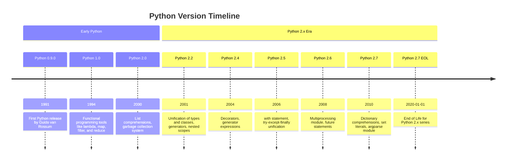
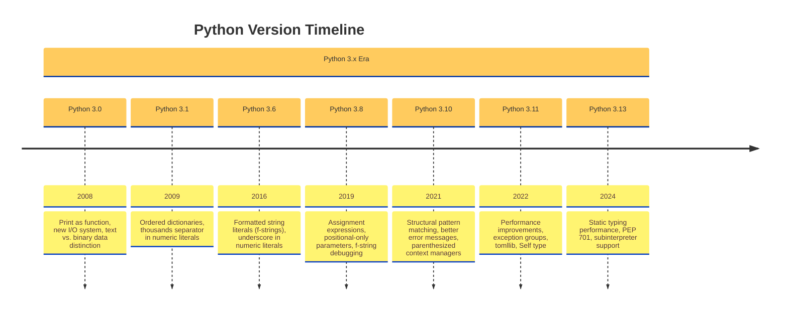
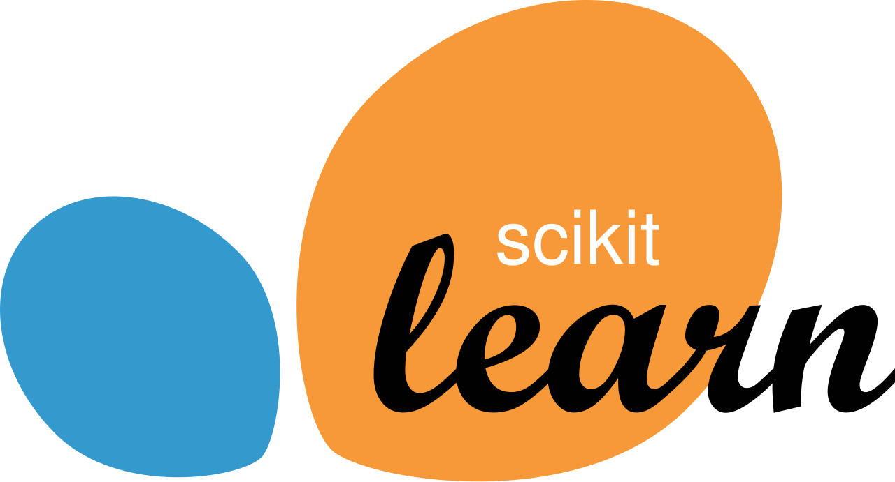
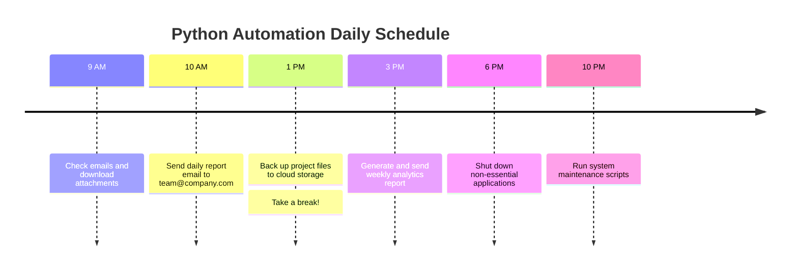
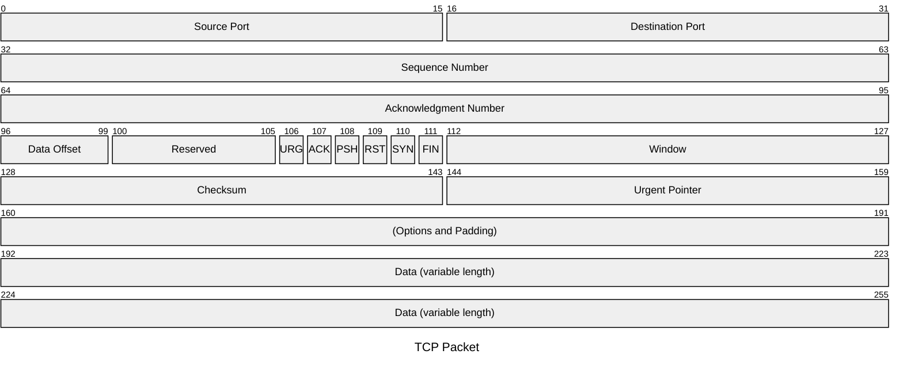
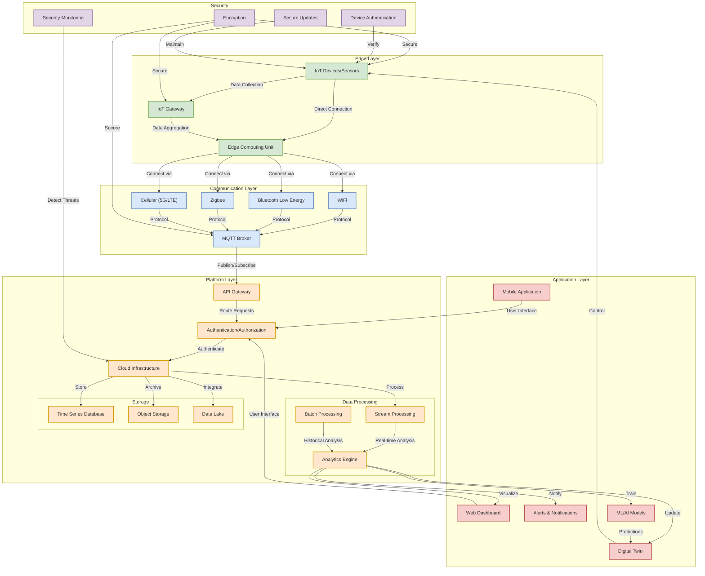
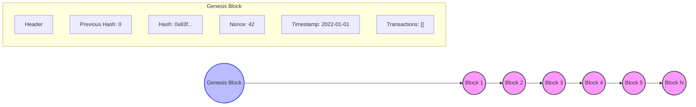

import Image from '@theme/IdealImage';


# Python Introduction

## What is Python?

<div style={{
    "width": "50%",
    "margin": "0 auto",
}}>
    <Image img={require('./img/logo/python-logo-master-v3-TM.png')}/>
</div>

Python is a high-level, interpreted, and general-purpose programming language. It was created by [**Guido van Rossum**](https://en.wikipedia.org/wiki/Guido_van_Rossum)
and first released in **1991**. Python's simple and readable syntax makes it a popular choice for beginners and
experienced developers alike.


:::info

* Python is a **scripting language**, meaning it is designed for automating tasks and writing scripts to control other
software.
* Python is an **interpreted language**, which means that Python code is executed line by line at runtime, rather than
being compiled into machine code beforehand.
* Python is a **dynamically typed** language, meaning you don't need to declare the type of a variable when you create
it.
The type is determined at runtime based on the value assigned to the variable.

:::


<details>

    <summary>What is a Dynamically Typed Language?</summary>

    ### What is a Dynamically Typed Language?

    A **dynamically typed language** is a programming language in which variable types are determined at **runtime**
    rather
    than **compile time**. This means that you do not need to explicitly declare the type of a variable when you create
    it—Python automatically infers the type based on the assigned value.

    #### Example in Python

    ```python
    x = 10 # x is an integer
    x = "Hello" # x is now a string
    x = 3.14 # x is now a float
    ```

    In the above example:

    - Initially, `x` is assigned an **integer** (`10`).
    - Later, `x` is reassigned to a **string** (`"Hello"`).
    - Then, `x` is reassigned to a **float** (`3.14`).

    Python allows you to change the type of a variable simply by assigning a new value of a different type. This is in
    contrast to **statically typed languages** like **Java, C, or C++**, where variable types must be explicitly
    declared
    and cannot change.

    ---

    #### **Dynamically Typed vs. Statically Typed Languages**

    | Feature | Dynamically Typed (Python) | Statically Typed (Java, C++) |
    |----------------------|------------------------------|-----------------------------------|
    | **Type Declaration** | Not required | Required |
    | **Type Checking** | At runtime | At compile-time |
    | **Flexibility** | More flexible | More rigid |
    | **Error Detection** | Errors occur at runtime | Errors caught at compile-time |
    | **Performance** | Slower due to runtime checks | Faster due to compile-time checks |

    ---

    #### **Advantages of Dynamic Typing**

    1. **Faster Development:** No need to declare types explicitly.
    2. **More Readable Code:** Less boilerplate, making code cleaner and easier to write.
    3. **Flexible and Adaptable:** Allows variables to change types dynamically.

    ---

    #### **Disadvantages of Dynamic Typing**

    1. **Potential Runtime Errors:** Type mismatches are only detected during execution, leading to runtime errors.
    2. **Harder to Debug:** Bugs related to type errors might not be obvious until the program runs.
    3. **Slower Performance:** Additional runtime checks make dynamically typed languages generally slower than
    statically
    typed ones.

    ---

    #### **Example: Type Flexibility in Python**

    ```python
    def add(a, b):
    return a + b

    print(add(5, 10)) # Output: 15 (Integer Addition)
    print(add("5", "10")) # Output: "510" (String Concatenation)
    ```

    Here, `add()` works for both integers and strings because Python dynamically determines the type of `a` and `b` at
    runtime.


</details>

<div align={"center"}>
    ```mermaid
    flowchart LR
    Python[Python] --> Features[Key Features]
    Features --> A[High-level]
    Features --> B[Interpreted]
    Features --> C[Dynamically typed]
    Features --> D[Simple syntax]
    Features --> E[Object-oriented]

    style Python fill:#6495ED,stroke:#333,stroke-width:2px,color:white,font-weight:bold
    style Features fill:#90EE90,stroke:#333,stroke-width:1px
    ```
</div>


## Why Learn Python?

- **Simple and Readable:** Python's syntax is clean and similar to natural language.
- **Versatile:** Used in web development, data science, AI, automation, game development, and more.
- **Extensive Libraries:** Python has a vast standard library and third-party modules.
- **Strong Community Support:** Large community with ample tutorials and documentation.

<div align={"center"}>
    ```mermaid
    xychart-beta
    title "Python Users Growth (2010-2024)"
    x-axis "Year" ["2010", "2012", "2014", "2016", "2018", "2020", "2022", "2024"]
    y-axis "Users (millions)" 1 --> 15
    bar [1.5, 2.3, 3.8, 5.6, 7.1, 8.7, 10.2, 11.8]
    line [1.5, 2.3, 3.8, 5.6, 7.1, 8.7, 10.2, 11.8]

    ```
</div>

---

## Python 3 vs. Python 2: Key Differences


:::warning

Python 2 was the older version of Python, widely used in legacy applications. However, it is **no longer maintained** as
of
**January 1, 2020**. Python 3 is the modern and actively supported version.

The language being used in this tutorial is **Python 3**.

:::


| Feature                | Python 2                         | Python 3                                |
|------------------------|----------------------------------|-----------------------------------------|
| **Print Statement**    | `print "Hello"` (No parentheses) | `print("Hello")` (Parentheses required) |
| **Integer Division**   | `5 / 2` → `2` (floor division)   | `5 / 2` → `2.5` (true division)         |
| **Unicode Support**    | Strings are ASCII by default     | Strings are Unicode by default          |
| **Iteration Methods**  | `.iteritems(), .xrange()` used   | `.items(), range()` replaces them       |
| **Syntax Differences** | `except Exception, e:`           | `except Exception as e:`                |
| **End of Life**        | No updates after 2020            | Actively maintained and updated         |






## Applications of Python in Various Fields

Python is one of the most widely used programming languages today due to its **simplicity, versatility, and extensive
library support**. It is used in **software development, data science, automation, artificial intelligence, and many
other fields**. Below are some of the major applications of Python.

---

### Web Development

Python is widely used in web development with powerful frameworks such as:

- [**Django**](https://www.djangoproject.com/) – A high-level framework that simplifies web application development.
- [**Flask**](https://flask.palletsprojects.com/en/stable/) – A lightweight web framework for building simple and
scalable applications.
- [**FastAPI**](https://fastapi.tiangolo.com/) – A high-performance framework for building RESTful APIs.

|                        Flask                         |                        Django                         |                        FastAPI                         |
|:----------------------------------------------------:|:-----------------------------------------------------:|:------------------------------------------------------:|
| <Image img={require('./img/logo/flask-logo.png')} /> | <Image img={require('./img/logo/django-logo.png')} /> | <Image img={require('./img/logo/fastapi-logo.png')} /> |

💡 **Flask Example:**

```python
from flask import Flask

app = Flask(__name__)

@app.route("/")
def home():
    return "Hello, World!"

if __name__ == "__main__":
    app.run()
```

---

### Data Science & Analytics

Python is a dominant language in **data analysis, statistics, and visualization**. It provides powerful libraries such
as:

- [**Pandas**](https://pandas.pydata.org/) – Data manipulation and analysis.
- [**NumPy**](https://numpy.org/) – Mathematical and scientific computing.
- [**Matplotlib & Seaborn**](https://matplotlib.org/) – Data visualization.
- [**Scikit-learn**](https://scikit-learn.org/) – Machine learning algorithms.

|                  Pandas                  |                 Numpy                  |                     Scikit-learn                     |
|:----------------------------------------:|:--------------------------------------:|:----------------------------------------------------:|
|  |  |  |


💡 **Example:**

```python
import pandas as pd

data = {"Name": ["Alice", "Bob", "Charlie"], "Age": [25, 30, 35]}
df = pd.DataFrame(data)

print(df)
```

📊 **Real-World Use Cases:**

- Financial companies use Python for **stock market analysis**.
- Social media platforms use Python for **user behavior analysis**.

---

### Machine Learning & Artificial Intelligence

Python is the most popular language for **AI and ML development** due to its powerful libraries:

- **[TensorFlow](https://www.tensorflow.org/) & [PyTorch](https://pytorch.org/)** – Deep learning frameworks.
- [**Scikit-learn**](https://scikit-learn.org/) – Traditional machine learning algorithms.
- **[NLTK](https://www.nltk.org/) & [spaCy](https://spacy.io/)** – Natural language processing (NLP).

|                    TensorFlow                    |                  PyTorch                   |
|:------------------------------------------------:|:------------------------------------------:|
|  |  |


💡 **Example: Simple AI model**

```python
from sklearn.linear_model import LinearRegression

model = LinearRegression()
X = [[1], [2], [3], [4], [5]]
y = [2, 4, 6, 8, 10]

model.fit(X, y)
print(model.predict([[6]]))  # Predict the next value
```

🤖 **Real-World Applications:**

- **Chatbots & Virtual Assistants** (Google Assistant, Siri, Alexa)
- **Recommendation Systems** (YouTube, Netflix, Amazon)

---

### Automation & Scripting

Python is widely used for **task automation** and **scripting**, making it popular for DevOps and IT professionals.

- **Automate file handling**
- **Web scraping**
- **Sending emails and managing databases**



**Example: Automating Email Sending**

```python
import smtplib

server = smtplib.SMTP("smtp.gmail.com", 587)
server.starttls()
server.login("your_email@gmail.com", "your_password")
server.sendmail("your_email@gmail.com", "recipient@example.com", "Hello from Python!")
server.quit()
```

⚙️ **Real-World Uses:**

- Automating **data entry, backups, and monitoring systems**.
- Automating **social media posting**.

---

### Cybersecurity & Ethical Hacking

Python is used in **cybersecurity** for penetration testing, vulnerability detection, and security analysis.

- **[Scapy](https://scapy.net/)** – Packet manipulation.
- **PyCrypto & [Cryptography](https://cryptography.io/en/latest/)** – Encryption & decryption.
- **Requests & [BeautifulSoup](https://pypi.org/project/beautifulsoup4/)** – Web scraping for ethical hacking.



💡 **Example: Hashing passwords using Python**

```python
import hashlib

password = "mypassword"
hashed_password = hashlib.sha256(password.encode()).hexdigest()

print("Hashed Password:", hashed_password)
```

🛡 **Real-World Applications:**

- Network security tools like **Nmap and Wireshark** use Python.
- Ethical hackers use Python to detect **security vulnerabilities**.

---

### Internet of Things (IoT)

Python is used in **IoT** for programming microcontrollers, smart home devices, and industrial automation.



- **[MicroPython](https://micropython.org/)** and **Raspberry Pi** allow Python to run on small IoT devices.

💡 **Example: Controlling an LED with Python and Raspberry Pi**

```python
import RPi.GPIO as GPIO
import time

GPIO.setmode(GPIO.BCM)
GPIO.setup(18, GPIO.OUT)

GPIO.output(18, GPIO.HIGH)  # Turn on LED
time.sleep(2)
GPIO.output(18, GPIO.LOW)   # Turn off LED
```

🌍 **Real-World Uses:**

- Smart home automation (lights, security systems).
- Smart healthcare devices.

---

### Game Development

Python is also used in **game development** with frameworks like:

- **[Pygame](https://github.com/pygame/pygame)** – 2D game development.
- **[Panda3D](https://www.panda3d.org/)** – 3D game engine.

💡 **Example: A simple Pygame program**

```python
import pygame

pygame.init()
screen = pygame.display.set_mode((400, 300))
pygame.display.set_caption("Simple Game")

running = True
while running:
    for event in pygame.event.get():
        if event.type == pygame.QUIT:
            running = False

pygame.quit()
```

🎮 **Games Developed with Python:**

- **Battlefield 2** (Logic scripting)
- **Civilization IV** (Game AI)
- **World of Tanks** (Server-side)

---

### Blockchain & Cryptocurrency

Python is widely used in **blockchain development** due to its simplicity and security.



- **Web3.py** – Interacting with Ethereum blockchain.
- **Bitcoinlib** – Bitcoin transactions.

💡 **Example: Generating a Blockchain Hash**

```python
import hashlib

block_data = "Block #1 - Transaction Data"
block_hash = hashlib.sha256(block_data.encode()).hexdigest()

print("Block Hash:", block_hash)
```

💰 **Real-World Uses:**

- **Ethereum Smart Contracts** (Solidity + Python)
- **Crypto Trading Bots**

---

### Robotics & Automation

Python is heavily used in **robotics** for controlling robots and AI-based automation.

- **ROS (Robot Operating System)** – Uses Python for robotic programming.
- **OpenCV** – Used in computer vision for robotics.


💡 **Example: Face Detection with OpenCV**

```python
import cv2

face_cascade = cv2.CascadeClassifier(cv2.data.haarcascades + "haarcascade_frontalface_default.xml")
img = cv2.imread("face.jpg")
gray = cv2.cvtColor(img, cv2.COLOR_BGR2GRAY)

faces = face_cascade.detectMultiScale(gray, 1.1, 4)
for (x, y, w, h) in faces:
    cv2.rectangle(img, (x, y), (x+w, y+h), (255, 0, 0), 2)

cv2.imshow("Face Detection", img)
cv2.waitKey(0)
```

🤖 **Real-World Applications:**

- **Self-driving cars** (Tesla, Waymo).
- **AI-powered robots** in healthcare & industry.

