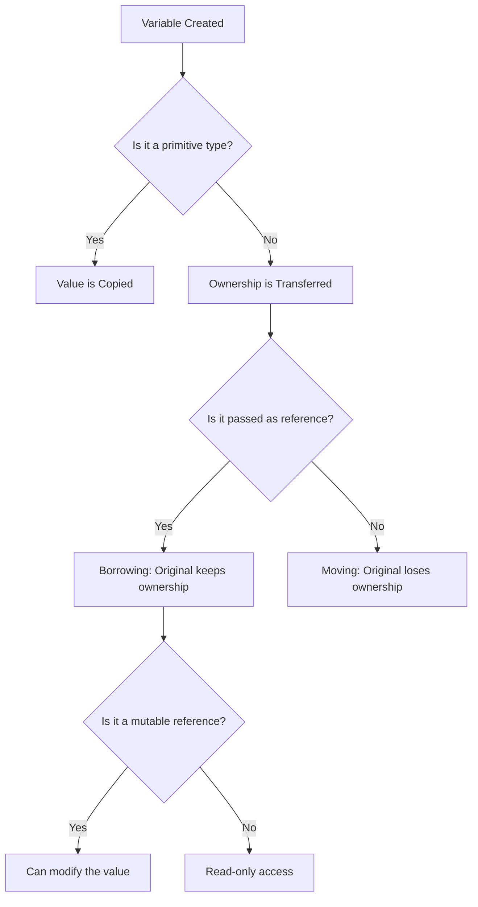

# Rust Introduction

## What is Rust?


<div style={{
    "width": "20%",
    "margin": "0 auto",
    "text-align": "center"
}}>
    
</div>

Rust is a modern systems programming language focused on safety, speed, and concurrency. First released in 2015, Rust has quickly gained popularity among developers for its unique approach to memory management and its powerful type system.

Unlike languages like Python or JavaScript, Rust gives you low-level control over system resources while providing high-level abstractions that make it pleasant to work with. It's often described as a language that provides both performance and programmer productivity.

## Why Learn Rust?

There are several compelling reasons to learn Rust:

1. **Memory Safety Without Garbage Collection**: Rust's ownership system ensures memory safety at compile time without needing a garbage collector, making it ideal for performance-critical applications.

2. **Concurrency Without Data Races**: Rust's type system and ownership model help prevent data races and other concurrency bugs at compile time.

3. **Zero-Cost Abstractions**: Rust allows you to write high-level, expressive code without sacrificing performance.

4. **Modern Language Features**: Rust includes pattern matching, type inference, generics, and many other features from modern programming languages.

5. **Growing Ecosystem**: Rust has a rapidly growing ecosystem of libraries (called "crates") and a friendly, helpful community.

## Installing Rust

Before we write our first Rust program, let's make sure Rust is installed on your system.

Rust is installed using a tool called `rustup`, which manages Rust versions and associated tools. Here's how to install it:

### On Windows, macOS, or Linux:

1. Visit [https://rustup.rs](https://rustup.rs) in your browser
2. Follow the instructions to download and run `rustup-init`
3. Follow the prompts to complete the installation

After installation, you should be able to run the following commands to verify that Rust is installed correctly:

```bash
rustc --version
cargo --version
```

## Your First Rust Program

Let's create the traditional "Hello, World!" program in Rust. Create a new file called `hello.rs` and add the following code:

```rust
fn main() {
    println!("Hello, World!");
}
```

To compile and run this program, use the following commands:

```bash
rustc hello.rs
./hello  # On Windows, use hello.exe instead
```

### Output:
```
Hello, World!
```

Let's break down this simple program:

- `fn main()` defines a function named `main`. The `main` function is special in Rust - it's the entry point of every Rust program.
- The function body is enclosed in curly braces `{}`.
- `println!` is a macro (note the `!`) that prints text to the console.
- Statements in Rust end with a semicolon `;`.

## Using Cargo: Rust's Build System and Package Manager

While you can compile Rust programs directly with `rustc`, most Rust developers use Cargo, Rust's build system and package manager. Let's rewrite our Hello World program using Cargo:

```bash
cargo new hello_cargo
cd hello_cargo
```

This creates a new Rust project with the following structure:

```
hello_cargo/
├── Cargo.toml
└── src/
    └── main.rs
```

The `Cargo.toml` file contains metadata about your project and its dependencies, while `src/main.rs` contains the source code.

Open `src/main.rs` and you'll see the same "Hello, World!" program we wrote earlier. To build and run this program, use:

```bash
cargo run
```

### Output:
```
   Compiling hello_cargo v0.1.0 (/path/to/hello_cargo)
    Finished dev [unoptimized + debuginfo] target(s) in 0.56s
     Running `target/debug/hello_cargo`
Hello, World!
```

## Basic Syntax and Concepts

Now that we've set up Rust and created our first program, let's explore some basic Rust syntax and concepts.

### Variables and Mutability

In Rust, variables are immutable by default. Once a value is bound to a name, you can't change that value:

```rust
fn main() {
    let x = 5;
    println!("The value of x is: {}", x);
    
    // This would cause a compile error
    // x = 6;
    
    // To make a variable mutable, use the `mut` keyword
    let mut y = 5;
    println!("The value of y is: {}", y);
    
    y = 6;
    println!("The value of y is now: {}", y);
}
```

### Output:
```
The value of x is: 5
The value of y is: 5
The value of y is now: 6
```

### Data Types

Rust is a statically typed language, which means it must know the types of all variables at compile time. Let's look at some common data types:

```rust
fn main() {
    // Integer types
    let a: i32 = 42;  // 32-bit signed integer
    let b: u8 = 255;  // 8-bit unsigned integer
    
    // Floating-point types
    let c: f64 = 3.14159;  // 64-bit float
    
    // Boolean type
    let d: bool = true;
    
    // Character type
    let e: char = 'z';
    
    // String type
    let f: &str = "hello";  // String slice
    let g: String = String::from("world");  // Owned string
    
    println!("a: {}, b: {}, c: {}", a, b, c);
    println!("d: {}, e: {}", d, e);
    println!("f: {}, g: {}", f, g);
}
```

### Output:
```
a: 42, b: 255, c: 3.14159
d: true, e: z
f: hello, g: world
```

### Control Flow

Rust has familiar control flow constructs like `if`, `else`, loops, and `match` (Rust's powerful pattern matching construct):

```rust
fn main() {
    // If-else
    let number = 7;
    
    if number < 5 {
        println!("Number is less than 5");
    } else if number > 10 {
        println!("Number is greater than 10");
    } else {
        println!("Number is between 5 and 10");
    }
    
    // Loops
    let mut counter = 0;
    
    loop {
        counter += 1;
        
        if counter == 5 {
            break;
        }
        
        println!("Loop iteration: {}", counter);
    }
    
    // While loop
    let mut number = 3;
    
    while number != 0 {
        println!("{}!", number);
        number -= 1;
    }
    println!("Liftoff!");
    
    // For loop
    let numbers = [10, 20, 30, 40, 50];
    
    for num in numbers.iter() {
        println!("Number: {}", num);
    }
}
```

### Output:
```
Number is between 5 and 10
Loop iteration: 1
Loop iteration: 2
Loop iteration: 3
Loop iteration: 4
3!
2!
1!
Liftoff!
Number: 10
Number: 20
Number: 30
Number: 40
Number: 50
```

## Functions

Functions are a core component of Rust programs. Let's define some simple functions:

```rust
fn main() {
    println!("Hello from main!");
    say_hello();
    
    let sum = add(5, 7);
    println!("5 + 7 = {}", sum);
    
    let squared = square(4);
    println!("4 squared is {}", squared);
}

fn say_hello() {
    println!("Hello, function!");
}

fn add(x: i32, y: i32) -> i32 {
    x + y  // Note: no semicolon here means this is a return expression
}

fn square(x: i32) -> i32 {
    // We can also use an explicit return statement
    return x * x;
}
```

### Output:
```
Hello from main!
Hello, function!
5 + 7 = 12
4 squared is 16
```

## Ownership: Rust's Unique Feature

Ownership is Rust's most unique feature and helps it guarantee memory safety without a garbage collector. Let's understand it with a simple example:

```rust
fn main() {
    // String is a heap-allocated type
    let s1 = String::from("hello");
    
    // This moves ownership from s1 to s2
    let s2 = s1;
    
    // This would cause an error: s1 no longer owns the value
    // println!("{}", s1);
    
    // This works fine
    println!("{}", s2);
    
    // Passing ownership to a function
    takes_ownership(s2);
    
    // Can't use s2 anymore because ownership was transferred
    // println!("{}", s2);
    
    // Primitive types are copied, not moved
    let x = 5;
    let y = x;
    
    // This is fine because integers are copied
    println!("x = {}, y = {}", x, y);
    
    // Borrowing: using references to avoid transferring ownership
    let s3 = String::from("hello");
    let len = calculate_length(&s3);
    
    // s3 is still valid here because we only borrowed it
    println!("The length of '{}' is {}.", s3, len);
    
    // Mutable borrowing
    let mut s4 = String::from("hello");
    change(&mut s4);
    println!("Changed string: {}", s4);
}

fn takes_ownership(s: String) {
    println!("Took ownership of: {}", s);
    // s is dropped (freed) when this function ends
}

fn calculate_length(s: &String) -> usize {
    // s is a reference to a String
    s.len()
    // s goes out of scope, but since it's just a reference,
    // the value it refers to is not dropped
}

fn change(s: &mut String) {
    s.push_str(", world");
}
```

### Output:
```
hello
Took ownership of: hello
x = 5, y = 5
The length of 'hello' is 5.
Changed string: hello, world
```

## Memory Safety Visualized

Here's a visualization of Rust's ownership model:



## Practical Example: A Simple Temperature Converter

Let's create a practical example that converts temperatures between Celsius and Fahrenheit:

```rust
use std::io;

fn main() {
    println!("Temperature Converter");
    println!("====================");
    
    loop {
        println!("
Select an option:");
        println!("1. Celsius to Fahrenheit");
        println!("2. Fahrenheit to Celsius");
        println!("3. Quit");
        
        let choice = get_user_input("Enter your choice (1-3): ");
        
        match choice.trim() {
            "1" => celsius_to_fahrenheit(),
            "2" => fahrenheit_to_celsius(),
            "3" => {
                println!("Goodbye!");
                break;
            }
            _ => println!("Invalid choice, please try again."),
        }
    }
}

fn get_user_input(prompt: &str) -> String {
    println!("{}", prompt);
    let mut input = String::new();
    io::stdin()
        .read_line(&mut input)
        .expect("Failed to read input");
    input
}

fn celsius_to_fahrenheit() {
    let input = get_user_input("Enter temperature in Celsius: ");
    
    // Parse the input as a floating-point number
    match input.trim().parse::<f64>() {
        Ok(celsius) => {
            let fahrenheit = (celsius * 9.0 / 5.0) + 32.0;
            println!("{:.2}°C is {:.2}°F", celsius, fahrenheit);
        }
        Err(_) => {
            println!("Invalid input. Please enter a number.");
        }
    }
}

fn fahrenheit_to_celsius() {
    let input = get_user_input("Enter temperature in Fahrenheit: ");
    
    // Parse the input as a floating-point number
    match input.trim().parse::<f64>() {
        Ok(fahrenheit) => {
            let celsius = (fahrenheit - 32.0) * 5.0 / 9.0;
            println!("{:.2}°F is {:.2}°C", fahrenheit, celsius);
        }
        Err(_) => {
            println!("Invalid input. Please enter a number.");
        }
    }
}
```

This program demonstrates:
- User input handling with proper error checking
- Function organization
- Pattern matching with `match`
- Type parsing
- Control flow with loops

## Summary

In this introduction to Rust, we've covered:

- What Rust is and why it's worth learning
- How to install Rust and set up your development environment
- Creating and running your first Rust program
- Basic syntax including variables, data types, and control flow
- Functions and how they work in Rust
- Rust's ownership system - its most unique and powerful feature
- A practical example showing Rust in action

Rust's combination of performance, safety, and ergonomics makes it an excellent choice for a wide range of applications, from systems programming to web development and beyond.

## Additional Resources

To continue your Rust journey, check out these resources:

1. [The Rust Book](https://doc.rust-lang.org/book/) - The official comprehensive guide to Rust
2. [Rust by Example](https://doc.rust-lang.org/rust-by-example/) - Learn Rust through annotated examples
3. [Rustlings](https://github.com/rust-lang/rustlings/) - Small exercises to get you used to reading and writing Rust code
4. [Exercism Rust Track](https://exercism.io/tracks/rust) - Practice exercises to improve your Rust skills
5. [Crates.io](https://crates.io/) - The Rust package registry

## Exercises

1. **Hello, Name**: Modify the "Hello, World!" program to ask for the user's name and then greet them by name.

2. **Number Guessing Game**: Create a simple game where the program generates a random number and the user tries to guess it, with the program providing "higher" or "lower" hints.

3. **Calculator**: Build a command-line calculator that can perform basic arithmetic operations (addition, subtraction, multiplication, division).

4. **Word Counter**: Write a program that counts the number of words, characters, and lines in a text input.

5. **Fibonacci Generator**: Create a function that generates the first n numbers in the Fibonacci sequence.

Happy coding in Rust!