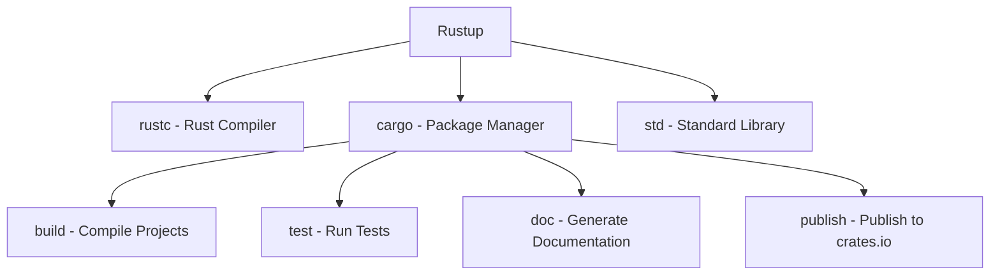

# Rust Environment Setup

## Introduction

Welcome to the world of Rust programming! Before you can start writing Rust code, you'll need to set up your development environment. This guide will walk you through the process of installing Rust and its essential tools, configuring your editor, and creating your first Rust project. By the end of this tutorial, you'll have everything you need to begin your Rust programming journey.

Rust is a systems programming language that focuses on safety, speed, and concurrency. Unlike other programming languages, Rust ensures memory safety without using a garbage collector, making it ideal for performance-critical applications. Setting up a proper Rust environment is your first step toward mastering this powerful language.

## Installing Rust

The primary way to install Rust is through a tool called **Rustup**, which is both a version manager and an installer for Rust.

### Installing Rustup

#### On Windows

1. Visit [https://rustup.rs](https://rustup.rs) and download the Rustup installer
2. Run the downloaded file and follow the on-screen instructions
3. You may need to install the Visual Studio C++ Build tools if prompted

#### On macOS and Linux

Open your terminal and run the following command:

```bash
curl --proto '=https' --tlsv1.2 -sSf https://sh.rustup.rs | sh
```

Follow the prompts to complete the installation. By default, this will install the latest stable version of Rust.

After installation, you'll need to restart your terminal or run the following command to update your PATH:

```bash
source $HOME/.cargo/env
```

### Verifying Your Installation

To verify that Rust has been installed correctly, open a new terminal window and run:

```bash
rustc --version
```

You should see output similar to:

```
rustc 1.72.0 (5680fa18f 2023-08-23)
```

Also check if Cargo (Rust's package manager) is installed:

```bash
cargo --version
```

Output should look like:

```
cargo 1.72.0 (103a7ff2e 2023-08-15)
```

## Understanding Rust Components

When you install Rust using Rustup, several components are installed:



### Key Components

1. **rustc** - The Rust compiler that transforms your Rust code into executable binaries
2. **cargo** - Rust's package manager and build system
3. **std** - Rust's standard library

## Setting Up Your Development Environment

While you can write Rust code in any text editor, using an IDE or code editor with Rust extensions can significantly improve your development experience.

### Visual Studio Code

Visual Studio Code is a popular choice for Rust development:

1. Download and install [Visual Studio Code](https://code.visualstudio.com/)
2. Install the "rust-analyzer" extension from the marketplace
3. Optionally, install "CodeLLDB" for debugging support
4. Install "Better TOML" for better support for TOML configuration files

### Other IDE Options

- **IntelliJ IDEA** with the Rust plugin
- **Vim/Neovim** with rust.vim and rust-analyzer plugins
- **Emacs** with rust-mode and rust-analyzer

## Creating Your First Rust Project

Let's create a simple "Hello, World!" program to verify your setup.

### Using Cargo to Create a New Project

Open your terminal and run:

```bash
cargo new hello_rust
cd hello_rust
```

This creates a new Rust project named "hello_rust" and changes your directory to the project folder.

### Project Structure

A new Cargo project has the following structure:

```
hello_rust/
├── Cargo.toml
└── src/
    └── main.rs
```

- **Cargo.toml** is the manifest file that contains metadata about your project and its dependencies
- **src/main.rs** is the main source file for your program

The default `main.rs` file contains a simple "Hello, world!" program:

```rust
fn main() {
    println!("Hello, world!");
}
```

### Building and Running Your Project

To build and run your project, use:

```bash
cargo run
```

You should see output similar to:

```
   Compiling hello_rust v0.1.0 (/path/to/hello_rust)
    Finished dev [unoptimized + debuginfo] target(s) in 0.56s
     Running `target/debug/hello_rust`
Hello, world!
```

### Building Without Running

If you just want to check if your code compiles without running it:

```bash
cargo build
```

This command creates an executable in the `target/debug` directory.

### Creating a Release Build

For optimized production-ready code:

```bash
cargo build --release
```

This creates an optimized executable in the `target/release` directory.

## Managing Rust Versions

Rustup makes it easy to manage different Rust versions.

### Updating Rust

To update to the latest Rust version:

```bash
rustup update
```

### Installing Different Toolchains

You can install different Rust versions (called "toolchains"):

```bash
# Install nightly version
rustup install nightly

# Use nightly for the current project
rustup override set nightly
```

### Viewing Installed Toolchains

To see which toolchains you have installed:

```bash
rustup toolchain list
```

## Adding Dependencies to Your Project

One of Rust's strengths is its package ecosystem. Let's modify our project to use a popular crate (Rust package).

### Updating Cargo.toml

Open `Cargo.toml` and add a dependency:

```toml
[package]
name = "hello_rust"
version = "0.1.0"
edition = "2021"

[dependencies]
colored = "2.0"
```

This adds the "colored" crate, which allows you to add colors to terminal output.

### Using the Dependency

Update `src/main.rs` to use the new dependency:

```rust
use colored::*;

fn main() {
    println!("{}", "Hello, colorful Rust world!".green().bold());
}
```

Run the project with `cargo run` to see the colorful output.

## Practical Example: Creating a Temperature Converter

Let's create a slightly more complex project - a temperature converter between Celsius and Fahrenheit.

Create a new project:

```bash
cargo new temp_converter
cd temp_converter
```

Update `src/main.rs` with the following code:

```rust
use std::io;

fn main() {
    println!("Temperature Converter");
    println!("====================");
    println!("1. Celsius to Fahrenheit");
    println!("2. Fahrenheit to Celsius");
    
    let mut choice = String::new();
    
    println!("Enter your choice (1 or 2): ");
    io::stdin()
        .read_line(&mut choice)
        .expect("Failed to read input");
    
    let choice: u32 = match choice.trim().parse() {
        Ok(num) => num,
        Err(_) => {
            println!("Please enter a valid number!");
            return;
        }
    };
    
    if choice != 1 && choice != 2 {
        println!("Please enter either 1 or 2!");
        return;
    }
    
    let mut temperature = String::new();
    
    println!("Enter the temperature: ");
    io::stdin()
        .read_line(&mut temperature)
        .expect("Failed to read input");
    
    let temperature: f64 = match temperature.trim().parse() {
        Ok(num) => num,
        Err(_) => {
            println!("Please enter a valid temperature!");
            return;
        }
    };
    
    match choice {
        1 => {
            let fahrenheit = celsius_to_fahrenheit(temperature);
            println!("{}°C is equal to {}°F", temperature, fahrenheit);
        },
        2 => {
            let celsius = fahrenheit_to_celsius(temperature);
            println!("{}°F is equal to {}°C", temperature, celsius);
        },
        _ => unreachable!(),
    }
}

fn celsius_to_fahrenheit(celsius: f64) -> f64 {
    (celsius * 9.0 / 5.0) + 32.0
}

fn fahrenheit_to_celsius(fahrenheit: f64) -> f64 {
    (fahrenheit - 32.0) * 5.0 / 9.0
}
```

Run the program with `cargo run` and follow the prompts to convert temperatures.

This example demonstrates:
- Reading user input
- Error handling with `match`
- Using functions
- Working with floating-point numbers
- Control flow with `match`

## Troubleshooting Common Installation Issues

### Windows-Specific Issues

- **MSVC Build Tools Missing**: Install the [Visual Studio C++ Build Tools](https://visualstudio.microsoft.com/visual-cpp-build-tools/)
- **Path Issues**: Ensure `%USERPROFILE%\.cargo\bin` is in your PATH

### macOS-Specific Issues

- **Command Line Tools**: You may need to install Xcode Command Line Tools with `xcode-select --install`
- **Homebrew Users**: If you installed Rust via Homebrew, consider switching to Rustup for better toolchain management

### Linux-Specific Issues

- **Missing Libraries**: You might need to install development libraries. On Ubuntu/Debian:
  ```bash
  sudo apt update
  sudo apt install build-essential
  ```
- **Permission Issues**: If you encounter permission errors, avoid using `sudo` with Rust commands and ensure `~/.cargo/bin` is in your PATH

## Summary

Congratulations! You've now set up a complete Rust development environment. Here's what you've learned:

1. How to install Rust using Rustup
2. Understanding the core components of Rust
3. Configuring your editor for Rust development
4. Creating, building, and running Rust projects with Cargo
5. Managing Rust versions
6. Adding dependencies to your projects
7. Creating a practical application using Rust

With this foundation, you're ready to dive deeper into Rust programming concepts and start building more complex applications.

## Additional Resources

- [The Rust Book](https://doc.rust-lang.org/book/) - The official comprehensive guide to Rust
- [Rust by Example](https://doc.rust-lang.org/rust-by-example/) - Learn Rust through annotated examples
- [Rustlings](https://github.com/rust-lang/rustlings/) - Small exercises to get you used to reading and writing Rust code
- [Cargo Documentation](https://doc.rust-lang.org/cargo/) - Detailed guide to Cargo
- [crates.io](https://crates.io/) - The Rust package registry

## Exercises

To practice what you've learned, try these exercises:

1. **Environment Exploration**: Run `rustup component list` and research what each available component does
2. **Project Structure**: Create a new Rust project and add a module in a separate file. Import and use that module in your main.rs
3. **Dependency Management**: Find a useful crate on crates.io and incorporate it into a simple project
4. **Build Profiles**: Modify your Cargo.toml to add a custom build profile with specific optimization settings
5. **Multiple Targets**: Extend a project to build both a binary executable and a library that can be used by other Rust projects