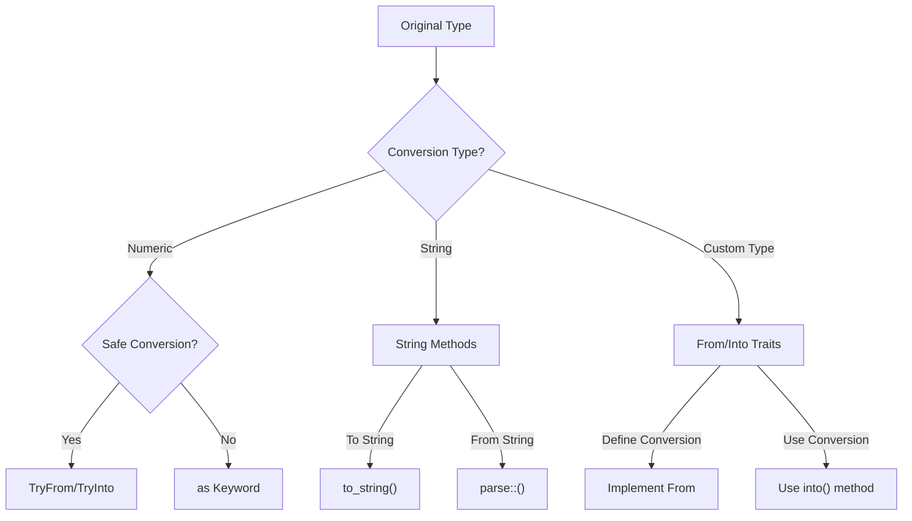

# Rust Type Casting

Type casting is the process of converting a value from one data type to another. In Rust, type casting is explicit and safety-focused, which aligns with Rust's core principles of memory safety and preventing unexpected behavior.

## Introduction

Unlike some programming languages that perform implicit type conversions, Rust requires developers to be explicit about type conversions. This deliberate approach helps prevent subtle bugs and makes code more readable by clearly showing where type conversions occur.

In this guide, we'll explore:
- Why type casting is necessary
- Different methods for type casting in Rust
- Safe conversion techniques
- Handling potential conversion errors

## Basic Type Casting with `as` Keyword

The simplest way to perform type casting in Rust is using the `as` keyword. This works well for numeric conversions but comes with important considerations.

### Numeric Type Conversion

Let's start with some basic numeric conversions:

```rust
fn main() {
    // Integer to different integer type
    let a: i32 = 15;
    let b: i64 = a as i64;
    
    // Float to integer (truncates the decimal part)
    let c: f32 = 15.7;
    let d: i32 = c as i32;
    
    println!("Original i32: {}", a);
    println!("Converted to i64: {}", b);
    println!("Original f32: {}", c);
    println!("Converted to i32 (truncated): {}", d);
}
```

**Output:**
```
Original i32: 15
Converted to i64: 15
Original f32: 15.7
Converted to i32 (truncated): 15
```

Notice how the decimal part is truncated, not rounded, when converting from float to integer.

### Potential Issues with `as`

The `as` keyword provides minimal safety guarantees. Consider what happens when converting between values that might not fit:

```rust
fn main() {
    // Converting a large i32 to i16 (potential data loss)
    let large_number: i32 = 1000000;
    let small_number: i16 = large_number as i16;
    
    println!("Original i32: {}", large_number);
    println!("Converted to i16: {}", small_number);
}
```

**Output:**
```
Original i32: 1000000
Converted to i16: 16960
```

The value changed completely! This is because 1,000,000 exceeds the maximum value an `i16` can hold, resulting in integer overflow and wrapping behavior.

## Safe Numeric Conversions

Rust's standard library provides safer methods for numeric conversions through the `TryFrom` and `TryInto` traits.

```rust
use std::convert::{TryFrom, TryInto};

fn main() {
    // Safe conversion that returns a Result
    let large_number: i32 = 1000000;
    
    // Using TryInto
    let result: Result<i16, _> = large_number.try_into();
    
    match result {
        Ok(small_number) => println!("Conversion successful: {}", small_number),
        Err(_) => println!("Conversion failed: value out of range"),
    }
    
    // A conversion that will succeed
    let small_value: i32 = 100;
    match small_value.try_into() {
        Ok(small_number: i16) => println!("Conversion successful: {}", small_number),
        Err(_) => println!("Conversion failed: value out of range"),
    }
}
```

**Output:**
```
Conversion failed: value out of range
Conversion successful: 100
```

Using `TryInto` (or `TryFrom`) gives you a `Result` that you can handle, preventing unexpected behavior.

## Type Conversion Between Standard Types

### String Conversions

Converting between strings and other types is a common requirement:

```rust
fn main() {
    // Convert integer to String
    let num = 42;
    let num_string = num.to_string();
    println!("Integer {} to String: {}", num, num_string);
    
    // Convert String to integer
    let str_value = "42";
    match str_value.parse::<i32>() {
        Ok(parsed_num) => println!("String \"{}\" to integer: {}", str_value, parsed_num),
        Err(_) => println!("Failed to parse \"{}\" as integer", str_value),
    }
    
    // Handling potential parsing errors
    let invalid_str = "42abc";
    match invalid_str.parse::<i32>() {
        Ok(parsed_num) => println!("String \"{}\" to integer: {}", invalid_str, parsed_num),
        Err(_) => println!("Failed to parse \"{}\" as integer", invalid_str),
    }
}
```

**Output:**
```
Integer 42 to String: 42
String "42" to integer: 42
Failed to parse "42abc" as integer
```

### Boolean Conversions

Converting to and from boolean values:

```rust
fn main() {
    // Convert integer to boolean
    let zero = 0;
    let non_zero = 42;
    
    let bool_from_zero = zero != 0;
    let bool_from_non_zero = non_zero != 0;
    
    println!("0 as boolean: {}", bool_from_zero);
    println!("42 as boolean: {}", bool_from_non_zero);
    
    // Convert boolean to integer
    let t = true;
    let f = false;
    
    let int_from_true = t as i32;
    let int_from_false = f as i32;
    
    println!("true as integer: {}", int_from_true);
    println!("false as integer: {}", int_from_false);
}
```

**Output:**
```
0 as boolean: false
42 as boolean: true
true as integer: 1
false as integer: 0
```

## Type Conversion Between Custom Types

For custom types, Rust provides traits like `From` and `Into` to define conversion behavior.

### Implementing `From` Trait

Here's an example with custom types:

```rust
// Define two custom structs
struct Celsius(f64);
struct Fahrenheit(f64);

// Implement conversion from Celsius to Fahrenheit
impl From<Celsius> for Fahrenheit {
    fn from(celsius: Celsius) -> Self {
        Fahrenheit(celsius.0 * 9.0 / 5.0 + 32.0)
    }
}

// Implement conversion from Fahrenheit to Celsius
impl From<Fahrenheit> for Celsius {
    fn from(fahrenheit: Fahrenheit) -> Self {
        Celsius((fahrenheit.0 - 32.0) * 5.0 / 9.0)
    }
}

fn main() {
    let body_temp_c = Celsius(37.0);
    
    // Convert to Fahrenheit
    let body_temp_f: Fahrenheit = body_temp_c.into();
    println!("Body temperature: {}°F", body_temp_f.0);
    
    // Convert back to Celsius
    let converted_back: Celsius = body_temp_f.into();
    println!("Converted back: {}°C", converted_back.0);
    
    // Direct conversion using From
    let boiling_f = Fahrenheit::from(Celsius(100.0));
    println!("Boiling point: {}°F", boiling_f.0);
}
```

**Output:**
```
Body temperature: 98.6°F
Converted back: 37°C
Boiling point: 212°F
```

When you implement `From`, you get `Into` for free due to Rust's blanket implementations.

## Type Casting with References

Type casting works differently with references:

```rust
fn main() {
    let value: i32 = 42;
    let reference: &i32 = &value;
    
    // This won't work:
    // let reference_u32: &u32 = reference as &u32;
    
    // Instead, dereference first:
    let dereferenced: i32 = *reference;
    let converted: u32 = dereferenced as u32;
    let new_reference: &u32 = &converted;
    
    println!("Original reference: {}", reference);
    println!("New reference: {}", new_reference);
}
```

**Output:**
```
Original reference: 42
New reference: 42
```

## Type Conversion Flow Diagram



## Real-World Applications

### Parsing User Input

A common scenario is parsing user input from strings to appropriate types:

```rust
use std::io;

fn main() {
    println!("Enter your age:");
    
    let mut input = String::new();
    io::stdin()
        .read_line(&mut input)
        .expect("Failed to read line");
    
    // Parse string to a number
    let age: Result<u8, _> = input.trim().parse();
    
    match age {
        Ok(parsed_age) => {
            println!("In 10 years, you'll be {} years old.", parsed_age + 10);
            
            // Convert age to different numeric type for calculation
            let days_lived: u32 = parsed_age as u32 * 365;
            println!("You've lived approximately {} days.", days_lived);
        },
        Err(_) => println!("Please enter a valid number for your age."),
    }
}
```

### Data Processing Pipeline

Type conversion is often needed when processing data from different sources:

```rust
// Simplified data processing example
struct RawSensorData {
    temperature_celsius: f32,
    pressure_kilopascals: f32,
}

struct ProcessedData {
    temperature_fahrenheit: f32,
    pressure_psi: f32,
}

// Implement conversion
impl From<RawSensorData> for ProcessedData {
    fn from(raw: RawSensorData) -> Self {
        ProcessedData {
            temperature_fahrenheit: (raw.temperature_celsius * 9.0 / 5.0) + 32.0,
            pressure_psi: raw.pressure_kilopascals * 0.145038,
        }
    }
}

fn process_sensor_reading(raw_data: RawSensorData) -> ProcessedData {
    // Use the From/Into conversion
    raw_data.into()
}

fn main() {
    let sensor_reading = RawSensorData {
        temperature_celsius: 25.0,
        pressure_kilopascals: 101.3,
    };
    
    let processed = process_sensor_reading(sensor_reading);
    
    println!("Temperature: {:.1}°F", processed.temperature_fahrenheit);
    println!("Pressure: {:.2} PSI", processed.pressure_psi);
}
```

**Output:**
```
Temperature: 77.0°F
Pressure: 14.69 PSI
```

This pattern is common in data processing pipelines where different formats or units need to be converted.

## Summary

In Rust, type casting is explicit and focused on safety:

1. Use the `as` keyword for simple numeric conversions when you're confident the conversion won't lead to unexpected results
2. Use `TryFrom`/`TryInto` for safer numeric conversions that can fail
3. Use string methods like `to_string()` and `parse()` for string conversions
4. Implement the `From`/`Into` traits for custom type conversions
5. Always be aware of potential data loss or invalid conversions

Rust's explicit type casting system may seem more verbose than other languages, but it helps prevent subtle bugs and makes code behavior more predictable.

## Exercises

1. Write a function that safely converts a `String` containing a number in hexadecimal format (like "1A" or "FF") to a decimal `u32`.
2. Create a custom type representing a percentage (0-100%) and implement conversions to and from decimal (0.0-1.0).
3. Write a program that reads a list of numbers from a file, where some might be invalid, and converts them to integers while handling errors.
4. Implement a function that takes a vector of any numeric type and converts all elements to a different numeric type, handling potential conversion errors.

## Additional Resources

- [Rust Documentation on Type Conversions](https://doc.rust-lang.org/rust-by-example/conversion.html)
- [The `std::convert` module](https://doc.rust-lang.org/std/convert/index.html)
- [The Rust Programming Language Book - Common Programming Concepts](https://doc.rust-lang.org/book/ch03-02-data-types.html)