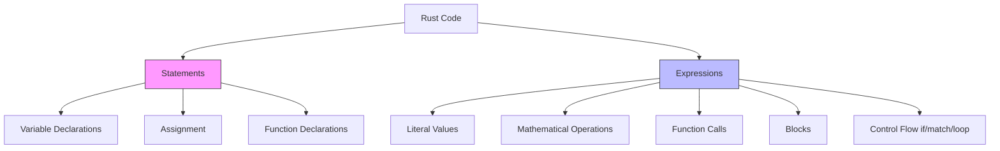

# Rust Statements vs Expressions

## Introduction

One of the most important concepts to understand in Rust is the distinction between **statements** and **expressions**. Unlike some other programming languages, Rust makes a clear distinction between these two constructs, and understanding this distinction is crucial for writing idiomatic Rust code.

In this guide, we'll explore:
- What statements and expressions are in Rust
- How to identify them in your code
- The ways they differ from each other
- How to use them effectively in your programs

## Statements vs Expressions: The Fundamental Difference

### Statements

A **statement** is an instruction that performs some action but doesn't return a value. In Rust, statements end with a semicolon (`;`) and don't evaluate to a value.

Key characteristics of statements:
- They perform an action
- They don't return a value
- They end with a semicolon (`;`)
- They cannot be assigned to variables

### Expressions

An **expression** is a combination of values, variables, operators, and function calls that evaluates to a single value. Expressions in Rust don't end with a semicolon.

Key characteristics of expressions:
- They evaluate to a value
- They don't end with a semicolon
- They can be part of a statement
- They can be assigned to variables

## Examples of Statements in Rust

Let's look at some common types of statements in Rust:

### Variable Declaration Statements

```rust
let x = 5;  // This is a statement
```

This statement creates a variable named `x` and assigns the value `5` to it, but it doesn't produce a value itself.

### Assignment Statements

```rust
x = 10;  // This is a statement (assuming x is already declared)
```

This changes the value of `x` but doesn't produce a value.

### Function Declarations

```rust
fn add(a: i32, b: i32) -> i32 {
    a + b  // This is an expression
}  // The function declaration itself is a statement
```

## Examples of Expressions in Rust

Now let's examine some common expressions in Rust:

### Literal Expressions

```rust
5  // This is an expression that evaluates to the integer 5
"hello"  // This is an expression that evaluates to a string
true  // This is an expression that evaluates to a boolean
```

### Math Operations

```rust
5 + 3  // This is an expression that evaluates to 8
```

### Function Calls

```rust
let result = add(5, 3);  // add(5, 3) is an expression that evaluates to 8
```

### Blocks

In Rust, blocks (`{}`) are expressions if they don't end with a semicolon:

```rust
let y = {
    let x = 3;
    x + 1  // No semicolon here, so this is an expression
};  // y will be assigned the value 4
```

## The Semicolon Difference

The presence or absence of a semicolon is crucial in Rust:

```rust
fn example() -> i32 {
    let x = 5;  // This is a statement
    x + 1;  // This is a statement (because of the semicolon), and returns ()
}  // This will cause a compilation error!
```

The function above won't compile because the last line `x + 1;` is a statement (due to the semicolon), not an expression. Since statements don't return values, there's nothing for the function to return.

Corrected version:

```rust
fn example() -> i32 {
    let x = 5;
    x + 1  // No semicolon, so this is an expression that returns i32
}  // This will compile and return the value 6
```

## Expressions in Control Flow

Rust's control flow constructs are expressions, which makes them very powerful:

### If Expressions

```rust
let number = 7;
let message = if number % 2 == 0 {
    "number is even"
} else {
    "number is odd"
};

println!("{}", message);  // Outputs: "number is odd"
```

In this example, the entire `if-else` block is an expression that evaluates to a string, which is then assigned to `message`.

### Loop Expressions

```rust
let mut counter = 0;
let result = loop {
    counter += 1;
    if counter == 10 {
        break counter * 2;  // Returns a value from the loop
    }
};

println!("Result: {}", result);  // Outputs: "Result: 20"
```

The `loop` construct can return a value using `break`, making it an expression.

### Match Expressions

```rust
let value = 3;
let description = match value {
    1 => "one",
    2 => "two",
    3 => "three",
    _ => "something else",
};

println!("{}", description);  // Outputs: "three"
```

The `match` block is an expression that evaluates to one of its arms.

## Understanding the Expression-Oriented Nature of Rust

Rust is an expression-oriented language, which means that most constructs are expressions rather than statements. This leads to more concise and functional-style code.

Let's visualize the relationship between statements and expressions:



## Practical Examples

### Example 1: Calculating the Absolute Value

```rust
fn abs(x: i32) -> i32 {
    if x >= 0 {
        x
    } else {
        -x
    }
}

fn main() {
    let number = -5;
    let absolute = abs(number);
    println!("The absolute value of {} is {}", number, absolute);
    // Outputs: "The absolute value of -5 is 5"
}
```

### Example 2: Finding the Maximum Value

```rust
fn max(a: i32, b: i32) -> i32 {
    if a > b {
        a
    } else {
        b
    }
}

fn main() {
    let x = 10;
    let y = 15;
    let maximum = max(x, y);
    println!("The maximum of {} and {} is {}", x, y, maximum);
    // Outputs: "The maximum of 10 and 15 is 15"
}
```

### Example 3: Real-World Application - Configuration Parser

Here's a more complex example that demonstrates how expressions can be used in a real-world scenario:

```rust
enum ConfigValue {
    Integer(i32),
    Float(f64),
    Text(String),
}

fn parse_config_value(input: &str) -> ConfigValue {
    if let Ok(int_val) = input.parse::<i32>() {
        ConfigValue::Integer(int_val)
    } else if let Ok(float_val) = input.parse::<f64>() {
        ConfigValue::Float(float_val)
    } else {
        ConfigValue::Text(input.to_string())
    }
}

fn main() {
    let config_entries = vec!["42", "3.14", "hello"];
    
    for entry in config_entries {
        let value = parse_config_value(entry);
        
        let description = match value {
            ConfigValue::Integer(i) => format!("Integer: {}", i),
            ConfigValue::Float(f) => format!("Float: {}", f),
            ConfigValue::Text(s) => format!("Text: {}", s),
        };
        
        println!("{}", description);
    }
}
```

Output:
```
Integer: 42
Float: 3.14
Text: hello
```

This example shows how expressions can be used to create a more elegant and concise configuration parser.

## Summary

Understanding the difference between statements and expressions in Rust is crucial for writing idiomatic code. Here's a quick recap:

- **Statements** perform actions but don't return values. They end with semicolons (`;`).
- **Expressions** evaluate to values and don't end with semicolons.
- The presence or absence of a semicolon can change a piece of code from an expression to a statement.
- Rust's control flow constructs like `if`, `match`, and `loop` are expressions, allowing for more concise code.
- Rust's expression-oriented nature enables a more functional programming style.

By mastering the distinction between statements and expressions, you'll be able to write more idiomatic, concise, and expressive Rust code.

## Additional Resources and Exercises

### Resources
- [The Rust Programming Language Book - Expressions Chapter](https://doc.rust-lang.org/book/ch03-05-control-flow.html)
- [Rust By Example - Expressions](https://doc.rust-lang.org/rust-by-example/expression.html)

### Exercises

1. **Basic Expression Evaluation**: Write a function that takes an operation (`+`, `-`, `*`, `/`) and two numbers, then returns the result using a match expression.

2. **Statement vs Expression Conversion**: Take the following statement-based code and convert it to use expressions instead:
   ```rust
   let mut result = 0;
   if x > 5 {
       result = x * 2;
   } else {
       result = x / 2;
   }
   ```

3. **Complex Expression Challenge**: Create a function that computes the factorial of a number using a loop expression that returns the result.

4. **Real-World Application**: Build a simple calculator program that reads an expression from the user (like "5 + 3") and evaluates it using match expressions for the different operations.

By completing these exercises, you'll gain a deeper understanding of how statements and expressions work in Rust and how to use them effectively in your code.