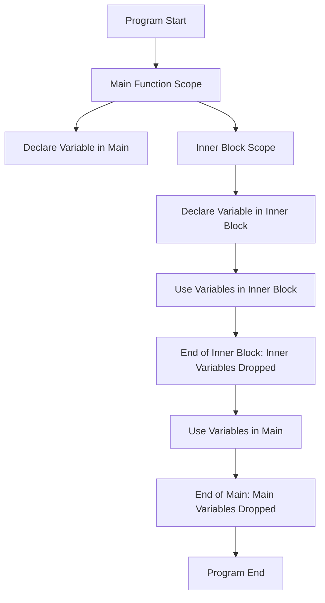

# Rust Scope

## Introduction

In programming, "scope" refers to the region of code where a variable is valid and accessible. Rust's scope system is particularly important because it's directly tied to Rust's memory management and ownership model. Understanding scope in Rust helps you write more efficient and safer code by controlling when resources are allocated and freed.

In this tutorial, we'll explore how scopes work in Rust, examining block scopes, shadowing, and how scope affects Rust's ownership and borrowing systems.

## Block Scopes in Rust

In Rust, a scope is created by a block of code enclosed in curly braces `{}`. Variables declared within a block are only accessible within that block and are automatically dropped when execution reaches the end of the block.

### Basic Example

```rust
fn main() {
    // Outer scope
    let outer_variable = 10;
    
    {
        // Inner scope
        let inner_variable = 20;
        
        println!("Inside inner scope:");
        println!("outer_variable: {}", outer_variable);      // Accessible
        println!("inner_variable: {}", inner_variable);      // Accessible
    }
    
    println!("Outside inner scope:");
    println!("outer_variable: {}", outer_variable);          // Accessible
    // println!("inner_variable: {}", inner_variable);       // Error! Not accessible here
}
```

**Output:**
```
Inside inner scope:
outer_variable: 10
inner_variable: 20
Outside inner scope:
outer_variable: 10
```

In this example, `inner_variable` is only accessible within its scope (the inner block). Trying to access it outside would result in a compilation error.

## Scope and Memory Management

When a variable goes out of scope in Rust, its destructor is called (if it has one), and its memory is deallocated. This is a key aspect of Rust's memory safety guarantees.

### Example with String

```rust
fn main() {
    {
        let name = String::from("Rust Programming");
        println!("Name: {}", name);
        
        // At the end of this scope, `name` is dropped and its memory is freed
    }
    
    // `name` is no longer valid here
    // println!("Name: {}", name);  // Would cause a compilation error
    
    println!("After the scope");
}
```

**Output:**
```
Name: Rust Programming
After the scope
```

In this example, the `String` object is automatically cleaned up when it goes out of scope, without requiring manual memory management.

## Variable Shadowing

Rust allows for variable shadowing, where a new variable with the same name can be declared in an inner scope, temporarily "shadowing" the outer variable.

```rust
fn main() {
    let value = 5;
    println!("Outer value: {}", value);  // Prints 5
    
    {
        let value = value * 2;  // Creates a new `value` that shadows the outer one
        println!("Inner value: {}", value);  // Prints 10
    }
    
    println!("Outer value after inner scope: {}", value);  // Prints 5 again
}
```

**Output:**
```
Outer value: 5
Inner value: 10
Outer value after inner scope: 5
```

Note that shadowing is different from mutability. Shadowing creates a completely new variable that happens to have the same name, while mutation changes the value of an existing variable.

## Scope in Functions

When you pass a value to a function, it enters the function's scope. Depending on how you pass it (by value, by reference, etc.), different rules apply:

```rust
fn main() {
    let s = String::from("hello");
    
    takes_ownership(s);
    // println!("s: {}", s);  // Error! `s` was moved into the function
    
    let x = 5;
    makes_copy(x);
    println!("x: {}", x);  // This works because i32 implements Copy
}

fn takes_ownership(some_string: String) {
    println!("{}", some_string);
    // `some_string` goes out of scope and is dropped here
}

fn makes_copy(some_integer: i32) {
    println!("{}", some_integer);
    // `some_integer` goes out of scope, but nothing special happens
}
```

**Output:**
```
hello
5
x: 5
```

## Scope and Lifetimes

Rust's lifetime system is directly related to scope. Lifetimes ensure that references don't outlive the data they refer to:

```rust
fn main() {
    let outer_value;
    
    {
        let inner_value = 5;
        // outer_value = &inner_value;  // This would cause an error
        // Because `inner_value` will be dropped before `outer_value`
    }
    
    // Using `outer_value` here would be accessing freed memory if the assignment were allowed
}
```

## Scope and the `drop` Function

Rust provides the `std::mem::drop` function to explicitly drop a value before the end of its scope:

```rust
fn main() {
    let v = vec![1, 2, 3];
    
    println!("Vector before drop: {:?}", v);
    
    // Explicitly drop `v`
    std::mem::drop(v);
    
    // `v` is no longer accessible
    // println!("Vector after drop: {:?}", v);  // Would cause an error
    
    println!("After dropping the vector");
}
```

**Output:**
```
Vector before drop: [1, 2, 3]
After dropping the vector
```

## Visualizing Rust Scopes

Let's visualize how scopes work in Rust:



## Real-World Example: Scoped Resource Management

Here's a practical example of using scopes for resource management in a file handling scenario:

```rust
use std::fs::File;
use std::io::{Write, Read};

fn main() -> std::io::Result<()> {
    // File will be automatically closed when it goes out of scope
    {
        let mut file = File::create("example.txt")?;
        file.write_all(b"Hello, Rust scopes!")?;
        println!("File written successfully");
        // `file` goes out of scope here and is automatically closed
    }
    
    // New scope with a new file handle
    {
        let mut file = File::open("example.txt")?;
        let mut contents = String::new();
        file.read_to_string(&mut contents)?;
        println!("File contents: {}", contents);
        // `file` is closed here
    }
    
    Ok(())
}
```

**Output:**
```
File written successfully
File contents: Hello, Rust scopes!
```

This pattern ensures that resources like file handles are properly closed when they're no longer needed, even if exceptions occur.

## Scopes in Closures

Closures in Rust can capture variables from their containing scope:

```rust
fn main() {
    let x = 4;
    
    let equal_to_x = |z| z == x;
    
    let y = 4;
    
    println!("Is y equal to x? {}", equal_to_x(y));
}
```

**Output:**
```
Is y equal to x? true
```

The closure `equal_to_x` captures `x` from its surrounding environment, demonstrating how inner scopes can access variables from outer scopes.

## Summary

Understanding scope in Rust is crucial for several reasons:

1. **Memory Management**: Rust automatically frees resources when they go out of scope.
2. **Variable Accessibility**: Scope determines where variables can be accessed.
3. **Lifetime Control**: Scopes are directly related to Rust's lifetime system.
4. **Resource Safety**: Rust's scope rules prevent dangling references and memory leaks.

By mastering scopes, you gain more control over your program's memory usage and can write more efficient, safer code.

## Exercises

1. Create a program with nested scopes that demonstrates variable shadowing.
2. Write a function that returns a reference to a variable created within the function. Understand why this might cause problems.
3. Experiment with the `drop` function to explicitly control when resources are freed.
4. Create a program that demonstrates the relationship between scope and ownership by passing variables between functions.

## Additional Resources

- [The Rust Book - Ownership Chapter](https://doc.rust-lang.org/book/ch04-00-understanding-ownership.html)
- [Rust by Example - Scopes and Shadowing](https://doc.rust-lang.org/rust-by-example/variable_bindings/scope.html)
- [Rust Reference - Influences on the Design of Scopes](https://doc.rust-lang.org/reference/influences.html#lifetimes)