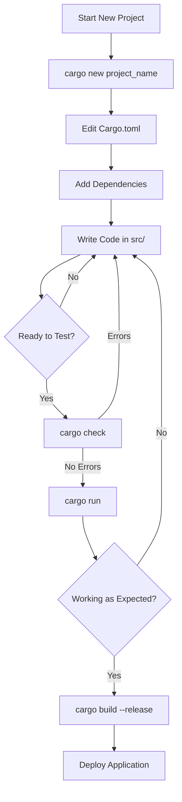

# Rust Cargo Basics

## Introduction

When you're learning Rust, one of the first tools you'll encounter is **Cargo** - Rust's official package manager and build system. Cargo handles many tasks that make Rust development smoother, including:

- Creating new projects with a standard structure
- Building your code (compiling it into executable programs)
- Managing dependencies (external libraries your code uses)
- Running tests and generating documentation
- Publishing your libraries for others to use

In this guide, we'll explore the essential Cargo commands and concepts that every Rust beginner should know. By the end, you'll be comfortable using Cargo to manage your Rust projects.

## Getting Started with Cargo

### Checking Your Installation

If you've installed Rust using [rustup](https://rustup.rs/) (the recommended approach), Cargo is already installed! To verify this, open your terminal and run:

```bash
cargo --version
```

You should see output similar to:

```
cargo 1.76.0 (c84b36941 2024-02-14)
```

If you don't see this output, you might need to install Rust and Cargo first.

### Creating Your First Project

To create a new Rust project, use the `cargo new` command followed by your project name:

```bash
cargo new hello_cargo
```

This creates a new directory called `hello_cargo` with the following structure:

```
hello_cargo/
├── Cargo.toml
└── src/
    └── main.rs
```

Let's examine each part:

- **Cargo.toml**: This is your project's configuration file (more on this below)
- **src/main.rs**: This is where your Rust code goes

The `main.rs` file comes with a basic "Hello, World!" program:

```rust
fn main() {
    println!("Hello, world!");
}
```

### Understanding Cargo.toml

The `Cargo.toml` file is written in [TOML](https://toml.io/) format and contains metadata about your project:

```toml
[package]
name = "hello_cargo"
version = "0.1.0"
edition = "2021"

# See more keys and their definitions at https://doc.rust-lang.org/cargo/reference/manifest.html

[dependencies]
```

Key sections include:

- **[package]**: Contains general information about your project
- **[dependencies]**: Lists external libraries your project uses

## Building and Running Projects

### Building Your Project

To compile your code without running it, navigate to your project directory and run:

```bash
cd hello_cargo
cargo build
```

This creates an executable in the `target/debug` directory. You'll see output like:

```
   Compiling hello_cargo v0.1.0 (/path/to/hello_cargo)
    Finished dev [unoptimized + debuginfo] target(s) in 0.61s
```

You can run the executable directly:

```bash
./target/debug/hello_cargo
```

Output:
```
Hello, world!
```

### Building for Release

For optimized, production-ready code, use:

```bash
cargo build --release
```

This creates an optimized executable in `target/release/` that runs faster but takes longer to compile.

### Compiling and Running in One Step

For quick testing, use:

```bash
cargo run
```

This both compiles and runs your program:

```
    Finished dev [unoptimized + debuginfo] target(s) in 0.01s
     Running `target/debug/hello_cargo`
Hello, world!
```

If your code hasn't changed since the last build, Cargo skips the compilation step.

### Checking Your Code Without Building

To check if your code compiles without producing an executable:

```bash
cargo check
```

This is faster than `cargo build` and useful when iteratively writing code.

## Managing Dependencies

### Adding Dependencies

To use external libraries (called "crates" in Rust), add them to the `[dependencies]` section in `Cargo.toml`:

```toml
[dependencies]
rand = "0.8.5"
```

This specifies that we want to use the `rand` crate (a random number generation library) with version 0.8.5 or compatible.

After adding a dependency, run `cargo build` to download and compile it.

### Using Dependencies in Code

Here's how to use our new `rand` dependency:

```rust
use rand::Rng;

fn main() {
    println!("Hello, world!");
    
    // Generate a random number between 1 and 10
    let secret_number = rand::thread_rng().gen_range(1..=10);
    println!("Random number: {}", secret_number);
}
```

When you run this with `cargo run`, you'll see output like:

```
Hello, world!
Random number: 7
```

(The random number will vary each time you run the program)

### Updating Dependencies

To update all dependencies to their latest compatible versions:

```bash
cargo update
```

To see what dependencies your project uses (including indirect ones):

```bash
cargo tree
```

## Project Organization

A typical Rust project structure looks like:

```
my_project/
├── Cargo.toml
├── Cargo.lock       # Created by Cargo, don't edit manually
├── src/
│   ├── main.rs      # Binary entry point
│   ├── lib.rs       # Library code (optional)
│   └── bin/         # Additional binaries (optional)
├── tests/           # Integration tests (optional)
└── examples/        # Example code (optional)
```

### Creating a Library

To create a library project instead of an executable:

```bash
cargo new my_library --lib
```

This creates a `src/lib.rs` file instead of `src/main.rs`.

## Cargo Workflow Diagram



## Additional Cargo Commands

### Documentation

To build and open documentation for your project and all dependencies:

```bash
cargo doc --open
```

### Testing

To run tests in your project:

```bash
cargo test
```

### Code Formatting

To format your code according to Rust style guidelines (requires `rustfmt`):

```bash
cargo fmt
```

### Code Linting

To check your code for common mistakes and style issues (requires `clippy`):

```bash
cargo clippy
```

## Real-World Example: Building a To-Do CLI Application

Let's create a simple command-line to-do list application using Cargo and external dependencies:

1. Create a new project:

```bash
cargo new todo_app
cd todo_app
```

2. Add dependencies to `Cargo.toml`:

```toml
[dependencies]
serde = { version = "1.0", features = ["derive"] }
serde_json = "1.0"
```

3. Create a to-do list application in `src/main.rs`:

```rust
use std::fs::{File, OpenOptions};
use std::io::{self, Read, Write};
use std::path::Path;
use serde::{Deserialize, Serialize};

#[derive(Debug, Serialize, Deserialize)]
struct Todo {
    text: String,
    completed: bool,
}

#[derive(Debug, Serialize, Deserialize)]
struct TodoList {
    items: Vec<Todo>,
}

impl TodoList {
    fn new() -> Self {
        TodoList { items: Vec::new() }
    }

    fn add_item(&mut self, text: String) {
        let todo = Todo {
            text,
            completed: false,
        };
        self.items.push(todo);
    }

    fn complete_item(&mut self, index: usize) -> Result<(), String> {
        if index < self.items.len() {
            self.items[index].completed = true;
            Ok(())
        } else {
            Err("Item index out of bounds".to_string())
        }
    }

    fn save_to_file(&self, filename: &str) -> io::Result<()> {
        let json = serde_json::to_string_pretty(self)?;
        let mut file = File::create(filename)?;
        file.write_all(json.as_bytes())?;
        Ok(())
    }

    fn load_from_file(filename: &str) -> io::Result<Self> {
        if !Path::new(filename).exists() {
            return Ok(TodoList::new());
        }

        let mut file = File::open(filename)?;
        let mut contents = String::new();
        file.read_to_string(&mut contents)?;
        
        let todo_list: TodoList = serde_json::from_str(&contents)?;
        Ok(todo_list)
    }

    fn display(&self) {
        if self.items.is_empty() {
            println!("No todo items yet.");
            return;
        }

        for (i, todo) in self.items.iter().enumerate() {
            let status = if todo.completed { "✓" } else { " " };
            println!("{}: [{}] {}", i, status, todo.text);
        }
    }
}

fn main() -> io::Result<()> {
    let filename = "todos.json";
    let mut todo_list = TodoList::load_from_file(filename).unwrap_or_else(|_| TodoList::new());

    loop {
        println!("
--- TODO APP ---");
        println!("1. View todos");
        println!("2. Add todo");
        println!("3. Complete todo");
        println!("4. Exit");
        print!("Choose an option: ");
        io::stdout().flush()?;

        let mut choice = String::new();
        io::stdin().read_line(&mut choice)?;
        
        match choice.trim() {
            "1" => {
                println!("
TODO LIST:");
                todo_list.display();
            },
            "2" => {
                print!("Enter new todo: ");
                io::stdout().flush()?;
                let mut text = String::new();
                io::stdin().read_line(&mut text)?;
                todo_list.add_item(text.trim().to_string());
                todo_list.save_to_file(filename)?;
                println!("Todo added!");
            },
            "3" => {
                todo_list.display();
                print!("Enter item number to complete: ");
                io::stdout().flush()?;
                let mut index = String::new();
                io::stdin().read_line(&mut index)?;
                
                if let Ok(idx) = index.trim().parse::<usize>() {
                    match todo_list.complete_item(idx) {
                        Ok(_) => {
                            todo_list.save_to_file(filename)?;
                            println!("Item marked as completed!");
                        },
                        Err(e) => println!("Error: {}", e),
                    }
                } else {
                    println!("Invalid number");
                }
            },
            "4" => break,
            _ => println!("Invalid option"),
        }
    }

    Ok(())
}
```

4. Build and run the application:

```bash
cargo run
```

This example demonstrates:
- Using external dependencies (serde, serde_json)
- Structuring a real application
- File I/O operations
- Error handling
- User input processing

## Summary

Cargo is an essential tool that simplifies Rust development by handling project creation, dependency management, building, testing, and more. In this guide, we've covered:

- Creating new projects with `cargo new`
- Understanding project structure and `Cargo.toml`
- Building and running projects
- Managing dependencies
- Common Cargo commands
- Building a practical application

By mastering these basics, you've taken an important step in your Rust journey. Cargo's features make it possible to focus on writing code rather than managing build processes and dependencies.

## Additional Resources

- [The Cargo Book](https://doc.rust-lang.org/cargo/) - Comprehensive official documentation
- [Crates.io](https://crates.io/) - The Rust community's crate registry
- [Rust by Example - Cargo](https://doc.rust-lang.org/stable/rust-by-example/cargo.html) - Examples of Cargo usage

## Exercises

1. Create a new Rust project and modify its `Cargo.toml` to include at least two dependencies.
2. Build a simple calculator program that uses the `regex` crate to parse input expressions.
3. Modify the todo app example to add a feature for deleting todos.
4. Create a library crate with some utility functions, then create a binary crate that uses your library.
5. Practice using `cargo doc` to generate documentation for your project.