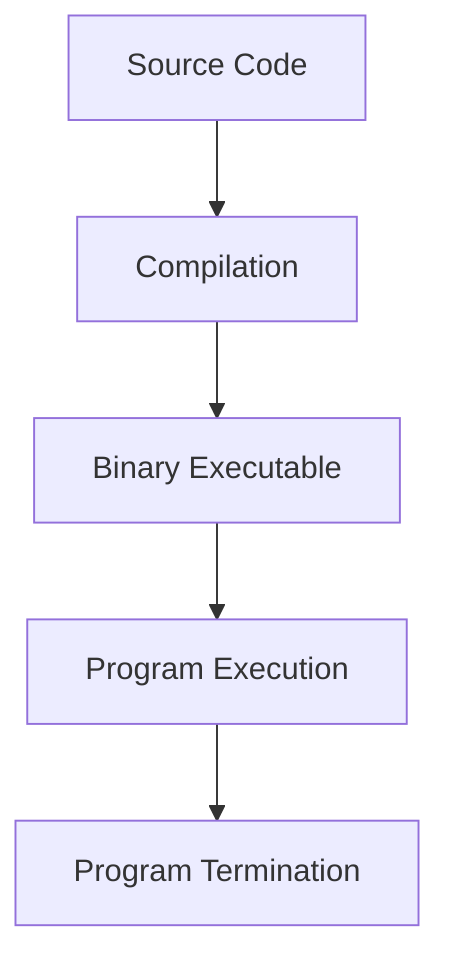

# Your First Rust Program

## Introduction

Welcome to the exciting world of Rust programming! In this tutorial, we'll guide you through creating and running your very first Rust program. This foundational step will help you understand Rust's basic syntax and structure while setting up your development environment for future projects.

Rust is a systems programming language that focuses on safety, speed, and concurrency. Unlike many other languages, Rust provides memory safety guarantees without using a garbage collector, making it ideal for performance-critical applications. By the end of this tutorial, you'll have written, compiled, and executed a simple Rust program and will understand the meaning behind each part of the code.

## Prerequisites

Before we start coding, make sure you have:

1. Rust installed on your system (via [rustup](https://rustup.rs/))
2. A text editor or IDE (like VS Code with the Rust extension)
3. Basic familiarity with using a terminal or command prompt

## Creating Your First Rust Program

Let's create a classic "Hello, World!" program to get started with Rust.

### Step 1: Create a New Project

Open your terminal and run the following command to create a new Rust project:

```bash
cargo new hello_rust
cd hello_rust
```

This creates a new directory called `hello_rust` with the necessary project structure:

```
hello_rust/
├── Cargo.toml
└── src/
    └── main.rs
```

`Cargo.toml` is Rust's manifest file where you define project metadata and dependencies, while `src/main.rs` is where your source code lives.

### Step 2: Understand the Default Code

Open `src/main.rs` in your editor. You'll see that Cargo has already generated a "Hello, World!" program for you:

```rust
fn main() {
    println!("Hello, world!");
}
```

Let's break down this code:

- `fn main()`: This declares a function named `main`. In Rust, the `main` function is the entry point of every executable program.
- `{}`: The curly braces define the body of the function, containing all the code that will execute.
- `println!("Hello, world!");`: This is a call to the `println!` macro (note the `!`), which prints text to the console. The text to print is provided as a string argument within parentheses.

### Step 3: Run Your Program

Now, let's run the program using Cargo:

```bash
cargo run
```

This command compiles and executes your program. You should see output similar to:

```
   Compiling hello_rust v0.1.0 (/path/to/hello_rust)
    Finished dev [unoptimized + debuginfo] target(s) in 0.57s
     Running `target/debug/hello_rust`
Hello, world!
```

Congratulations! You've just written and executed your first Rust program.

## Understanding the Components

Let's explore the key components of a Rust program in more detail:

### The `main` Function

Every Rust executable program must have a `main` function, which serves as the entry point. When you run your program, execution begins at the first line of the `main` function.

```rust
fn main() {
    // Your code goes here
}
```

The `fn` keyword is used to declare a function, followed by the function name and a pair of parentheses that would contain any parameters (none in this case).

### Macros vs. Functions

In our example, we used `println!`, which is a macro, not a function. In Rust, macros are denoted with an exclamation mark (`!`). Macros are a way of writing code that writes other code, known as metaprogramming.

Unlike functions, macros:
- Can take a variable number of arguments
- Are expanded into source code before the actual compilation
- Can implement functionality that would be difficult or impossible with regular functions

### Statements and Expressions

In Rust, most lines of code are statements. Statements perform an action but don't return a value. Expressions, on the other hand, evaluate to a resulting value.

Our `println!("Hello, world!");` is a statement. The semicolon (`;`) at the end of the line marks it as a statement. In Rust, semicolons are mandatory for most statements.

## Expanding Your First Program

Now that you understand the basics, let's modify our program to make it more interesting:

```rust
fn main() {
    // Variables in Rust are immutable by default
    let name = "Rustacean";
    
    // Using variables in string formatting
    println!("Hello, {}!", name);
    
    // Basic math operations
    let a = 5;
    let b = 10;
    println!("The sum of {} and {} is {}", a, b, a + b);
    
    // Mutable variables require the 'mut' keyword
    let mut counter = 0;
    counter += 1;
    println!("Counter: {}", counter);
}
```

If you run this code with `cargo run`, you'll see:

```
Hello, Rustacean!
The sum of 5 and 10 is 15
Counter: 1
```

### Key Concepts Demonstrated

1. **Variables**: Declared with `let` keyword.
2. **Immutability**: Variables are immutable by default.
3. **String Formatting**: Using `{}` as placeholders in strings.
4. **Mutable Variables**: Using the `mut` keyword to allow changes.
5. **Basic Operations**: Simple arithmetic operations like addition.

## Common Patterns in Rust Programs

Here's a more comprehensive example that demonstrates additional Rust features:

```rust
fn main() {
    // Basic variable
    let greeting = "Hello";
    
    // Function call
    print_message(greeting);
    
    // Variables with explicit types
    let age: u32 = 25;
    let is_adult: bool = age >= 18;
    
    // Conditional logic
    if is_adult {
        println!("You are an adult at {}", age);
    } else {
        println!("You are not yet an adult");
    }
    
    // Using a loop
    let mut count = 0;
    loop {
        count += 1;
        println!("Count: {}", count);
        
        if count >= 3 {
            break;
        }
    }
    
    // Final message
    println!("Program completed successfully!");
}

// A simple function that takes a parameter
fn print_message(msg: &str) {
    println!("{}, Rust programmer!", msg);
}
```

Output:

```
Hello, Rust programmer!
You are an adult at 25
Count: 1
Count: 2
Count: 3
Program completed successfully!
```

## The Rust Program Lifecycle

When you run a Rust program, it goes through several stages:



1. **Source Code**: The `.rs` files you write
2. **Compilation**: Rust's compiler (`rustc`) checks your code and converts it to an executable
3. **Binary Executable**: The compiled program
4. **Program Execution**: Running your program
5. **Program Termination**: Your program completes execution

## Real-World Application: Temperature Converter

Let's create a simple temperature converter that demonstrates real-world application:

```rust
use std::io;

fn main() {
    println!("Temperature Converter");
    println!("--------------------");
    
    println!("Enter a temperature in Fahrenheit:");
    
    let mut input = String::new();
    
    io::stdin()
        .read_line(&mut input)
        .expect("Failed to read input");
    
    // Parse the input string to a number, handling potential errors
    let fahrenheit: f64 = match input.trim().parse() {
        Ok(num) => num,
        Err(_) => {
            println!("Please enter a valid number!");
            return;
        }
    };
    
    // Convert Fahrenheit to Celsius
    let celsius = (fahrenheit - 32.0) * 5.0 / 9.0;
    
    println!("{:.1}°F is equal to {:.1}°C", fahrenheit, celsius);
}
```

This program:
1. Imports the input/output library (`std::io`)
2. Prompts the user for a temperature in Fahrenheit
3. Reads user input from the terminal
4. Converts the input to a floating-point number
5. Performs the temperature conversion
6. Displays the result formatted to one decimal place

When you run this program and enter a value like `98.6`, you'll see:

```
Temperature Converter
--------------------
Enter a temperature in Fahrenheit:
98.6
98.6°F is equal to 37.0°C
```

## Common Errors and Troubleshooting

When writing your first Rust programs, you might encounter these common issues:

1. **Missing Semicolons**: In Rust, most statements end with semicolons.
```rust
// Incorrect
println!("Hello")

// Correct
println!("Hello");
```

2. **Type Mismatches**: Rust strictly enforces types.
```rust
// Incorrect
let x: u32 = "hello";

// Correct
let x: u32 = 42;
let y: &str = "hello";
```

3. **Borrowing Errors**: Rust's ownership system can be tricky at first.
```rust
// This might cause errors in more complex scenarios
let s = String::from("hello");
let s2 = s; // s is moved to s2, and s can no longer be used
println!("{}", s); // Error: value used after move

// Correct approach using a reference
let s = String::from("hello");
let s2 = &s; // s2 borrows s
println!("{} and {}", s, s2); // Both can be used
```

## Summary

Congratulations! You've successfully written, understood, and executed your first Rust program. We've covered:

- Creating a new Rust project with Cargo
- Understanding the basic structure of a Rust program
- Learning about functions, macros, variables, and data types
- Running and debugging Rust code
- Building a simple real-world application

Rust's focus on safety and performance makes it an excellent choice for many applications, from web servers to embedded systems. The concepts you've learned here form the foundation for more advanced Rust programming.

## Exercises

To reinforce your learning, try these exercises:

1. Modify the "Hello, World!" program to greet you by name.
2. Create a program that calculates the area and perimeter of a rectangle.
3. Write a program that converts Celsius to Fahrenheit (inverse of our example).
4. Create a simple calculator that can add, subtract, multiply, and divide two numbers.

## Additional Resources

- [The Rust Programming Language Book](https://doc.rust-lang.org/book/) - The official guide
- [Rust By Example](https://doc.rust-lang.org/rust-by-example/) - Learn through annotated examples
- [Rustlings](https://github.com/rust-lang/rustlings/) - Small exercises to get you used to reading and writing Rust code
- [Rust Playground](https://play.rust-lang.org/) - Write and test Rust code in your browser

Keep practicing, and soon you'll be comfortable with Rust's unique features and powerful capabilities!