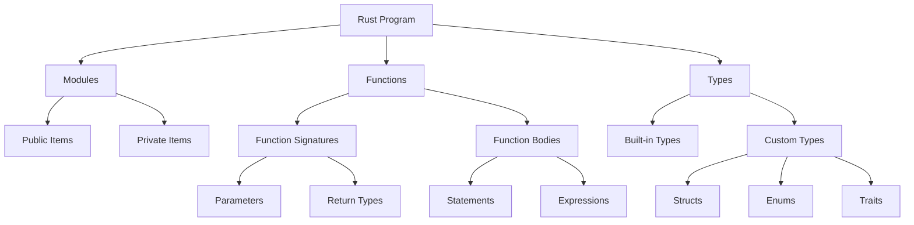

# Rust Syntax

## Introduction

Rust is a modern systems programming language that focuses on safety, speed, and concurrency. One of the first steps to mastering Rust is understanding its syntax - the set of rules that define how to write valid Rust code. This guide will walk you through the fundamental syntax elements of Rust, from basic variables to more complex structures, with clear examples and explanations.

## Basic Syntax Elements

### Variables and Mutability

In Rust, variables are immutable by default, which means once a value is assigned, it cannot be changed. To make a variable mutable, you use the `mut` keyword.

```rust
// Immutable variable
let x = 5;
// This would cause an error
// x = 6;

// Mutable variable
let mut y = 5;
// This is allowed
y = 6;
println!("y is now: {}", y);
```

Output:
```
y is now: 6
```

### Constants

Constants are values that remain unchanged throughout the entire program. They are declared using the `const` keyword and must have their type annotated.

```rust
const MAX_POINTS: u32 = 100_000;
println!("The maximum points is: {}", MAX_POINTS);
```

Output:
```
The maximum points is: 100000
```

### Data Types

Rust is a statically typed language, which means it needs to know the types of all variables at compile time. Here are some basic types:

#### Scalar Types

1. **Integers**: Rust has signed integers (`i8`, `i16`, `i32`, `i64`, `i128`, `isize`) and unsigned integers (`u8`, `u16`, `u32`, `u64`, `u128`, `usize`).

```rust
let a: i32 = -42;
let b: u32 = 42;
println!("a: {}, b: {}", a, b);
```

2. **Floating-Point Numbers**: Rust has `f32` and `f64` for floating-point numbers.

```rust
let c: f64 = 3.14;
println!("c: {}", c);
```

3. **Booleans**: The `bool` type has two possible values: `true` and `false`.

```rust
let is_active: bool = true;
println!("Is active: {}", is_active);
```

4. **Characters**: The `char` type represents a Unicode scalar value.

```rust
let emoji: char = '😊';
println!("Emoji: {}", emoji);
```

Output from the above examples:
```
a: -42, b: 42
c: 3.14
Is active: true
Emoji: 😊
```

#### Compound Types

1. **Tuples**: A tuple is a collection of values of different types.

```rust
let person: (String, i32) = (String::from("Alice"), 30);
println!("Name: {}, Age: {}", person.0, person.1);

// Destructuring a tuple
let (name, age) = person;
println!("Name: {}, Age: {}", name, age);
```

2. **Arrays**: An array is a collection of elements of the same type with a fixed length.

```rust
let numbers: [i32; 5] = [1, 2, 3, 4, 5];
println!("First number: {}", numbers[0]);

// Array with same value for all elements
let zeros = [0; 5]; // Creates [0, 0, 0, 0, 0]
println!("Zeros: {:?}", zeros);
```

Output:
```
Name: Alice, Age: 30
Name: Alice, Age: 30
First number: 1
Zeros: [0, 0, 0, 0, 0]
```

### Functions

Functions are defined using the `fn` keyword. The `main` function is the entry point of every Rust program.

```rust
fn main() {
    println!("Hello from main!");
    greet("Rustacean");
    let sum = add(5, 7);
    println!("Sum: {}", sum);
}

fn greet(name: &str) {
    println!("Hello, {}!", name);
}

fn add(a: i32, b: i32) -> i32 {
    a + b // Note: no semicolon here means this is an expression that returns a value
}
```

Output:
```
Hello from main!
Hello, Rustacean!
Sum: 12
```

### Comments

Rust supports line comments using `//` and block comments using `/* ... */`.

```rust
// This is a line comment

/*
This is a
block comment
spanning multiple lines
*/

let x = 5; // Inline comment
```

## Control Flow

### If Expressions

Rust uses `if`, `else if`, and `else` for conditional execution. The condition doesn't need parentheses, but curly braces are required.

```rust
let number = 7;

if number < 5 {
    println!("Number is less than 5");
} else if number == 5 {
    println!("Number is equal to 5");
} else {
    println!("Number is greater than 5");
}

// If is an expression, so it can be used on the right side of a let statement
let condition = true;
let value = if condition { 5 } else { 6 };
println!("Value: {}", value);
```

Output:
```
Number is greater than 5
Value: 5
```

### Loops

Rust has three types of loops: `loop`, `while`, and `for`.

1. **loop**: The `loop` keyword creates an infinite loop.

```rust
let mut counter = 0;

let result = loop {
    counter += 1;
    
    if counter == 10 {
        break counter * 2; // Return a value from the loop
    }
};

println!("Result: {}", result);
```

2. **while**: A `while` loop runs as long as a condition is true.

```rust
let mut number = 3;

while number != 0 {
    println!("{}!", number);
    number -= 1;
}

println!("LIFTOFF!!!");
```

3. **for**: A `for` loop is used to iterate over elements of a collection.

```rust
let pets = ["cat", "dog", "fish", "hamster"];

for pet in pets.iter() {
    println!("I have a {}", pet);
}

// Using a range
for number in 1..4 {
    println!("Count: {}", number);
}
```

Output:
```
Result: 20
3!
2!
1!
LIFTOFF!!!
I have a cat
I have a dog
I have a fish
I have a hamster
Count: 1
Count: 2
Count: 3
```

## Ownership and Borrowing

One of Rust's most unique features is its ownership system, which ensures memory safety without garbage collection.

### Ownership Rules

1. Each value in Rust has a variable that's called its owner.
2. There can only be one owner at a time.
3. When the owner goes out of scope, the value will be dropped.

```rust
{
    let s = String::from("hello"); // s is valid from this point forward
    
    // do stuff with s
    println!("String value: {}", s);
    
} // this scope is now over, and s is no longer valid
```

### Moving Ownership

When you assign a value to another variable, ownership is moved.

```rust
let s1 = String::from("hello");
let s2 = s1; // s1 is moved to s2

// This would cause an error because s1 is no longer valid
// println!("{}", s1);

println!("{}", s2); // This works fine
```

Output:
```
hello
```

### Borrowing with References

You can borrow a value without taking ownership using references.

```rust
let s1 = String::from("hello");
let len = calculate_length(&s1); // Passing a reference to s1

println!("The length of '{}' is {}.", s1, len); // s1 is still valid here

fn calculate_length(s: &String) -> usize {
    s.len()
    // s goes out of scope here, but since it's a reference, 
    // nothing happens to the original value
}
```

Output:
```
The length of 'hello' is 5.
```

### Mutable References

You can also create mutable references to change a borrowed value.

```rust
let mut s = String::from("hello");
change(&mut s); // Passing a mutable reference
println!("Modified string: {}", s);

fn change(s: &mut String) {
    s.push_str(", world");
}
```

Output:
```
Modified string: hello, world
```

## Structs and Enums

### Structs

Structs are custom data types that let you name and package together multiple related values.

```rust
// Define a struct
struct User {
    username: String,
    email: String,
    sign_in_count: u64,
    active: bool,
}

// Create an instance
let user1 = User {
    email: String::from("user@example.com"),
    username: String::from("username123"),
    active: true,
    sign_in_count: 1,
};

println!("User email: {}", user1.email);

// Creating a mutable instance
let mut user2 = User {
    email: String::from("another@example.com"),
    username: String::from("another123"),
    active: true,
    sign_in_count: 1,
};

// Modifying a field
user2.email = String::from("newemail@example.com");
println!("Updated email: {}", user2.email);
```

Output:
```
User email: user@example.com
Updated email: newemail@example.com
```

### Enums

Enums allow you to define a type by enumerating its possible variants.

```rust
enum Message {
    Quit,
    Move { x: i32, y: i32 },
    Write(String),
    ChangeColor(i32, i32, i32),
}

let msg1 = Message::Quit;
let msg2 = Message::Move { x: 10, y: 20 };
let msg3 = Message::Write(String::from("Hello"));
let msg4 = Message::ChangeColor(255, 0, 0);

// Using match with an enum
fn process_message(msg: Message) {
    match msg {
        Message::Quit => println!("Quitting the application"),
        Message::Move { x, y } => println!("Moving to position ({}, {})", x, y),
        Message::Write(text) => println!("Text message: {}", text),
        Message::ChangeColor(r, g, b) => println!("Changing color to RGB({}, {}, {})", r, g, b),
    }
}

process_message(Message::Write(String::from("Hello, Rust!")));
```

Output:
```
Text message: Hello, Rust!
```

### Option Enum

Rust doesn't have `null` values. Instead, it has an `Option` enum that can be either `Some` with a value or `None`.

```rust
let some_number = Some(5);
let some_string = Some("a string");
let absent_number: Option<i32> = None;

// Extracting the value from an Option
match some_number {
    Some(i) => println!("Got a number: {}", i),
    None => println!("No number found"),
}
```

Output:
```
Got a number: 5
```

## Error Handling

Rust has two types of errors: recoverable errors with the `Result` type and unrecoverable errors with the `panic!` macro.

### Result Type

The `Result` enum has two variants: `Ok` containing a success value and `Err` containing an error value.

```rust
use std::fs::File;
use std::io::ErrorKind;

fn open_file() {
    let file_result = File::open("hello.txt");
    
    let file = match file_result {
        Ok(file) => {
            println!("File opened successfully!");
            file
        },
        Err(error) => match error.kind() {
            ErrorKind::NotFound => {
                println!("File not found, creating it...");
                match File::create("hello.txt") {
                    Ok(fc) => {
                        println!("File created successfully!");
                        fc
                    },
                    Err(e) => panic!("Problem creating the file: {:?}", e),
                }
            },
            other_error => {
                panic!("Problem opening the file: {:?}", other_error);
            }
        },
    };
    
    // File can be used here
}
```

### Shorthand: unwrap and expect

You can use `unwrap` to get the value or panic, and `expect` to get the value or panic with a custom message.

```rust
// Will panic if the file doesn't exist
let file = File::open("hello.txt").unwrap();

// Same as unwrap but with a custom error message
let file = File::open("hello.txt").expect("Failed to open hello.txt");
```

## Collections

Rust's standard library includes several useful collection types.

### Vectors

A vector is a growable array-like collection type.

```rust
// Create a new empty vector
let mut nums: Vec<i32> = Vec::new();

// Add elements
nums.push(1);
nums.push(2);
nums.push(3);

println!("Vector: {:?}", nums);

// Access elements
let third = &nums[2];
println!("Third element: {}", third);

// Using vector macro
let words = vec!["hello", "world"];
println!("Words: {:?}", words);

// Iterating over a vector
for num in &nums {
    println!("{}", num);
}
```

Output:
```
Vector: [1, 2, 3]
Third element: 3
Words: ["hello", "world"]
1
2
3
```

### Strings

Rust has several string types. The most common ones are `String` and `&str`.

```rust
// Creating a String
let mut s = String::from("hello");

// Appending to a String
s.push_str(", world");
println!("{}", s);

// String concatenation
let s1 = String::from("Hello, ");
let s2 = String::from("world!");
let s3 = s1 + &s2; // s1 is moved here and can no longer be used
println!("{}", s3);

// String slicing with string literals (&str)
let hello = "Hello, world!";
let hello_slice = &hello[0..5];
println!("Slice: {}", hello_slice);
```

Output:
```
hello, world
Hello, world!
Slice: Hello
```

### HashMaps

HashMaps store key-value pairs.

```rust
use std::collections::HashMap;

let mut scores = HashMap::new();

// Inserting values
scores.insert(String::from("Blue"), 10);
scores.insert(String::from("Yellow"), 50);

// Getting values
match scores.get("Blue") {
    Some(score) => println!("Blue team score: {}", score),
    None => println!("Blue team not found"),
}

// Iterating over a HashMap
for (key, value) in &scores {
    println!("{}: {}", key, value);
}

// Updating a value
scores.insert(String::from("Blue"), 25); // Overwrites the old value
println!("Updated scores: {:?}", scores);

// Only insert if key doesn't exist
scores.entry(String::from("Red")).or_insert(30);
println!("Updated scores with new team: {:?}", scores);
```

Output:
```
Blue team score: 10
Blue: 10
Yellow: 50
Updated scores: {"Blue": 25, "Yellow": 50}
Updated scores with new team: {"Blue": 25, "Yellow": 50, "Red": 30}
```

## Modules and Visibility

Rust's module system helps organize code and control privacy.

```rust
// Define a module
mod shapes {
    // Public struct
    pub struct Rectangle {
        pub width: u32,
        pub height: u32,
    }
    
    impl Rectangle {
        // Public method
        pub fn new(width: u32, height: u32) -> Rectangle {
            Rectangle { width, height }
        }
        
        pub fn area(&self) -> u32 {
            self.width * self.height
        }
    }
    
    // Private function
    fn helper_function() {
        println!("This is a helper function");
    }
}

// Using the module
fn use_shapes() {
    // Creating a rectangle
    let rect = shapes::Rectangle::new(30, 50);
    println!("Rectangle area: {}", rect.area());
    
    // Accessing fields
    println!("Width: {}, Height: {}", rect.width, rect.height);
    
    // This would cause an error because helper_function is private
    // shapes::helper_function();
}
```

## Concise Control Flow with `match`

The `match` expression is one of Rust's most powerful features for controlling the flow of your program.

```rust
let number = 13;

match number {
    // Match a single value
    1 => println!("One!"),
    // Match multiple values
    2 | 3 | 5 | 7 | 11 | 13 => println!("This is a prime"),
    // Match a range
    8..=20 => println!("Between 8 and 20"),
    // Default case
    _ => println!("Something else"),
}
```

Output:
```
This is a prime
```

## Syntax Visualization

Here's a visualization of Rust's basic syntax structure:



## Summary

This guide has covered the fundamental syntax of Rust:

- **Variables and Data Types**: Learn how to declare variables, their mutability, and the different data types available in Rust.
- **Functions**: Define functions with parameters and return values.
- **Control Flow**: Use `if`, `loop`, `while`, and `for` constructs to control program flow.
- **Ownership and Borrowing**: Understand Rust's unique ownership system that ensures memory safety.
- **Structs and Enums**: Create custom data types to express your program's concepts.
- **Error Handling**: Manage errors using the `Result` type and `panic!` macro.
- **Collections**: Work with dynamic data using vectors, strings, and hashmaps.
- **Modules**: Organize your code into modular components with privacy controls.

## Additional Resources

1. [The Rust Programming Language Book](https://doc.rust-lang.org/book/) - The official book that covers Rust in depth.
2. [Rust by Example](https://doc.rust-lang.org/rust-by-example/) - Learn Rust through annotated examples.
3. [Rust Standard Library Documentation](https://doc.rust-lang.org/std/) - Comprehensive reference for the standard library.

## Exercises

1. **Hello, World!**: Create a Rust program that prints "Hello, World!" to the console.
2. **Temperature Converter**: Write a function that converts temperatures between Fahrenheit and Celsius.
3. **FizzBuzz**: Implement the classic FizzBuzz program in Rust.
4. **Todo List**: Create a simple command-line todo list application that demonstrates structs, enums, and collections.
5. **File Reader**: Write a program that reads a text file and counts the number of words, lines, and characters.