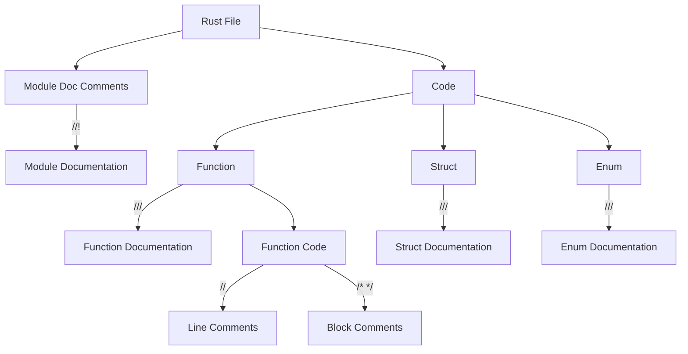

# Rust Comments

## Introduction

Comments are an essential part of programming that allow developers to add explanatory notes within their code. In Rust, comments serve several important purposes:

- Explaining complex logic to other developers (or your future self)
- Temporarily disabling code during development
- Generating documentation with tools like `rustdoc`
- Adding metadata for tools like the Rust compiler or linters

Well-written comments make your code more readable, maintainable, and accessible to other developers. In this guide, we'll explore the different types of comments in Rust and best practices for using them effectively.

## Types of Comments in Rust

Rust supports three main types of comments:

1. Line comments (`//`)
2. Block comments (`/* ... */`)
3. Documentation comments (`///` and `//!`)

Let's dive into each type with examples.

## Line Comments

Line comments start with `//` and continue until the end of the line. They're perfect for brief explanations or temporary notes.

```rust
// This is a line comment
let x = 5; // This comment explains the variable

// The next line calculates the square of x
let x_squared = x * x;
```

Line comments are the most common type of comment in Rust and are great for quick explanations.

## Block Comments

Block comments start with `/*` and end with `*/`. They can span multiple lines and are useful for temporarily commenting out blocks of code or for longer explanations.

```rust
/* This is a block comment.
   It can span multiple lines.
   Useful for longer explanations. */

let y = 10;

/* 
This commented-out code isn't executed:
let unused_variable = "hello";
println!("{}", unused_variable);
*/
```

Unlike some other languages, Rust's block comments can be nested:

```rust
/* Outer comment /* Inner comment */ still in outer comment */
```

This nesting capability can be useful when commenting out code that already contains comments.

## Documentation Comments

Rust has special comments designed for generating documentation:

### External Documentation Comments (`///`)

External documentation comments use three slashes (`///`) and apply to the item that follows them. They support Markdown formatting and are used to document functions, structs, enums, and other items.

```rust
/// Calculates the square of a number.
///
/// # Examples
///
/// ```
/// let result = square(5);
/// assert_eq!(result, 25);
/// ```
///
/// # Arguments
///
/// * `num` - The number to be squared
///
/// # Returns
///
/// The square of the input number
fn square(num: i32) -> i32 {
    num * num
}
```

When you run `cargo doc`, these comments are converted into HTML documentation.

### Inner Documentation Comments (`//!`)

Inner documentation comments use `//!` and apply to the enclosing item (usually a module or crate). They're typically placed at the top of a file or module.

```rust
//! # Math Utilities Module
//!
//! This module provides various mathematical utility functions.
//!
//! ## Available Functions
//!
//! - `square`: Calculates the square of a number

/// Calculates the square of a number
pub fn square(num: i32) -> i32 {
    num * num
}
```

## Practical Examples

Let's look at some real-world applications of comments in Rust code:

### Example 1: Explaining Complex Logic

```rust
fn is_prime(n: u32) -> bool {
    if n <= 1 {
        return false;
    }
    
    if n <= 3 {
        return true;
    }
    
    // If n is divisible by 2 or 3, it's not prime
    if n % 2 == 0 || n % 3 == 0 {
        return false;
    }
    
    // All primes greater than 3 can be expressed in the form 6k ± 1
    // We check if n is divisible by any number of the form 6k ± 1 up to sqrt(n)
    let mut i = 5;
    while i * i <= n {
        if n % i == 0 || n % (i + 2) == 0 {
            return false;
        }
        i += 6;
    }
    
    true
}
```

### Example 2: Documenting a Data Structure

```rust
/// Represents a point in 2D space.
///
/// # Examples
///
/// ```
/// let point = Point::new(3.0, 4.0);
/// assert_eq!(point.distance_from_origin(), 5.0);
/// ```
pub struct Point {
    /// The x-coordinate
    pub x: f64,
    
    /// The y-coordinate
    pub y: f64,
}

impl Point {
    /// Creates a new Point with the given coordinates.
    pub fn new(x: f64, y: f64) -> Self {
        Point { x, y }
    }
    
    /// Calculates the distance of this point from the origin (0, 0).
    pub fn distance_from_origin(&self) -> f64 {
        (self.x.powi(2) + self.y.powi(2)).sqrt()
    }
}
```

### Example 3: Module Documentation

```rust
//! # Geometry Module
//!
//! This module provides types and functions for working with
//! geometric shapes and calculations.
//!
//! ## Features
//!
//! - 2D point representation
//! - Distance calculations
//! - Area and perimeter calculations for common shapes

mod point;
mod shapes;

pub use point::Point;
pub use shapes::{Circle, Rectangle, Triangle};
```

## Comment Visualization

Here's a visual representation of how different comments are used in a Rust file:



## Best Practices for Comments in Rust

### DO:

1. **Write why, not what**: Explain the reasoning behind complex code, not just what it does.
   ```rust
   // BAD: Increment counter by one
   counter += 1;
   
   // GOOD: Increment counter to account for the boundary element
   counter += 1;
   ```

2. **Use documentation comments for public APIs**: Always document public functions, structs, and enums with documentation comments.

3. **Include examples in documentation**: Show how your code should be used.

4. **Keep comments up-to-date**: Update comments when you change the code they describe.

5. **Use Markdown formatting in doc comments**: Make your documentation more readable with headers, lists, and code blocks.

### DON'T:

1. **Avoid redundant comments**: Don't state the obvious.
   ```rust
   // BAD:
   // Set x to 5
   let x = 5;
   ```

2. **Don't use comments to hide bad code**: Refactor unclear code instead of explaining it with comments.

3. **Avoid commented-out code in production**: Remove or implement unused code rather than leaving it commented out.

## Rustdoc and Documentation Generation

Rust's documentation comments are especially powerful when used with `rustdoc`, the built-in documentation generator. To generate documentation for your project:

```bash
cargo doc --open
```

This command compiles the documentation for your crate and its dependencies, then opens it in your browser.

## Exercises

1. **Basic Comment Practice**: Add appropriate line comments to the following code:

   ```rust
   fn celsius_to_fahrenheit(celsius: f64) -> f64 {
       celsius * 9.0 / 5.0 + 32.0
   }
   
   fn fahrenheit_to_celsius(fahrenheit: f64) -> f64 {
       (fahrenheit - 32.0) * 5.0 / 9.0
   }
   ```

2. **Documentation Comments**: Convert this function with regular comments to use documentation comments:

   ```rust
   // Calculates the factorial of a number.
   // n: The number to calculate factorial for
   // Returns: The factorial of n, or 1 if n is 0
   fn factorial(n: u64) -> u64 {
       if n == 0 {
           1
       } else {
           n * factorial(n - 1)
       }
   }
   ```

3. **Module Documentation**: Write appropriate module documentation for a module that contains various utility functions for string manipulation.

## Summary

Comments in Rust are more than just notes in your code; they're a vital component of writing maintainable, understandable software. Rust provides several types of comments to serve different purposes:

- Line comments (`//`) for brief explanations
- Block comments (`/* ... */`) for longer notes or temporarily disabling code
- Documentation comments (`///` and `//!`) for generating formal documentation

By using these comment types effectively and following best practices, you can make your Rust code more accessible to other developers and your future self.

## Additional Resources

- [The Rust Programming Language Book: Comments](https://doc.rust-lang.org/book/ch03-04-comments.html)
- [Rust by Example: Documentation](https://doc.rust-lang.org/rust-by-example/meta/doc.html)
- [Rustdoc Book](https://doc.rust-lang.org/rustdoc/index.html)
- [RFC 1574: More API Documentation Conventions](https://rust-lang.github.io/rfcs/1574-more-api-documentation-conventions.html)

Happy commenting in Rust!