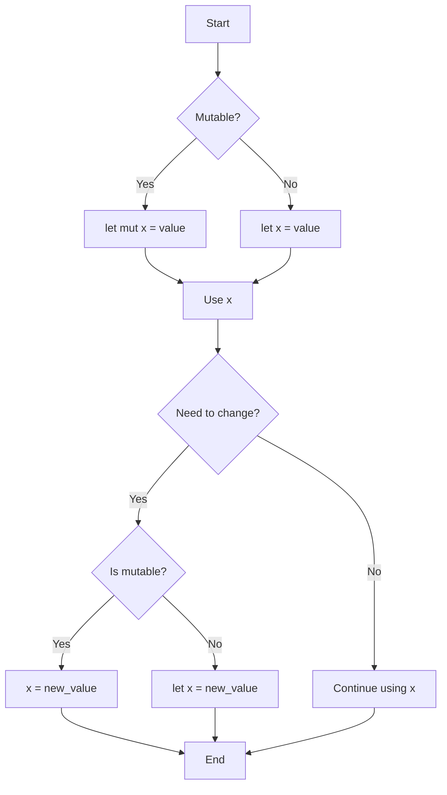

# Rust Variables

Welcome to the Rust Fundamentals section! In this article, we'll explore how variables work in Rust. Variables are one of the most basic building blocks in any programming language, and Rust has some unique approaches to handling them that make your code more reliable and safe.

## Introduction to Variables in Rust

In programming, a variable is a named storage location that holds a value. Think of it like a labeled box where you can store data for later use in your program. In Rust, variables have several important characteristics that make them different from variables in other languages:

- **Immutable by default**: Variables in Rust cannot be changed once assigned, unless explicitly declared as mutable
- **Static typing**: Every variable has a defined type at compile time
- **Type inference**: Rust can often figure out the type for you
- **Shadowing**: You can declare a new variable with the same name as a previous variable

Let's explore each of these concepts with examples.

## Declaring Variables

In Rust, you declare a variable using the `let` keyword:

```rust
fn main() {
    let name = "Ferris";
    println!("Hello, {}!", name);
}
```

Output:
```
Hello, Ferris!
```

In this example, we declared a variable named `name` and assigned it the string value "Ferris".

### Type Annotations

While Rust can infer types, you can also explicitly specify the type using a colon `:` followed by the type:

```rust
fn main() {
    let age: u32 = 25;
    let price: f64 = 19.99;
    let is_rust_fun: bool = true;
    
    println!("Age: {}", age);
    println!("Price: ${}", price);
    println!("Is Rust fun? {}", is_rust_fun);
}
```

Output:
```
Age: 25
Price: $19.99
Is Rust fun? true
```

## Immutability and Mutability

By default, variables in Rust are immutable, which means once a value is bound to a name, you can't change that value. This is one of Rust's many features that help write code with fewer bugs.

```rust
fn main() {
    let x = 5;
    println!("The value of x is: {}", x);
    
    // This will cause a compilation error
    // x = 6;
    // println!("The value of x is: {}", x);
}
```

If you try to reassign a value to an immutable variable, the Rust compiler will throw an error:

```
error[E0384]: cannot assign twice to immutable variable `x`
```

### Making Variables Mutable

To make a variable mutable, you use the `mut` keyword:

```rust
fn main() {
    let mut x = 5;
    println!("The value of x is: {}", x);
    
    x = 6; // This works now!
    println!("The value of x is: {}", x);
}
```

Output:
```
The value of x is: 5
The value of x is: 6
```

## Variable Shadowing

Rust allows you to declare a new variable with the same name as a previous variable. This is called "shadowing" and it's different from making a variable mutable:

```rust
fn main() {
    let x = 5;
    println!("The value of x is: {}", x);
    
    let x = x + 1; // Shadow the previous x
    println!("The value of x is: {}", x);
    
    let x = x * 2; // Shadow again
    println!("The value of x is: {}", x);
}
```

Output:
```
The value of x is: 5
The value of x is: 6
The value of x is: 12
```

Shadowing is useful because:

1. It allows you to reuse variable names, which can make code cleaner
2. You can change the type of a variable, which isn't possible with `mut` alone

Here's an example of changing the type:

```rust
fn main() {
    let spaces = "   "; // This is a string
    println!("Spaces: '{}'", spaces);
    
    let spaces = spaces.len(); // Now it's a number
    println!("Number of spaces: {}", spaces);
}
```

Output:
```
Spaces: '   '
Number of spaces: 3
```

## Constants

Besides variables, Rust also has constants. Constants are values that are bound to a name and cannot change, like immutable variables. However, there are a few differences:

- You must annotate the type
- Constants use the `const` keyword instead of `let`
- Constants can be declared in any scope, including the global scope
- Constants can only be set to a constant expression, not a function call result or anything computed at runtime

```rust
fn main() {
    const MAX_POINTS: u32 = 100_000;
    println!("The maximum points is: {}", MAX_POINTS);
}
```

Output:
```
The maximum points is: 100000
```

The naming convention for constants in Rust is to use all uppercase with underscores between words.

## Variable Scope

The scope of a variable refers to the region of code where the variable is valid. In Rust, a variable is valid from the point it's declared until the end of the current scope.

```rust
fn main() {
    // x is not valid here
    
    {
        // x is not valid here
        let x = 42;
        // x is valid from this point forward
        println!("x inside inner scope: {}", x);
    }
    
    // x is no longer valid here
    // println!("x outside: {}", x); // This would cause an error
}
```

Output:
```
x inside inner scope: 42
```

## Real-world Examples

Let's see some practical examples of using variables in Rust:

### Example 1: Temperature Converter

```rust
fn main() {
    let celsius = 23.0;
    let fahrenheit = celsius * 9.0 / 5.0 + 32.0;
    
    println!("{} degrees Celsius is {} degrees Fahrenheit", celsius, fahrenheit);
    
    // Convert back to prove our calculation
    let celsius_again = (fahrenheit - 32.0) * 5.0 / 9.0;
    println!("Converting back: {} degrees Fahrenheit is {:.1} degrees Celsius", 
             fahrenheit, celsius_again);
}
```

Output:
```
23 degrees Celsius is 73.4 degrees Fahrenheit
Converting back: 73.4 degrees Fahrenheit is 23.0 degrees Celsius
```

### Example 2: Working with User Data

```rust
fn main() {
    let mut username = String::from("rust_lover");
    let initial_username = username.clone(); // Save a copy
    
    println!("Current username: {}", username);
    
    // Update the username
    username.push_str("_2025");
    println!("Updated username: {}", username);
    
    // User account info
    let is_active = true;
    let registration_year = 2025;
    
    println!("User: {}", initial_username);
    println!("Current username: {}", username);
    println!("Active status: {}", is_active);
    println!("Registered: {}", registration_year);
}
```

Output:
```
Current username: rust_lover
Updated username: rust_lover_2025
User: rust_lover
Current username: rust_lover_2025
Active status: true
Registered: 2025
```

## Variable Declaration Flow

Here's a diagram showing the flow of variable declaration and usage in Rust:



## Summary

In this article, we've covered the fundamental concepts of variables in Rust:

- Variables are declared using the `let` keyword and are immutable by default
- You can make variables mutable with the `mut` keyword
- Rust uses type inference but also allows explicit type annotations
- Variables can be shadowed, allowing reuse of names and type changes
- Constants are similar to immutable variables but with additional restrictions
- Variables have scopes that determine where they can be accessed

Understanding variables is crucial for effective Rust programming. The immutability-by-default approach might seem restrictive at first, but it helps prevent bugs and makes your code safer and more predictable.

## Exercises

1. Create a program that converts a given amount of money from one currency to another using variables.
2. Write a program that uses shadowing to transform a string input in various ways (uppercase, count characters, etc.).
3. Create a program with nested scopes and observe how variable shadowing and visibility work.
4. Try to modify an immutable variable, then fix the error by making it mutable or using shadowing.
5. Create a program that uses constants for configuration values and variables for changing data.

## Additional Resources

- [Rust Official Documentation on Variables](https://doc.rust-lang.org/book/ch03-01-variables-and-mutability.html)
- [Rust By Example: Variables](https://doc.rust-lang.org/rust-by-example/variable_bindings.html)
- [The Rust Programming Language Book, Chapter 3](https://doc.rust-lang.org/book/ch03-00-common-programming-concepts.html)

Happy coding in Rust!