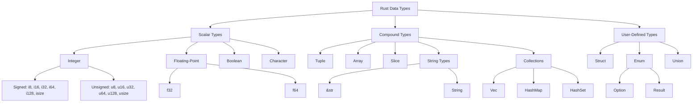

# Rust Data Types

## Introduction

Data types are a fundamental concept in any programming language, and Rust is no exception. Rust is a statically typed language, which means that it must know the types of all variables at compile time. Understanding Rust's type system is essential for writing efficient, safe, and bug-free code.

In this tutorial, we'll explore the various data types available in Rust, how they work, and when to use them. We'll cover primitive types, compound types, and learn how to convert between different types.

## Scalar Types

Scalar types represent a single value. Rust has four primary scalar types:

### Integers

Integers are whole numbers without a fractional component. Rust provides several integer types with different sizes and signedness:

| Length | Signed | Unsigned |
|--------|--------|----------|
| 8-bit  | i8     | u8       |
| 16-bit | i16    | u16      |
| 32-bit | i32    | u32      |
| 64-bit | i64    | u64      |
| 128-bit| i128   | u128     |
| arch   | isize  | usize    |

- Signed integers can represent both positive and negative numbers
- Unsigned integers can only represent positive numbers
- The `isize` and `usize` types depend on the architecture of the computer (64 bits on 64-bit architecture)

```rust
// Integer type examples
let a: i32 = -42;        // 32-bit signed integer
let b: u8 = 255;         // 8-bit unsigned integer
let c = 100_000;         // Type inferred as i32 by default
let d = 0xff;            // Hexadecimal
let e = 0o77;            // Octal
let f = 0b1111_0000;     // Binary with visual separator
let g: usize = 123;      // Architecture-dependent size
```

### Floating-Point Numbers

Floating-point numbers are numbers with decimal points. Rust has two floating-point types: `f32` and `f64`.

```rust
// Floating-point examples
let x: f64 = 2.0;        // 64-bit float (double precision)
let y: f32 = 3.14;       // 32-bit float (single precision)
let z = 10.5;            // Type inferred as f64 by default
```

### Booleans

The boolean type has two possible values: `true` and `false`.

```rust
// Boolean examples
let is_active: bool = true;
let is_greater = 10 > 5;  // Evaluates to true
```

### Characters

The `char` type represents a Unicode Scalar Value, which means it can represent more than just ASCII.

```rust
// Character examples
let letter: char = 'A';     // Single quotes for char literals
let emoji = '😊';           // Supports Unicode characters
let kanji = '日';           // Supports international characters
```

## Compound Types

Compound types can group multiple values into one type. Rust has two primitive compound types:

### Tuples

A tuple is a general way of grouping together a number of values with a variety of types into one compound type.

```rust
// Tuple examples
let coordinates: (i32, i32) = (10, 20);   // Tuple with two i32 values
let mix = (500, 6.4, "hello");            // Tuple with mixed types

// Destructuring a tuple
let (x, y) = coordinates;
println!("x: {}, y: {}", x, y);
// Output: x: 10, y: 20

// Accessing tuple elements with index
let first = mix.0;
let second = mix.1;
let third = mix.2;
println!("Values: {}, {}, {}", first, second, third);
// Output: Values: 500, 6.4, hello
```

### Arrays

Unlike tuples, every element of an array must have the same type. Arrays in Rust have a fixed length.

```rust
// Array examples
let numbers: [i32; 5] = [1, 2, 3, 4, 5];  // Array of 5 i32 values
let zeros = [0; 10];                      // Creates an array of 10 zeros

// Accessing array elements (zero-indexed)
let first = numbers[0];
let second = numbers[1];
println!("First: {}, Second: {}", first, second);
// Output: First: 1, Second: 2

// Getting array length
println!("Array length: {}", numbers.len());
// Output: Array length: 5
```

## String Types

Rust has two string types: `String` and `&str`.

### String Slices (&str)

A string slice is a reference to a part of a string and is commonly seen as string literals.

```rust
// String slice examples
let greeting: &str = "Hello, world!";
let part: &str = &greeting[0..5];  // Takes a slice of the greeting (Hello)
println!("Part: {}", part);
// Output: Part: Hello
```

### String Type

The `String` type is a growable, mutable, owned UTF-8 encoded string.

```rust
// String examples
let mut s = String::from("Hello");  // Creates a String from a string literal
s.push_str(", world!");             // Appends a string slice
println!("{}", s);
// Output: Hello, world!

// Converting between String and &str
let slice: &str = &s;               // &String coerces to &str
let owned: String = slice.to_string(); // Convert &str to String
```

## Collection Types

Rust's standard library includes several collection types that can store multiple values:

### Vectors

A vector is a growable array-like structure:

```rust
// Vector examples
let mut numbers: Vec<i32> = Vec::new();  // Create an empty vector
numbers.push(1);                         // Add values
numbers.push(2);
numbers.push(3);

// Alternative initialization
let numbers2 = vec![1, 2, 3];            // Using the vec! macro

// Accessing elements
let third: &i32 = &numbers[2];
println!("Third element: {}", third);
// Output: Third element: 3

// Iterating over vectors
for num in &numbers {
    println!("{}", num);
}
// Output: 
// 1
// 2
// 3
```

### HashMaps

The `HashMap<K, V>` type stores a mapping of keys of type `K` to values of type `V`.

```rust
use std::collections::HashMap;

// HashMap examples
let mut scores = HashMap::new();

// Inserting values
scores.insert(String::from("Blue"), 10);
scores.insert(String::from("Red"), 50);

// Accessing values
let team_name = String::from("Blue");
let score = scores.get(&team_name);

match score {
    Some(s) => println!("Team {} score: {}", team_name, s),
    None => println!("Team {} not found", team_name),
}
// Output: Team Blue score: 10
```

## Custom Types

### Structs

Structs are custom data types that let you name and package together multiple related values:

```rust
// Struct examples
struct User {
    username: String,
    email: String,
    sign_in_count: u64,
    active: bool,
}

// Creating an instance
let user1 = User {
    email: String::from("user@example.com"),
    username: String::from("username123"),
    active: true,
    sign_in_count: 1,
};

// Accessing fields
println!("User: {}", user1.username);
// Output: User: username123
```

### Enums

Enums allow you to define a type by enumerating its possible variants:

```rust
// Enum examples
enum IpAddrKind {
    V4,
    V6,
}

// More complex enum
enum IpAddr {
    V4(u8, u8, u8, u8),
    V6(String),
}

// Creating instances
let home = IpAddr::V4(127, 0, 0, 1);
let loopback = IpAddr::V6(String::from("::1"));

// Using with match
match home {
    IpAddr::V4(a, b, c, d) => println!("IPv4: {}.{}.{}.{}", a, b, c, d),
    IpAddr::V6(addr) => println!("IPv6: {}", addr),
}
// Output: IPv4: 127.0.0.1
```

## Option and Result Types

Rust doesn't have null values, but instead uses the `Option` and `Result` enums to handle absence of values and error cases.

### Option

```rust
// Option examples
let some_number = Some(5);
let some_string = Some("a string");
let absent_number: Option<i32> = None;

// Using Option with match
match some_number {
    Some(n) => println!("Got a number: {}", n),
    None => println!("No number available"),
}
// Output: Got a number: 5
```

### Result

```rust
// Result examples
use std::fs::File;

// Open a file, which might fail
let file_result = File::open("hello.txt");

match file_result {
    Ok(file) => println!("File opened successfully"),
    Err(error) => println!("Failed to open file: {}", error),
}
```

## Type Conversions

Rust provides several ways to convert between types:

### Explicit Type Casting

The `as` keyword allows for explicit type casting:

```rust
// Type casting examples
let decimal = 65.4321_f32;
let integer = decimal as u8;    // 65
let character = integer as char; // 'A'

println!("Decimal: {}", decimal);
println!("Integer: {}", integer);
println!("Character: {}", character);
// Output: 
// Decimal: 65.4321
// Integer: 65
// Character: A
```

### From and Into Traits

The `From` and `Into` traits define conversions between types:

```rust
// From and Into examples
let my_str = "hello";
let my_string = String::from(my_str);  // Using From

let num = 5;
let num_to_string: String = num.into(); // Using Into

println!("Original: {}, Converted: {}", my_str, my_string);
println!("Number {} as string: {}", num, num_to_string);
// Output:
// Original: hello, Converted: hello
// Number 5 as string: 5
```

## Type Visualization

Here's a visual representation of Rust's type hierarchy:



## Summary

In this tutorial, we've covered Rust's rich type system:

- **Scalar types**: integers, floating-point numbers, booleans, and characters
- **Compound types**: tuples and arrays
- **String types**: `String` and `&str`
- **Collection types**: vectors, hash maps
- **Custom types**: structs and enums
- **Option and Result** for handling absent values and errors
- **Type conversions** using `as`, `From`, and `Into`

Understanding Rust's type system is crucial for writing safe and efficient code. Rust's strict type checking helps prevent many common bugs at compile time rather than runtime.

## Exercises

1. Create a function that takes a string slice and returns its length as a `usize`.
2. Define a struct called `Rectangle` with `width` and `height` fields of type `f64`, then write a function that calculates its area.
3. Create a vector of integers, then use a loop to calculate the sum of all elements.
4. Define an enum representing different shapes (Circle, Square, Triangle) with appropriate data for each variant, then write a function that calculates the area depending on the shape.
5. Create a HashMap that maps student names to their grades, then write code to find the student with the highest grade.

## Additional Resources

- [Rust Book - Data Types Chapter](https://doc.rust-lang.org/book/ch03-02-data-types.html)
- [Rust By Example - Primitives](https://doc.rust-lang.org/rust-by-example/primitives.html)
- [Rust Standard Library Documentation](https://doc.rust-lang.org/std/)
- [Rust Language Cheat Sheet](https://cheats.rs/)