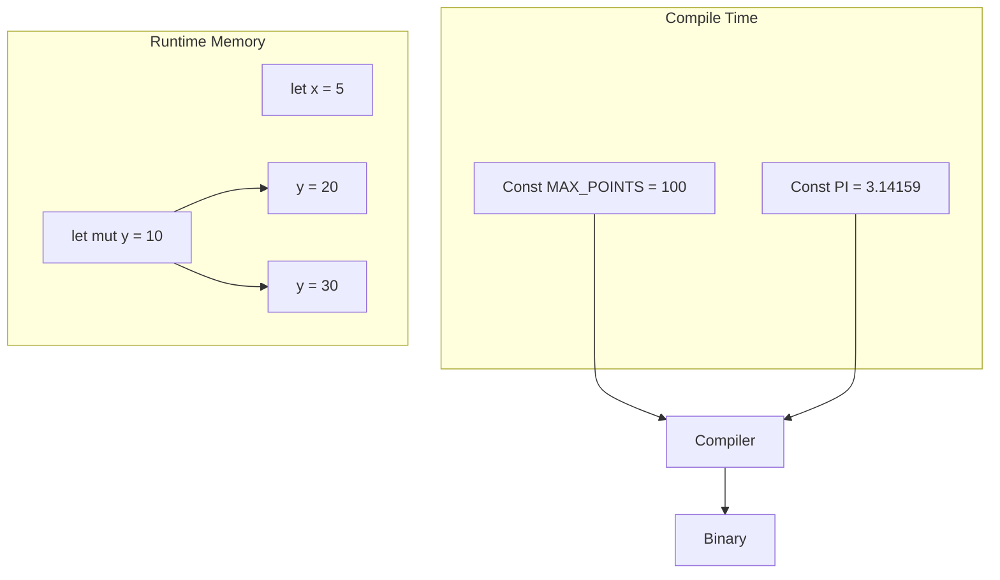

# Rust Constants

## Introduction

Constants in Rust are fixed values that cannot change during program execution. Unlike variables, which can be mutated (if declared as `mut`), constants are immutable by definition and must have their values defined at compile time. Constants play a critical role in writing clean, maintainable, and efficient Rust code.

In this tutorial, we'll explore:
- What constants are and how they work in Rust
- The difference between constants and variables
- When and how to use constants effectively
- Best practices for naming and organizing constants

## Declaring Constants

In Rust, constants are declared using the `const` keyword. Let's look at the basic syntax:

```rust
const MAX_POINTS: u32 = 100_000;
```

Let's break down the components:
- `const`: The keyword that indicates we're defining a constant
- `MAX_POINTS`: The name of the constant (conventionally in SCREAMING_SNAKE_CASE)
- `u32`: The data type (required for all constants)
- `100_000`: The value (the underscore is optional and helps with readability)

Here's a simple program demonstrating constants:

```rust
fn main() {
    const MAX_HEALTH: u32 = 100;
    const MIN_HEALTH: u32 = 0;
    
    println!("Maximum health: {}", MAX_HEALTH);
    println!("Minimum health: {}", MIN_HEALTH);
}
```

Output:
```
Maximum health: 100
Minimum health: 0
```

## Constants vs Variables

To understand constants better, let's compare them with variables:

| Feature | Constants | Variables |
|---------|-----------|-----------|
| Mutability | Always immutable | Can be mutable with `mut` |
| Type declaration | Always required | Optional (can be inferred) |
| Value assignment | At compile time only | At runtime or compile time |
| Shadowing | Not allowed | Allowed |
| Scope | Global or local | Global or local |
| Naming convention | SCREAMING_SNAKE_CASE | snake_case |

Here's a code example illustrating the differences:

```rust
fn main() {
    // Constant - compile time value, immutable
    const MAX_SPEED: f64 = 55.0;
    
    // Variable - can be calculated at runtime
    let current_speed = 40.5;
    
    // Mutable variable
    let mut acceleration = 0.0;
    
    acceleration = 2.5;  // This is allowed
    
    // MAX_SPEED = 65.0;  // This would cause a compile error
    
    println!("Speed limit: {} mph", MAX_SPEED);
    println!("Current speed: {} mph", current_speed);
    println!("Acceleration: {} mph/s", acceleration);
}
```

Output:
```
Speed limit: 55 mph
Current speed: 40.5 mph
Acceleration: 2.5 mph/s
```

## Key Properties of Constants

### 1. Type Annotation Requirement

Unlike variables, constants **always** require type annotations:

```rust
// This works
let x = 5;

// This works too
const MAX: i32 = 100;

// This would NOT work
// const MIN = 0;  // Error: missing type for constant
```

### 2. Compile-Time Evaluation

Constants must be evaluated at compile time. This means you cannot use functions or operations that are only determined at runtime:

```rust
fn main() {
    // This works - compile time evaluation
    const SECONDS_IN_DAY: u32 = 60 * 60 * 24;
    
    // This would NOT work - runtime function
    // const RANDOM_NUMBER: u32 = rand::random();  // Error
    
    println!("Seconds in a day: {}", SECONDS_IN_DAY);
}
```

Output:
```
Seconds in a day: 86400
```

### 3. Scope and Visibility

Constants can be declared in global scope (outside of any function) or local scope (inside a function):

```rust
// Global constant
const PI: f64 = 3.14159;

fn main() {
    // Local constant
    const E: f64 = 2.71828;
    
    println!("π = {}", PI);
    println!("e = {}", E);
    
    calculate_area();
}

fn calculate_area() {
    // PI is accessible here
    println!("Area of a circle with radius 2: {}", PI * 2.0 * 2.0);
    
    // E is NOT accessible here
    // println!("e = {}", E);  // Error: E is not in scope
}
```

Output:
```
π = 3.14159
e = 2.71828
Area of a circle with radius 2: 12.56636
```

## Practical Use Cases for Constants

### 1. Configuration Values

Constants are ideal for configuration values that should not change throughout program execution:

```rust
const DATABASE_URL: &str = "postgres://localhost:5432/myapp";
const MAX_CONNECTIONS: u32 = 100;
const TIMEOUT_MS: u64 = 30_000;

fn connect_to_database() {
    println!("Connecting to {}", DATABASE_URL);
    println!("Max connections: {}", MAX_CONNECTIONS);
    println!("Timeout: {} ms", TIMEOUT_MS);
    // Database connection logic would go here
}

fn main() {
    connect_to_database();
}
```

Output:
```
Connecting to postgres://localhost:5432/myapp
Max connections: 100
Timeout: 30000 ms
```

### 2. Mathematical Constants

Constants are perfect for mathematical values:

```rust
const PI: f64 = 3.14159265359;
const GOLDEN_RATIO: f64 = 1.61803398875;

fn main() {
    let radius = 5.0;
    let circle_area = PI * radius * radius;
    
    println!("Area of circle with radius {}: {:.2}", radius, circle_area);
    println!("Golden ratio: {:.5}", GOLDEN_RATIO);
}
```

Output:
```
Area of circle with radius 5: 78.54
Golden ratio: 1.61803
```

### 3. Application Limits and Boundaries

Constants help define the boundaries and limits of your application:

```rust
const MIN_USERNAME_LENGTH: usize = 3;
const MAX_USERNAME_LENGTH: usize = 20;
const MAX_LOGIN_ATTEMPTS: u32 = 5;

fn validate_username(username: &str) -> bool {
    let length = username.len();
    
    if length < MIN_USERNAME_LENGTH {
        println!("Username too short! Minimum length is {}", MIN_USERNAME_LENGTH);
        return false;
    }
    
    if length > MAX_USERNAME_LENGTH {
        println!("Username too long! Maximum length is {}", MAX_USERNAME_LENGTH);
        return false;
    }
    
    println!("Username '{}' is valid", username);
    true
}

fn main() {
    validate_username("jo");
    validate_username("john_doe");
    validate_username("this_username_is_way_too_long_for_our_system");
}
```

Output:
```
Username too short! Minimum length is 3
Username 'john_doe' is valid
Username too long! Maximum length is 20
```

## Static vs Const

In Rust, there's another way to define constants called `static`. While similar, they have important differences:

```rust
// A constant
const MAX_SPEED: u32 = 55;

// A static variable
static MIN_SPEED: u32 = 5;

fn main() {
    println!("Speed range: {} to {}", MIN_SPEED, MAX_SPEED);
}
```

Output:
```
Speed range: 5 to 55
```

The key differences are:

1. **Memory Model**: `static` variables have a fixed address in memory that remains the same throughout program execution. Constants may be inlined by the compiler.

2. **Mutability**: You can create mutable static variables with `static mut`, but accessing them is considered unsafe:

```rust
static mut COUNTER: u32 = 0;

fn main() {
    // Accessing mutable static requires unsafe
    unsafe {
        COUNTER += 1;
        println!("Counter: {}", COUNTER);
    }
}
```

3. **Use Cases**: Use `const` for values that might be used in multiple places, and `static` when you need a value with a fixed memory address.

Generally, `const` is preferred over `static` for most use cases unless you specifically need a fixed memory location.

## Best Practices for Using Constants

1. **Use SCREAMING_SNAKE_CASE for naming**:
   Follow Rust's naming convention for constants to improve code readability.

2. **Group related constants**:
   Consider grouping related constants in modules or structs for better organization.

```rust
mod config {
    pub const SERVER_PORT: u16 = 8080;
    pub const MAX_REQUESTS: u32 = 1000;
    pub const TIMEOUT_SECONDS: u64 = 30;
}

fn main() {
    println!("Server running on port {}", config::SERVER_PORT);
}
```

3. **Use constants for magic numbers**:
   Replace "magic numbers" in your code with named constants to improve readability.

```rust
// Bad practice: Magic numbers
fn calculate_price(items: u32) -> f64 {
    let mut price = items as f64 * 10.0;
    if items > 10 {
        price *= 0.9;  // 10% discount
    }
    price
}

// Good practice: Named constants
const ITEM_PRICE: f64 = 10.0;
const BULK_THRESHOLD: u32 = 10;
const BULK_DISCOUNT: f64 = 0.9;  // 10% discount

fn calculate_price_better(items: u32) -> f64 {
    let mut price = items as f64 * ITEM_PRICE;
    if items > BULK_THRESHOLD {
        price *= BULK_DISCOUNT;
    }
    price
}

fn main() {
    let num_items = 15;
    println!("Price for {} items: ${:.2}", num_items, calculate_price_better(num_items));
}
```

Output:
```
Price for 15 items: $135.00
```

4. **Document your constants**:
   Add meaningful comments for constants, especially when their values might not be self-explanatory.

```rust
/// Gravitational acceleration on Earth in m/s²
const GRAVITY: f64 = 9.81;

/// Maximum allowed temperature in the system in Celsius
const MAX_TEMPERATURE: f32 = 90.0;
```

## Constants in Expressions

Constants can be used in various expressions, including array sizes and other compile-time calculations:

```rust
const MAX_USERS: usize = 100;

fn main() {
    // Using constant for array size
    let scores: [i32; MAX_USERS] = [0; MAX_USERS];
    
    // Using constant in expressions
    const AREA: f64 = 3.14159 * 10.0 * 10.0;
    
    println!("Array size: {}", scores.len());
    println!("Circle area: {}", AREA);
}
```

Output:
```
Array size: 100
Circle area: 314.159
```

## Constants in Associated Functions and Methods

Constants can also be defined within `impl` blocks as associated constants:

```rust
struct Circle {
    radius: f64,
}

impl Circle {
    // Associated constant
    const PI: f64 = 3.14159;
    
    fn new(radius: f64) -> Self {
        Circle { radius }
    }
    
    fn area(&self) -> f64 {
        Self::PI * self.radius * self.radius
    }
}

fn main() {
    let circle = Circle::new(5.0);
    println!("Circle area: {:.2}", circle.area());
    println!("PI value: {}", Circle::PI);
}
```

Output:
```
Circle area: 78.54
PI value: 3.14159
```

## Visualizing Constants in Memory

Let's visualize the difference between constants, immutable variables, and mutable variables:



Constants are "baked into" the compiled program at the locations where they're used, rather than being stored in memory locations that are assigned at runtime.

## Summary

Constants in Rust provide a powerful way to define fixed values that are known at compile time. They offer several advantages:

- They make your code more readable by giving meaningful names to values
- They help prevent accidental changes to important values
- They can improve performance as they're evaluated at compile time
- They follow a consistent naming convention that makes them easy to identify

Key points to remember:
1. Declare constants with the `const` keyword
2. Always specify the data type
3. Use SCREAMING_SNAKE_CASE for naming
4. Constants must be defined with values known at compile time
5. Constants can be defined in global or local scope
6. Use constants instead of "magic numbers" or string literals

## Exercises

1. Create a program that calculates the volume of different geometric shapes using constants for mathematical values.

2. Define a set of constants for an e-commerce application (e.g., shipping costs, discount thresholds, tax rates) and write functions that use these constants.

3. Compare the behavior of constants, immutable variables, and mutable variables in a program. Try to assign new values to each and observe the compiler messages.

4. Refactor a program that uses numeric literals by replacing them with named constants. How does this affect the readability of your code?

## Additional Resources

- [Rust Book: Variables and Mutability](https://doc.rust-lang.org/book/ch03-01-variables-and-mutability.html)
- [Rust Reference: Constants](https://doc.rust-lang.org/reference/items/constant-items.html)
- [Rust By Example: Constants](https://doc.rust-lang.org/rust-by-example/custom_types/constants.html)