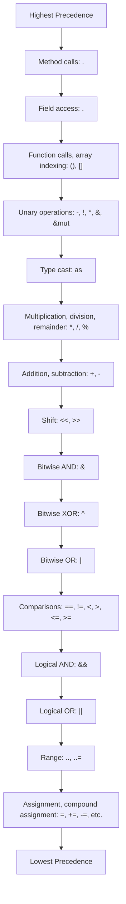

# Rust Operators

## Introduction

Operators are symbols that perform operations on one or more operands to produce a result. In Rust, operators allow you to manipulate values, compare them, and perform logical operations. Understanding operators is fundamental to writing efficient and effective Rust code.

This guide will walk you through the various operators available in Rust, explain how they work with different data types, and demonstrate their usage through practical examples.

## Arithmetic Operators

Arithmetic operators in Rust perform mathematical operations on numeric values.

| Operator | Description | Example |
|----------|-------------|---------|
| `+` | Addition | `5 + 3` equals `8` |
| `-` | Subtraction | `5 - 3` equals `2` |
| `*` | Multiplication | `5 * 3` equals `15` |
| `/` | Division | `15 / 3` equals `5` |
| `%` | Modulus (remainder) | `10 % 3` equals `1` |

Let's see these operators in action:

```rust
fn main() {
    // Basic arithmetic operations
    let sum = 10 + 5;
    let difference = 10 - 5;
    let product = 10 * 5;
    let quotient = 10 / 5;
    let remainder = 10 % 3;
    
    println!("Sum: {}", sum);
    println!("Difference: {}", difference);
    println!("Product: {}", product);
    println!("Quotient: {}", quotient);
    println!("Remainder: {}", remainder);
}
```

Output:
```
Sum: 15
Difference: 5
Product: 50
Quotient: 2
Remainder: 1
```

### Integer Division

Note that when dividing integers in Rust, the result is truncated toward zero (integer division):

```rust
fn main() {
    let result = 5 / 2;
    println!("5 / 2 = {}", result);
    
    // For floating point division
    let float_result = 5.0 / 2.0;
    println!("5.0 / 2.0 = {}", float_result);
}
```

Output:
```
5 / 2 = 2
5.0 / 2.0 = 2.5
```

## Compound Assignment Operators

These operators combine an arithmetic operation with assignment.

| Operator | Description | Equivalent to |
|----------|-------------|---------------|
| `+=` | Add and assign | `a = a + b` |
| `-=` | Subtract and assign | `a = a - b` |
| `*=` | Multiply and assign | `a = a * b` |
| `/=` | Divide and assign | `a = a / b` |
| `%=` | Modulus and assign | `a = a % b` |

Example:

```rust
fn main() {
    let mut x = 5;
    
    // Compound assignment
    x += 3;  // x = x + 3
    println!("After x += 3: {}", x);
    
    x -= 2;  // x = x - 2
    println!("After x -= 2: {}", x);
    
    x *= 4;  // x = x * 4
    println!("After x *= 4: {}", x);
    
    x /= 2;  // x = x / 2
    println!("After x /= 2: {}", x);
    
    x %= 5;  // x = x % 5
    println!("After x %= 5: {}", x);
}
```

Output:
```
After x += 3: 8
After x -= 2: 6
After x *= 4: 24
After x /= 2: 12
After x %= 5: 2
```

## Comparison Operators

Comparison operators compare two values and return a boolean result (`true` or `false`).

| Operator | Description | Example |
|----------|-------------|---------|
| `==` | Equal to | `5 == 5` returns `true` |
| `!=` | Not equal to | `5 != 3` returns `true` |
| `>` | Greater than | `5 > 3` returns `true` |
| `<` | Less than | `5 < 3` returns `false` |
| `>=` | Greater than or equal to | `5 >= 5` returns `true` |
| `<=` | Less than or equal to | `5 <= 3` returns `false` |

Example:

```rust
fn main() {
    let a = 5;
    let b = 10;
    
    println!("{} == {} is {}", a, b, a == b);
    println!("{} != {} is {}", a, b, a != b);
    println!("{} > {} is {}", a, b, a > b);
    println!("{} < {} is {}", a, b, a < b);
    println!("{} >= {} is {}", a, b, a >= b);
    println!("{} <= {} is {}", a, b, a <= b);
}
```

Output:
```
5 == 10 is false
5 != 10 is true
5 > 10 is false
5 < 10 is true
5 >= 10 is false
5 <= 10 is true
```

## Logical Operators

Logical operators are used to combine boolean expressions.

| Operator | Description | Example |
|----------|-------------|---------|
| `&&` | Logical AND | `true && false` returns `false` |
| `\|\|` | Logical OR | `true \|\| false` returns `true` |
| `!` | Logical NOT | `!true` returns `false` |

Example:

```rust
fn main() {
    let is_adult = true;
    let has_license = false;
    
    // Using logical AND (&&)
    let can_drive = is_adult && has_license;
    println!("Can drive: {}", can_drive);
    
    // Using logical OR (||)
    let needs_id = is_adult || has_license;
    println!("Needs ID: {}", needs_id);
    
    // Using logical NOT (!)
    let is_minor = !is_adult;
    println!("Is minor: {}", is_minor);
    
    // Complex logical expression
    let complex_result = (is_adult && has_license) || !is_minor;
    println!("Complex result: {}", complex_result);
}
```

Output:
```
Can drive: false
Needs ID: true
Is minor: false
Complex result: true
```

## Bitwise Operators

Bitwise operators manipulate individual bits of integer types.

| Operator | Description | Example |
|----------|-------------|---------|
| `&` | Bitwise AND | `5 & 3` equals `1` |
| `\|` | Bitwise OR | `5 \| 3` equals `7` |
| `^` | Bitwise XOR | `5 ^ 3` equals `6` |
| `<<` | Left shift | `5 << 1` equals `10` |
| `>>` | Right shift | `5 >> 1` equals `2` |

Let's visualize these operations using binary representations:

```rust
fn main() {
    let a = 5;  // Binary: 0101
    let b = 3;  // Binary: 0011
    
    let bitwise_and = a & b;
    let bitwise_or = a | b;
    let bitwise_xor = a ^ b;
    let left_shift = a << 1;
    let right_shift = a >> 1;
    
    println!("{} & {} = {} (binary: {:04b} & {:04b} = {:04b})", a, b, bitwise_and, a, b, bitwise_and);
    println!("{} | {} = {} (binary: {:04b} | {:04b} = {:04b})", a, b, bitwise_or, a, b, bitwise_or);
    println!("{} ^ {} = {} (binary: {:04b} ^ {:04b} = {:04b})", a, b, bitwise_xor, a, b, bitwise_xor);
    println!("{} << 1 = {} (binary: {:04b} << 1 = {:04b})", a, left_shift, a, left_shift);
    println!("{} >> 1 = {} (binary: {:04b} >> 1 = {:04b})", a, right_shift, a, right_shift);
}
```

Output:
```
5 & 3 = 1 (binary: 0101 & 0011 = 0001)
5 | 3 = 7 (binary: 0101 | 0011 = 0111)
5 ^ 3 = 6 (binary: 0101 ^ 0011 = 0110)
5 << 1 = 10 (binary: 0101 << 1 = 1010)
5 >> 1 = 2 (binary: 0101 >> 1 = 0010)
```

There are also compound assignment versions of these operators: `&=`, `|=`, `^=`, `<<=`, `>>=`.

## Range Operators

Range operators create iterators that produce a sequence of values.

| Operator | Description | Example |
|----------|-------------|---------|
| `..` | Exclusive range | `1..5` creates range from 1 to 4 |
| `..=` | Inclusive range | `1..=5` creates range from 1 to 5 |

```rust
fn main() {
    // Exclusive range (doesn't include the upper bound)
    println!("Exclusive range (1..5):");
    for i in 1..5 {
        print!("{} ", i);
    }
    println!();
    
    // Inclusive range (includes the upper bound)
    println!("Inclusive range (1..=5):");
    for i in 1..=5 {
        print!("{} ", i);
    }
    println!();
}
```

Output:
```
Exclusive range (1..5):
1 2 3 4 
Inclusive range (1..=5):
1 2 3 4 5 
```

## Type Cast Operator

Rust uses the `as` keyword to perform explicit type conversions.

```rust
fn main() {
    let float_num = 3.99;
    let integer_num = float_num as i32;  // Truncates to 3
    
    println!("Float: {}", float_num);
    println!("Cast to integer: {}", integer_num);
    
    let character = 65 as u8 as char;  // ASCII value for 'A'
    println!("Character: {}", character);
    
    // Using as for safe numeric conversions
    let large_value = 1000;
    let byte_value = large_value as u8;  // This will overflow and wrap around
    println!("1000 as u8: {}", byte_value);  // Results in 232 (1000 % 256)
}
```

Output:
```
Float: 3.99
Cast to integer: 3
Character: A
1000 as u8: 232
```

## Reference and Dereference Operators

Rust uses `&` for references and `*` for dereferencing.

| Operator | Description | Example |
|----------|-------------|---------|
| `&` | Borrow reference | `&x` borrows a reference to `x` |
| `&mut` | Mutable reference | `&mut x` borrows a mutable reference |
| `*` | Dereference | `*x` dereferences a reference `x` |

```rust
fn main() {
    let mut value = 10;
    
    // Immutable reference
    let reference = &value;
    println!("Value: {}", value);
    println!("Reference: {}", reference);
    
    // Mutable reference
    let mut_reference = &mut value;
    *mut_reference += 5;  // Dereference and modify
    
    println!("Modified value: {}", value);
}
```

Output:
```
Value: 10
Reference: 10
Modified value: 15
```

## Method Call Operator

The `.` operator is used to call methods on values.

```rust
fn main() {
    let text = String::from("Hello, Rust!");
    
    // Using method call operator
    let length = text.len();
    let uppercase = text.to_uppercase();
    let contains_rust = text.contains("Rust");
    
    println!("Text: {}", text);
    println!("Length: {}", length);
    println!("Uppercase: {}", uppercase);
    println!("Contains 'Rust': {}", contains_rust);
}
```

Output:
```
Text: Hello, Rust!
Length: 12
Uppercase: HELLO, RUST!
Contains 'Rust': true
```

## Operator Precedence

Rust operators have a specific order of precedence (priority). Here's a simplified precedence table from highest to lowest:



## Real-World Examples

### Example 1: Temperature Converter

```rust
fn main() {
    // Temperature conversion program using operators
    let celsius = 25.0;
    
    // Formula: F = (C * 9/5) + 32
    let fahrenheit = (celsius * 9.0 / 5.0) + 32.0;
    
    println!("{:.1}°C = {:.1}°F", celsius, fahrenheit);
    
    // Convert back to verify
    let celsius_again = (fahrenheit - 32.0) * 5.0 / 9.0;
    println!("{:.1}°F = {:.1}°C", fahrenheit, celsius_again);
}
```

Output:
```
25.0°C = 77.0°F
77.0°F = 25.0°C
```

### Example 2: Bitwise Operations for Color Manipulation

```rust
fn main() {
    // Using bitwise operators to work with RGB colors
    
    // RGB color: Red (0xFF0000)
    let red = 0xFF0000;
    
    // RGB color: Green (0x00FF00)
    let green = 0x00FF00;
    
    // RGB color: Blue (0x0000FF)
    let blue = 0x0000FF;
    
    // Mix colors with bitwise OR
    let yellow = red | green;
    let magenta = red | blue;
    let cyan = green | blue;
    let white = red | green | blue;
    
    println!("Red (hex): {:06X}", red);
    println!("Green (hex): {:06X}", green);
    println!("Blue (hex): {:06X}", blue);
    println!("Yellow (hex): {:06X}", yellow);
    println!("Magenta (hex): {:06X}", magenta);
    println!("Cyan (hex): {:06X}", cyan);
    println!("White (hex): {:06X}", white);
    
    // Extract color components using bitwise AND and shifts
    let color = 0x3A7CBD;  // Some RGB color
    
    let r = (color >> 16) & 0xFF;
    let g = (color >> 8) & 0xFF;
    let b = color & 0xFF;
    
    println!("
Color: {:06X}", color);
    println!("Red component: {:02X} ({})", r, r);
    println!("Green component: {:02X} ({})", g, g);
    println!("Blue component: {:02X} ({})", b, b);
}
```

Output:
```
Red (hex): FF0000
Green (hex): 00FF00
Blue (hex): 0000FF
Yellow (hex): FFFF00
Magenta (hex): FF00FF
Cyan (hex): 00FFFF
White (hex): FFFFFF

Color: 3A7CBD
Red component: 3A (58)
Green component: 7C (124)
Blue component: BD (189)
```

### Example 3: Permissions Using Bitwise Flags

```rust
fn main() {
    // Using bitwise operators to work with permission flags
    
    // Define permission flags
    const READ: u8 = 0b0000_0100;    // 4
    const WRITE: u8 = 0b0000_0010;   // 2
    const EXECUTE: u8 = 0b0000_0001; // 1
    
    // Set permissions
    let mut permissions = 0;
    
    // Grant read permission
    permissions |= READ;
    println!("After granting READ: {:08b}", permissions);
    
    // Grant write permission
    permissions |= WRITE;
    println!("After granting WRITE: {:08b}", permissions);
    
    // Check permissions
    println!("Has read permission: {}", (permissions & READ) != 0);
    println!("Has write permission: {}", (permissions & WRITE) != 0);
    println!("Has execute permission: {}", (permissions & EXECUTE) != 0);
    
    // Grant execute permission
    permissions |= EXECUTE;
    println!("After granting EXECUTE: {:08b}", permissions);
    
    // Revoke write permission
    permissions &= !WRITE;
    println!("After revoking WRITE: {:08b}", permissions);
    
    // Toggle execute permission
    permissions ^= EXECUTE;
    println!("After toggling EXECUTE: {:08b}", permissions);
    
    // Check final permissions
    println!("Final permissions:");
    println!("Read: {}", (permissions & READ) != 0);
    println!("Write: {}", (permissions & WRITE) != 0);
    println!("Execute: {}", (permissions & EXECUTE) != 0);
}
```

Output:
```
After granting READ: 00000100
After granting WRITE: 00000110
Has read permission: true
Has write permission: true
Has execute permission: false
After granting EXECUTE: 00000111
After revoking WRITE: 00000101
After toggling EXECUTE: 00000100
Final permissions:
Read: true
Write: false
Execute: false
```

## Summary

Rust operators are powerful tools that allow you to manipulate values in various ways. We've covered:

- Arithmetic operators for mathematical operations
- Compound assignment operators for combined operations
- Comparison operators for value comparison
- Logical operators for boolean operations
- Bitwise operators for bit-level manipulations
- Range operators for creating sequences
- Type cast operator for type conversions
- Reference and dereference operators for memory management
- Method call operator for calling methods

Understanding operators and their precedence is fundamental to mastering Rust programming. They form the building blocks of more complex expressions and algorithms.

## Additional Resources

- [The Rust Programming Language Book - Operators](https://doc.rust-lang.org/book/appendix-02-operators.html)
- [Rust By Example - Operators](https://doc.rust-lang.org/rust-by-example/operators.html)
- [Rust Reference - Expressions](https://doc.rust-lang.org/reference/expressions.html)

## Exercises

1. **Basic Calculator**: Create a program that takes two numbers and an operator (+, -, *, /, %) from the user and performs the calculation.

2. **Temperature Converter**: Extend the temperature converter to handle both Celsius to Fahrenheit and Fahrenheit to Celsius conversions based on user input.

3. **Bit Manipulator**: Write a program that takes an integer and performs various bitwise operations (AND, OR, XOR, shifts) with another given integer. Display the results in binary.

4. **Permission System**: Implement a more complex file permission system with more fine-grained permissions using bitwise operators.

5. **Color Blender**: Create a program that blends two RGB colors using various operators and displays the resulting color.