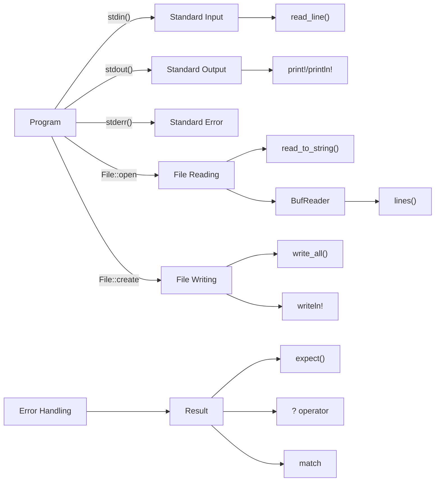

# Rust Input Output

## Introduction

Input and output (I/O) operations are essential for any practical program. They allow your application to interact with users, read data from files, and save information for later use. In Rust, I/O operations are handled through a robust and safe system that prevents common bugs while maintaining good performance.

This guide will walk you through the fundamentals of handling input and output in Rust, covering:
- Standard input/output (stdin/stdout)
- Reading user input from the console
- Displaying information to users
- Working with files
- Error handling for I/O operations

Let's dive into how Rust handles these operations!

## Standard Input and Output

### The `std::io` Module

Rust's standard library provides the `std::io` module, which contains the core functionality for input and output operations. To use this module, you'll need to include it at the beginning of your Rust file:

```rust
use std::io;
```

### Reading from Standard Input

One of the most common input operations is reading user input from the command line. Let's start with a simple example:

```rust
use std::io;

fn main() {
    println!("What's your name?");
    
    let mut input = String::new();
    
    io::stdin()
        .read_line(&mut input)
        .expect("Failed to read line");
    
    println!("Hello, {}!", input.trim());
}
```

Let's break down this example:

1. We create a mutable `String` variable called `input` to store the user's input.
2. `io::stdin()` gives us a handle to the standard input stream.
3. The `read_line()` method reads a line of text from stdin and appends it to our string.
4. `read_line()` returns a `Result` type, which we handle with `expect()`. In a real application, you'd want to use proper error handling.
5. We use `trim()` to remove the newline character at the end of the input.

When you run this program, it will:
- Display "What's your name?"
- Wait for the user to type something and press Enter
- Display "Hello, [user input]!"

### Writing to Standard Output

Rust provides several macros for outputting text:

```rust
fn main() {
    // Basic printing
    println!("This is a line of text"); // Adds a newline at the end
    
    // Print without a newline
    print!("This won't end with a newline. ");
    print!("See?
");
    
    // Formatted printing
    let name = "Rustacean";
    let age = 5;
    println!("Hello, my name is {} and I'm {} years old.", name, age);
    
    // Named parameters
    println!("{greeting}, {name}!", greeting = "Hello", name = "World");
    
    // Debugging information
    let point = (3, 4);
    println!("Debug output: {:?}", point);
    println!("Pretty debug output: {:#?}", point);
}
```

The `println!` and `print!` macros are the most common way to display output in Rust.

## Reading Different Types of Input

Often, you'll need to read input as a specific type (like numbers). Rust requires explicit type conversion for this:

```rust
use std::io;

fn main() {
    println!("Enter a number:");
    
    let mut input = String::new();
    
    io::stdin()
        .read_line(&mut input)
        .expect("Failed to read line");
    
    // Convert string to integer
    let number: i32 = match input.trim().parse() {
        Ok(num) => num,
        Err(_) => {
            println!("That's not a valid number");
            return;
        }
    };
    
    println!("You entered: {}", number);
    println!("Double that is: {}", number * 2);
}
```

In this example:
1. We read a line of text as before
2. We use `trim()` to remove whitespace and `parse()` to attempt conversion to an `i32`
3. We handle the Result using pattern matching to deal with possible errors

### Reading Multiple Inputs

Let's see how to read multiple inputs from a user:

```rust
use std::io;

fn main() {
    // Read first number
    println!("Enter the first number:");
    let first_number = read_number();
    
    // Read second number
    println!("Enter the second number:");
    let second_number = read_number();
    
    // Calculate and display the sum
    let sum = first_number + second_number;
    println!("{} + {} = {}", first_number, second_number, sum);
}

fn read_number() -> i32 {
    let mut input = String::new();
    
    io::stdin()
        .read_line(&mut input)
        .expect("Failed to read line");
    
    match input.trim().parse() {
        Ok(num) => num,
        Err(_) => {
            println!("Invalid input! Defaulting to 0.");
            0
        }
    }
}
```

Here we've created a helper function `read_number()` to avoid code duplication.

## Working with Files

File operations are another important aspect of I/O. Let's explore how to read from and write to files in Rust.

### Writing to a File

```rust
use std::fs::File;
use std::io::Write;

fn main() {
    let mut file = File::create("output.txt")
        .expect("Failed to create file");
    
    file.write_all(b"Hello, Rust file I/O!")
        .expect("Failed to write to file");
    
    println!("Successfully wrote to file");
}
```

In this example:
1. We use `File::create()` to create a new file (or overwrite an existing one)
2. `write_all()` writes a byte slice to the file
3. We use `expect()` for simple error handling

### Reading from a File

```rust
use std::fs::File;
use std::io::{self, Read};

fn main() {
    let mut file = File::open("output.txt")
        .expect("Failed to open file");
    
    let mut contents = String::new();
    file.read_to_string(&mut contents)
        .expect("Failed to read file");
    
    println!("File contents: {}", contents);
}
```

This code:
1. Opens an existing file with `File::open()`
2. Creates a String to hold the contents
3. Reads the entire file into the string
4. Prints the contents

### Better Error Handling with `?` Operator

The `?` operator provides a more concise way to handle errors. It automatically propagates errors up the call stack:

```rust
use std::fs::File;
use std::io::{self, Read};

fn read_file_contents(path: &str) -> io::Result<String> {
    let mut file = File::open(path)?;
    let mut contents = String::new();
    file.read_to_string(&mut contents)?;
    Ok(contents)
}

fn main() {
    match read_file_contents("output.txt") {
        Ok(contents) => println!("File contents: {}", contents),
        Err(error) => println!("Error reading file: {}", error),
    }
}
```

This pattern is the preferred way to handle errors in Rust for real applications.

### Reading a File Line by Line

For large files, reading line by line is more efficient:

```rust
use std::fs::File;
use std::io::{self, BufRead, BufReader};

fn main() -> io::Result<()> {
    let file = File::open("output.txt")?;
    let reader = BufReader::new(file);
    
    for (index, line) in reader.lines().enumerate() {
        let line = line?;
        println!("Line {}: {}", index + 1, line);
    }
    
    Ok(())
}
```

The `BufReader` provides buffered reading capabilities, making line-by-line processing more efficient.

## Common I/O Patterns and Utilities

Rust's standard library provides several utilities to make I/O operations easier.

### Reading an Entire File at Once

```rust
use std::fs;

fn main() {
    // Read entire file into a string
    let contents = fs::read_to_string("output.txt")
        .expect("Failed to read file");
    
    println!("File contents: {}", contents);
    
    // Read entire file into a byte vector
    let bytes = fs::read("output.txt")
        .expect("Failed to read file");
    
    println!("File size: {} bytes", bytes.len());
}
```

These helpers simplify common operations where you need the entire file contents.

### Writing an Entire File at Once

```rust
use std::fs;

fn main() {
    // Write a string to a file
    fs::write("quick_output.txt", "This is a quick test")
        .expect("Failed to write file");
    
    // Write bytes to a file
    let data = vec![72, 101, 108, 108, 111]; // "Hello" in ASCII
    fs::write("binary_output.txt", data)
        .expect("Failed to write file");
    
    println!("Files written successfully");
}
```

### Working with Paths

The `std::path` module helps with platform-independent path handling:

```rust
use std::path::Path;
use std::fs;

fn main() {
    let path = Path::new("data").join("config.txt");
    
    println!("Path: {}", path.display());
    
    if !path.exists() {
        // Create directories if they don't exist
        fs::create_dir_all(path.parent().unwrap())
            .expect("Failed to create directories");
        
        // Write to the file
        fs::write(&path, "Configuration data")
            .expect("Failed to write config file");
        
        println!("Created file at: {}", path.display());
    }
}
```

This code creates a path using the platform's path separator and handles directory creation.

## Real-World Example: Simple Note-Taking App

Let's build a simple note-taking application that demonstrates various I/O concepts:

```rust
use std::fs::{self, OpenOptions};
use std::io::{self, Write, BufRead, BufReader};
use std::path::Path;

fn main() -> io::Result<()> {
    let notes_file = "notes.txt";
    
    loop {
        println!("
=== Simple Notes App ===");
        println!("1. View all notes");
        println!("2. Add a new note");
        println!("3. Exit");
        println!("Enter your choice (1-3):");
        
        let choice = read_user_input()?;
        
        match choice.trim() {
            "1" => view_notes(notes_file)?,
            "2" => add_note(notes_file)?,
            "3" => {
                println!("Goodbye!");
                break;
            }
            _ => println!("Invalid choice, please try again."),
        }
    }
    
    Ok(())
}

fn read_user_input() -> io::Result<String> {
    let mut input = String::new();
    io::stdin().read_line(&mut input)?;
    Ok(input)
}

fn view_notes(file_path: &str) -> io::Result<()> {
    if !Path::new(file_path).exists() {
        println!("No notes found.");
        return Ok(());
    }
    
    let file = fs::File::open(file_path)?;
    let reader = BufReader::new(file);
    
    println!("
=== Your Notes ===");
    let mut note_found = false;
    
    for (index, line) in reader.lines().enumerate() {
        let line = line?;
        if !line.trim().is_empty() {
            println!("{}. {}", index + 1, line);
            note_found = true;
        }
    }
    
    if !note_found {
        println!("No notes found.");
    }
    
    Ok(())
}

fn add_note(file_path: &str) -> io::Result<()> {
    println!("Enter your note (press Enter when done):");
    let note = read_user_input()?;
    
    if note.trim().is_empty() {
        println!("Note cannot be empty.");
        return Ok(());
    }
    
    // Open file in append mode or create if it doesn't exist
    let mut file = OpenOptions::new()
        .create(true)
        .append(true)
        .open(file_path)?;
    
    // Write the note
    writeln!(file, "{}", note.trim())?;
    println!("Note added successfully!");
    
    Ok(())
}
```

This example demonstrates:
- User input processing
- File reading and writing
- Error handling with the `?` operator
- File opening with specific options
- Structured application flow

## Understanding I/O in Rust: Concepts Visualization

Let's visualize how I/O works in Rust:



## Summary

In this guide, we've covered the fundamentals of input and output operations in Rust:

- Reading user input from standard input
- Displaying output to standard output
- Working with files for reading and writing data
- Error handling techniques specific to I/O operations
- Practical examples including a simple note-taking application

Rust's I/O system is designed to be safe and efficient, preventing common bugs while maintaining good performance. The error handling patterns in Rust encourage you to think about potential failures, leading to more robust code.

## Additional Resources

Here are some resources to deepen your understanding of Rust I/O:

- [Rust Standard Library Documentation for std::io](https://doc.rust-lang.org/std/io/index.html)
- [Rust By Example: File I/O](https://doc.rust-lang.org/rust-by-example/std_misc/file.html)
- [The Rust Programming Language Book, Chapter 12](https://doc.rust-lang.org/book/ch12-00-an-io-project.html)

## Exercises

1. **Basic Input/Output**: Create a program that asks the user for their name, age, and favorite programming language, then prints a personalized message.

2. **Temperature Converter**: Build a program that reads a temperature in Celsius from the user and converts it to Fahrenheit (or vice versa).

3. **File Statistics**: Write a program that analyzes a text file and reports statistics such as the number of lines, words, and characters.

4. **Mini Journal**: Extend the note-taking app to include features like searching notes, deleting notes, or categorizing notes.

5. **CSV Parser**: Create a program that reads data from a CSV file, processes it in some way, and writes the results to a new file.

Remember, practice is key to mastering input and output operations in Rust. Try to incorporate these concepts into your own projects to reinforce your learning!