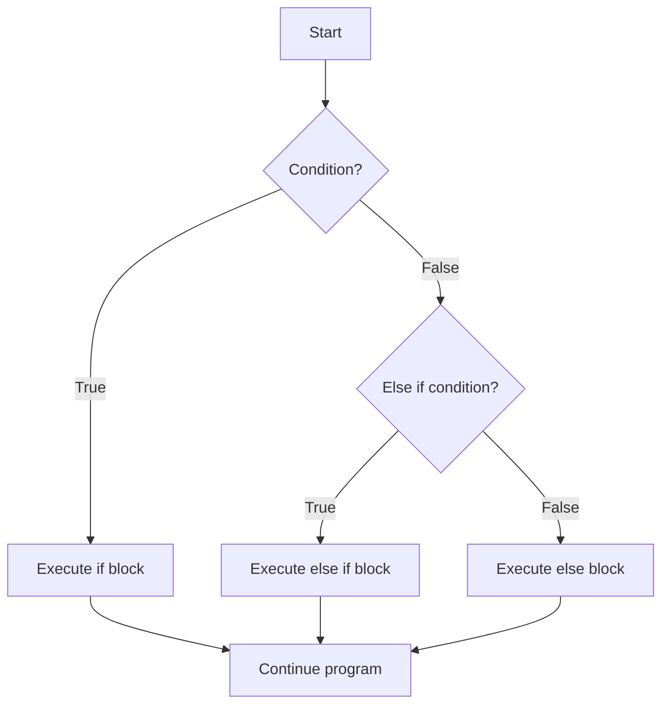

# Rust Conditional Statements

## Introduction

Conditional statements are one of the fundamental building blocks of programming. They allow your program to make decisions and execute different code based on certain conditions. In Rust, like many other programming languages, conditional statements help control the flow of your program by evaluating expressions to true or false and then taking appropriate actions.

In this guide, we'll explore how to use conditional statements in Rust, including `if`, `else if`, and `else` expressions. We'll also cover how Rust's conditional statements can be used as expressions to return values, a powerful feature that enables concise and readable code.

## Basic If Statements

The simplest form of a conditional statement in Rust is the `if` statement. It executes a block of code only if a condition evaluates to `true`.

### Syntax

```rust
if condition {
    // code to execute if condition is true
}
```

### Example

```rust
fn main() {
    let number = 7;
    
    if number > 5 {
        println!("The number is greater than 5");
    }
}
```

**Output:**
```
The number is greater than 5
```

In this example, the condition `number > 5` evaluates to `true` because 7 is greater than 5, so the message is printed.

## If-Else Statements

When you want to execute one block of code if a condition is true and another block if it's false, you can use an `if-else` statement.

### Syntax

```rust
if condition {
    // code to execute if condition is true
} else {
    // code to execute if condition is false
}
```

### Example

```rust
fn main() {
    let number = 4;
    
    if number > 5 {
        println!("The number is greater than 5");
    } else {
        println!("The number is 5 or less");
    }
}
```

**Output:**
```
The number is 5 or less
```

In this example, since 4 is not greater than 5, the condition evaluates to `false`, and the code in the `else` block is executed.

## If-Else If-Else Statements

For more complex conditions, you can chain multiple conditions using `else if` clauses.

### Syntax

```rust
if condition1 {
    // code to execute if condition1 is true
} else if condition2 {
    // code to execute if condition1 is false but condition2 is true
} else {
    // code to execute if all conditions are false
}
```

### Example

```rust
fn main() {
    let number = 7;
    
    if number < 5 {
        println!("The number is less than 5");
    } else if number == 5 {
        println!("The number is equal to 5");
    } else if number < 10 {
        println!("The number is between 6 and 9");
    } else {
        println!("The number is 10 or greater");
    }
}
```

**Output:**
```
The number is between 6 and 9
```

The program checks each condition in order until it finds one that evaluates to `true`, then executes the corresponding block and skips the rest.

## Important Notes About Conditions in Rust

### 1. Conditions Must Be Boolean

In Rust, the condition in an `if` statement must evaluate to a boolean value (`true` or `false`). Unlike some other languages, Rust does not automatically convert non-boolean types to booleans.

```rust
// This will not compile in Rust
if number {  // Error: expected `bool`, found integer
    // ...
}

// Correct way
if number != 0 {
    // ...
}
```

### 2. Parentheses Are Optional

Unlike languages like C, C++, or Java, Rust doesn't require parentheses around the condition.

```rust
// Both are valid in Rust
if (number > 5) {
    // ...
}

if number > 5 {
    // ...
}
```

The second form (without parentheses) is more idiomatic in Rust.

### 3. Braces Are Required

In Rust, braces `{}` are always required for the code blocks, even if they contain only a single statement.

```rust
// This will not compile
if number > 5
    println!("Greater than 5");  // Error: expected `{`

// Correct way
if number > 5 {
    println!("Greater than 5");
}
```

## If Statements as Expressions

One of Rust's powerful features is that `if` statements are expressions, which means they can return values. This allows you to assign the result of an `if` expression to a variable or use it directly.

### Syntax

```rust
let result = if condition {
    expression1
} else {
    expression2
};
```

### Example

```rust
fn main() {
    let number = 7;
    
    let message = if number > 5 {
        "The number is greater than 5"
    } else {
        "The number is 5 or less"
    };
    
    println!("{}", message);
}
```

**Output:**
```
The number is greater than 5
```

### Important Rules for If Expressions

1. All branches must return the same type.
2. The last expression in each block is the return value (no semicolon).
3. If using `if` as an expression, you must include an `else` branch.

```rust
// This will not compile - different types
let result = if number > 5 {
    "greater"  // returns a &str
} else {
    5  // returns an integer
};

// This is valid - same types
let result = if number > 5 {
    "greater"
} else {
    "lesser or equal"
};
```

## Nested If Statements

You can also nest `if` statements inside other `if` or `else` blocks to handle more complex conditional logic.

### Example

```rust
fn main() {
    let number = 15;
    let is_divisible_by_3 = number % 3 == 0;
    
    if number > 10 {
        println!("The number is greater than 10");
        
        if is_divisible_by_3 {
            println!("And it's divisible by 3");
        } else {
            println!("But it's not divisible by 3");
        }
    } else {
        println!("The number is 10 or less");
    }
}
```

**Output:**
```
The number is greater than 10
And it's divisible by 3
```

## Real-World Application: Input Validation

Let's look at a practical example where conditional statements are used to validate user input.

```rust
use std::io;

fn main() {
    println!("Please enter your age:");
    
    let mut input = String::new();
    io::stdin()
        .read_line(&mut input)
        .expect("Failed to read line");
    
    let age: u32 = match input.trim().parse() {
        Ok(num) => num,
        Err(_) => {
            println!("Please enter a valid number!");
            return;
        }
    };
    
    let message = if age < 13 {
        "You're not old enough for this program"
    } else if age < 18 {
        "You can use the program with parental guidance"
    } else if age < 65 {
        "You can use all features of the program"
    } else {
        "You qualify for the senior discount"
    };
    
    println!("{}", message);
}
```

In this example, we:
1. Read a string from the user
2. Convert it to a number, handling errors with `match`
3. Use an `if-else if-else` chain to categorize the age and determine the appropriate message
4. Print the result to the user

## Combining Conditions with Logical Operators

You can combine multiple conditions using logical operators:
- `&&` (AND): Both conditions must be true
- `||` (OR): At least one condition must be true
- `!` (NOT): Inverts a boolean value

### Example

```rust
fn main() {
    let age = 25;
    let has_license = true;
    
    if age >= 18 && has_license {
        println!("You can drive a car");
    } else if age >= 18 && !has_license {
        println!("You need to get a license first");
    } else {
        println!("You are too young to drive");
    }
}
```

**Output:**
```
You can drive a car
```

## Control Flow Diagram

Here's a visual representation of how conditional statements control the flow of a program:



## Summary

Rust's conditional statements provide a powerful way to control the flow of your programs:

- **Basic if statements** execute code when a condition is true
- **If-else statements** provide alternative code to execute when a condition is false
- **If-else if-else chains** allow testing multiple conditions in sequence
- **If expressions** can return values, making your code more concise
- Conditions must be boolean expressions
- All branches of an if expression must return the same type
- Logical operators (`&&`, `||`, `!`) can combine multiple conditions

Understanding and effectively using conditional statements is essential for writing any non-trivial program in Rust. They allow your programs to make decisions and adapt to different inputs and situations.

## Additional Resources

- [The Rust Programming Language Book - Control Flow](https://doc.rust-lang.org/book/ch03-05-control-flow.html)
- [Rust By Example - If/else](https://doc.rust-lang.org/rust-by-example/flow_control/if_else.html)

## Exercises

1. Write a program that takes a number as input and determines if it's even or odd.
2. Create a program that grades a student based on their score: A (90-100), B (80-89), C (70-79), D (60-69), F (0-59).
3. Implement a simple calculator that takes two numbers and an operator (+, -, *, /) as input and performs the appropriate operation.
4. Write a program that determines if a year is a leap year. (Hint: A leap year is divisible by 4, but not by 100 unless it's also divisible by 400.)
5. Create a program that simulates a simple login system. Define a username and password, then ask the user to input their credentials and check if they match.