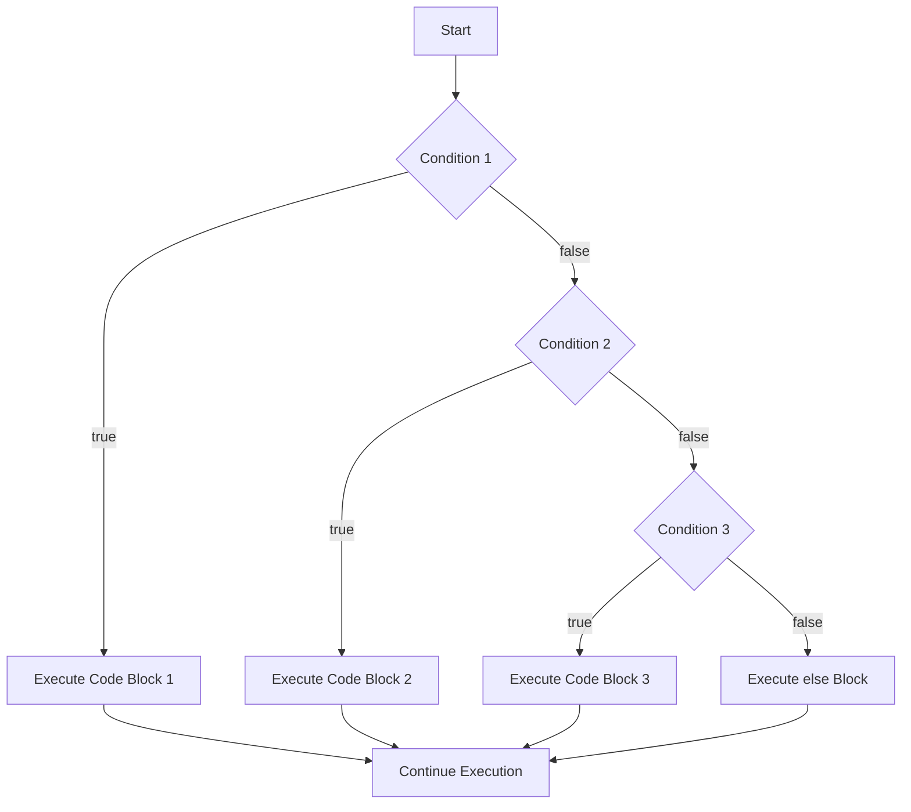

# Rust If Else

## Introduction

Conditional logic is a fundamental concept in programming, allowing your code to make decisions and execute different blocks of code based on different conditions. In Rust, like many programming languages, this is primarily achieved using `if`, `else if`, and `else` expressions.

What makes Rust's conditionals special is that they are **expressions**, not just statements. This means they can return values and be used in assignments, giving you concise and powerful ways to write conditional code.

## Basic If Statements

The simplest form of a conditional in Rust is an `if` statement. It executes a block of code only if a specified condition evaluates to `true`.

```rust
fn main() {
    let number = 5;
    
    if number > 0 {
        println!("The number is positive");
    }
}
```

**Output:**
```
The number is positive
```

In this example:
1. We define a variable `number` with value `5`
2. The condition `number > 0` evaluates to `true`
3. So the code within the curly braces `{}` gets executed

### Important Points About If Conditions

- In Rust, the condition **must** be a boolean expression (unlike languages like C where any non-zero value is considered `true`)
- The curly braces `{}` are **required**, even if the block contains only one statement
- Conditions don't need to be enclosed in parentheses `()` (although you can add them if you prefer)

❌ This will not compile in Rust:
```rust
if number { // Error: expected `bool`, found integer
    println!("number is not zero");
}
```

✅ Instead, you must write:
```rust
if number != 0 {
    println!("number is not zero");
}
```

## If Else Statements

To execute one block of code if a condition is `true` and another block if it's `false`, you can use `if else`:

```rust
fn main() {
    let number = -3;
    
    if number > 0 {
        println!("The number is positive");
    } else {
        println!("The number is zero or negative");
    }
}
```

**Output:**
```
The number is zero or negative
```

This provides a binary path for your code - one path when the condition is true, and another when it's false.

## Multiple Conditions with Else If

For more than two possible paths, you can chain multiple conditions using `else if`:

```rust
fn main() {
    let number = 0;
    
    if number > 0 {
        println!("The number is positive");
    } else if number < 0 {
        println!("The number is negative");
    } else {
        println!("The number is zero");
    }
}
```

**Output:**
```
The number is zero
```

The conditions are evaluated in order, and the first one that evaluates to `true` will have its code block executed. If none of the conditions are `true`, the `else` block (if present) will be executed.

## If Expressions as Values

One of Rust's unique features is that `if` is an expression, which means it returns a value. This allows you to assign the result of an `if` expression to a variable:

```rust
fn main() {
    let number = 5;
    
    let message = if number > 0 {
        "positive"
    } else if number < 0 {
        "negative"
    } else {
        "zero"
    };
    
    println!("The number is {}", message);
}
```

**Output:**
```
The number is positive
```

Notice a few important things:
1. Each arm of the `if`/`else if`/`else` returns a value
2. All possible return values must be of the same type
3. We end with a semicolon after the closing brace because the entire `if` expression is part of a let statement

❌ This will not compile because the arms return different types:
```rust
let result = if number > 0 {
    "positive" // Returns a string
} else {
    5 // Returns a number - Type mismatch!
};
```

## Nested If Statements

You can place `if` expressions inside other `if` expressions, creating nested conditions:

```rust
fn main() {
    let number = 15;
    
    if number > 0 {
        println!("The number is positive");
        
        if number % 2 == 0 {
            println!("And it's even");
        } else {
            println!("And it's odd");
        }
    } else {
        println!("The number is zero or negative");
    }
}
```

**Output:**
```
The number is positive
And it's odd
```

While nesting is possible, excessive nesting can make code harder to read. Consider refactoring deeply nested conditions into separate functions or using Rust's pattern matching with `match` for more complex scenarios.

## Real-World Example: Simple Calculator

Let's create a simple calculator that performs different operations based on user input:

```rust
fn main() {
    let operation = '+';
    let num1 = 10.0;
    let num2 = 5.0;
    
    let result = if operation == '+' {
        num1 + num2
    } else if operation == '-' {
        num1 - num2
    } else if operation == '*' {
        num1 * num2
    } else if operation == '/' {
        if num2 != 0.0 {
            num1 / num2
        } else {
            println!("Error: Division by zero");
            f64::NAN // Not a Number
        }
    } else {
        println!("Unsupported operation");
        f64::NAN
    };
    
    if !result.is_nan() {
        println!("{} {} {} = {}", num1, operation, num2, result);
    }
}
```

**Output:**
```
10 + 5 = 15
```

This example shows how we can use if-else expressions to:
1. Select different operations based on an input character
2. Handle error conditions (division by zero)
3. Return appropriate values from each branch

## Control Flow Visualization

Here's a diagram showing how if-else control flow works in Rust:



## Using Let-If Expressions (Rust 2018+)

Rust allows combining `let` and `if` in a powerful pattern that binds variables only when a condition is true:

```rust
fn main() {
    let some_value: Option<i32> = Some(42);
    
    if let Some(value) = some_value {
        println!("Got a value: {}", value);
    } else {
        println!("No value");
    }
}
```

**Output:**
```
Got a value: 42
```

This pattern is especially useful when dealing with `Option` and `Result` types, and we'll explore it more in later tutorials.

## Logical Operators with If Statements

You can combine multiple conditions using logical operators:

- `&&` (AND): both conditions must be true
- `||` (OR): at least one condition must be true
- `!` (NOT): inverts a condition

```rust
fn main() {
    let age = 25;
    let has_license = true;
    
    if age >= 18 && has_license {
        println!("You can drive");
    } else if age >= 18 && !has_license {
        println!("You need to get a license first");
    } else {
        println!("You're too young to drive");
    }
}
```

**Output:**
```
You can drive
```

## Summary

Rust's if-else expressions provide a powerful way to add conditional logic to your programs:

- Basic `if` statements execute code when conditions are true
- `else` provides an alternative when conditions are false
- `else if` allows handling multiple conditions
- In Rust, if-else constructs are expressions that return values
- All branches of an if-else expression must return the same type
- Conditions must be boolean expressions
- You can combine conditions using logical operators

## Exercises

1. Write a program that takes a temperature value and prints whether it's "Freezing" (below 0), "Cold" (0-15), "Warm" (16-25), or "Hot" (above 25).

2. Create a function `max` that takes three integers and returns the largest one using if-else expressions.

3. Write a program that determines whether a year is a leap year. A leap year is divisible by 4, except for years divisible by 100 unless they are also divisible by 400.

## Additional Resources

- [Rust Book: Control Flow](https://doc.rust-lang.org/book/ch03-05-control-flow.html)
- [Rust by Example: If/Else](https://doc.rust-lang.org/rust-by-example/flow_control/if_else.html)
- [Rust Playground](https://play.rust-lang.org/) - Try these examples online