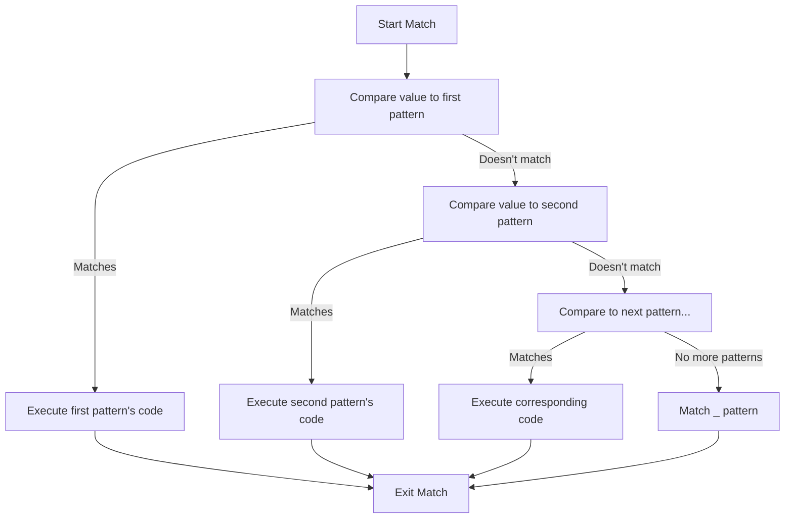

# Rust Match Expressions

## Introduction

The `match` expression is one of Rust's most powerful control flow operators. It allows you to compare a value against a series of patterns and execute code based on which pattern matches. Think of it as an enhanced version of a switch statement from other languages, but with additional capabilities that make it much more powerful.

In this tutorial, we'll explore how match expressions work in Rust, when to use them, and how they can make your code more concise and safer.

## Basic Syntax

The basic syntax of a match expression looks like this:

```rust
match value {
    pattern1 => expression1,
    pattern2 => expression2,
    pattern3 => expression3,
    _ => default_expression,
}
```

Here's how it works:
1. The `value` is compared against each pattern in order
2. When a pattern matches, its corresponding expression is executed
3. The `_` pattern is a catch-all that matches any value not matched by the previous patterns

Let's look at a simple example:

```rust
fn main() {
    let number = 3;
    
    match number {
        1 => println!("One!"),
        2 => println!("Two!"),
        3 => println!("Three!"),
        _ => println!("Something else!"),
    }
}
```

**Output:**
```
Three!
```

In this example, `number` is `3`, so the third pattern matches and "Three!" is printed.

## Exhaustiveness Checking

One of the key features of Rust's match expression is exhaustiveness checking. The compiler ensures that all possible values are handled. This prevents bugs by making sure you don't forget to handle certain cases.

For example, if we try to match on a boolean without covering both `true` and `false` cases:

```rust
let value = true;

match value {
    true => println!("It's true!"),
    // false case is missing!
}
```

The Rust compiler will raise an error because the `false` case isn't handled. We can fix this by either adding a match arm for `false` or using the `_` wildcard pattern.

## Matching with Enums

Match expressions truly shine when used with enums. Let's see how we can match against an enum:

```rust
enum Coin {
    Penny,
    Nickel,
    Dime,
    Quarter,
}

fn value_in_cents(coin: Coin) -> u8 {
    match coin {
        Coin::Penny => 1,
        Coin::Nickel => 5,
        Coin::Dime => 10,
        Coin::Quarter => 25,
    }
}

fn main() {
    let coin = Coin::Dime;
    println!("A {:?} is worth {} cents", coin, value_in_cents(coin));
}
```

This example shows how we can match against different enum variants and return different values based on the match.

## Binding Values with Patterns

Match expressions can also bind to parts of the values that match the pattern. This is extremely useful when working with enums that have data inside them:

```rust
enum UsState {
    Alabama,
    Alaska,
    // ... other states
}

enum Coin {
    Penny,
    Nickel,
    Dime,
    Quarter(UsState),
}

fn value_in_cents(coin: Coin) -> u8 {
    match coin {
        Coin::Penny => 1,
        Coin::Nickel => 5,
        Coin::Dime => 10,
        Coin::Quarter(state) => {
            println!("State quarter from {:?}!", state);
            25
        },
    }
}

fn main() {
    let coin = Coin::Quarter(UsState::Alaska);
    println!("Value: {} cents", value_in_cents(coin));
}
```

**Output:**
```
State quarter from Alaska!
Value: 25 cents
```

In this example, we extract the `state` value from the `Quarter` variant and use it within the match arm.

## Matching with `Option<T>`

Matching is particularly useful when working with `Option<T>`, which is an enum Rust provides to express the concept of a value being present (`Some(T)`) or absent (`None`):

```rust
fn main() {
    let some_value = Some(5);
    let no_value: Option<i32> = None;
    
    println!("some_value: {}", process_option(some_value));
    println!("no_value: {}", process_option(no_value));
}

fn process_option(x: Option<i32>) -> String {
    match x {
        Some(i) => format!("Got a value: {}", i),
        None => "Got nothing!".to_string(),
    }
}
```

**Output:**
```
some_value: Got a value: 5
no_value: Got nothing!
```

This pattern helps eliminate null pointer exceptions, as Rust forces you to handle both the "value exists" and "value doesn't exist" cases.

## Multiple Patterns

You can match multiple patterns with the same code using the `|` (or) operator:

```rust
fn main() {
    let dice_roll = 3;
    
    match dice_roll {
        1 | 2 => println!("Not great"),
        3 | 4 => println!("Pretty good"),
        5 | 6 => println!("Excellent!"),
        _ => println!("Invalid dice roll"),
    }
}
```

**Output:**
```
Pretty good
```

## Range Patterns

For numbers and characters, you can use range patterns with `..=`:

```rust
fn main() {
    let grade = 85;
    
    let letter_grade = match grade {
        90..=100 => 'A',
        80..=89 => 'B',
        70..=79 => 'C',
        60..=69 => 'D',
        _ => 'F',
    };
    
    println!("Grade: {}", letter_grade);
}
```

**Output:**
```
Grade: B
```

## Match Guards

Match guards allow you to add additional conditions to a pattern:

```rust
fn main() {
    let number = 4;
    let is_even = true;
    
    match number {
        n if n % 2 == 0 && is_even => println!("{} is even and the flag is set to true", n),
        n if n % 2 == 0 => println!("{} is even", n),
        n if n % 2 == 1 => println!("{} is odd", n),
        _ => println!("This shouldn't happen"),
    }
}
```

**Output:**
```
4 is even and the flag is set to true
```

Match guards add an `if` condition after the pattern, which must also be true for the pattern to match.

## Binding with @ Operator

The `@` operator allows you to create a variable that holds a value while also testing that value against a pattern:

```rust
fn main() {
    let number = 5;
    
    match number {
        n @ 1..=5 => println!("Got a small number: {}", n),
        n @ 6..=10 => println!("Got a medium number: {}", n),
        n => println!("Got a different number: {}", n),
    }
}
```

**Output:**
```
Got a small number: 5
```

## Destructuring Structs and Tuples

Match can also be used to destructure complex data types like structs and tuples:

```rust
struct Point {
    x: i32,
    y: i32,
}

fn main() {
    let point = Point { x: 0, y: 7 };
    
    match point {
        Point { x: 0, y } => println!("On the y-axis at y={}", y),
        Point { x, y: 0 } => println!("On the x-axis at x={}", x),
        Point { x, y } => println!("Neither on the x nor y axis: ({}, {})", x, y),
    }
    
    // Tuple matching
    let coordinates = (2, 3, 1);
    
    match coordinates {
        (0, _, _) => println!("X is zero"),
        (_, 0, _) => println!("Y is zero"),
        (_, _, z) if z == 1 => println!("Z is one"),
        (x, y, z) => println!("Got coordinates: ({}, {}, {})", x, y, z),
    }
}
```

**Output:**
```
On the y-axis at y=7
Z is one
```

## Real-World Application: State Machine

A common real-world use case for match expressions is implementing state machines. Here's a simple example of a traffic light system:

```rust
enum TrafficLight {
    Red,
    Yellow,
    Green,
}

fn next_light(current: TrafficLight) -> TrafficLight {
    match current {
        TrafficLight::Red => TrafficLight::Green,
        TrafficLight::Green => TrafficLight::Yellow,
        TrafficLight::Yellow => TrafficLight::Red,
    }
}

fn main() {
    let mut light = TrafficLight::Red;
    
    // Simulate several light changes
    for _ in 0..6 {
        light = next_light(light);
        match light {
            TrafficLight::Red => println!("STOP: Light is red"),
            TrafficLight::Yellow => println!("CAUTION: Light is yellow"),
            TrafficLight::Green => println!("GO: Light is green"),
        }
    }
}
```

**Output:**
```
GO: Light is green
CAUTION: Light is yellow
STOP: Light is red
GO: Light is green
CAUTION: Light is yellow
STOP: Light is red
```

This example demonstrates how match expressions can make state transition logic very clear and concise.

## Flow Diagram of Match Expression Evaluation



## Summary

The `match` expression is one of Rust's most powerful features. It provides:

- Exhaustive pattern matching, ensuring all cases are handled
- The ability to destructure complex data types
- A concise way to implement complex control flow
- Compile-time checks that prevent common bugs

By using `match` expressions effectively, you can write code that is both safer and more expressive.

## Exercises

1. **Basic Match**: Write a function that takes a number and returns "positive", "negative", or "zero" using a match expression.

2. **Enum Matching**: Create an enum `Shape` with variants for `Circle`, `Rectangle`, and `Triangle`. Each variant should contain appropriate data (e.g., radius for Circle). Write a function that calculates the area of a shape using a match expression.

3. **Option Handling**: Write a function that takes two `Option<i32>` values and returns their sum as an `Option<i32>`. If either input is `None`, the result should be `None`.

4. **Complex Pattern**: Implement a function that takes a tuple `(i32, i32, i32)` representing RGB color values and returns a string description: "primarily red", "primarily green", "primarily blue", or "mixed" based on which color component is highest.

## Additional Resources

- [Rust Book: Pattern Matching](https://doc.rust-lang.org/book/ch18-00-patterns.html)
- [Rust by Example: Match](https://doc.rust-lang.org/rust-by-example/flow_control/match.html)
- [Rust Pattern Syntax](https://doc.rust-lang.org/reference/patterns.html)