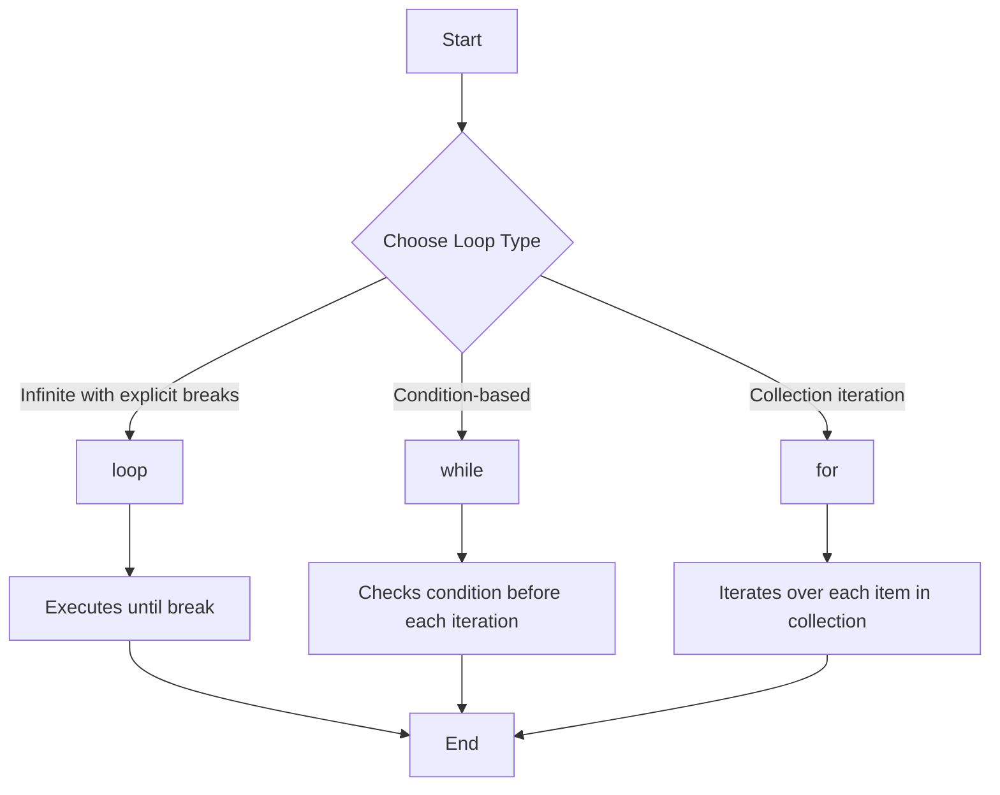

# Rust Loops

## Introduction

Loops are essential control flow structures in programming that allow you to execute a block of code repeatedly. Rust provides several loop constructs that give you precise control over how and when code executes multiple times. This guide will walk you through the different types of loops in Rust, how they work, and when to use each one.

In Rust, there are three main loop constructs:
- `loop`: An infinite loop that runs until explicitly stopped
- `while`: A conditional loop that runs as long as a condition is true
- `for`: A loop that iterates over a collection or range

Each of these loop types has its own strengths and use cases, which we'll explore in this guide.

## The `loop` Statement

The `loop` statement is the simplest form of looping in Rust. It creates an infinite loop that continues until you explicitly break out of it.

### Basic Syntax

```rust
loop {
    // Code to execute repeatedly
    // Use break to exit the loop
}
```

### Example: Simple Counter

```rust
fn main() {
    let mut count = 0;
    
    loop {
        println!("Count: {}", count);
        count += 1;
        
        if count == 5 {
            println!("Breaking out of the loop!");
            break;
        }
    }
}
```

**Output:**
```
Count: 0
Count: 1
Count: 2
Count: 3
Count: 4
Breaking out of the loop!
```

### Returning Values from Loops

A unique feature of Rust's `loop` construct is that it can return a value when it breaks:

```rust
fn main() {
    let mut counter = 0;
    
    let result = loop {
        counter += 1;
        
        if counter == 10 {
            break counter * 2; // Return a value when breaking
        }
    };
    
    println!("The result is: {}", result);
}
```

**Output:**
```
The result is: 20
```

### Nested Loops and Labels

When working with nested loops, you might need to break out of a specific loop. Rust provides loop labels to help with this:

```rust
fn main() {
    'outer: loop {
        println!("Entered the outer loop");
        
        'inner: loop {
            println!("Entered the inner loop");
            
            // This breaks the inner loop
            // break;
            
            // This breaks the outer loop
            break 'outer;
        }
        
        // This point is never reached
        println!("This will never be printed");
    }
    
    println!("Exited the outer loop");
}
```

**Output:**
```
Entered the outer loop
Entered the inner loop
Exited the outer loop
```

## The `while` Loop

The `while` loop executes a block of code as long as a condition remains true. It checks the condition before each iteration.

### Basic Syntax

```rust
while condition {
    // Code to execute while condition is true
}
```

### Example: Countdown

```rust
fn main() {
    let mut number = 5;
    
    while number != 0 {
        println!("{}!", number);
        number -= 1;
    }
    
    println!("Liftoff!");
}
```

**Output:**
```
5!
4!
3!
2!
1!
Liftoff!
```

### When to Use `while` Loops

`while` loops are best used when:
- You don't know exactly how many iterations you need ahead of time
- The loop continuation depends on a condition that might change during execution
- You need to check a condition before performing any iterations

## The `for` Loop

The `for` loop in Rust is used to iterate over elements in a collection (like an array, vector, or range). It's the most commonly used loop for collections.

### Basic Syntax

```rust
for element in collection {
    // Code to execute for each element
}
```

### Example: Iterating Over a Range

```rust
fn main() {
    for number in 1..=5 {
        println!("Number: {}", number);
    }
}
```

**Output:**
```
Number: 1
Number: 2
Number: 3
Number: 4
Number: 5
```

### Example: Iterating Over an Array

```rust
fn main() {
    let animals = ["dog", "cat", "bird", "fish"];
    
    for animal in animals.iter() {
        println!("Animal: {}", animal);
    }
}
```

**Output:**
```
Animal: dog
Animal: cat
Animal: bird
Animal: fish
```

### Using Iterator Methods

Rust's `for` loops leverage the Iterator trait, which provides many useful methods:

```rust
fn main() {
    let numbers = [1, 2, 3, 4, 5];
    
    // Using enumerate() to get both index and value
    for (index, value) in numbers.iter().enumerate() {
        println!("Index: {}, Value: {}", index, value);
    }
}
```

**Output:**
```
Index: 0, Value: 1
Index: 1, Value: 2
Index: 2, Value: 3
Index: 3, Value: 4
Index: 4, Value: 5
```

## Loop Control with `continue` and `break`

Rust provides two keywords to control loop execution:
- `break`: Exits the loop entirely
- `continue`: Skips the rest of the current iteration and moves to the next one

### Example: Using `continue` and `break`

```rust
fn main() {
    for number in 1..=10 {
        // Skip even numbers
        if number % 2 == 0 {
            continue;
        }
        
        println!("Odd number: {}", number);
        
        // Stop after reaching 7
        if number == 7 {
            println!("Breaking the loop at 7");
            break;
        }
    }
}
```

**Output:**
```
Odd number: 1
Odd number: 3
Odd number: 5
Odd number: 7
Breaking the loop at 7
```

## Loop Comparison Flowchart



## Practical Examples

### Example 1: Simple Menu System

```rust
fn main() {
    let mut choice = String::new();
    
    loop {
        println!("
Menu Options:");
        println!("1. Print Hello");
        println!("2. Print Numbers");
        println!("3. Exit");
        println!("Enter your choice (1-3):");
        
        // Reset the choice string
        choice.clear();
        
        // Read user input
        std::io::stdin().read_line(&mut choice)
            .expect("Failed to read input");
        
        // Process the choice
        match choice.trim() {
            "1" => println!("Hello, World!"),
            "2" => {
                for i in 1..=5 {
                    println!("Number: {}", i);
                }
            },
            "3" => {
                println!("Exiting program. Goodbye!");
                break;
            },
            _ => println!("Invalid choice, please try again."),
        }
    }
}
```

### Example 2: Processing File Data

```rust
fn main() {
    // Simulating file data processing
    let data = [
        "Name: John, Age: 30, Active: true",
        "Name: Sarah, Age: 25, Active: true",
        "Name: Mike, Age: 40, Active: false",
        "Name: Lisa, Age: 35, Active: true",
    ];
    
    let mut active_users = 0;
    let mut total_age = 0;
    
    for record in data.iter() {
        // Checking if user is active
        if record.contains("Active: true") {
            active_users += 1;
            
            // Extract age (simple parsing for demonstration)
            if let Some(age_index) = record.find("Age: ") {
                let age_str = &record[age_index + 5..];
                if let Some(end_index) = age_str.find(',') {
                    if let Ok(age) = age_str[..end_index].parse::<i32>() {
                        total_age += age;
                    }
                }
            }
        }
    }
    
    println!("Active users: {}", active_users);
    
    if active_users > 0 {
        println!("Average age of active users: {}", total_age / active_users);
    } else {
        println!("No active users found.");
    }
}
```

**Output:**
```
Active users: 3
Average age of active users: 30
```

## Performance Considerations

When choosing loops in Rust, consider these performance aspects:

1. **`for` loops** with iterators are generally the most optimized, as the Rust compiler can make many safety optimizations.

2. **`while` loops** are great for condition-based looping but may require more bounds checking.

3. **`loop`** has minimal overhead since it doesn't check any conditions, but requires manual breaking logic.

## Summary

Loops are fundamental control flow structures in Rust that allow code to be executed repeatedly:

- **`loop`** creates an infinite loop that continues until explicitly broken, and can return values.
- **`while`** executes a block of code as long as a condition is true, checking before each iteration.
- **`for`** iterates over collections like arrays, vectors, or ranges, and is the most commonly used loop.

Each loop type has specific use cases:
- Use `loop` when you need a loop that might break based on complex conditions.
- Use `while` when you need to check a condition before each iteration.
- Use `for` when iterating over collections or ranges with a known number of elements.

Control flow within loops can be managed with `break` and `continue`, and nested loops can be controlled with labels.

## Exercises

1. Write a program that uses a `for` loop to print the first 10 Fibonacci numbers.
2. Create a program that uses a `while` loop to find the first number divisible by both 3 and 7, starting from 1.
3. Implement a simple guessing game where the user has to guess a number between 1 and 100, using a `loop` to give multiple chances.
4. Write a program that uses nested loops to print a simple pattern of asterisks in the shape of a right triangle.

## Additional Resources

- [The Rust Programming Language Book - Loops](https://doc.rust-lang.org/book/ch03-05-control-flow.html#loops)
- [Rust By Example - Loops](https://doc.rust-lang.org/rust-by-example/flow_control/loop.html)
- [Rust Iterator Documentation](https://doc.rust-lang.org/std/iter/trait.Iterator.html)