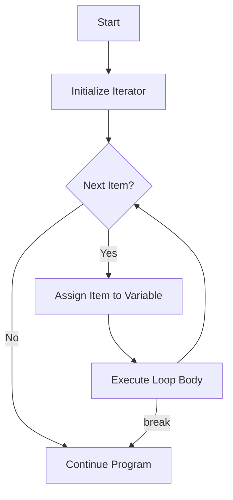

# Rust For Loop

## Introduction

The `for` loop is one of the most commonly used control flow constructs in Rust. It provides a simple and efficient way to iterate over elements in a collection, range, or any other iterable object. Unlike languages like C or Java, Rust's `for` loop is designed specifically for iteration, making it both safer and more concise.

In this tutorial, we'll explore how `for` loops work in Rust, their syntax, common patterns, and practical applications. By the end, you'll be comfortable using `for` loops in your Rust programs.

## Basic Syntax

The basic syntax of a Rust `for` loop is:

```rust
for element in collection {
    // Code to execute for each element
}
```

Where:
- `element` is a variable that will hold each item from the collection, one at a time
- `collection` is any iterable object (array, vector, range, etc.)
- The code block contains the instructions to execute for each element

## Iterating Over Ranges

One of the most common uses of `for` loops is to iterate over a range of numbers.

### Simple Range Example

```rust
fn main() {
    // Iterate over numbers 1 through 5 (inclusive)
    for i in 1..=5 {
        println!("Number: {}", i);
    }
}
```

Output:
```
Number: 1
Number: 2
Number: 3
Number: 4
Number: 5
```

In this example:
- `1..=5` creates an inclusive range from 1 to 5
- The `for` loop iterates over each number in the range
- For each iteration, `i` takes on the current value

### Exclusive Range

If you don't want to include the upper bound, you can use `..` instead of `..=`:

```rust
fn main() {
    // Iterate over numbers 0 through 4 (exclusive of 5)
    for i in 0..5 {
        println!("Index: {}", i);
    }
}
```

Output:
```
Index: 0
Index: 1
Index: 2
Index: 3
Index: 4
```

## Iterating Over Collections

Rust's `for` loops really shine when working with collections like arrays, vectors, and slices.

### Arrays

```rust
fn main() {
    let colors = ["red", "green", "blue", "yellow"];
    
    for color in colors {
        println!("Color: {}", color);
    }
}
```

Output:
```
Color: red
Color: green
Color: blue
Color: yellow
```

### Vectors

```rust
fn main() {
    let numbers = vec![10, 20, 30, 40, 50];
    
    for number in &numbers {
        println!("Number: {}", number);
    }
    
    // The vector is still usable here because we used a reference
    println!("Vector length: {}", numbers.len());
}
```

Output:
```
Number: 10
Number: 20
Number: 30
Number: 40
Number: 50
Vector length: 5
```

Notice that we used `&numbers` to iterate over references to the elements. This keeps ownership of the vector with the `numbers` variable, so we can continue using it after the loop.

## Getting Indices While Iterating

Sometimes you need both the index and the value. Rust provides the `.enumerate()` method for this purpose:

```rust
fn main() {
    let fruits = ["apple", "banana", "cherry", "date"];
    
    for (index, fruit) in fruits.iter().enumerate() {
        println!("Fruit at index {}: {}", index, fruit);
    }
}
```

Output:
```
Fruit at index 0: apple
Fruit at index 1: banana
Fruit at index 2: cherry
Fruit at index 3: date
```

The `enumerate()` method transforms each element into a tuple of `(index, value)`.

## Iterating Over Strings

Iterating over strings in Rust requires special consideration because of how Rust handles Unicode:

```rust
fn main() {
    let message = "Hello, 世界!";
    
    // Iterate over bytes
    println!("Bytes:");
    for byte in message.bytes() {
        print!("{} ", byte);
    }
    println!();
    
    // Iterate over characters (Unicode scalar values)
    println!("Characters:");
    for character in message.chars() {
        print!("{} ", character);
    }
    println!();
}
```

Output:
```
Bytes:
72 101 108 108 111 44 32 228 184 150 231 149 140 33 
Characters:
H e l l o ,   世 界 ! 
```

## Control Flow Within Loops

You can use `continue` and `break` statements to control the flow within a `for` loop:

### Continue

The `continue` statement skips the rest of the current iteration and moves to the next one:

```rust
fn main() {
    for i in 1..=10 {
        if i % 2 == 0 {
            // Skip even numbers
            continue;
        }
        println!("Odd number: {}", i);
    }
}
```

Output:
```
Odd number: 1
Odd number: 3
Odd number: 5
Odd number: 7
Odd number: 9
```

### Break

The `break` statement exits the loop entirely:

```rust
fn main() {
    for i in 1..=100 {
        if i > 5 {
            println!("Stopping at 5");
            break;
        }
        println!("Number: {}", i);
    }
    println!("Loop has ended");
}
```

Output:
```
Number: 1
Number: 2
Number: 3
Number: 4
Number: 5
Stopping at 5
Loop has ended
```

## Returning Values from Loops

While not specific to `for` loops (it's actually more common with `loop`), it's worth noting that Rust allows you to return a value from a loop using `break`:

```rust
fn main() {
    let mut counter = 0;
    
    let result = loop {
        counter += 1;
        
        if counter * 2 > 20 {
            break counter * 2;
        }
    };
    
    println!("Result: {}", result);
}
```

Output:
```
Result: 22
```

This technique is less commonly used with `for` loops but can be useful in some scenarios.

## Patterns and Real-World Examples

Let's look at some practical examples of `for` loops in Rust:

### Example 1: Calculating Sum and Average

```rust
fn main() {
    let grades = [85, 92, 78, 65, 88, 91];
    let mut sum = 0;
    
    for grade in grades {
        sum += grade;
    }
    
    let average = sum as f32 / grades.len() as f32;
    println!("Sum: {}", sum);
    println!("Average: {:.2}", average);
}
```

Output:
```
Sum: 499
Average: 83.17
```

### Example 2: Finding Items in a Collection

```rust
fn main() {
    let inventory = vec!["sword", "shield", "potion", "map", "compass"];
    let item_to_find = "map";
    let mut found = false;
    
    for item in &inventory {
        if item == &item_to_find {
            found = true;
            break;
        }
    }
    
    if found {
        println!("You have a {} in your inventory!", item_to_find);
    } else {
        println!("You don't have a {} in your inventory.", item_to_find);
    }
}
```

Output:
```
You have a map in your inventory!
```

### Example 3: Processing 2D Data

```rust
fn main() {
    let matrix = [
        [1, 2, 3],
        [4, 5, 6],
        [7, 8, 9]
    ];
    
    println!("Matrix elements:");
    for row in &matrix {
        for &element in row {
            print!("{} ", element);
        }
        println!();
    }
    
    println!("
Diagonal elements:");
    for i in 0..matrix.len() {
        print!("{} ", matrix[i][i]);
    }
    println!();
}
```

Output:
```
Matrix elements:
1 2 3 
4 5 6 
7 8 9 

Diagonal elements:
1 5 9 
```

### Example 4: Filtering and Transformation

```rust
fn main() {
    let numbers = vec![1, 2, 3, 4, 5, 6, 7, 8, 9, 10];
    let mut even_squares = Vec::new();
    
    for num in &numbers {
        if num % 2 == 0 {
            even_squares.push(num * num);
        }
    }
    
    println!("Original numbers: {:?}", numbers);
    println!("Squares of even numbers: {:?}", even_squares);
}
```

Output:
```
Original numbers: [1, 2, 3, 4, 5, 6, 7, 8, 9, 10]
Squares of even numbers: [4, 16, 36, 64, 100]
```

## Visual Representation of For Loop Flow

Here's a diagram showing the control flow of a Rust `for` loop:



## Common Patterns and Best Practices

1. **Use references (`&`) to iterate over collections when you don't need ownership:**
   ```rust
   for item in &collection { /* ... */ }
   ```

2. **Use mutable references (`&mut`) when you need to modify collection items:**
   ```rust
   for item in &mut collection { /* ... */ }
   ```

3. **Use `enumerate()` when you need both indices and values:**
   ```rust
   for (index, value) in collection.iter().enumerate() { /* ... */ }
   ```

4. **Prefer `for` loops over `while` loops for iteration** - they're more concise and prevent common errors like off-by-one errors.

5. **Use inclusive ranges (`..=`) when you want to include the upper bound.**

## Common Mistakes

1. **Trying to modify a collection while iterating over it directly** - Rust's ownership system prevents this, which is actually a good thing! Use `&mut` references instead.

2. **Forgetting that ranges with `..` (without `=`) exclude the upper bound.**

3. **Using `.iter()` when iterating over a range** - Ranges are already iterators, so there's no need for `.iter()`.

## Summary

The `for` loop in Rust is a powerful and safe way to iterate over collections and ranges. Let's recap the key points:

- Rust's `for` loops work with any iterable, including ranges, arrays, vectors, and more
- The basic syntax is `for element in collection { /* code */ }`
- You can use ranges (`1..5` or `1..=5`) to iterate over numbers
- Use references (`&` or `&mut`) to avoid transferring ownership during iteration
- The `enumerate()` method gives you both indices and values
- Control flow statements like `continue` and `break` work within `for` loops
- Rust's ownership system ensures safe iteration, preventing common bugs found in other languages

With `for` loops, you can write cleaner, safer, and more idiomatic Rust code. They're an essential tool in every Rust programmer's toolkit.

## Exercises

To practice your understanding of `for` loops in Rust, try these exercises:

1. Write a program that uses a `for` loop to find the sum of all even numbers from 1 to 100.

2. Create a function that takes a vector of integers and returns a new vector containing only the prime numbers from the original vector.

3. Write a program that uses nested `for` loops to print a multiplication table from 1 to 10.

4. Implement a function that takes a string and returns a new string with all vowels removed, using a `for` loop.

5. Write a program that uses a `for` loop with `enumerate()` to find and print the indices of all occurrences of a specific value in a vector.

## Additional Resources

- [The Rust Programming Language Book: Loops](https://doc.rust-lang.org/book/ch03-05-control-flow.html#loops)
- [Rust By Example: For Loops](https://doc.rust-lang.org/rust-by-example/flow_control/for.html)
- [Rust Standard Library: Iterator trait](https://doc.rust-lang.org/std/iter/trait.Iterator.html)