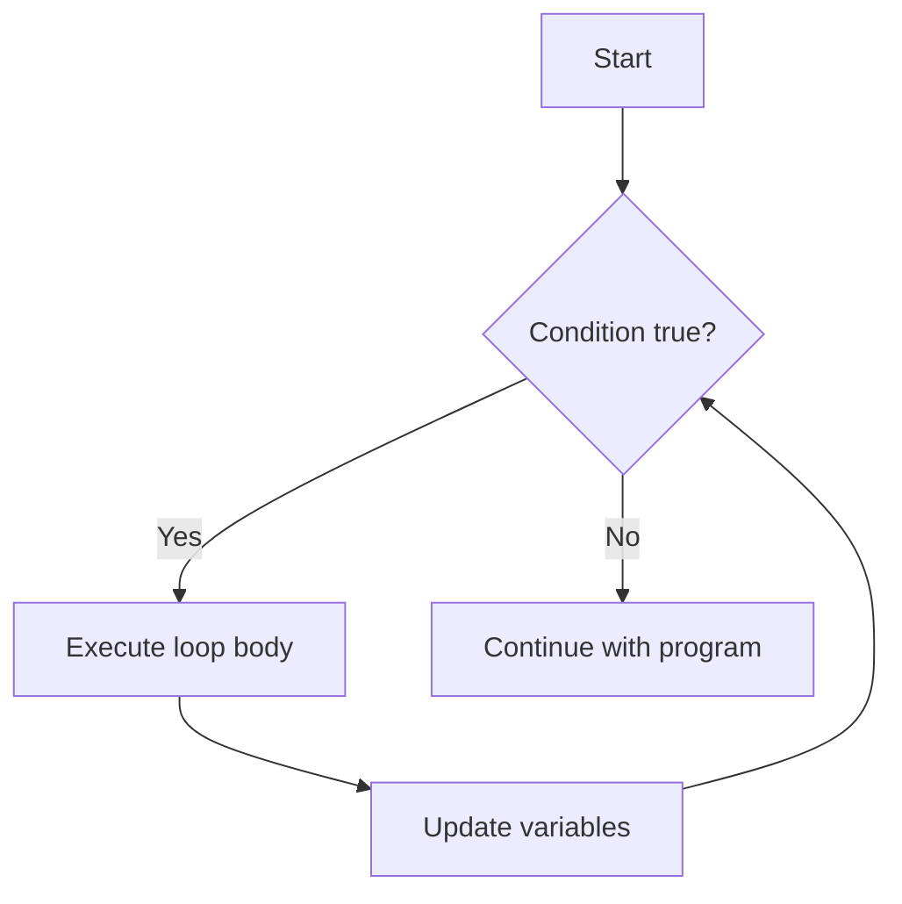

# Rust While Loop

## Introduction

While loops are a fundamental control flow construct in Rust that allow you to execute a block of code repeatedly as long as a specified condition remains true. They are incredibly useful when you need to repeat an action until a certain state is reached, but you don't know in advance exactly how many iterations will be needed.

In this tutorial, we'll explore how while loops work in Rust, when to use them, and look at several practical examples to help solidify your understanding.

## Basic Syntax

The syntax of a while loop in Rust is straightforward:

```rust
while condition {
    // code to execute while condition is true
}
```

The loop begins by evaluating the `condition`. If the condition is `true`, the code inside the loop executes. After execution, the condition is evaluated again. This process repeats until the condition becomes `false`, at which point the program continues with the code after the loop.

Let's look at a simple example:

```rust
fn main() {
    let mut counter = 0;
    
    while counter < 5 {
        println!("Counter value: {}", counter);
        counter += 1;
    }
    
    println!("Loop finished!");
}
```

**Output:**
```
Counter value: 0
Counter value: 1
Counter value: 2
Counter value: 3
Counter value: 4
Loop finished!
```

In this example:
1. We initialize `counter` to 0
2. The while loop checks if `counter` is less than 5
3. If true, it prints the counter value and increments counter by 1
4. The condition is checked again, and the process repeats
5. When `counter` reaches 5, the condition becomes false, and the loop terminates

## The Infinite Loop Problem

One common pitfall with while loops is accidentally creating an infinite loop, where the condition never becomes false. For example:

```rust
fn main() {
    let mut counter = 0;
    
    // This is an infinite loop because counter is never decremented
    while counter >= 0 {
        println!("Counter: {}", counter);
        counter += 1;
    }
}
```

To avoid infinite loops, make sure your loop has:
1. A condition that will eventually become false
2. Code inside the loop that progresses toward making the condition false

## Breaking Out of a While Loop

Sometimes you need to exit a while loop prematurely based on a condition that's separate from the loop's conditional check. Rust provides the `break` keyword for this purpose:

```rust
fn main() {
    let mut counter = 0;
    
    while counter < 100 {
        println!("Counter: {}", counter);
        counter += 1;
        
        // Exit the loop early when counter reaches 5
        if counter == 5 {
            println!("Breaking out of the loop!");
            break;
        }
    }
    
    println!("Loop finished!");
}
```

**Output:**
```
Counter: 0
Counter: 1
Counter: 2
Counter: 3
Counter: 4
Breaking out of the loop!
Loop finished!
```

## Skipping Iterations with Continue

The `continue` keyword allows you to skip the rest of the current iteration and proceed to the next one:

```rust
fn main() {
    let mut counter = 0;
    
    while counter < 10 {
        counter += 1;
        
        // Skip printing for odd numbers
        if counter % 2 != 0 {
            continue;
        }
        
        println!("Even number: {}", counter);
    }
}
```

**Output:**
```
Even number: 2
Even number: 4
Even number: 6
Even number: 8
Even number: 10
```

## While Loop Flow Diagram

Here's a visualization of how a while loop works:



## Practical Examples

### Example 1: User Input Validation

While loops are excellent for input validation, where you need to keep prompting the user until they provide valid input:

```rust
use std::io;

fn main() {
    let mut valid_input = false;
    let mut guess = String::new();
    
    println!("Guess a number between 1 and 10:");
    
    while !valid_input {
        guess.clear();
        io::stdin()
            .read_line(&mut guess)
            .expect("Failed to read line");
            
        let guess: u32 = match guess.trim().parse() {
            Ok(num) => {
                if num >= 1 && num <= 10 {
                    valid_input = true;
                    num
                } else {
                    println!("Please enter a number between 1 and 10:");
                    continue;
                }
            },
            Err(_) => {
                println!("Please enter a valid number:");
                continue;
            }
        };
        
        println!("You guessed: {}", guess);
    }
    
    println!("Thank you for providing a valid input!");
}
```

### Example 2: Processing a Collection Until Empty

While loops are useful when working with collections of unknown size:

```rust
fn main() {
    let mut stack = vec![1, 2, 3, 4, 5];
    
    println!("Processing stack elements:");
    while !stack.is_empty() {
        let item = stack.pop().unwrap();
        println!("Processed item: {}", item);
    }
    
    println!("Stack is now empty!");
}
```

**Output:**
```
Processing stack elements:
Processed item: 5
Processed item: 4
Processed item: 3
Processed item: 2
Processed item: 1
Stack is now empty!
```

### Example 3: Finding a Value in an Array

While loops can be used to search for values in collections:

```rust
fn main() {
    let numbers = [10, 20, 30, 40, 50, 60, 70];
    let target = 50;
    
    let mut index = 0;
    let mut found = false;
    
    while index < numbers.len() {
        if numbers[index] == target {
            found = true;
            break;
        }
        index += 1;
    }
    
    if found {
        println!("Found {} at index {}", target, index);
    } else {
        println!("{} not found in the array", target);
    }
}
```

**Output:**
```
Found 50 at index 4
```

## While vs. For Loops in Rust

In Rust, you often have a choice between using a while loop or a for loop. Here's when to choose each:

**Use a while loop when:**
- The number of iterations is not known in advance
- The loop condition depends on a dynamic value
- You need complex exit conditions
- You're waiting for a specific event or state

**Use a for loop when:**
- Iterating over a collection (array, vector, etc.)
- The number of iterations is known in advance
- You need to iterate a specific number of times

## While Let Construct

Rust provides a convenient syntax called `while let` which combines a while loop with pattern matching:

```rust
fn main() {
    let mut optional = Some(0);
    
    // Continue looping as long as `optional` contains a value
    while let Some(i) = optional {
        if i > 9 {
            println!("Greater than 9, quit!");
            optional = None;
        } else {
            println!("Current value: {}", i);
            optional = Some(i + 1);
        }
    }
}
```

**Output:**
```
Current value: 0
Current value: 1
Current value: 2
Current value: 3
Current value: 4
Current value: 5
Current value: 6
Current value: 7
Current value: 8
Current value: 9
Greater than 9, quit!
```

This construct is particularly useful when working with iterators or Options in Rust.

## Summary

While loops in Rust provide a powerful way to execute code repeatedly based on a condition. Key points to remember:

- The loop continues as long as the condition evaluates to `true`
- Use `break` to exit a loop early
- Use `continue` to skip to the next iteration
- Be careful to avoid creating infinite loops
- The `while let` construct combines loops with pattern matching

While loops are essential tools in any programmer's toolkit, especially when dealing with situations where the number of iterations isn't known beforehand.

## Exercises

1. Write a program that uses a while loop to print the first 10 Fibonacci numbers.
2. Create a number guessing game where the user has to guess a random number between 1 and 100, with the program providing "too high" or "too low" hints.
3. Implement a simple calculator program that continues processing user operations until they enter "quit".
4. Write a program that uses a while loop to reverse a string entered by the user.
5. Create a program that validates a password, ensuring it meets certain criteria (length, contains numbers, special characters, etc.).

## Additional Resources

- [Rust Book: Control Flow](https://doc.rust-lang.org/book/ch03-05-control-flow.html)
- [Rust By Example: Loops](https://doc.rust-lang.org/rust-by-example/flow_control/loop.html)
- [Rust Standard Library Documentation](https://doc.rust-lang.org/std/)

Happy coding with Rust while loops!