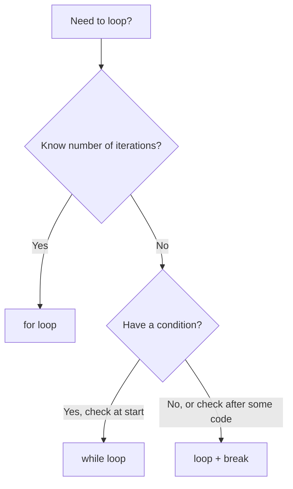

# Rust Loop Keyword

## Introduction

Loops are a fundamental concept in programming that allow you to execute a block of code multiple times. Rust provides several loop constructs that give you precise control over how and when code repeats. The `loop` keyword is one of Rust's basic loop constructs, enabling you to create infinite loops that continue until explicitly stopped.

In this tutorial, we'll explore how the `loop` keyword works in Rust, when to use it, and how it compares to other looping constructs like `while` and `for` loops.

## The Basic `loop` Keyword

The `loop` keyword in Rust creates an infinite loop - a loop that runs continuously until you explicitly tell it to stop. Here's the basic syntax:

```rust
loop {
    // Code to be executed repeatedly
}
```

Without any additional control flow, this creates a loop that runs forever. Let's see a simple example:

```rust
fn main() {
    let mut count = 0;
    
    loop {
        println!("Count: {}", count);
        count += 1;
        
        if count == 5 {
            break; // Exit the loop when count reaches 5
        }
    }
    
    println!("Loop finished!");
}
```

**Output:**
```
Count: 0
Count: 1
Count: 2
Count: 3
Count: 4
Loop finished!
```

In this example, we:
1. Create a mutable variable `count` initialized to 0
2. Start an infinite loop with the `loop` keyword
3. Print the current count and increment it
4. Check if count equals 5, and if so, use the `break` keyword to exit the loop
5. Print a message after the loop ends

## Breaking Out of Loops

As seen in the previous example, the `break` keyword is essential when working with the `loop` construct. Without it, your loop would run indefinitely (or until your program is forcibly terminated).

There are several ways to break out of a loop:

### Simple Break

```rust
loop {
    // Some code
    if some_condition {
        break;
    }
}
```

### Break with a Value

One powerful feature of Rust's `loop` is that it can return a value when it's broken. This is done by adding an expression after the `break` keyword:

```rust
fn main() {
    let mut counter = 0;
    
    let result = loop {
        counter += 1;
        
        if counter == 10 {
            break counter * 2; // Return counter * 2 when breaking
        }
    };
    
    println!("Result: {}", result);
}
```

**Output:**
```
Result: 20
```

This feature is particularly useful for initialization patterns where you might be waiting for a resource to become available.

## The `continue` Keyword

While `break` exits a loop entirely, the `continue` keyword skips the rest of the current iteration and jumps to the next iteration:

```rust
fn main() {
    for i in 0..10 {
        // Skip printing odd numbers
        if i % 2 != 0 {
            continue;
        }
        
        println!("{}", i);
    }
}
```

**Output:**
```
0
2
4
6
8
```

## Nested Loops and Labels

When working with nested loops, you might want to break or continue a specific outer loop from within an inner loop. Rust allows this through loop labels:

```rust
fn main() {
    'outer: loop {
        println!("Entered the outer loop");
        
        'inner: loop {
            println!("Entered the inner loop");
            
            // This breaks the outer loop
            break 'outer;
        }
        
        // This point is never reached
        println!("This won't be printed");
    }
    
    println!("Exited the outer loop");
}
```

**Output:**
```
Entered the outer loop
Entered the inner loop
Exited the outer loop
```

Loop labels start with a single quote (`'`) and are placed before the loop keyword. You can then use these labels with `break` or `continue` to specify which loop you want to affect.

## When to Use the `loop` Keyword

The `loop` keyword is particularly useful in scenarios like:

1. **Waiting for a condition that will eventually occur**, but you're not sure when:
   ```rust
   loop {
       if resource_is_available() {
           break;
       }
       std::thread::sleep(std::time::Duration::from_millis(100));
   }
   ```

2. **Retry mechanisms** where you want to keep trying an operation until it succeeds:
   ```rust
   loop {
       match perform_operation() {
           Ok(result) => break result,
           Err(_) => {
               println!("Operation failed, retrying...");
               std::thread::sleep(std::time::Duration::from_secs(1));
           }
       }
   }
   ```

3. **Game loops** or other scenarios where you want a program to run continuously until a specific exit condition:
   ```rust
   loop {
       process_input();
       update_game_state();
       render();
       
       if should_exit() {
           break;
       }
   }
   ```

## Comparing Loop Types in Rust

Rust provides different types of loops for different scenarios:

### Loop Types Comparison



Let's compare them:

| Loop Type | When to Use | Example |
|-----------|-------------|---------|
| `loop` | When you need an infinite loop with manual breaks | Retry mechanisms, game loops |
| `while` | When you have a condition to check before each iteration | Processing while data is available |
| `for` | When iterating over a collection or a known range | Processing items in an array |

## Practical Examples

### Example 1: User Input Validation

Here's a real-world example of using a loop to validate user input:

```rust
use std::io;

fn main() {
    let mut input = String::new();
    
    let number = loop {
        println!("Please enter a positive number:");
        input.clear();
        
        io::stdin()
            .read_line(&mut input)
            .expect("Failed to read line");
        
        match input.trim().parse::<i32>() {
            Ok(num) if num > 0 => break num,
            Ok(_) => println!("The number must be positive!"),
            Err(_) => println!("That's not a valid number!"),
        }
    };
    
    println!("You entered: {}", number);
}
```

This example continually prompts the user for input until they enter a valid positive number.

### Example 2: A Simple Menu System

This example shows how to create a simple menu-driven application:

```rust
use std::io;

fn main() {
    loop {
        println!("
Menu:");
        println!("1. Say hello");
        println!("2. Calculate square");
        println!("3. Exit");
        println!("Enter your choice:");
        
        let mut input = String::new();
        io::stdin()
            .read_line(&mut input)
            .expect("Failed to read line");
        
        match input.trim() {
            "1" => println!("Hello!"),
            "2" => {
                println!("Enter a number:");
                let mut num_input = String::new();
                io::stdin()
                    .read_line(&mut num_input)
                    .expect("Failed to read line");
                
                match num_input.trim().parse::<i32>() {
                    Ok(num) => println!("Square of {} is {}", num, num * num),
                    Err(_) => println!("That's not a valid number"),
                }
            },
            "3" => {
                println!("Goodbye!");
                break;
            },
            _ => println!("Invalid choice. Please try again."),
        }
    }
}
```

This program shows a menu of options and processes user input accordingly, continuing until the user selects the exit option.

## Summary

The `loop` keyword in Rust provides a powerful way to create loops that run indefinitely until explicitly broken. Key points to remember:

- Use `loop` for situations where you need an infinite loop with manual control over when to exit
- `break` allows you to exit a loop and optionally return a value
- `continue` skips the rest of the current iteration and moves to the next one
- Loop labels let you break or continue specific loops when they're nested
- Rust's `loop` construct pairs well with `match` expressions for error handling and retry logic

The `loop` keyword is just one of several loop constructs in Rust, each with its own use cases and advantages. By understanding when and how to use each one, you can write more efficient and readable code.

## Exercises

1. Write a program that uses a loop to find the first 10 Fibonacci numbers.
2. Create a guessing game that generates a random number and uses a loop to allow the user to keep guessing until they get it right.
3. Implement a simple calculator program that uses a loop to continuously take user input for operations until they choose to exit.

## Additional Resources

- [The Rust Programming Language Book - Loops](https://doc.rust-lang.org/book/ch03-05-control-flow.html#loops)
- [Rust By Example - Loops](https://doc.rust-lang.org/rust-by-example/flow_control/loop.html)
- [Rust Standard Library Documentation](https://doc.rust-lang.org/std/)