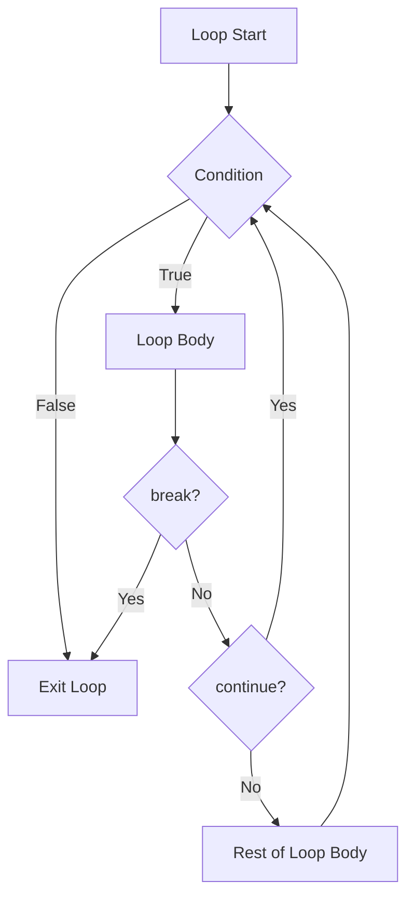

# Rust Break and Continue

In this guide, we'll explore two powerful loop control mechanisms in Rust: `break` and `continue`. These statements give you fine-grained control over loop execution, allowing you to create more efficient and readable code.

## Introduction

When working with loops in Rust, you'll often need to:
- Exit a loop early when a condition is met
- Skip certain iterations and move to the next one

This is where `break` and `continue` statements come in. They are essential tools for controlling the flow of your programs and handling different scenarios within loops.

## The `break` Statement

The `break` statement allows you to exit a loop immediately, regardless of whether the loop condition is still true.

### Basic Usage

```rust
fn main() {
    let mut count = 0;
    
    loop {
        println!("Count: {}", count);
        count += 1;
        
        if count == 5 {
            println!("Breaking the loop!");
            break;
        }
    }
    
    println!("After the loop");
}
```

**Output:**
```
Count: 0
Count: 1
Count: 2
Count: 3
Count: 4
Breaking the loop!
After the loop
```

In this example, the `loop` would run indefinitely, but we use `break` to exit when `count` reaches 5.

### Breaking from Nested Loops

When working with nested loops, `break` only exits the innermost loop by default:

```rust
fn main() {
    for i in 1..=3 {
        println!("Outer loop iteration: {}", i);
        
        for j in 1..=5 {
            println!("  Inner loop iteration: {}", j);
            
            if j == 3 {
                println!("  Breaking inner loop!");
                break;
            }
        }
    }
    
    println!("Both loops finished");
}
```

**Output:**
```
Outer loop iteration: 1
  Inner loop iteration: 1
  Inner loop iteration: 2
  Inner loop iteration: 3
  Breaking inner loop!
Outer loop iteration: 2
  Inner loop iteration: 1
  Inner loop iteration: 2
  Inner loop iteration: 3
  Breaking inner loop!
Outer loop iteration: 3
  Inner loop iteration: 1
  Inner loop iteration: 2
  Inner loop iteration: 3
  Breaking inner loop!
Both loops finished
```

### Loop Labels and Break

Rust allows you to break out of specific nested loops using loop labels:

```rust
fn main() {
    'outer: for i in 1..=3 {
        println!("Outer loop iteration: {}", i);
        
        for j in 1..=5 {
            println!("  Inner loop iteration: {}", j);
            
            if i == 2 && j == 2 {
                println!("  Breaking outer loop!");
                break 'outer;
            }
        }
    }
    
    println!("After all loops");
}
```

**Output:**
```
Outer loop iteration: 1
  Inner loop iteration: 1
  Inner loop iteration: 2
  Inner loop iteration: 3
  Inner loop iteration: 4
  Inner loop iteration: 5
Outer loop iteration: 2
  Inner loop iteration: 1
  Inner loop iteration: 2
  Breaking outer loop!
After all loops
```

In this example, we use `'outer` as a label for the outer loop and `break 'outer` to exit both loops at once.

### Returning Values with Break

In Rust, you can return a value from a loop using `break`:

```rust
fn main() {
    let mut counter = 0;
    
    let result = loop {
        counter += 1;
        
        if counter == 10 {
            break counter * 2;
        }
    };
    
    println!("Result: {}", result);
}
```

**Output:**
```
Result: 20
```

The value following `break` (in this case `counter * 2`) becomes the value of the entire loop expression.

## The `continue` Statement

The `continue` statement skips the rest of the current iteration and jumps to the next iteration of the loop.

### Basic Usage

```rust
fn main() {
    for i in 1..=10 {
        if i % 2 == 0 {
            continue; // Skip even numbers
        }
        
        println!("Odd number: {}", i);
    }
}
```

**Output:**
```
Odd number: 1
Odd number: 3
Odd number: 5
Odd number: 7
Odd number: 9
```

In this example, we use `continue` to skip printing even numbers and only print odd numbers.

### Continue in Nested Loops

Similar to `break`, `continue` affects only the innermost loop by default:

```rust
fn main() {
    for i in 1..=3 {
        println!("Outer loop iteration: {}", i);
        
        for j in 1..=5 {
            if j % 2 == 0 {
                println!("  Skipping even j: {}", j);
                continue;
            }
            
            println!("  Processing: i={}, j={}", i, j);
        }
    }
}
```

**Output:**
```
Outer loop iteration: 1
  Processing: i=1, j=1
  Skipping even j: 2
  Processing: i=1, j=3
  Skipping even j: 4
  Processing: i=1, j=5
Outer loop iteration: 2
  Processing: i=2, j=1
  Skipping even j: 2
  Processing: i=2, j=3
  Skipping even j: 4
  Processing: i=2, j=5
Outer loop iteration: 3
  Processing: i=3, j=1
  Skipping even j: 2
  Processing: i=3, j=3
  Skipping even j: 4
  Processing: i=3, j=5
```

### Loop Labels and Continue

Just like with `break`, you can use labels with `continue` to specify which loop to continue:

```rust
fn main() {
    'outer: for i in 1..=3 {
        println!("Outer loop iteration: {}", i);
        
        for j in 1..=5 {
            if j > 3 {
                println!("  j > 3, continuing outer loop");
                continue 'outer;
            }
            
            println!("  Processing: i={}, j={}", i, j);
        }
        
        println!("End of outer iteration {}", i);
    }
}
```

**Output:**
```
Outer loop iteration: 1
  Processing: i=1, j=1
  Processing: i=1, j=2
  Processing: i=1, j=3
  j > 3, continuing outer loop
Outer loop iteration: 2
  Processing: i=2, j=1
  Processing: i=2, j=2
  Processing: i=2, j=3
  j > 3, continuing outer loop
Outer loop iteration: 3
  Processing: i=3, j=1
  Processing: i=3, j=2
  Processing: i=3, j=3
  j > 3, continuing outer loop
```

In this example, when `j` exceeds 3, we skip the rest of the inner loop *and* the rest of the current iteration of the outer loop.

## Practical Examples

### Example 1: Finding the First Prime Number in a Range

```rust
fn is_prime(n: u32) -> bool {
    if n <= 1 {
        return false;
    }
    
    for i in 2..=(n as f64).sqrt() as u32 {
        if n % i == 0 {
            return false;
        }
    }
    
    true
}

fn main() {
    let range_start = 1000;
    let range_end = 1100;
    
    let mut first_prime = None;
    
    for num in range_start..=range_end {
        if is_prime(num) {
            first_prime = Some(num);
            break;
        }
    }
    
    match first_prime {
        Some(p) => println!("First prime in range: {}", p),
        None => println!("No primes in the specified range"),
    }
}
```

**Output:**
```
First prime in range: 1009
```

This example uses `break` to stop searching once we find the first prime number in a range.

### Example 2: Processing Data with Exceptions

```rust
fn main() {
    let data = [1, -3, 5, 0, 7, -2, 9, 11];
    let mut sum = 0;
    
    println!("Processing array: {:?}", data);
    
    for item in data {
        // Skip negative numbers
        if item < 0 {
            println!("Skipping negative value: {}", item);
            continue;
        }
        
        // Stop if we encounter zero
        if item == 0 {
            println!("Found zero, stopping calculation");
            break;
        }
        
        sum += item;
        println!("Added {} to sum, current sum = {}", item, sum);
    }
    
    println!("Final sum: {}", sum);
}
```

**Output:**
```
Processing array: [1, -3, 5, 0, 7, -2, 9, 11]
Added 1 to sum, current sum = 1
Skipping negative value: -3
Added 5 to sum, current sum = 6
Found zero, stopping calculation
Final sum: 6
```

This example uses both `continue` to skip negative values and `break` to stop processing when we encounter a zero.

### Example 3: User Input Validation Loop

```rust
use std::io::{self, Write};

fn main() {
    let mut valid_number = None;
    
    loop {
        print!("Enter a positive number (or 'q' to quit): ");
        io::stdout().flush().unwrap();
        
        let mut input = String::new();
        io::stdin().read_line(&mut input).expect("Failed to read line");
        
        let input = input.trim();
        
        if input.eq_ignore_ascii_case("q") {
            println!("Quitting without a valid number");
            break;
        }
        
        match input.parse::<i32>() {
            Ok(num) if num > 0 => {
                println!("Valid number: {}", num);
                valid_number = Some(num);
                break;
            }
            Ok(num) => {
                println!("Number must be positive, try again");
                continue;
            }
            Err(_) => {
                println!("Not a valid number, try again");
                continue;
            }
        }
    }
    
    if let Some(num) = valid_number {
        println!("You entered: {}", num);
    }
}
```

This interactive example shows how to use `break` and `continue` in an input validation loop, only exiting when the user provides a valid positive number or chooses to quit.

## Visual Representation of Control Flow

The following diagram shows how `break` and `continue` affect the control flow in loops:



## Best Practices

1. **Use `break` and `continue` purposefully**: These statements can make your code harder to follow if overused. Use them when they genuinely simplify your logic.

2. **Consider extracting complex conditions**: If your break or continue conditions are complex, consider extracting them into named functions for clarity.

3. **Label your loops**: When working with nested loops, use labels to make it clear which loop you're controlling.

4. **Document the exit conditions**: Comment on non-obvious break conditions to help readers understand when and why a loop might exit early.

5. **Avoid deep nesting**: If you find yourself using many levels of nested loops with complex break/continue logic, consider restructuring your code.

## Summary

`break` and `continue` are powerful tools in Rust's control flow arsenal:

- **`break`** terminates a loop early and can optionally return a value
- **`continue`** skips to the next iteration of a loop
- Both can be used with labels to target specific loops in nested structures

These statements allow you to create more efficient loops by avoiding unnecessary iterations and handling exceptions elegantly.

## Exercises

1. Write a program that finds the first three prime numbers greater than 100 using `break` and `continue`.

2. Create a nested loop structure that prints a multiplication table for numbers 1-5, but skips multiplications where either number is 3.

3. Implement a function that takes an array of integers and returns the sum of all positive numbers up to the first occurrence of zero (or the entire array if there is no zero).

4. Write a program that processes user input until they enter "exit", but allows them to skip operations by typing "skip".

## Additional Resources

- [The Rust Programming Language Book - Control Flow section](https://doc.rust-lang.org/book/ch03-05-control-flow.html)
- [Rust By Example - Flow of Control](https://doc.rust-lang.org/rust-by-example/flow_control.html)
- [Rust Standard Library Documentation](https://doc.rust-lang.org/std/)