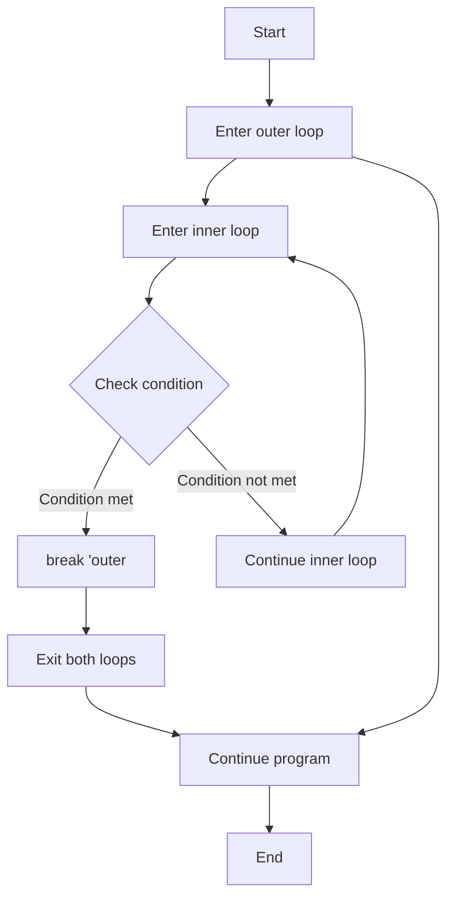

# Rust Loop Labels

## Introduction

When working with nested loops in Rust, you might sometimes need to break or continue an outer loop from within an inner loop. This is where **loop labels** come in handy. Loop labels allow you to specify which loop you want to affect when using `break` or `continue` statements, giving you finer control over your program's flow.

In this tutorial, we'll explore how loop labels work in Rust, when to use them, and how they can make your code more readable and efficient.

## What Are Loop Labels?

A loop label is a name you give to a loop that you can reference later in your code. In Rust, you can label any loop construct (`loop`, `while`, or `for`) by prefixing it with a name followed by a colon:

```rust
'outer_loop: for i in 1..6 {
    // Loop body
}
```

The label name follows Rust's identifier rules and is prefixed with a single quote (`'`).

## Basic Loop Label Syntax

Here's the general syntax for creating a labeled loop:

```rust
'label_name: loop {
    // Loop body
}
```

For `while` and `for` loops:

```rust
'label_name: while condition {
    // Loop body
}

'label_name: for item in collection {
    // Loop body
}
```

## Breaking from Nested Loops

One of the most common use cases for loop labels is to break out of multiple nested loops at once. Let's look at an example:

```rust
fn main() {
    let mut count = 0;
    
    'outer: for i in 1..6 {
        println!("Outer loop iteration {}", i);
        
        for j in 1..6 {
            println!("  Inner loop iteration {}", j);
            count += 1;
            
            if count > 10 {
                println!("  Count exceeded 10, breaking outer loop!");
                break 'outer; // This breaks the outer loop
            }
        }
    }
    
    println!("Final count: {}", count);
}
```

**Output:**
```
Outer loop iteration 1
  Inner loop iteration 1
  Inner loop iteration 2
  Inner loop iteration 3
  Inner loop iteration 4
  Inner loop iteration 5
Outer loop iteration 2
  Inner loop iteration 1
  Inner loop iteration 2
  Inner loop iteration 3
  Inner loop iteration 4
  Inner loop iteration 5
Outer loop iteration 3
  Inner loop iteration 1
  Count exceeded 10, breaking outer loop!
Final count: 11
```

In this example, we have two nested loops. The outer loop is labeled `'outer`. Inside the inner loop, when the count exceeds 10, we use `break 'outer;` to break out of the outer loop completely, skipping the remaining iterations of both the inner and outer loops.

## Using Continue with Labels

Similarly, you can use `continue` with a label to skip the current iteration of an outer loop:

```rust
fn main() {
    'outer: for i in 1..4 {
        println!("Outer loop iteration {}", i);
        
        for j in 1..4 {
            if j == 2 {
                println!("  j is 2, continuing outer loop");
                continue 'outer; // Skip to the next iteration of the outer loop
            }
            println!("  Inner loop iteration {}", j);
        }
        
        println!("End of outer loop iteration {}", i);
    }
}
```

**Output:**
```
Outer loop iteration 1
  Inner loop iteration 1
  j is 2, continuing outer loop
Outer loop iteration 2
  Inner loop iteration 1
  j is 2, continuing outer loop
Outer loop iteration 3
  Inner loop iteration 1
  j is 2, continuing outer loop
```

In this example, when `j` equals 2, we use `continue 'outer;` to skip the rest of the inner loop and continue with the next iteration of the outer loop.

## Multiple Nested Loops

Loop labels are especially useful with multiple levels of nesting. Here's an example with three nested loops:

```rust
fn main() {
    'outer: for i in 1..4 {
        println!("Outer loop (i={})", i);
        
        'middle: for j in 1..4 {
            println!("  Middle loop (j={})", j);
            
            for k in 1..4 {
                println!("    Inner loop (k={})", k);
                
                if i == 2 && j == 2 && k == 2 {
                    println!("    Breaking middle loop");
                    break 'middle;
                }
                
                if i == 3 && k == 2 {
                    println!("    Breaking outer loop");
                    break 'outer;
                }
            }
        }
    }
    
    println!("Loop completed");
}
```

In this example, we have labels for both the outer and middle loops, allowing us to break out of either one depending on the condition.

## Real-World Example: Finding an Element in a 2D Grid

Let's look at a practical example where loop labels are useful. Imagine we're searching for a specific element in a 2D grid:

```rust
fn main() {
    let grid = [
        [1, 2, 3],
        [4, 5, 6],
        [7, 8, 9],
    ];
    
    let target = 5;
    let mut found = false;
    let mut position = (0, 0);
    
    'search: for (i, row) in grid.iter().enumerate() {
        for (j, &value) in row.iter().enumerate() {
            if value == target {
                found = true;
                position = (i, j);
                break 'search;
            }
        }
    }
    
    if found {
        println!("Found {} at position ({}, {})", target, position.0, position.1);
    } else {
        println!("{} not found in the grid", target);
    }
}
```

**Output:**
```
Found 5 at position (1, 1)
```

In this example, we're searching through a 2D grid for a specific number. Once we find it, we use `break 'search;` to exit both loops immediately, which is more efficient than setting a flag and checking it in each loop.

## When to Use Loop Labels

Loop labels are powerful but should be used judiciously. Here are some scenarios where they make sense:

1. **Early termination**: When you need to exit multiple loops at once upon finding a result
2. **Skipping iterations**: When you want to restart an outer loop based on a condition in an inner loop
3. **Complex control flow**: When dealing with nested searches or multi-level data structures
4. **Optimizing performance**: When continuing computation after finding a result would be wasteful

## Loop Labels vs. Other Approaches

There are alternative ways to handle nested loop control flow:

```rust
fn main() {
    // Using loop labels
    'outer: for i in 1..5 {
        for j in 1..5 {
            if i * j > 10 {
                break 'outer;
            }
            println!("{} * {} = {}", i, j, i * j);
        }
    }
    
    println!("With loop labels");
    
    // Using a flag
    let mut should_break = false;
    for i in 1..5 {
        for j in 1..5 {
            if i * j > 10 {
                should_break = true;
                break;
            }
            println!("{} * {} = {}", i, j, i * j);
        }
        if should_break {
            break;
        }
    }
    
    println!("With a flag");
    
    // Using a function
    fn multiplication_table() {
        for i in 1..5 {
            for j in 1..5 {
                if i * j > 10 {
                    return;
                }
                println!("{} * {} = {}", i, j, i * j);
            }
        }
    }
    
    multiplication_table();
    println!("With a function");
}
```

Each approach has its merits, but loop labels often lead to clearer code when the control flow logic is straightforward.

## Control Flow Visualization

Here's a diagram showing how loop labels affect the flow of a program:



## Summary

Loop labels in Rust provide a powerful way to control the flow of nested loops:

- Loop labels are created by prefixing a loop with a name and a colon: `'label_name: loop { ... }`
- You can use `break 'label_name;` to exit a labeled loop from within a nested loop
- You can use `continue 'label_name;` to skip to the next iteration of a labeled loop
- Loop labels are particularly useful for early termination, optimizing searches, and simplifying control flow in nested structures

The ability to break out of specific loops gives you precise control over your program's execution, making your code more efficient and often more readable when dealing with complex looping structures.

## Exercises

1. Write a program that uses loop labels to print a multiplication table for numbers 1 through 5, but stops when the product exceeds 20.

2. Create a program that searches for the first prime number in a 2D array using loop labels.

3. Implement a nested loop structure with at least three levels of nesting, using loop labels to control the flow between them.

## Additional Resources

- [Rust Book: Loop Labels](https://doc.rust-lang.org/book/ch03-05-control-flow.html#loop-labels-to-disambiguate-between-multiple-loops)
- [Rust By Example: Nested Loops](https://doc.rust-lang.org/rust-by-example/flow_control/loop/nested.html)
- [Rust Language Forum](https://users.rust-lang.org/) - A great place to ask questions about complex control flow scenarios

Happy coding with Rust loop labels!