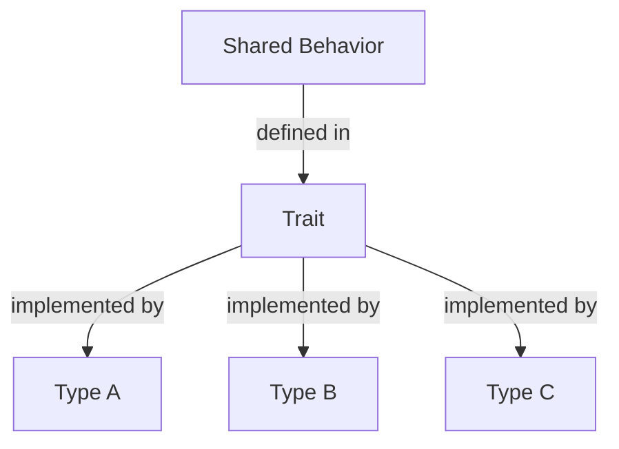

# Rust Traits Basics

## Introduction

Traits are one of Rust's most powerful features, similar to interfaces in other programming languages. They allow you to define shared behavior across different types in an abstract way. Think of traits as a contract that types can implement, promising to provide certain functionality.

In this tutorial, we'll learn:
- What traits are and why they're useful
- How to define and implement traits
- How to use trait bounds in functions
- How to work with default trait methods
- Practical examples of traits in real-world code

## What are Traits?

A trait tells the Rust compiler about functionality a particular type has and can share with other types. We use traits to define shared behavior in an abstract way.

Let's visualize how traits work:



## Defining a Trait

To define a trait, we use the `trait` keyword followed by the trait name and a block containing method signatures.

```rust
trait Summary {
    fn summarize(&self) -> String;
}
```

In this example, we've defined a trait called `Summary` with one method: `summarize`. Any type that implements this trait must provide an implementation for this method.

## Implementing a Trait

To implement a trait for a type, we use the `impl TraitName for TypeName` syntax.

Let's create a few types and implement our `Summary` trait for them:

```rust
// Define some types
struct NewsArticle {
    headline: String,
    location: String,
    author: String,
    content: String,
}

struct Tweet {
    username: String,
    content: String,
    reply: bool,
    retweet: bool,
}

// Implement the Summary trait for NewsArticle
impl Summary for NewsArticle {
    fn summarize(&self) -> String {
        format!("{}, by {} ({})", self.headline, self.author, self.location)
    }
}

// Implement the Summary trait for Tweet
impl Summary for Tweet {
    fn summarize(&self) -> String {
        format!("{}: {}", self.username, self.content)
    }
}
```

Now we can call the `summarize` method on instances of both `NewsArticle` and `Tweet`:

```rust
fn main() {
    let article = NewsArticle {
        headline: String::from("Rust 1.68 Released"),
        location: String::from("San Francisco"),
        author: String::from("Rust Team"),
        content: String::from("The Rust Team is excited to announce..."),
    };

    let tweet = Tweet {
        username: String::from("rustlang"),
        content: String::from("Just released a new version!"),
        reply: false,
        retweet: false,
    };

    println!("Article summary: {}", article.summarize());
    println!("Tweet summary: {}", tweet.summarize());
}
```

**Output:**
```
Article summary: Rust 1.68 Released, by Rust Team (San Francisco)
Tweet summary: rustlang: Just released a new version!
```

## Default Implementations

Sometimes it makes sense to provide a default implementation for a trait method. Types can either use this default implementation or override it with their own.

```rust
trait Summary {
    fn summarize(&self) -> String {
        String::from("(Read more...)")
    }
    
    fn summarize_author(&self) -> String;
}

impl Summary for NewsArticle {
    fn summarize_author(&self) -> String {
        format!("Author: {}", self.author)
    }
    // We're using the default implementation for summarize
}

impl Summary for Tweet {
    fn summarize(&self) -> String {
        format!("{}: {}", self.username, self.content)
    }
    
    fn summarize_author(&self) -> String {
        format!("@{}", self.username)
    }
}
```

Now if we call `summarize()` on a `NewsArticle`, it will use the default implementation, while a `Tweet` will use its custom implementation.

## Traits as Parameters

One of the most powerful aspects of traits is using them as function parameters. This allows a function to accept any type that implements a specific trait.

```rust
// This function can take any type that implements the Summary trait
fn notify(item: &impl Summary) {
    println!("Breaking news! {}", item.summarize());
}

fn main() {
    let article = NewsArticle {
        headline: String::from("Rust 1.68 Released"),
        location: String::from("San Francisco"),
        author: String::from("Rust Team"),
        content: String::from("The Rust Team is excited to announce..."),
    };
    
    notify(&article); // This works!
    
    let tweet = Tweet {
        username: String::from("rustlang"),
        content: String::from("Just released a new version!"),
        reply: false,
        retweet: false,
    };
    
    notify(&tweet); // This works too!
}
```

## Trait Bounds

The `impl Trait` syntax is actually syntax sugar for a longer form known as a trait bound:

```rust
fn notify<T: Summary>(item: &T) {
    println!("Breaking news! {}", item.summarize());
}
```

This is equivalent to the previous example but uses generic type parameters with trait bounds. The longer form gives more flexibility when dealing with multiple parameters.

### Multiple Trait Bounds

You can specify that a parameter must implement multiple traits using the `+` syntax:

```rust
use std::fmt::Display;

fn notify<T: Summary + Display>(item: &T) {
    println!("Breaking news! {}", item.summarize());
    println!("Display: {}", item);
}
```

Now the function will only accept types that implement both the `Summary` and `Display` traits.

## Returning Types that Implement Traits

You can also use trait bounds to specify that a function returns a type that implements a trait:

```rust
fn returns_summarizable() -> impl Summary {
    Tweet {
        username: String::from("rustlang"),
        content: String::from("Just released a new version!"),
        reply: false,
        retweet: false,
    }
}
```

This is particularly useful when returning complex types or when you want to hide the concrete type being returned.

## Real-world Example: Creating a Shape Trait

Let's build a more practical example by creating a system for calculating areas of different shapes:

```rust
trait Shape {
    fn area(&self) -> f64;
    fn name(&self) -> &str;
    fn describe(&self) -> String {
        format!("This {} has an area of {:.2} square units.", self.name(), self.area())
    }
}

struct Circle {
    radius: f64,
}

struct Rectangle {
    width: f64,
    height: f64,
}

impl Shape for Circle {
    fn area(&self) -> f64 {
        std::f64::consts::PI * self.radius * self.radius
    }
    
    fn name(&self) -> &str {
        "circle"
    }
}

impl Shape for Rectangle {
    fn area(&self) -> f64 {
        self.width * self.height
    }
    
    fn name(&self) -> &str {
        "rectangle"
    }
}

fn main() {
    let shapes: Vec<Box<dyn Shape>> = vec![
        Box::new(Circle { radius: 5.0 }),
        Box::new(Rectangle { width: 4.0, height: 6.0 }),
    ];
    
    for shape in shapes {
        println!("{}", shape.describe());
    }
}
```

**Output:**
```
This circle has an area of 78.54 square units.
This rectangle has an area of 24.00 square units.
```

In this example, we:
1. Define a `Shape` trait with methods for calculating area and describing the shape
2. Implement the trait for different shape types
3. Store different shapes in a vector of trait objects
4. Process shapes polymorphically using their trait methods

## Summary

Traits are a fundamental concept in Rust that enable polymorphism and code reuse. In this tutorial, we've learned:

- How to define traits using the `trait` keyword
- How to implement traits for specific types
- How to provide default implementations for trait methods
- How to use trait bounds to constrain generic types
- How to return types that implement traits
- How to use traits for polymorphism in real-world scenarios

Traits provide the foundation for much of Rust's type system and enable writing flexible, reusable code while maintaining Rust's strong type safety guarantees.

## Additional Resources and Exercises

### Resources
- [Rust Book: Traits Chapter](https://doc.rust-lang.org/book/ch10-02-traits.html)
- [Rust by Example: Traits](https://doc.rust-lang.org/rust-by-example/trait.html)

### Exercises

1. **Basic Trait Implementation**:
   Create a `Printable` trait with a method `to_string` that returns a String representation. Implement it for at least three different types.

2. **Extending Standard Library Types**:
   Create a `WordCount` trait with a method that counts words. Implement it for Rust's standard `String` type.

3. **Multiple Trait Bounds**:
   Write a function that accepts a parameter that implements both `Display` and `Debug` traits, and prints the value using both implementations.

4. **Advanced Shape System**:
   Extend the Shape example by adding more shapes (Triangle, Square) and additional methods like `perimeter()`.