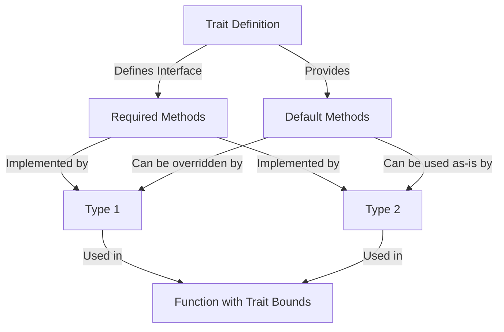

# Rust Trait Methods

## Introduction

In Rust, traits are a powerful feature that define shared behavior between types. One of the most useful aspects of traits is the ability to define **trait methods** - functions that are associated with the trait and can be implemented by any type that adopts that trait. These methods allow you to create consistent interfaces across different types while enabling code reuse and polymorphism.

In this tutorial, we'll explore how trait methods work in Rust, including:

- Basic trait method definitions
- Default method implementations
- Overriding default implementations
- Associated functions in traits
- Using trait methods in practice

By the end of this guide, you'll understand how to define, implement, and use trait methods effectively in your Rust programs.

## Basic Trait Methods

Let's start with a simple example to understand how trait methods work. We'll create a `Shape` trait with methods that any shape should implement:

```rust
trait Shape {
    // Method that requires implementation
    fn area(&self) -> f64;
    
    // Method that requires implementation
    fn perimeter(&self) -> f64;
}
```

In this example, the `Shape` trait defines two methods: `area()` and `perimeter()`. Any type that wants to implement the `Shape` trait must provide implementations for both of these methods.

Now, let's implement this trait for a `Circle` and a `Rectangle` type:

```rust
struct Circle {
    radius: f64,
}

struct Rectangle {
    width: f64,
    height: f64,
}

impl Shape for Circle {
    fn area(&self) -> f64 {
        std::f64::consts::PI * self.radius * self.radius
    }
    
    fn perimeter(&self) -> f64 {
        2.0 * std::f64::consts::PI * self.radius
    }
}

impl Shape for Rectangle {
    fn area(&self) -> f64 {
        self.width * self.height
    }
    
    fn perimeter(&self) -> f64 {
        2.0 * (self.width + self.height)
    }
}
```

Now we can use these methods on instances of both types:

```rust
fn main() {
    let circle = Circle { radius: 5.0 };
    let rectangle = Rectangle { width: 4.0, height: 3.0 };
    
    println!("Circle area: {}", circle.area());         // Output: Circle area: 78.53981633974483
    println!("Circle perimeter: {}", circle.perimeter()); // Output: Circle perimeter: 31.41592653589793
    
    println!("Rectangle area: {}", rectangle.area());     // Output: Rectangle area: 12.0
    println!("Rectangle perimeter: {}", rectangle.perimeter()); // Output: Rectangle perimeter: 14.0
}
```

## Default Method Implementations

Rust allows you to provide default implementations for trait methods. This is powerful because:

1. It reduces code duplication
2. It lets types implement the trait with minimal code
3. It allows for behavior extensions without breaking existing code

Let's extend our example with a default method:

```rust
trait Shape {
    // Methods that still require implementation
    fn area(&self) -> f64;
    fn perimeter(&self) -> f64;
    
    // Method with a default implementation
    fn describe(&self) -> String {
        String::from("This is a shape")
    }
}
```

Now, types that implement `Shape` don't need to implement `describe()` unless they want to override the default behavior:

```rust
impl Shape for Circle {
    fn area(&self) -> f64 {
        std::f64::consts::PI * self.radius * self.radius
    }
    
    fn perimeter(&self) -> f64 {
        2.0 * std::f64::consts::PI * self.radius
    }
    
    // Overriding the default behavior
    fn describe(&self) -> String {
        format!("This is a circle with radius {}", self.radius)
    }
}

impl Shape for Rectangle {
    fn area(&self) -> f64 {
        self.width * self.height
    }
    
    fn perimeter(&self) -> f64 {
        2.0 * (self.width + self.height)
    }
    
    // Using the default implementation (no override)
}
```

When we use these methods:

```rust
fn main() {
    let circle = Circle { radius: 5.0 };
    let rectangle = Rectangle { width: 4.0, height: 3.0 };
    
    println!("{}", circle.describe());    // Output: This is a circle with radius 5
    println!("{}", rectangle.describe()); // Output: This is a shape
}
```

### Default Methods Using Other Methods

Default methods can also call other methods in the same trait, even required ones. This allows for derived behavior based on core functionality:

```rust
trait Shape {
    fn area(&self) -> f64;
    fn perimeter(&self) -> f64;
    
    // Default method that uses other methods from the trait
    fn info(&self) -> String {
        format!("Area: {}, Perimeter: {}", self.area(), self.perimeter())
    }
}
```

When we use this method on our shapes:

```rust
fn main() {
    let circle = Circle { radius: 5.0 };
    let rectangle = Rectangle { width: 4.0, height: 3.0 };
    
    println!("Circle info: {}", circle.info());     
    // Output: Circle info: Area: 78.53981633974483, Perimeter: 31.41592653589793
    
    println!("Rectangle info: {}", rectangle.info());
    // Output: Rectangle info: Area: 12.0, Perimeter: 14.0
}
```

## Associated Functions in Traits

In addition to methods that take `&self` as their first parameter, traits can also define **associated functions** that don't take `self` as a parameter. These are similar to static methods in other languages and are called using the `::` syntax.

```rust
trait Shape {
    fn area(&self) -> f64;
    fn perimeter(&self) -> f64;
    
    // Associated function (doesn't take self)
    fn name() -> &'static str {
        "Generic Shape"
    }
}

impl Shape for Circle {
    // ... previous implementations ...
    
    // Override the associated function
    fn name() -> &'static str {
        "Circle"
    }
}

impl Shape for Rectangle {
    // ... previous implementations ...
    
    fn name() -> &'static str {
        "Rectangle"
    }
}
```

To call associated functions, we use the type name along with the trait:

```rust
fn main() {
    println!("Shape name: {}", Circle::name());    // Output: Shape name: Circle
    println!("Shape name: {}", Rectangle::name()); // Output: Shape name: Rectangle
}
```

For associated functions with default implementations, we need to specify which trait's function we're calling:

```rust
fn main() {
    // This won't work if there are multiple traits with 'name' function
    // println!("Shape name: {}", Circle::name());
    
    // This is the correct way:
    println!("Shape name: {}", <Circle as Shape>::name());    // Output: Shape name: Circle
    println!("Shape name: {}", <Rectangle as Shape>::name()); // Output: Shape name: Rectangle
}
```

## Practical Example: Document Processing

Let's explore a more practical example where trait methods are useful. We'll create a document processing system:

```rust
trait Document {
    fn content(&self) -> &str;
    
    // Default method that counts words
    fn word_count(&self) -> usize {
        self.content().split_whitespace().count()
    }
    
    // Default method that counts characters
    fn char_count(&self) -> usize {
        self.content().chars().count()
    }
    
    // Default method that prints a summary
    fn summarize(&self) -> String {
        format!("Document with {} words and {} characters", 
                self.word_count(), self.char_count())
    }
}

struct Article {
    title: String,
    author: String,
    text: String,
}

struct Email {
    sender: String,
    recipient: String,
    message: String,
}

impl Document for Article {
    fn content(&self) -> &str {
        &self.text
    }
    
    // Customize the summary for articles
    fn summarize(&self) -> String {
        format!("Article '{}' by {}: {} words", 
                self.title, self.author, self.word_count())
    }
}

impl Document for Email {
    fn content(&self) -> &str {
        &self.message
    }
}
```

Now we can use these methods:

```rust
fn main() {
    let article = Article {
        title: String::from("Rust Traits"),
        author: String::from("Rust Enthusiast"),
        text: String::from("Rust traits are a powerful feature for defining shared behavior between types.")
    };
    
    let email = Email {
        sender: String::from("sender@example.com"),
        recipient: String::from("recipient@example.com"),
        message: String::from("Hello! Just checking in about our meeting tomorrow.")
    };
    
    println!("{}", article.summarize());  
    // Output: Article 'Rust Traits' by Rust Enthusiast: 12 words
    
    println!("{}", email.summarize());    
    // Output: Document with 8 words and 50 characters
    
    println!("Email word count: {}", email.word_count());  
    // Output: Email word count: 8
}
```

## Working with Trait Methods in Functions

One of the most powerful aspects of traits is the ability to use them for polymorphism. We can write functions that accept any type that implements a particular trait:

```rust
fn process_document(doc: &impl Document) {
    println!("Processing document: {}", doc.summarize());
    println!("Word count: {}", doc.word_count());
    println!("Character count: {}", doc.char_count());
}

// Alternatively, using trait bounds:
fn analyze_document<T: Document>(doc: &T) {
    println!("Analysis: {}", doc.summarize());
}
```

This allows us to work with different types in a unified way:

```rust
fn main() {
    let article = Article {
        title: String::from("Rust Traits"),
        author: String::from("Rust Enthusiast"),
        text: String::from("Rust traits are a powerful feature for defining shared behavior between types.")
    };
    
    let email = Email {
        sender: String::from("sender@example.com"),
        recipient: String::from("recipient@example.com"),
        message: String::from("Hello! Just checking in about our meeting tomorrow.")
    };
    
    process_document(&article);
    process_document(&email);
    
    analyze_document(&article);
    analyze_document(&email);
}
```

## How Trait Methods Work Under the Hood

Under the hood, Rust's trait methods are implemented through a mechanism called "static dispatch" by default. This means the compiler generates specialized versions of the code for each type that implements the trait.

Here's a simplified diagram of how trait methods work:



## Summary

Trait methods in Rust provide a powerful mechanism for defining shared behavior across different types. In this tutorial, we've learned:

- How to define basic trait methods that must be implemented
- How to provide default implementations that can be used or overridden
- How to define associated functions in traits
- How to implement trait methods for different types
- How to use trait methods for polymorphism in functions

Rust's trait system, with its method capabilities, brings together the best of interfaces and inheritance from other languages, while avoiding many of their pitfalls. By using trait methods effectively, you can write code that is both flexible and maintainable.

## Exercises

To solidify your understanding of trait methods, try these exercises:

1. Create a `Printable` trait with a `print` method, and implement it for different types like `Book`, `Document`, and `Image`.

2. Define a `Vehicle` trait with methods for `start_engine()`, `stop_engine()`, and a default method `status()` that reports if the engine is running.

3. Extend the `Shape` example by adding a `Triangle` struct and implementing the `Shape` trait for it.

4. Create a trait with associated functions for constructing new instances, like a `new()` function.

5. Create a trait with methods that rely on each other, where one default method calls another method.

## Additional Resources

- [Rust Book: Traits](https://doc.rust-lang.org/book/ch10-02-traits.html)
- [Rust By Example: Traits](https://doc.rust-lang.org/rust-by-example/trait.html)
- [Rust API Guidelines](https://rust-lang.github.io/api-guidelines/)