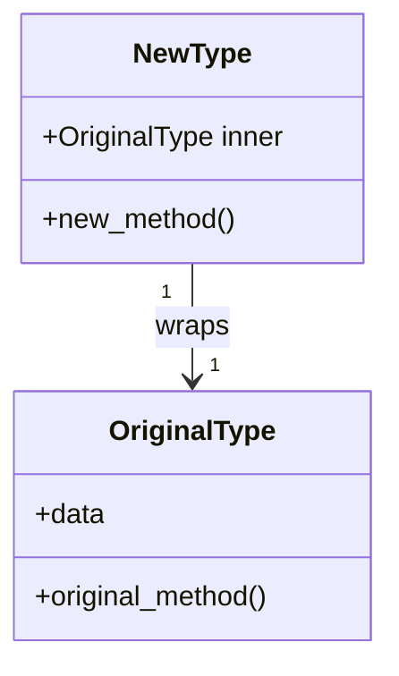

# The Newtype Pattern in Rust

## Introduction

The Newtype pattern is a powerful technique in Rust that allows you to create a new type that wraps around an existing type. This simple yet effective pattern originates from Haskell programming and has become a staple in Rust development for several important use cases.

In this tutorial, we'll explore how the Newtype pattern works, why it's useful, and show practical examples demonstrating its application in real-world Rust code.

## What is the Newtype Pattern?

The Newtype pattern involves creating a thin wrapper around an existing type to give it:

1. A more specific meaning
2. Different behavior (through trait implementations)
3. Enhanced type safety

In Rust, this pattern is implemented using a tuple struct with a single field:

```rust
// Basic syntax of the Newtype pattern
struct NewType(OriginalType);
```

This creates a completely new type that wraps the original type, rather than just creating an alias (which would be possible with `type NewName = OriginalType`).

## Why Use the Newtype Pattern?

The Newtype pattern solves several important problems in Rust:

### 1. Adding Semantic Meaning to Types

A newtype can add domain-specific meaning to a generic type:

```rust
// Instead of using String directly
struct Username(String);
struct Email(String);

fn register_user(username: Username, email: Email) {
    // Implementation...
}

fn main() {
    // Now you can't accidentally swap parameters
    let username = Username(String::from("rust_lover"));
    let email = Email(String::from("example@example.com"));
    
    register_user(username, email);
    
    // This would cause a compiler error:
    // register_user(email, username);
}
```

### 2. Implementing Traits for External Types

Rust has the "orphan rule" which prevents you from implementing external traits for external types. The Newtype pattern helps you work around this limitation:

```rust
// Cannot implement an external trait (Display) for an external type (Vec<T>)
// directly, but we can do so with a newtype
use std::fmt;

struct Wrapper(Vec<String>);

impl fmt::Display for Wrapper {
    fn fmt(&self, f: &mut fmt::Formatter) -> fmt::Result {
        write!(f, "[{}]", self.0.join(", "))
    }
}

fn main() {
    let w = Wrapper(vec![String::from("hello"), String::from("world")]);
    println!("w = {}", w); // Prints: w = [hello, world]
}
```

### 3. Adding Compile-Time Validation

Newtypes allow you to enforce constraints on values at compile time:

```rust
struct PositiveNumber(i32);

impl PositiveNumber {
    // Constructor that validates the value
    fn new(value: i32) -> Option<PositiveNumber> {
        if value > 0 {
            Some(PositiveNumber(value))
        } else {
            None
        }
    }
    
    fn value(&self) -> i32 {
        self.0
    }
}

fn main() {
    // This will succeed
    let num1 = PositiveNumber::new(42);
    
    // This will return None
    let num2 = PositiveNumber::new(-10);
    
    match num1 {
        Some(n) => println!("Valid positive number: {}", n.value()),
        None => println!("Not a positive number"),
    }
}
```

## Implementing the Newtype Pattern

Let's walk through implementing the Newtype pattern step by step:

### Basic Implementation

```rust
// Step 1: Define the newtype as a tuple struct
struct Kilometers(f64);

// Step 2: Implement methods for the type
impl Kilometers {
    fn new(value: f64) -> Kilometers {
        Kilometers(value)
    }
    
    fn value(&self) -> f64 {
        self.0
    }
}

// Step 3: Use the newtype
fn main() {
    let distance = Kilometers::new(23.5);
    println!("The distance is {} km", distance.value());
}
```

### Adding Traits to the Newtype

You can implement various traits for your newtype to give it additional capabilities:

```rust
use std::fmt;
use std::ops::Add;

struct Kilometers(f64);

// Implement Display
impl fmt::Display for Kilometers {
    fn fmt(&self, f: &mut fmt::Formatter) -> fmt::Result {
        write!(f, "{} km", self.0)
    }
}

// Implement addition
impl Add for Kilometers {
    type Output = Kilometers;
    
    fn add(self, other: Kilometers) -> Kilometers {
        Kilometers(self.0 + other.0)
    }
}

fn main() {
    let distance1 = Kilometers(10.0);
    let distance2 = Kilometers(20.0);
    let total = distance1 + distance2;
    
    println!("Total distance: {}", total); // Prints: Total distance: 30 km
}
```

## Deriving Behavior from the Wrapped Type

Sometimes you want your newtype to inherit some or all of the behavior of the inner type. You have two options:

### 1. Manually Implementing Traits

You can manually forward trait implementations to the wrapped type:

```rust
use std::ops::Deref;

struct Wrapper(Vec<String>);

// Implement Deref to get access to Vec's methods
impl Deref for Wrapper {
    type Target = Vec<String>;
    
    fn deref(&self) -> &Self::Target {
        &self.0
    }
}

fn main() {
    let w = Wrapper(vec![String::from("hello"), String::from("world")]);
    
    // Now we can use Vec methods directly
    println!("First item: {}", w[0]);
    println!("Length: {}", w.len());
}
```

### 2. Using the Derive Macro

For common traits, you can use the `#[derive]` macro:

```rust
#[derive(Debug, Clone, PartialEq)]
struct Miles(f64);

fn main() {
    let distance = Miles(26.2);
    
    // Using derived Debug trait
    println!("Marathon distance: {:?}", distance);
    
    // Using derived Clone trait
    let another_distance = distance.clone();
    
    // Using derived PartialEq trait
    if distance == another_distance {
        println!("Distances are equal!");
    }
}
```

## Real-World Applications

Let's look at some practical examples of the Newtype pattern in real-world Rust applications:

### Example 1: Creating Type-Safe IDs

In a database application, you might have different types of IDs. Using newtypes ensures you can't mix them up:

```rust
#[derive(Debug, Clone, PartialEq)]
struct UserId(u64);

#[derive(Debug, Clone, PartialEq)]
struct ProductId(u64);

fn get_user(id: UserId) -> Option<User> {
    // Implementation...
    # None
}

fn get_product(id: ProductId) -> Option<Product> {
    // Implementation...
    # None
}

fn main() {
    let user_id = UserId(1);
    let product_id = ProductId(1);
    
    // This works
    let user = get_user(user_id);
    
    // This would fail to compile:
    // let wrong_user = get_user(product_id);
}

// For the example to compile
struct User {}
struct Product {}
```

### Example 2: Units of Measurement

Newtypes are perfect for representing units of measurement to prevent unit conversion errors:

```rust
#[derive(Debug, Clone, Copy, PartialEq)]
struct Meters(f64);

#[derive(Debug, Clone, Copy, PartialEq)]
struct Feet(f64);

impl Meters {
    fn to_feet(&self) -> Feet {
        Feet(self.0 * 3.28084)
    }
}

impl Feet {
    fn to_meters(&self) -> Meters {
        Meters(self.0 / 3.28084)
    }
}

fn calculate_area_in_square_meters(length: Meters, width: Meters) -> f64 {
    length.0 * width.0
}

fn main() {
    let height = Meters(2.0);
    let height_in_feet = height.to_feet();
    
    println!("{:?} meters is approximately {:?} feet", height.0, height_in_feet.0);
    
    let length = Meters(10.0);
    let width = Meters(5.0);
    let area = calculate_area_in_square_meters(length, width);
    
    println!("Area: {} square meters", area);
    
    // This would fail to compile:
    // let wrong_area = calculate_area_in_square_meters(length, height_in_feet);
}
```

### Example 3: Working with External Libraries

Here's how the Newtype pattern can help when working with external libraries:

```rust
use std::fmt;

// Imagine this comes from an external crate
struct ExternalType {
    data: String,
}

// We create a newtype wrapper
struct MyWrapper(ExternalType);

// Now we can implement our own trait for the external type
impl fmt::Display for MyWrapper {
    fn fmt(&self, f: &mut fmt::Formatter) -> fmt::Result {
        write!(f, "MyWrapper containing: {}", self.0.data)
    }
}

fn main() {
    let external = ExternalType { data: String::from("some data") };
    let wrapped = MyWrapper(external);
    
    println!("{}", wrapped);
}
```

## Visualizing the Newtype Pattern

Here's a diagram showing how the Newtype pattern works conceptually:



## Performance Considerations

The Newtype pattern in Rust has negligible performance impact:

1. The wrapper struct is optimized away at compile time
2. There is no runtime overhead for accessing the inner value
3. The abstraction is zero-cost when properly implemented

## Common Pitfalls and Solutions

### Pitfall 1: Loss of Methods from Inner Type

When you create a newtype, you lose direct access to the methods of the inner type. This can be solved in several ways:

```rust
// Solution 1: Implement Deref
use std::ops::Deref;

struct Name(String);

impl Deref for Name {
    type Target = String;
    
    fn deref(&self) -> &Self::Target {
        &self.0
    }
}

// Solution 2: Create specific methods that forward to the inner type
impl Name {
    fn len(&self) -> usize {
        self.0.len()
    }
    
    fn is_empty(&self) -> bool {
        self.0.is_empty()
    }
}

// Solution 3: Create accessor method
impl Name {
    fn as_str(&self) -> &str {
        &self.0
    }
}

fn main() {
    let name = Name(String::from("Rust"));
    
    // Using Deref
    println!("Length via deref: {}", name.len());
    
    // Using forwarding method
    println!("Is empty: {}", name.is_empty());
    
    // Using accessor
    println!("Uppercase: {}", name.as_str().to_uppercase());
}
```

### Pitfall 2: Wrapping and Unwrapping Overhead

It can become tedious to constantly wrap and unwrap values:

```rust
// Solution: Implement From and Into traits for smoother conversions
#[derive(Debug)]
struct Password(String);

impl From<String> for Password {
    fn from(s: String) -> Self {
        Password(s)
    }
}

impl From<Password> for String {
    fn from(p: Password) -> Self {
        p.0
    }
}

fn main() {
    // Easy conversion from String to Password
    let password: Password = "secret123".to_string().into();
    println!("Password: {:?}", password);
    
    // Easy conversion from Password to String
    let password_string: String = password.into();
    println!("As string: {}", password_string);
}
```

## Summary

The Newtype pattern in Rust is a powerful technique that allows you to:

1. Create type-safe wrappers around existing types
2. Add domain-specific meaning to generic types
3. Implement traits for external types (bypassing the orphan rule)
4. Enforce compile-time validation on values
5. Create a zero-cost abstraction layer

By using the Newtype pattern, you can write more expressive, type-safe code that clearly communicates intent and prevents entire classes of bugs at compile time.

## Additional Resources

- [Rust By Example: Newtype Pattern](https://doc.rust-lang.org/rust-by-example/generics/new_types.html)
- [The Rust Programming Language Book: Using the Newtype Pattern](https://doc.rust-lang.org/book/ch19-03-advanced-traits.html#using-the-newtype-pattern-to-implement-external-traits-on-external-types)
- [Rust Design Patterns: Newtype](https://rust-unofficial.github.io/patterns/patterns/behavioural/newtype.html)

## Exercises

1. Create a `NonEmptyString` newtype that guarantees the string is never empty
2. Implement a `PositiveInteger` type with mathematical operations that preserve the positive constraint
3. Create a newtype wrapper around `Vec<T>` that implements a custom `Display` trait
4. Design a temperature conversion system using newtypes for Celsius and Fahrenheit
5. Use the newtype pattern to create a robust email validation system