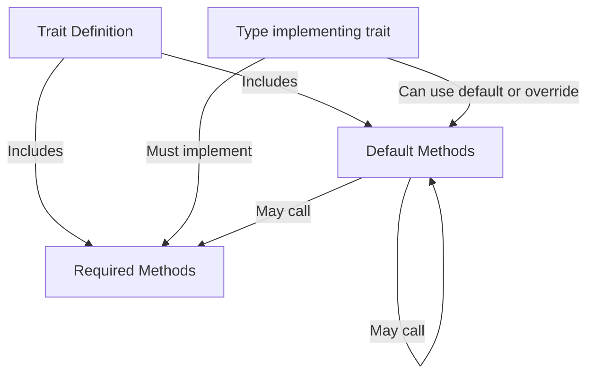

# Rust Default Implementations

## Introduction

When working with traits in Rust, you'll often want to define common behavior that trait implementers can rely on. **Default implementations** allow you to provide method bodies directly within a trait definition, giving implementers the option to either use your default behavior or override it with their own implementation.

This powerful feature enables you to:
- Create traits with optional functionality
- Reduce code duplication across implementations
- Build extensible APIs with reasonable defaults
- Implement the [Template Method pattern](https://en.wikipedia.org/wiki/Template_method_pattern) from object-oriented design

In this guide, we'll explore how default implementations work in Rust, when to use them, and examine practical examples to solidify your understanding.

## Understanding Default Implementations

### Basic Syntax

Let's start with the basic syntax for defining a trait with default implementations:

```rust
trait MyTrait {
    // Method without a default implementation (must be implemented)
    fn required_method(&self);
    
    // Method with a default implementation (optional to override)
    fn optional_method(&self) {
        println!("Using the default implementation!");
    }
}
```

In this example:
- `required_method` has no implementation, so any type that implements `MyTrait` must provide its own implementation
- `optional_method` has a default implementation, so types can choose to use this default or provide their own version

### A Simple Example

Let's see a complete working example:

```rust
trait Greeter {
    // This method must be implemented
    fn name(&self) -> String;
    
    // This method has a default implementation
    fn greet(&self) {
        println!("Hello, {}!", self.name());
    }
}

struct Person {
    name: String,
}

impl Greeter for Person {
    fn name(&self) -> String {
        self.name.clone()
    }
    // We're using the default implementation for greet()
}

struct FormalPerson {
    first_name: String,
    last_name: String,
}

impl Greeter for FormalPerson {
    fn name(&self) -> String {
        format!("{} {}", self.first_name, self.last_name)
    }
    
    // Override the default implementation
    fn greet(&self) {
        println!("Good day to you, {} {}!", self.first_name, self.last_name);
    }
}

fn main() {
    let person = Person { name: String::from("Alice") };
    let formal_person = FormalPerson { 
        first_name: String::from("Bob"), 
        last_name: String::from("Smith") 
    };
    
    // Uses default implementation
    person.greet(); // Output: Hello, Alice!
    
    // Uses custom implementation
    formal_person.greet(); // Output: Good day to you, Bob Smith!
}
```

In this example:
1. The `Greeter` trait defines a required `name()` method and a default implementation for `greet()`
2. `Person` implements only the required `name()` method and uses the default `greet()`
3. `FormalPerson` implements both methods, overriding the default `greet()` with its own formal greeting

## Using Self in Default Implementations

Default implementations can call other methods within the same trait, even required ones that don't have default implementations themselves. This allows you to build complex behavior from simpler components:

```rust
trait Summary {
    // Required method - must be implemented
    fn summarize_content(&self) -> String;
    
    // Optional method with default implementation
    fn title(&self) -> String {
        String::from("(Untitled)")
    }
    
    // Default implementation that uses other trait methods
    fn summarize(&self) -> String {
        format!("{}: {}", self.title(), self.summarize_content())
    }
}

struct Article {
    headline: String,
    content: String,
}

impl Summary for Article {
    fn summarize_content(&self) -> String {
        // Just return the first 50 characters with "..."
        if self.content.len() > 50 {
            format!("{}...", &self.content[..50])
        } else {
            self.content.clone()
        }
    }
    
    fn title(&self) -> String {
        self.headline.clone()
    }
    // Using the default implementation for summarize()
}

fn main() {
    let article = Article {
        headline: String::from("Rust Default Implementations Explained"),
        content: String::from("Default implementations allow trait authors to provide common behavior while giving implementers flexibility to customize when needed...")
    };
    
    println!("{}", article.summarize());
    // Output: Rust Default Implementations Explained: Default implementations allow trait authors to provide...
}
```

In this example, `summarize()` calls both `title()` and `summarize_content()` to build the complete summary string.

## When to Use Default Implementations

Default implementations are particularly useful in several scenarios:

### 1. Reducing Boilerplate Code

When a method can be implemented in terms of other trait methods, providing a default implementation reduces repetitive code across multiple implementers.

### 2. Providing Convenience Methods

You can offer additional functionality built on top of core trait methods:

```rust
trait Collection {
    fn size(&self) -> usize;
    
    // Convenience method with default implementation
    fn is_empty(&self) -> bool {
        self.size() == 0
    }
}
```

### 3. Allowing Partial Implementation

Default implementations let users implement only what they need, making traits more flexible and easier to adopt:

```rust
trait EventHandler {
    fn on_click(&self) {}    // Default: do nothing
    fn on_hover(&self) {}    // Default: do nothing
    fn on_key_press(&self, key: char) {} // Default: do nothing
    
    // Users can implement just the events they care about
}
```

### 4. Building Extensible APIs

Default implementations allow trait authors to add new methods in the future without breaking existing code:

```rust
// Version 1
trait Parser {
    fn parse(&self, input: &str) -> Result<(), String>;
}

// Version 2 - adds new functionality with defaults, preserving backward compatibility
trait Parser {
    fn parse(&self, input: &str) -> Result<(), String>;
    
    // New method with default implementation
    fn validate(&self, input: &str) -> bool {
        true  // By default, assume all input is valid
    }
}
```

## Real-World Example: A Custom Iterator

Let's look at a more practical example inspired by Rust's own `Iterator` trait. We'll create a simplified version:

```rust
trait MyIterator {
    // The only method that needs to be implemented
    fn next(&mut self) -> Option<i32>;
    
    // All these methods have default implementations
    fn count(mut self) -> usize where Self: Sized {
        let mut count = 0;
        while let Some(_) = self.next() {
            count += 1;
        }
        count
    }
    
    fn sum(mut self) -> i32 where Self: Sized {
        let mut total = 0;
        while let Some(value) = self.next() {
            total += value;
        }
        total
    }
    
    fn max(mut self) -> Option<i32> where Self: Sized {
        self.next().map(|first| {
            let mut max = first;
            while let Some(value) = self.next() {
                if value > max {
                    max = value;
                }
            }
            max
        })
    }
}

// A simple counter that implements our iterator
struct Counter {
    current: i32,
    max: i32,
}

impl Counter {
    fn new(max: i32) -> Self {
        Counter { current: 0, max }
    }
}

impl MyIterator for Counter {
    // We only need to implement the next method
    fn next(&mut self) -> Option<i32> {
        if self.current < self.max {
            let value = self.current;
            self.current += 1;
            Some(value)
        } else {
            None
        }
    }
    // We get count(), sum(), and max() for free!
}

fn main() {
    let counter = Counter::new(5);
    println!("Count: {}", counter.count());  // Output: Count: 5
    
    let counter = Counter::new(5);
    println!("Sum: {}", counter.sum());  // Output: Sum: 10 (0+1+2+3+4)
    
    let counter = Counter::new(5);
    println!("Max: {:?}", counter.max());  // Output: Max: Some(4)
    
    let counter = Counter::new(0);
    println!("Max of empty: {:?}", counter.max());  // Output: Max of empty: None
}
```

In this example:
1. The `MyIterator` trait requires only one method (`next()`) to be implemented
2. It provides default implementations for `count()`, `sum()`, and `max()`
3. The `Counter` struct only needs to implement `next()` but gets all the additional functionality for free

This pattern is extremely powerful and is used extensively in Rust's standard library.

## Default Implementations Flow

Let's visualize how default implementations work with a simple diagram:



## Advanced Feature: Default Type Parameters

In addition to method implementations, traits can also have default type parameters:

```rust
trait Container<T = String> {
    fn add(&mut self, item: T);
    fn get(&self, index: usize) -> Option<&T>;
}

// Implementation using the default type (String)
struct StringBox {
    items: Vec<String>
}

impl Container for StringBox {
    fn add(&mut self, item: String) {
        self.items.push(item);
    }
    
    fn get(&self, index: usize) -> Option<&String> {
        self.items.get(index)
    }
}

// Implementation with a custom type
struct NumberBox {
    items: Vec<i32>
}

impl Container<i32> for NumberBox {
    fn add(&mut self, item: i32) {
        self.items.push(item);
    }
    
    fn get(&self, index: usize) -> Option<&i32> {
        self.items.get(index)
    }
}
```

## Common Pitfalls and Best Practices

### Pitfall: Overusing Default Implementations

While default implementations are useful, overusing them can lead to complex, difficult-to-understand traits. Consider these guidelines:

- **Do** provide defaults for convenience methods built on core functionality
- **Don't** create traits where most methods have default implementations; consider splitting into smaller traits
- **Do** use default implementations to ensure backward compatibility
- **Don't** use default implementations that make surprising assumptions

### Pitfall: Conflicting Implementations with Multiple Traits

When multiple traits have methods with the same name, you'll need to use fully qualified syntax to disambiguate:

```rust
trait Animal {
    fn make_sound(&self) {
        println!("Some generic animal sound");
    }
}

trait Bird {
    fn make_sound(&self) {
        println!("Tweet tweet");
    }
}

struct Parrot;

impl Animal for Parrot {}
impl Bird for Parrot {}

fn main() {
    let polly = Parrot;
    
    // Error: multiple applicable methods
    // polly.make_sound();
    
    // Solution: use fully qualified syntax
    Animal::make_sound(&polly);  // Some generic animal sound
    Bird::make_sound(&polly);    // Tweet tweet
}
```

### Best Practice: Test Default Implementations

Always test your default implementations to ensure they work correctly with various implementers. Don't assume users will read your documentation or understand exactly how your defaults behave.

## Summary

Default implementations in Rust traits provide a powerful way to:

1. **Reduce code duplication** by sharing common behavior
2. **Create extensible APIs** that can grow without breaking changes
3. **Provide convenience methods** that build on core functionality
4. **Make traits more adaptable** by allowing partial implementation

By understanding when and how to use default implementations, you can write more flexible, maintainable code that's easier for others to use and extend.

## Exercises

1. Create a `Formatter` trait with required methods for formatting data and default methods for various output formats (plain text, HTML, JSON).

2. Implement a `Logger` trait with default implementations for different log levels (debug, info, warning, error) that build on a single required `log` method.

3. Design a `Serializable` trait with default implementations for serializing to different formats, all based on a required `to_bytes` method.

## Additional Resources

- [Rust Book: Default Implementations](https://doc.rust-lang.org/book/ch10-02-traits.html#default-implementations)
- [Rust API Guidelines](https://rust-lang.github.io/api-guidelines/interoperability.html)
- [Rust by Example: Traits](https://doc.rust-lang.org/rust-by-example/trait.html)
- [The Rust Standard Library's Iterator trait](https://doc.rust-lang.org/std/iter/trait.Iterator.html) (an excellent example of default implementations)