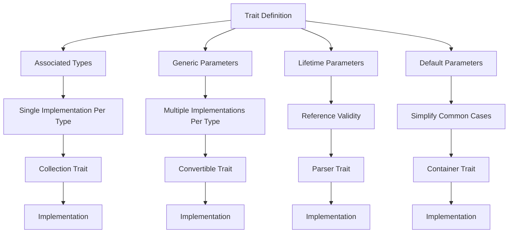

# Rust Trait Parameters

## Introduction

Rust's trait system is a powerful feature that enables polymorphism and code reuse. One aspect that makes traits especially flexible is the ability to use parameters with traits. These parameters allow you to create more generic and reusable code by specifying additional requirements or configurations for your traits. In this guide, we'll explore how trait parameters work, why they're useful, and how to implement them in your own Rust code.

## Trait Parameters Basics

In Rust, trait parameters come in several forms:

1. **Associated Types**: Define placeholder types within traits
2. **Generic Parameters**: Allow traits to work with different types
3. **Lifetime Parameters**: Ensure references live long enough

Let's explore each of these concepts with examples.

## Associated Types

Associated types provide a way to define a placeholder type within a trait definition. The concrete type will be specified when implementing the trait.

### Basic Syntax

```rust
trait Collection {
    type Item;  // This is an associated type
    
    fn add(&mut self, item: Self::Item);
    fn get(&self, index: usize) -> Option<&Self::Item>;
}
```

### Example: Building a Collection

Let's implement our `Collection` trait for a simple vector:

```rust
struct MyVec<T> {
    items: Vec<T>,
}

impl<T> Collection for MyVec<T> {
    type Item = T;  // Specify the concrete type for Item
    
    fn add(&mut self, item: T) {
        self.items.push(item);
    }
    
    fn get(&self, index: usize) -> Option<&T> {
        self.items.get(index)
    }
}

fn main() {
    let mut numbers = MyVec { items: Vec::new() };
    numbers.add(1);
    numbers.add(2);
    numbers.add(3);
    
    println!("First item: {:?}", numbers.get(0));  // Output: First item: Some(1)
}
```

### Why Use Associated Types?

Associated types improve code clarity by allowing you to refer to a specific type within a trait without having to specify it as a generic parameter everywhere. They're particularly useful when a trait will only ever need one implementation for a given type.

## Generic Parameters

Generic parameters in traits allow a trait to work with different types, specified at the point of implementation.

### Basic Syntax

```rust
trait Convertible<T> {
    fn convert(&self) -> T;
}
```

### Example: Type Conversion

```rust
struct Person {
    name: String,
    age: u32,
}

impl Convertible<String> for Person {
    fn convert(&self) -> String {
        format!("{} ({})", self.name, self.age)
    }
}

impl Convertible<u32> for Person {
    fn convert(&self) -> u32 {
        self.age
    }
}

fn main() {
    let person = Person {
        name: String::from("Alice"),
        age: 30,
    };
    
    let as_string: String = person.convert();
    let as_age: u32 = person.convert();
    
    println!("Person as string: {}", as_string);  // Output: Person as string: Alice (30)
    println!("Person as age: {}", as_age);        // Output: Person as age: 30
}
```

### Generic vs. Associated Types

You might wonder when to use generic parameters instead of associated types. Here's a comparison:

- Use **generic parameters** when:
  - You need multiple implementations of a trait for the same type
  - The trait functionality varies based on the parameter type

- Use **associated types** when:
  - There should be only one implementation for a given type
  - You want to simplify the function signatures that use the trait

## Lifetime Parameters

Lifetime parameters ensure that references in your traits live long enough to be valid.

### Basic Syntax

```rust
trait Parser<'a> {
    type Input;
    fn parse(&self, input: &'a Self::Input) -> Result<(), &'static str>;
}
```

### Example: Document Parser

```rust
struct XmlDocument {
    content: String,
}

struct XmlParser;

impl<'a> Parser<'a> for XmlParser {
    type Input = XmlDocument;
    
    fn parse(&self, doc: &'a XmlDocument) -> Result<(), &'static str> {
        // Simple validation: check if the document starts with an XML tag
        if doc.content.trim_start().starts_with("<?xml") {
            Ok(())
        } else {
            Err("Not a valid XML document")
        }
    }
}

fn main() {
    let doc = XmlDocument {
        content: String::from("<?xml version=\"1.0\" encoding=\"UTF-8\"?><root></root>"),
    };
    
    let parser = XmlParser;
    match parser.parse(&doc) {
        Ok(()) => println!("Valid XML document!"),
        Err(e) => println!("Error: {}", e),
    }
    // Output: Valid XML document!
}
```

## Default Type Parameters

Rust also allows you to specify default types for your trait parameters, making it easier to use in common cases.

### Basic Syntax

```rust
trait Container<T = String> {
    fn contains(&self, item: T) -> bool;
}
```

### Example: Default Container

```rust
struct Box<T> {
    items: Vec<T>,
}

// Implementation using the default String type
impl Container for Box<String> {
    fn contains(&self, item: String) -> bool {
        self.items.contains(&item)
    }
}

// Explicit implementation for a different type
impl Container<i32> for Box<i32> {
    fn contains(&self, item: i32) -> bool {
        self.items.contains(&item)
    }
}

fn main() {
    let string_box = Box { items: vec![String::from("hello"), String::from("world")] };
    let int_box = Box { items: vec![1, 2, 3, 4, 5] };
    
    println!("String box contains 'hello': {}", string_box.contains(String::from("hello")));
    // Output: String box contains 'hello': true
    
    println!("Int box contains 3: {}", int_box.contains(3));
    // Output: Int box contains 3: true
}
```

## Where Clauses with Trait Parameters

The `where` clause allows you to specify additional constraints on your trait parameters.

### Basic Syntax

```rust
trait Sortable<T> where T: Ord {
    fn sort(&mut self);
}
```

### Example: Sorting Collection

```rust
struct SortableVec<T> {
    items: Vec<T>,
}

impl<T> Sortable<T> for SortableVec<T> where T: Ord {
    fn sort(&mut self) {
        self.items.sort();
    }
}

fn main() {
    let mut numbers = SortableVec { items: vec![5, 2, 8, 1, 3] };
    numbers.sort();
    
    println!("Sorted numbers: {:?}", numbers.items);
    // Output: Sorted numbers: [1, 2, 3, 5, 8]
}
```

## Combining Multiple Parameter Types

In real-world scenarios, you'll often need to combine different types of parameters.

### Example: Advanced Iterator

```rust
trait AdvancedIterator<'a, T: 'a, E = ()> {
    type Item;
    
    fn next(&mut self) -> Option<Self::Item>;
    fn collect_results(self) -> Result<Vec<T>, E> where Self: Sized;
}

struct EvenNumberIterator {
    current: i32,
    max: i32,
}

impl<'a> AdvancedIterator<'a, i32, &'static str> for EvenNumberIterator {
    type Item = i32;
    
    fn next(&mut self) -> Option<Self::Item> {
        if self.current <= self.max {
            let result = self.current;
            self.current += 2;
            Some(result)
        } else {
            None
        }
    }
    
    fn collect_results(self) -> Result<Vec<i32>, &'static str> {
        if self.max >= 0 {
            let mut results = Vec::new();
            let mut iter = self;
            while let Some(item) = iter.next() {
                results.push(item);
            }
            Ok(results)
        } else {
            Err("Maximum value cannot be negative")
        }
    }
}

fn main() {
    let even_iter = EvenNumberIterator { current: 0, max: 10 };
    
    match even_iter.collect_results() {
        Ok(numbers) => println!("Even numbers: {:?}", numbers),
        Err(e) => println!("Error: {}", e),
    }
    // Output: Even numbers: [0, 2, 4, 6, 8, 10]
}
```

## Real-World Application: Building a Data Processing Pipeline

Let's create a more practical example: a data processing pipeline using trait parameters.

```rust
trait DataProcessor<I, O, E = String> {
    fn process(&self, input: I) -> Result<O, E>;
}

struct JsonParser;
struct DataValidator;
struct DataTransformer;

// Parse string to JSON
impl DataProcessor<String, serde_json::Value, String> for JsonParser {
    fn process(&self, input: String) -> Result<serde_json::Value, String> {
        serde_json::from_str(&input).map_err(|e| format!("JSON parsing error: {}", e))
    }
}

// Validate JSON data
impl DataProcessor<serde_json::Value, serde_json::Value, String> for DataValidator {
    fn process(&self, input: serde_json::Value) -> Result<serde_json::Value, String> {
        // Check if the required fields exist
        if input.is_object() {
            let obj = input.as_object().unwrap();
            if obj.contains_key("name") && obj.contains_key("age") {
                Ok(input)
            } else {
                Err("Missing required fields".to_string())
            }
        } else {
            Err("Input is not a JSON object".to_string())
        }
    }
}

// Transform JSON to a Person struct
#[derive(Debug)]
struct Person {
    name: String,
    age: u32,
}

impl DataProcessor<serde_json::Value, Person, String> for DataTransformer {
    fn process(&self, input: serde_json::Value) -> Result<Person, String> {
        let obj = input.as_object().unwrap();
        
        let name = obj["name"].as_str()
            .ok_or("Name is not a string".to_string())?
            .to_string();
            
        let age = obj["age"].as_u64()
            .ok_or("Age is not a number".to_string())?
            as u32;
            
        Ok(Person { name, age })
    }
}

// Process pipeline function that works with any chain of processors
fn process_data<P1, P2, P3, I, T1, T2, O, E>(
    input: I,
    processor1: &P1,
    processor2: &P2,
    processor3: &P3,
) -> Result<O, E>
where
    P1: DataProcessor<I, T1, E>,
    P2: DataProcessor<T1, T2, E>,
    P3: DataProcessor<T2, O, E>,
    E: From<String>,
{
    let intermediate1 = processor1.process(input)?;
    let intermediate2 = processor2.process(intermediate1)?;
    processor3.process(intermediate2)
}

fn main() {
    // This would typically come from a file or network request
    let json_str = r#"{"name": "Alice", "age": 30, "city": "New York"}"#.to_string();
    
    let parser = JsonParser;
    let validator = DataValidator;
    let transformer = DataTransformer;
    
    match process_data(json_str, &parser, &validator, &transformer) {
        Ok(person) => println!("Processed person: {:?}", person),
        Err(e) => println!("Error: {}", e),
    }
    // Output: Processed person: Person { name: "Alice", age: 30 }
}
```

This example demonstrates how trait parameters enable you to create flexible, composable components that can be chained together to form complex processing pipelines.

## Visualizing Trait Parameters

Here's a diagram to help visualize how different trait parameters work together:



## Summary

Trait parameters in Rust provide a powerful way to create flexible, reusable, and type-safe abstractions. To recap:

- **Associated types** define placeholder types that are specified when implementing the trait, useful when there should be only one implementation for a given type.
- **Generic parameters** allow a trait to work with different types and enable multiple implementations for the same type.
- **Lifetime parameters** ensure references live long enough to be valid.
- **Default type parameters** simplify trait usage in common cases.
- **Where clauses** allow you to specify additional constraints on your trait parameters.

By combining these different forms of parameters, you can create complex and powerful abstractions while maintaining Rust's strong safety guarantees.

## Exercises

1. Implement a trait called `Mappable<T, U>` with a method `map` that converts elements of type `T` to type `U`.
2. Create a trait called `Stateful` with an associated type `State` and methods to get and set the state.
3. Implement a `Cache<K, V>` trait with lifetime parameters for a simple key-value store.
4. Extend the data processing pipeline example to include error handling and recovery.
5. Create a trait hierarchy using trait parameters for a simple game engine.

## Additional Resources

- [The Rust Programming Language Book: Traits chapter](https://doc.rust-lang.org/book/ch10-02-traits.html)
- [Rust by Example: Traits section](https://doc.rust-lang.org/rust-by-example/trait.html)
- [Rust RFC 0195: Associated Items](https://github.com/rust-lang/rfcs/blob/master/text/0195-associated-items.md)
- [Rust Standard Library Documentation](https://doc.rust-lang.org/std/)
- [Learning Rust With Entirely Too Many Linked Lists](https://rust-unofficial.github.io/too-many-lists/) - An excellent resource for understanding advanced Rust concepts through practical examples