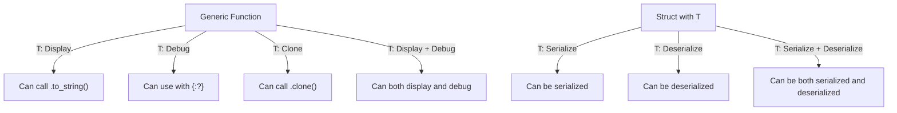

# Rust Trait Bounds

## Introduction

When working with generic types in Rust, you often need to specify what capabilities a type must have. This is where **trait bounds** come in - they let you constrain generic types to only those that implement specific traits. Trait bounds are a powerful feature in Rust that enable you to write flexible code without sacrificing type safety or performance.

In this tutorial, we'll explore how trait bounds work, why they're useful, and how to use them effectively in your Rust programs.

## Understanding Trait Bounds

### What Are Trait Bounds?

Trait bounds specify that a generic type parameter must implement a particular trait or set of traits. This allows your code to rely on the behavior provided by those traits.

Let's start with a simple example:

```rust
// Without trait bounds
fn print_item<T>(item: T) {
    // How do we print T?
    // println!("{}", item); // This won't compile!
}

// With trait bounds
fn print_item_with_bound<T: std::fmt::Display>(item: T) {
    println!("{}", item);
}

fn main() {
    print_item_with_bound(42); // Works!
    print_item_with_bound("Hello"); // Works!
    
    // This would fail to compile:
    // print_item_with_bound(vec![1, 2, 3]);
}
```

In this example:
- The first function `print_item` takes a generic type `T` but can't print it because it doesn't know if `T` can be displayed.
- The second function `print_item_with_bound` specifies that `T` must implement the `Display` trait, which guarantees that we can print it.

### Basic Syntax

There are several ways to specify trait bounds in Rust:

1. **In the type parameter declaration**:

```rust
fn example<T: Clone>(item: T) {
    // Use T, knowing it implements Clone
    let cloned = item.clone();
}
```

2. **Using the `where` clause** (more readable for complex bounds):

```rust
fn example<T>(item: T) 
where 
    T: Clone,
{
    let cloned = item.clone();
}
```

3. **Multiple trait bounds** with `+`:

```rust
fn example<T: Clone + std::fmt::Debug>(item: T) {
    let cloned = item.clone();
    println!("Debug view: {:?}", cloned);
}

// Or with where clause:
fn example<T>(item: T) 
where 
    T: Clone + std::fmt::Debug,
{
    let cloned = item.clone();
    println!("Debug view: {:?}", cloned);
}
```

## Practical Examples

### Example 1: A Generic Sum Function

Let's create a function that can sum any collection of numeric values:

```rust
fn sum<T, I>(items: I) -> T
where
    T: std::ops::Add<Output = T> + Default,
    I: IntoIterator<Item = T>,
{
    let mut total = T::default();
    for item in items {
        total = total + item;
    }
    total
}

fn main() {
    let integers = vec![1, 2, 3, 4, 5];
    let floats = vec![1.1, 2.2, 3.3, 4.4, 5.5];
    
    println!("Sum of integers: {}", sum(integers)); // Output: Sum of integers: 15
    println!("Sum of floats: {}", sum(floats));     // Output: Sum of floats: 16.5
}
```

In this example:
- We constrain `T` to types that implement `Add` (so we can add them together) and `Default` (so we can create an initial value).
- We constrain `I` to types that can be converted into an iterator of `T` items.

### Example 2: A Data Processor with Trait Bounds

Let's create a more complex example that processes data from different sources:

```rust
trait DataSource {
    type Item;
    fn get_data(&self) -> Vec<Self::Item>;
}

trait Processor<T> {
    fn process(&self, data: Vec<T>) -> String;
}

struct DataAnalyzer<S, P> {
    source: S,
    processor: P,
}

impl<S, P, T> DataAnalyzer<S, P>
where
    S: DataSource<Item = T>,
    P: Processor<T>,
{
    fn new(source: S, processor: P) -> Self {
        DataAnalyzer { source, processor }
    }
    
    fn analyze(&self) -> String {
        let data = self.source.get_data();
        self.processor.process(data)
    }
}

// Implementation examples
struct NumberSource {
    numbers: Vec<i32>,
}

impl DataSource for NumberSource {
    type Item = i32;
    
    fn get_data(&self) -> Vec<Self::Item> {
        self.numbers.clone()
    }
}

struct SumProcessor;

impl Processor<i32> for SumProcessor {
    fn process(&self, data: Vec<i32>) -> String {
        let sum: i32 = data.iter().sum();
        format!("Sum: {}", sum)
    }
}

fn main() {
    let source = NumberSource { 
        numbers: vec![1, 2, 3, 4, 5] 
    };
    let processor = SumProcessor;
    
    let analyzer = DataAnalyzer::new(source, processor);
    let result = analyzer.analyze();
    
    println!("Analysis result: {}", result); // Output: Analysis result: Sum: 15
}
```

This example demonstrates:
- Using associated types with traits
- Constraining generic parameters with multiple trait bounds
- Creating a flexible architecture where components can be mixed and matched as long as they satisfy the required traits

## Conditional Implementation with Trait Bounds

You can use trait bounds to conditionally implement methods or traits for types:

```rust
struct Wrapper<T> {
    value: T,
}

// This implementation only exists if T implements Display
impl<T: std::fmt::Display> Wrapper<T> {
    fn display(&self) {
        println!("Wrapped value: {}", self.value);
    }
}

// This implementation only exists if T implements Debug but not Display
impl<T> Wrapper<T> 
where 
    T: std::fmt::Debug,
    T: std::fmt::Display,
{
    fn debug(&self) {
        println!("Wrapped value: {:?}", self.value);
    }
}

fn main() {
    let w = Wrapper { value: "hello" };
    w.display(); // This works because &str implements Display
    
    let w2 = Wrapper { value: vec![1, 2, 3] };
    // w2.display(); // This would not compile because Vec doesn't implement Display
    w2.debug();  // This works because Vec implements Debug
}
```

## Advanced Trait Bounds

### Trait Objects vs Generic Type Parameters

Trait bounds with generics are resolved at compile time (static dispatch), while trait objects are resolved at runtime (dynamic dispatch):

```rust
// Using generics with trait bounds (static dispatch)
fn process_static<T: std::fmt::Display>(item: T) {
    println!("{}", item);
}

// Using trait objects (dynamic dispatch)
fn process_dynamic(item: &dyn std::fmt::Display) {
    println!("{}", item);
}

fn main() {
    let string = "Hello";
    let number = 42;
    
    // Both of these call specialized versions of the function
    process_static(string);
    process_static(number);
    
    // Both of these call the same function with different trait objects
    process_dynamic(&string);
    process_dynamic(&number);
}
```

### Trait Bounds in Lifetimes

You can also specify that a type must outlive a certain lifetime:

```rust
fn longest_with_announcement<'a, T>(
    x: &'a str,
    y: &'a str,
    ann: T,
) -> &'a str
where
    T: std::fmt::Display,
{
    println!("Announcement! {}", ann);
    if x.len() > y.len() {
        x
    } else {
        y
    }
}

fn main() {
    let string1 = String::from("long string is long");
    let string2 = String::from("xyz");
    let result = longest_with_announcement(
        string1.as_str(),
        string2.as_str(),
        "Today's winner is...",
    );
    println!("The longest string is: {}", result);
}
```

## Visual Representation

Here's a diagram showing how trait bounds work with generic types:



## Common Trait Bounds in Rust

Here are some commonly used trait bounds in Rust:

| Trait        | Purpose                                  | Example                              |
|--------------|------------------------------------------|--------------------------------------|
| `Display`    | Format a value for user-facing output    | `println!("{}", value)`              |
| `Debug`      | Format a value for debugging             | `println!("{:?}", value)`            |
| `Clone`      | Create a copy of a value                 | `let copy = value.clone()`           |
| `Copy`       | Types that can be copied bit by bit      | `let copy = value;` (without moving) |
| `PartialEq`  | Compare values for equality              | `if a == b { ... }`                  |
| `Eq`         | Reflexive equality comparison            | (extends `PartialEq`)                |
| `PartialOrd` | Compare values for ordering              | `if a < b { ... }`                   |
| `Ord`        | Total ordering                           | `vec.sort()`                         |
| `Default`    | Create a default instance                | `let instance = T::default();`       |
| `Sized`      | Types with a known size at compile time  | (most types, automatically applied)  |
| `Send`       | Types that can be sent between threads   | (for thread safety)                  |
| `Sync`       | Types that can be shared between threads | (for thread safety)                  |

## Summary

Trait bounds are a powerful mechanism in Rust that allow you to:

1. Constrain generic types to those that implement specific behaviors
2. Write flexible code without sacrificing type safety
3. Express complex requirements for your generic types
4. Create conditional implementations based on trait implementations
5. Build extensible systems where components can be mixed and matched

By using trait bounds effectively, you can write code that's both flexible and safe, leveraging Rust's powerful type system to catch potential errors at compile time rather than runtime.

## Exercises

1. Create a function that takes a vector of any type that can be ordered and returns the largest element.

2. Implement a generic `Cache<T>` structure that can store items of any type that can be cloned and hashed.

3. Create a trait `Converter` with a method `convert_to<U>(&self) -> U` and implement it for various types.

4. Define a struct `Pair<T>` with implementations for different operations based on what traits `T` implements.

5. Implement a function that can create a pretty-printed table from any collection of items that implement both `Display` and `Debug`.

## Additional Resources

- [The Rust Programming Language Book: Traits](https://doc.rust-lang.org/book/ch10-02-traits.html)
- [Rust By Example: Traits](https://doc.rust-lang.org/rust-by-example/trait.html)
- [Rust Reference: Trait Bounds](https://doc.rust-lang.org/reference/trait-bounds.html)
- [Rustonomicon: Higher-Rank Trait Bounds](https://doc.rust-lang.org/nomicon/hrtb.html)