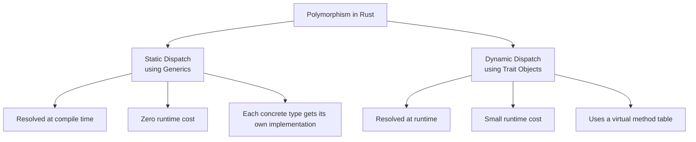

# Rust Trait Objects

## Introduction

Trait objects are a powerful feature in Rust that enable runtime polymorphism. While Rust's generics provide compile-time polymorphism, trait objects allow you to work with different types that implement the same trait at runtime. This is particularly useful when you need to store a collection of different types that all implement a common trait, or when you don't know which concrete type you'll be working with until your program runs.

In this guide, we'll explore:
- What trait objects are and how they differ from generics
- How to create and use trait objects
- The `dyn` keyword
- Object safety requirements
- Performance considerations
- Real-world applications of trait objects

## Understanding Trait Objects

### What is a Trait Object?

A trait object is a value that represents a type that implements a specific trait. Unlike generics (which are resolved at compile time), trait objects allow for runtime polymorphism through a mechanism called *dynamic dispatch*.

Here's a simple comparison:



### From Generics to Trait Objects

Let's first look at how we might use generics with traits:

```rust
// Define a trait
trait Shape {
    fn area(&self) -> f64;
}

// Implement the trait for some types
struct Circle {
    radius: f64,
}

impl Shape for Circle {
    fn area(&self) -> f64 {
        std::f64::consts::PI * self.radius * self.radius
    }
}

struct Rectangle {
    width: f64,
    height: f64,
}

impl Shape for Rectangle {
    fn area(&self) -> f64 {
        self.width * self.height
    }
}

// A function that uses generics
fn print_area<T: Shape>(shape: &T) {
    println!("Area: {}", shape.area());
}

fn main() {
    let circle = Circle { radius: 2.0 };
    let rectangle = Rectangle { width: 3.0, height: 4.0 };
    
    print_area(&circle);      // Output: Area: 12.566370614359172
    print_area(&rectangle);   // Output: Area: 12
}
```

The compiler will generate separate versions of `print_area` for each type that implements `Shape`. This is efficient but can lead to larger binary sizes if used extensively with many types.

Now, let's see how trait objects differ:

```rust
// The same trait and implementations as before

// A function that uses a trait object
fn print_area(shape: &dyn Shape) {
    println!("Area: {}", shape.area());
}

fn main() {
    let circle = Circle { radius: 2.0 };
    let rectangle = Rectangle { width: 3.0, height: 4.0 };
    
    print_area(&circle);      // Output: Area: 12.566370614359172
    print_area(&rectangle);   // Output: Area: 12
}
```

With trait objects, only one version of `print_area` is generated, which can handle any type that implements `Shape`. The runtime determines which implementation of `area()` to call.

## Creating and Using Trait Objects

### The `dyn` Keyword

In Rust, we use the `dyn` keyword to indicate a trait object. This keyword was introduced to make it clear when dynamic dispatch is being used:

```rust
// These are trait objects
let shape1: &dyn Shape = &circle;
let shape2: Box<dyn Shape> = Box::new(rectangle);
```

The `dyn` keyword signals that we're using dynamic dispatch for the trait.

### Common Ways to Create Trait Objects

There are several ways to work with trait objects in Rust:

1. **References to trait objects**:
```rust
fn process_shape(shape: &dyn Shape) {
    println!("Area: {}", shape.area());
}
```

2. **Boxed trait objects**:
```rust
fn create_shape(circle: bool) -> Box<dyn Shape> {
    if circle {
        Box::new(Circle { radius: 1.0 })
    } else {
        Box::new(Rectangle { width: 1.0, height: 1.0 })
    }
}
```

3. **Vectors of trait objects**:
```rust
let shapes: Vec<Box<dyn Shape>> = vec![
    Box::new(Circle { radius: 1.0 }),
    Box::new(Rectangle { width: 2.0, height: 3.0 }),
];

for shape in &shapes {
    println!("Area: {}", shape.area());
}
```

### Dynamic Dispatch Under the Hood

When you use a trait object, Rust implements dynamic dispatch using a concept called a "virtual method table" or "vtable." The vtable is a struct that contains pointers to the concrete implementations of the trait methods for a specific type.

A trait object consists of two pointers:
1. A pointer to the actual data (the value)
2. A pointer to the vtable for the specific implementation of the trait

This is how Rust knows which function to call at runtime.

## Object Safety

Not all traits can be used as trait objects. For a trait to be "object safe," it must meet certain requirements:

1. The trait doesn't require `Self: Sized`
2. All methods in the trait:
   - Have a `self` parameter of type `Self`, `&Self`, or `&mut Self`
   - Don't use `Self` anywhere else in the signature (except in `self` parameters)
   - Don't have generic type parameters

Here's an example of a trait that is not object safe:

```rust
trait NotObjectSafe {
    fn clone_box(&self) -> Self;  // Returns Self, not object safe
    fn method_without_self();     // No self parameter, not object safe
}
```

If you try to use this trait as a trait object, the compiler will give you an error explaining why it's not object safe.

## A Practical Example: Drawing Different Shapes

Let's create a more comprehensive example of using trait objects to draw different shapes:

```rust
trait Drawable {
    fn draw(&self);
    fn name(&self) -> &str;
}

struct Circle {
    radius: f64,
    name: String,
}

impl Drawable for Circle {
    fn draw(&self) {
        println!("Drawing a circle with radius {}", self.radius);
    }
    
    fn name(&self) -> &str {
        &self.name
    }
}

struct Rectangle {
    width: f64,
    height: f64,
    name: String,
}

impl Drawable for Rectangle {
    fn draw(&self) {
        println!("Drawing a rectangle with width {} and height {}", 
                 self.width, self.height);
    }
    
    fn name(&self) -> &str {
        &self.name
    }
}

struct Canvas {
    drawable_items: Vec<Box<dyn Drawable>>,
}

impl Canvas {
    fn new() -> Self {
        Canvas { drawable_items: Vec::new() }
    }
    
    fn add_item(&mut self, item: Box<dyn Drawable>) {
        self.drawable_items.push(item);
    }
    
    fn draw_all(&self) {
        println!("Canvas drawing begins:");
        for item in &self.drawable_items {
            println!("Drawing item: {}", item.name());
            item.draw();
        }
        println!("Canvas drawing completed");
    }
}

fn main() {
    let mut canvas = Canvas::new();
    
    canvas.add_item(Box::new(Circle { 
        radius: 5.0, 
        name: String::from("Big Circle") 
    }));
    
    canvas.add_item(Box::new(Rectangle { 
        width: 10.0, 
        height: 7.0, 
        name: String::from("Welcome Banner") 
    }));
    
    canvas.add_item(Box::new(Circle { 
        radius: 2.0, 
        name: String::from("Small Circle") 
    }));
    
    canvas.draw_all();
}
```

Output:
```
Canvas drawing begins:
Drawing item: Big Circle
Drawing a circle with radius 5
Drawing item: Welcome Banner
Drawing a rectangle with width 10 and height 7
Drawing item: Small Circle
Drawing a circle with radius 2
Canvas drawing completed
```

This example demonstrates a real-world use case for trait objects: a drawing application that needs to work with different shapes. The `Canvas` can store and draw any type that implements the `Drawable` trait.

## Performance Considerations

Trait objects come with some runtime overhead compared to using generics:

1. **Memory Layout**: A trait object consists of two pointers (data + vtable), so it's twice the size of a regular pointer.
2. **Dynamic Dispatch**: Each method call requires an extra indirection through the vtable.
3. **No Inlining**: The compiler can't inline method calls on trait objects because it doesn't know which implementation will be used at runtime.

In most applications, this overhead is negligible. However, if you're working on performance-critical code, you might want to benchmark both approaches.

## When to Use Trait Objects

Use trait objects when you need:

1. **Heterogeneous collections**: When you need to store different types in the same collection.
2. **Runtime type determination**: When you don't know which concrete type you'll be working with until runtime.
3. **Plugin systems**: When you want to allow users to extend your application with their own types.

Use generics when:

1. You know all the types at compile time.
2. You need maximum performance.
3. You want compile-time guarantees.

## Real-World Application: A Plugin System

Let's see how trait objects can be used to implement a simple plugin system:

```rust
// Define the plugin trait
trait Plugin {
    fn name(&self) -> &str;
    fn execute(&self, data: &str) -> String;
}

// A text transformation plugin
struct ReversePlugin;

impl Plugin for ReversePlugin {
    fn name(&self) -> &str {
        "Reverse Plugin"
    }
    
    fn execute(&self, data: &str) -> String {
        data.chars().rev().collect()
    }
}

// An uppercase conversion plugin
struct UppercasePlugin;

impl Plugin for UppercasePlugin {
    fn name(&self) -> &str {
        "Uppercase Plugin"
    }
    
    fn execute(&self, data: &str) -> String {
        data.to_uppercase()
    }
}

// Application that uses plugins
struct Application {
    plugins: Vec<Box<dyn Plugin>>,
}

impl Application {
    fn new() -> Self {
        Application { plugins: Vec::new() }
    }
    
    fn register_plugin(&mut self, plugin: Box<dyn Plugin>) {
        println!("Registering plugin: {}", plugin.name());
        self.plugins.push(plugin);
    }
    
    fn process_data(&self, data: &str) {
        println!("Original data: '{}'", data);
        
        for plugin in &self.plugins {
            let result = plugin.execute(data);
            println!("{} processed: '{}'", plugin.name(), result);
        }
    }
}

fn main() {
    let mut app = Application::new();
    
    app.register_plugin(Box::new(ReversePlugin));
    app.register_plugin(Box::new(UppercasePlugin));
    
    app.process_data("Hello, Rust trait objects!");
}
```

Output:
```
Registering plugin: Reverse Plugin
Registering plugin: Uppercase Plugin
Original data: 'Hello, Rust trait objects!'
Reverse Plugin processed: '!stcejbo tiart tsuR ,olleH'
Uppercase Plugin processed: 'HELLO, RUST TRAIT OBJECTS!'
```

This example shows how trait objects enable plugin architectures where the main application can work with any type that implements the plugin interface.

## Summary

Trait objects are a powerful feature of Rust that enable runtime polymorphism through dynamic dispatch. They allow you to:

- Work with heterogeneous collections of types that implement the same trait
- Use runtime polymorphism when needed
- Build flexible systems like plugin architectures

While trait objects have a slight performance overhead compared to generics, they provide flexibility that can be essential in many applications.

Remember these key points:
- Use the `dyn` keyword to denote a trait object
- Trait objects use dynamic dispatch via a vtable
- Not all traits are object-safe
- Trait objects are typically used with references (`&dyn Trait`) or smart pointers (`Box<dyn Trait>`)

## Exercises

1. Create a trait called `Serializable` with a method `to_json` that returns a JSON string representation. Implement this trait for different types like `Person`, `Product`, and `Order`. Then create a function that takes a trait object and serializes it.

2. Extend the drawing example to include more shapes like `Triangle` and `Polygon`. Add methods to the `Drawable` trait that calculate the area and perimeter of each shape.

3. Build a simple text processing pipeline using trait objects, where each processor implements a `TextProcessor` trait with a `process` method. Chain multiple processors together to transform text in different ways.

## Additional Resources

- [Rust Book: Trait Objects](https://doc.rust-lang.org/book/ch17-02-trait-objects.html)
- [Rust By Example: Trait Objects](https://doc.rust-lang.org/rust-by-example/trait/trait_objects.html)
- [The `dyn` Keyword](https://doc.rust-lang.org/std/keyword.dyn.html)
- [Object Safety Rules](https://doc.rust-lang.org/reference/items/traits.html#object-safety)