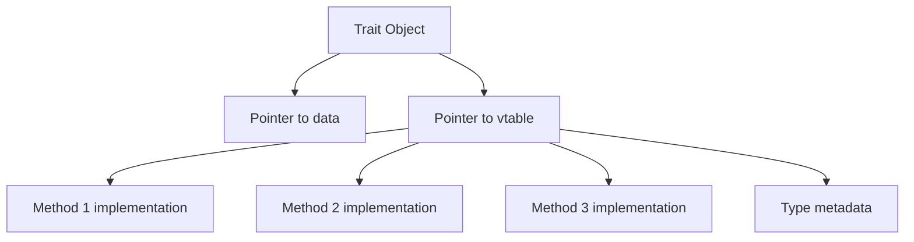

# Rust Dynamic Dispatch

## Introduction

When writing Rust programs, you'll often need to work with different types that share common behavior. For example, you might have various shapes that can all be drawn, or different notification systems that can all send messages. Rust provides two main ways to handle these situations: **static dispatch** and **dynamic dispatch**.

In this guide, we'll focus on dynamic dispatch in Rust, which allows your code to decide at runtime which implementation of a trait to use. This is a fundamental concept for writing flexible, polymorphic code that can work with different types without knowing them in advance.

## Prerequisites

Before diving into dynamic dispatch, you should be familiar with:
- Basic Rust syntax
- Rust traits (what they are and how to implement them)
- Generic functions and types

## Understanding Static vs. Dynamic Dispatch

Let's first understand the difference between static and dynamic dispatch:

- **Static Dispatch**: The compiler knows exactly which function to call at compile time. This is achieved using generics and trait bounds and has zero runtime cost.
- **Dynamic Dispatch**: The decision about which function to call is made at runtime. This adds a small performance overhead but provides more flexibility.

## Trait Objects and Dynamic Dispatch

Rust implements dynamic dispatch through **trait objects**. A trait object is a combination of:

1. A pointer to the concrete type implementing a trait
2. A vtable (virtual method table) that contains pointers to the actual methods for that type

### Creating Trait Objects

You create a trait object by using one of these syntaxes:
- `&dyn Trait` - a reference to a trait object
- `Box<dyn Trait>` - a heap-allocated trait object
- `Arc<dyn Trait>` or `Rc<dyn Trait>` - reference-counted trait objects

Let's see this in action with a simple example:

```rust
// Define a trait
trait Drawable {
    fn draw(&self);
}

// Implement the trait for different types
struct Circle {
    radius: f64,
}

impl Drawable for Circle {
    fn draw(&self) {
        println!("Drawing a circle with radius {}", self.radius);
    }
}

struct Square {
    side: f64,
}

impl Drawable for Square {
    fn draw(&self) {
        println!("Drawing a square with side {}", self.side);
    }
}

// Static dispatch with generics
fn draw_static<T: Drawable>(shape: &T) {
    shape.draw();
}

// Dynamic dispatch with trait objects
fn draw_dynamic(shape: &dyn Drawable) {
    shape.draw();
}

fn main() {
    let circle = Circle { radius: 5.0 };
    let square = Square { side: 4.0 };
    
    // Both work the same way from the caller's perspective
    draw_static(&circle);
    draw_static(&square);
    
    draw_dynamic(&circle);
    draw_dynamic(&square);
}
```

Output:
```
Drawing a circle with radius 5
Drawing a square with side 4
Drawing a circle with radius 5
Drawing a square with side 4
```

In this example, both approaches accomplish the same thing, but they work differently under the hood:

1. `draw_static` uses generics and gets specialized by the compiler for each type (creating separate functions for `Circle` and `Square`)
2. `draw_dynamic` uses a trait object and decides which implementation to call at runtime

## How Dynamic Dispatch Works

When you use a trait object, Rust needs to keep track of two pieces of information:



1. **Data Pointer**: Points to the actual instance of the concrete type
2. **Virtual Table (vtable)**: Contains pointers to the specific implementations of all the trait's methods for that type

At runtime, when a method is called on a trait object:
1. Rust looks up the appropriate method in the vtable
2. It then calls that method with the data pointer

This adds a small performance cost (typically two pointer dereferences) compared to static dispatch, where the correct function is determined at compile time.

## When to Use Dynamic Dispatch

Dynamic dispatch is particularly useful when:

1. **Collections of different types**: When you need to store different types in the same collection
2. **Plugin systems**: For loading components at runtime
3. **State patterns**: When objects change their behavior based on internal state
4. **Unknown types at compile time**: When the exact types aren't known until the program runs

### Example: A Collection of Mixed Types

One of the most common use cases for dynamic dispatch is storing different types in the same collection:

```rust
fn main() {
    // Create a vector of trait objects
    let shapes: Vec<Box<dyn Drawable>> = vec![
        Box::new(Circle { radius: 5.0 }),
        Box::new(Square { side: 4.0 }),
        Box::new(Triangle { base: 3.0, height: 4.0 }),
    ];
    
    // Draw all shapes
    for shape in &shapes {
        shape.draw();
    }
}

// Additional struct for the example
struct Triangle {
    base: f64,
    height: f64,
}

impl Drawable for Triangle {
    fn draw(&self) {
        println!("Drawing a triangle with base {} and height {}", 
                 self.base, self.height);
    }
}
```

Output:
```
Drawing a circle with radius 5
Drawing a square with side 4
Drawing a triangle with base 3 and height 4
```

Without dynamic dispatch, it would be impossible to store these different types in the same collection while preserving their specific behaviors.

## Trait Object Limitations

Trait objects have some limitations you should be aware of:

1. **Not all traits can be made into trait objects**: To be "object safe," a trait must follow these rules:
   - The return type cannot be `Self`
   - There can't be generic type parameters

2. **Size limitations**: The compiler needs to know the size of values at compile time, which is why we often use `Box`, `&`, or other pointer types with trait objects

3. **Performance impact**: Dynamic dispatch has a small runtime cost compared to static dispatch

## Real-World Example: Plugin System

Let's create a simple plugin system for a text editor:

```rust
// Plugin trait that defines common functionality
trait Plugin {
    fn name(&self) -> &str;
    fn execute(&self, text: &str) -> String;
}

// Word count plugin
struct WordCountPlugin;

impl Plugin for WordCountPlugin {
    fn name(&self) -> &str {
        "Word Counter"
    }
    
    fn execute(&self, text: &str) -> String {
        let count = text.split_whitespace().count();
        format!("The text contains {} words", count)
    }
}

// Text reversal plugin
struct ReverseTextPlugin;

impl Plugin for ReverseTextPlugin {
    fn name(&self) -> &str {
        "Text Reverser"
    }
    
    fn execute(&self, text: &str) -> String {
        text.chars().rev().collect()
    }
}

// A text editor that can use plugins
struct TextEditor {
    text: String,
    plugins: Vec<Box<dyn Plugin>>,
}

impl TextEditor {
    fn new(text: &str) -> Self {
        TextEditor {
            text: text.to_string(),
            plugins: Vec::new(),
        }
    }
    
    fn add_plugin(&mut self, plugin: Box<dyn Plugin>) {
        self.plugins.push(plugin);
    }
    
    fn run_plugin(&self, plugin_index: usize) -> Option<String> {
        self.plugins.get(plugin_index).map(|plugin| {
            println!("Running plugin: {}", plugin.name());
            plugin.execute(&self.text)
        })
    }
}

fn main() {
    let mut editor = TextEditor::new("Hello, world! This is a test of the plugin system.");
    
    // Add plugins
    editor.add_plugin(Box::new(WordCountPlugin));
    editor.add_plugin(Box::new(ReverseTextPlugin));
    
    // Run plugins
    if let Some(result) = editor.run_plugin(0) {
        println!("Result: {}", result);
    }
    
    if let Some(result) = editor.run_plugin(1) {
        println!("Result: {}", result);
    }
}
```

Output:
```
Running plugin: Word Counter
Result: The text contains 10 words
Running plugin: Text Reverser
Result: .metsys nigulp eht fo tset a si sihT !dlrow ,olleH
```

This example demonstrates how dynamic dispatch enables plugin systems where components can be added and used at runtime without the core code needing to know the specific types in advance.

## Performance Considerations

Dynamic dispatch has some performance overhead compared to static dispatch:

1. **Memory usage**: Trait objects require storing the vtable
2. **Method calls**: Each method call requires an extra pointer dereference
3. **Optimization limitations**: The compiler can't inline methods or apply certain optimizations across trait object boundaries

However, for most applications, this overhead is negligible compared to the flexibility dynamic dispatch provides. In performance-critical code paths, you might want to prefer static dispatch.

## Static vs. Dynamic Dispatch Comparison

| Feature | Static Dispatch | Dynamic Dispatch |
|---------|----------------|------------------|
| When determined | Compile time | Runtime |
| Performance | Faster (zero cost) | Slight overhead |
| Code size | Can lead to larger binary (monomorphization) | Smaller binary possible |
| Flexibility | Less flexible | More flexible |
| Implementation | Generics with trait bounds | Trait objects |
| Syntax example | `fn process<T: Trait>(item: T)` | `fn process(item: &dyn Trait)` |

## Summary

Dynamic dispatch in Rust provides a powerful way to write flexible, polymorphic code through trait objects. By delaying the decision of which implementation to use until runtime, your code can work with different types that share a common interface.

Key takeaways:
- Dynamic dispatch uses trait objects (`&dyn Trait`, `Box<dyn Trait>`, etc.)
- It enables polymorphism at runtime, allowing different types to be used interchangeably
- It's ideal for heterogeneous collections, plugin systems, and cases where types aren't known at compile time
- It comes with a small performance cost compared to static dispatch

By understanding when and how to use dynamic dispatch, you can write more flexible and maintainable Rust code while still taking advantage of Rust's safety guarantees.

## Exercises

1. Create a `Logger` trait with a `log` method and implement it for different types like `ConsoleLogger`, `FileLogger`, and `NetworkLogger`.

2. Implement a simple command system for a game where each command implements a `Command` trait with an `execute` method.

3. Extend the plugin system example with more plugins and features.

4. Benchmark the performance difference between static and dynamic dispatch for a simple function on your machine.

## Additional Resources

- [Rust Book: Trait Objects](https://doc.rust-lang.org/book/ch17-02-trait-objects.html)
- [Rust By Example: Trait Objects](https://doc.rust-lang.org/rust-by-example/trait/trait_objects.html)
- [Rust Reference: Trait Objects](https://doc.rust-lang.org/reference/types/trait-object.html)
- [Rust Design Patterns: Dynamic Dispatch](https://rust-unofficial.github.io/patterns/patterns/behavioural/strategy.html)