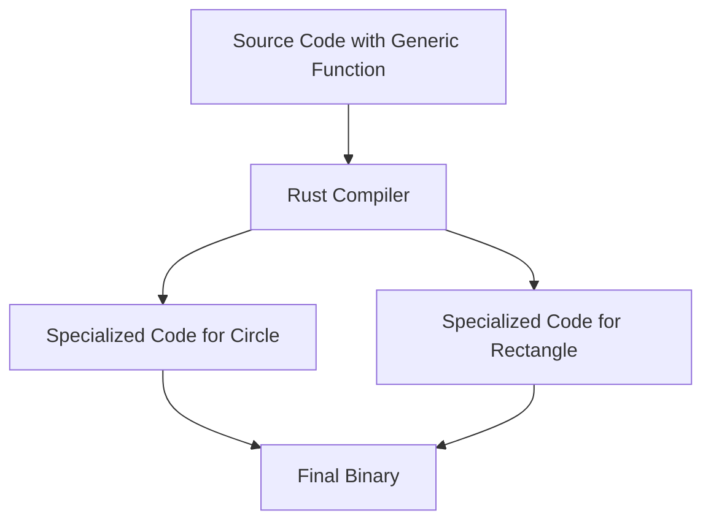

# Rust Static Dispatch

## Introduction

When working with traits in Rust, one of the most powerful features is the ability to write code that works with any type that implements a specific trait. This flexibility allows you to create reusable and modular code without sacrificing performance. **Static dispatch** is a mechanism Rust uses to resolve which implementation of a trait method to call at compile time rather than runtime.

In this tutorial, we'll explore how static dispatch works in Rust, why it's important, and how to implement it effectively in your code. By the end, you'll understand how Rust's static dispatch contributes to both the flexibility and performance of your programs.

## What is Static Dispatch?

Static dispatch means that the specific function to call is determined at compile time. When you use static dispatch with traits in Rust, the compiler generates specialized code for each concrete type that implements the trait. This approach:

- Allows the compiler to optimize the code extensively
- Eliminates runtime overhead of virtual function calls
- Results in faster execution and smaller memory footprint

Let's see how static dispatch works in practice.

## Static Dispatch Using Generic Functions

The most common way to use static dispatch in Rust is through generic functions with trait bounds:

```rust
// Define a trait
trait Drawable {
    fn draw(&self);
}

// Implement the trait for different types
struct Circle {
    radius: f64,
}

impl Drawable for Circle {
    fn draw(&self) {
        println!("Drawing a circle with radius: {}", self.radius);
    }
}

struct Rectangle {
    width: f64,
    height: f64,
}

impl Drawable for Rectangle {
    fn draw(&self) {
        println!("Drawing a rectangle with width: {} and height: {}", self.width, self.height);
    }
}

// Generic function using static dispatch
fn draw_shape<T: Drawable>(shape: &T) {
    shape.draw();
}

fn main() {
    let circle = Circle { radius: 5.0 };
    let rectangle = Rectangle { width: 10.0, height: 20.0 };
    
    draw_shape(&circle);
    draw_shape(&rectangle);
}
```

**Output:**
```
Drawing a circle with radius: 5
Drawing a rectangle with width: 10 and height: 20
```

In this example, `draw_shape` is a generic function that can accept any type implementing the `Drawable` trait. The compiler generates specialized versions of this function for each concrete type.

## What Happens Under the Hood?

Let's visualize what happens with static dispatch:



When the compiler sees the above code, it essentially creates:

```rust
// Generated by the compiler (not actual Rust syntax)
fn draw_shape_circle(shape: &Circle) {
    shape.draw();  // Directly calls Circle's implementation
}

fn draw_shape_rectangle(shape: &Rectangle) {
    shape.draw();  // Directly calls Rectangle's implementation
}
```

This process is called **monomorphization**. The compiler creates separate copies of the function for each concrete type it's used with, resulting in highly optimized code.

## Static Dispatch with the `impl Trait` Syntax

Rust also offers a more concise syntax for static dispatch using `impl Trait` in function arguments:

```rust
// Using impl Trait syntax for static dispatch
fn draw_shape(shape: &impl Drawable) {
    shape.draw();
}
```

This is syntactic sugar for the generic version we saw earlier. It's more concise but functionally identical to using `<T: Drawable>`.

## Returning Types with Static Dispatch

Static dispatch also works when returning values from functions. The `impl Trait` syntax is particularly useful in return types:

```rust
fn create_drawable_shape(circle: bool) -> impl Drawable {
    if circle {
        Circle { radius: 5.0 }
    } else {
        Rectangle { width: 4.0, height: 3.0 }
    }
}

fn main() {
    let shape = create_drawable_shape(true);
    shape.draw();
}
```

Note that with `impl Trait` in return position, all possible return values must be of the same concrete type. The function above would not compile if it returned different types in different branches.

## When to Use Static Dispatch

Static dispatch is generally preferred in Rust when:

1. You know all the types that will implement your trait at compile time
2. Performance is critical (especially for small, frequently called functions)
3. You want the compiler to perform optimizations like inlining

## Static Dispatch vs. Dynamic Dispatch

Let's compare static dispatch with dynamic dispatch (which we'll explore in more detail in a later tutorial):

| Feature | Static Dispatch | Dynamic Dispatch |
|---------|----------------|------------------|
| Resolution time | Compile time | Runtime |
| Performance | Faster, no runtime overhead | Slightly slower due to indirection |
| Binary size | Potentially larger due to monomorphization | Potentially smaller |
| Flexibility | Less flexible, all types must be known at compile time | More flexible, allows for heterogeneous collections |
| Implementation | Generics (`<T: Trait>`) or `impl Trait` | Trait objects (`dyn Trait`) |

## Real-World Example: A Shape Area Calculator

Let's see a more practical example of static dispatch with a shape area calculator:

```rust
trait Shape {
    fn area(&self) -> f64;
    fn name(&self) -> &str;
}

struct Circle {
    radius: f64,
}

impl Shape for Circle {
    fn area(&self) -> f64 {
        std::f64::consts::PI * self.radius * self.radius
    }
    
    fn name(&self) -> &str {
        "Circle"
    }
}

struct Rectangle {
    width: f64,
    height: f64,
}

impl Shape for Rectangle {
    fn area(&self) -> f64 {
        self.width * self.height
    }
    
    fn name(&self) -> &str {
        "Rectangle"
    }
}

// Static dispatch with multiple trait bounds
fn print_shape_info<T: Shape + std::fmt::Debug>(shape: &T) {
    println!("Shape: {:?}", shape);
    println!("Type: {}", shape.name());
    println!("Area: {:.2}", shape.area());
}

fn main() {
    let circle = Circle { radius: 5.0 };
    let rectangle = Rectangle { width: 10.0, height: 20.0 };
    
    print_shape_info(&circle);
    println!("---");
    print_shape_info(&rectangle);
}
```

This example demonstrates static dispatch with multiple trait bounds (`Shape + std::fmt::Debug`). The compiler will generate specialized versions of `print_shape_info` for each type.

## Performance Considerations

To demonstrate the performance benefits of static dispatch, consider a benchmark:

```rust
use std::time::{Duration, Instant};

// Function to benchmark performance
fn benchmark<F>(name: &str, iterations: u32, f: F) 
where
    F: Fn(),
{
    let start = Instant::now();
    for _ in 0..iterations {
        f();
    }
    let duration = start.elapsed();
    println!("{}: {:?} ({:.2} ns/iteration)", 
        name, 
        duration, 
        duration.as_nanos() as f64 / iterations as f64
    );
}

fn main() {
    const ITERATIONS: u32 = 10_000_000;
    
    // Circle for testing
    let circle = Circle { radius: 5.0 };
    
    // Benchmark static dispatch
    benchmark("Static dispatch", ITERATIONS, || {
        let _area = calculate_area(&circle);
    });
}

// Static dispatch version
fn calculate_area<T: Shape>(shape: &T) -> f64 {
    shape.area()
}
```

When compared to dynamic dispatch (which we'll cover in another tutorial), static dispatch typically performs better, especially for simple operations called in tight loops.

## Multiple Trait Bounds

You can also specify multiple trait bounds for more complex behaviors:

```rust
use std::fmt::Display;

// Function with multiple trait bounds
fn describe_shape<T: Shape + Display + Clone>(shape: &T) {
    let cloned = shape.clone();
    println!("Shape description: {}", cloned);
    println!("Shape area: {:.2}", shape.area());
}
```

This approach ensures that any type passed to `describe_shape` implements not only the `Shape` trait but also `Display` and `Clone`.

## Where Clauses for Complex Trait Bounds

For more complex trait bounds, the `where` clause provides a cleaner syntax:

```rust
fn process_shape<T>(shape: &T) -> String
where
    T: Shape + Clone + Display,
    T::Output: Display,
{
    let cloned = shape.clone();
    format!("Processed shape: {}, Area: {:.2}", cloned, shape.area())
}
```

The `where` clause makes complex trait bounds more readable, especially when you have multiple generic parameters or associated types.

## Summary

Static dispatch in Rust is a powerful feature that allows you to write generic code that works with any type implementing a specific trait while maintaining performance comparable to concrete implementations. Key points to remember:

- Static dispatch resolves which function to call at compile time
- It's implemented using generics (`<T: Trait>`) or the `impl Trait` syntax
- The compiler performs monomorphization, creating specialized versions of code for each concrete type
- Static dispatch provides better performance at the cost of potential code bloat
- It's ideal for performance-critical code where all types are known at compile time

By mastering static dispatch, you'll be able to write Rust code that is both flexible and efficient, taking full advantage of Rust's zero-cost abstractions.

## Exercises

1. **Basic Implementation**: Create a `Printable` trait with a `print` method, and implement it for at least three different types. Then write a generic function that accepts any `Printable` type and calls its `print` method.

2. **Performance Comparison**: Write a simple benchmark that compares the performance of static dispatch vs. direct method calls for a simple operation.

3. **Complex Traits**: Create a system of traits for various vehicles that can `start()`, `stop()`, and `refuel()`. Implement these traits for different vehicle types and write generic functions that work with any vehicle type.

4. **Return Types Challenge**: Write a function that returns different concrete types that implement the same trait based on an input parameter. Use the `impl Trait` syntax for the return type.

## Additional Resources

- [Rust Book: Traits chapter](https://doc.rust-lang.org/book/ch10-02-traits.html)
- [Rust by Example: Traits](https://doc.rust-lang.org/rust-by-example/trait.html)
- [The Rust Performance Book](https://nnethercote.github.io/perf-book/introduction.html)
- [Rust API Guidelines](https://rust-lang.github.io/api-guidelines/)

By following these guidelines and practicing with the provided examples, you'll be well on your way to mastering static dispatch in Rust and writing more efficient, flexible code.