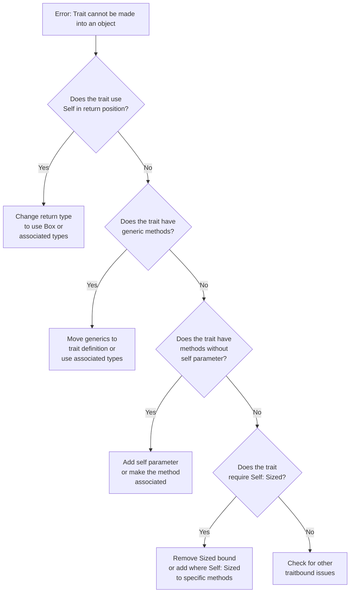

# Rust Object Safety

## Introduction

If you've been working with Rust for a while, you might have encountered a puzzling error message like this:

```
error[E0038]: the trait `MyTrait` cannot be made into an object
  --> src/main.rs:10:5
   |
10 |     let obj: Box<dyn MyTrait> = Box::new(MyStruct);
   |     ^^^^^^^^^^^^^^^^^^^^^^^^^^^^^^^^^^^^^^^^^^^^ `MyTrait` cannot be made into an object
   |
   = note: the trait cannot be made into an object because it requires `Self: Sized`
```

This error relates to a concept called **object safety** - an important aspect of Rust's trait system that determines which traits can be used as trait objects. In this guide, we'll explore:

- What object safety is and why it matters
- The rules that make a trait object-safe
- How to fix common object safety issues
- Practical examples of working with trait objects

## What Are Trait Objects?

Before diving into object safety, let's understand trait objects. In Rust, we have two main ways to use traits:

1. **Static dispatch**: Using generics and monomorphization (resolved at compile time)
2. **Dynamic dispatch**: Using trait objects (resolved at runtime)

A **trait object** allows for runtime polymorphism through a pointer type like `&dyn MyTrait` or `Box<dyn MyTrait>`. This enables you to store different types that implement the same trait behind the same interface.

```rust
// Define a trait
trait Animal {
    fn make_sound(&self) -> String;
}

// Implement for different types
struct Dog;
impl Animal for Dog {
    fn make_sound(&self) -> String {
        "Woof!".to_string()
    }
}

struct Cat;
impl Animal for Cat {
    fn make_sound(&self) -> String {
        "Meow!".to_string()
    }
}

fn main() {
    // Create a vector of trait objects
    let animals: Vec<Box<dyn Animal>> = vec![
        Box::new(Dog),
        Box::new(Cat),
    ];
    
    // Use dynamic dispatch
    for animal in animals {
        println!("{}", animal.make_sound());
    }
}
```

**Output:**
```
Woof!
Meow!
```

But not all traits can be used this way! This is where object safety comes in.

## What is Object Safety?

**Object safety** is a set of rules that determine whether a trait can be used as a trait object (`dyn Trait`). A trait is object-safe if Rust can work with it through a pointer without knowing the concrete type at compile time.

Think of it this way: when you use a trait object, Rust creates a special vtable (virtual method table) that stores pointers to the trait methods for your specific type. But for this to work, Rust needs to be able to call these methods through a pointer to an unknown-sized type.

## The Rules of Object Safety

A trait is object-safe if all its methods satisfy these conditions:

1. The method doesn't use `Self` as a parameter or return type
2. The method doesn't have generic type parameters
3. The method isn't a static method (doesn't have a `self` parameter)
4. The trait doesn't require `Self: Sized`

Let's see how these rules play out in practice.

## Common Object Safety Issues and Fixes

### Issue 1: Using `Self` in Return Types

```rust
trait Clone {
    fn clone(&self) -> Self; // Returns Self!
}

// Trying to use as a trait object
fn main() {
    // Error! Clone is not object-safe
    let cloneable: Box<dyn Clone> = Box::new(String::from("Hello"));
}
```

**Why it fails**: When using a trait object, Rust doesn't know what concrete type `Self` will be, so it can't determine the return type's size.

**Fix**: Use associated types or trait objects in return types instead of `Self`:

```rust
trait CloneableObject {
    fn clone_box(&self) -> Box<dyn CloneableObject>;
}

// Now it can be used as a trait object
```

### Issue 2: Generic Methods

```rust
trait Converter {
    fn convert<T>(&self, input: i32) -> T;
}

fn main() {
    // Error! Converter is not object-safe
    let converter: Box<dyn Converter> = Box::new(MyConverter);
}
```

**Why it fails**: Generic methods require monomorphization (creating separate implementations for each type), which conflicts with dynamic dispatch.

**Fix**: Use associated types or make the entire trait generic instead of the method:

```rust
trait Converter<T> {
    fn convert(&self, input: i32) -> T;
}

// Now you can use it with a specific type
let converter: Box<dyn Converter<String>> = Box::new(MyConverter);
```

### Issue 3: Static Methods (No Self Parameter)

```rust
trait Factory {
    fn create() -> i32; // No self parameter!
}

fn main() {
    // Error! Factory is not object-safe
    let factory: Box<dyn Factory> = Box::new(MyFactory);
}
```

**Why it fails**: Without a `self` parameter, Rust can't determine which implementation to call through the trait object.

**Fix**: Add a `self` parameter or use associated functions for static methods:

```rust
trait Factory {
    fn create(&self) -> i32; // Now has a self parameter
}
```

### Issue 4: Requiring `Self: Sized`

```rust
trait BigTrait: Sized {  // Explicitly requires Sized
    fn method(&self);
}

// Or implicitly:
trait ImplicitSized {
    fn method(self);  // Takes self by value, implying Sized
}

fn main() {
    // Error! Neither trait is object-safe
    let obj: Box<dyn BigTrait> = Box::new(MyStruct);
}
```

**Why it fails**: Trait objects are unsized types, but the trait requires `Self` to be `Sized`.

**Fix**: Remove the `Sized` bound or make only specific methods require `Sized`:

```rust
trait BetterTrait {
    fn safe_method(&self);  // Object-safe method
    
    fn sized_method(self) where Self: Sized;  // Only this method requires Sized
}

// Now you can use it as a trait object
let obj: Box<dyn BetterTrait> = Box::new(MyStruct);
// But you can only call safe_method on obj
```

## Diagnosing Object Safety Issues

Let's see how to diagnose object safety problems:



## Practical Example: Building a Plugin System

Let's create a simple plugin system using trait objects to show object safety in a real-world context:

```rust
// A trait for plugins
trait Plugin {
    fn name(&self) -> &str;
    fn execute(&self, input: &str) -> String;
    
    // This method requires Self: Sized, but that's OK
    // as we mark it with a where clause
    fn clone_instance(&self) -> Box<Self> where Self: Sized + Clone;
}

// Example plugins
#[derive(Clone)]
struct ReversePlugin;

impl Plugin for ReversePlugin {
    fn name(&self) -> &str {
        "Reverse"
    }
    
    fn execute(&self, input: &str) -> String {
        input.chars().rev().collect()
    }
    
    fn clone_instance(&self) -> Box<Self> {
        Box::new(self.clone())
    }
}

#[derive(Clone)]
struct UppercasePlugin;

impl Plugin for UppercasePlugin {
    fn name(&self) -> &str {
        "Uppercase"
    }
    
    fn execute(&self, input: &str) -> String {
        input.to_uppercase()
    }
    
    fn clone_instance(&self) -> Box<Self> {
        Box::new(self.clone())
    }
}

// Application that uses plugins
struct Application {
    plugins: Vec<Box<dyn Plugin>>,
}

impl Application {
    fn new() -> Self {
        Application { plugins: Vec::new() }
    }
    
    fn add_plugin(&mut self, plugin: Box<dyn Plugin>) {
        self.plugins.push(plugin);
    }
    
    fn process_text(&self, text: &str) -> Vec<(String, String)> {
        self.plugins
            .iter()
            .map(|plugin| (plugin.name().to_string(), plugin.execute(text)))
            .collect()
    }
}

fn main() {
    let mut app = Application::new();
    
    // Add plugins
    app.add_plugin(Box::new(ReversePlugin));
    app.add_plugin(Box::new(UppercasePlugin));
    
    // Process text with all plugins
    let results = app.process_text("Hello, Rust!");
    
    // Display results
    for (name, result) in results {
        println!("{} plugin: {}", name, result);
    }
}
```

**Output:**
```
Reverse plugin: !tsuR ,olleH
Uppercase plugin: HELLO, RUST!
```

Notice how our `Plugin` trait is object-safe, even though it includes the `clone_instance` method that uses `Self`. By adding the `where Self: Sized` clause to just that method, we make it exempt from object safety requirements while keeping the rest of the trait object-safe.

## Advanced Topic: Making Non-Object-Safe Traits Usable

Sometimes, you might need to work with traits that aren't object-safe. Here are some approaches:

### 1. Create an Object-Safe Wrapper Trait

```rust
// Not object-safe
trait NonObjectSafe {
    fn method(&self) -> Self;
}

// Object-safe wrapper
trait ObjectSafeWrapper {
    fn method_wrapper(&self) -> Box<dyn ObjectSafeWrapper>;
}

// Implement the wrapper for any type that implements the original trait
impl<T: NonObjectSafe + 'static> ObjectSafeWrapper for T {
    fn method_wrapper(&self) -> Box<dyn ObjectSafeWrapper> {
        Box::new(self.method())
    }
}
```

### 2. Use the `object_safe_trait` Crate

For more complex cases, consider using the `object_safe_trait` crate from crates.io, which helps create object-safe versions of traits automatically.

## Summary

Object safety is a fundamental concept in Rust's trait system that controls which traits can be used as trait objects. Understanding object safety helps you design more flexible and reusable APIs.

Key points to remember:

1. Trait objects allow for dynamic dispatch through types like `&dyn Trait` or `Box<dyn Trait>`
2. A trait is object-safe if it doesn't use `Self` in return position, doesn't have generic methods, doesn't have static methods, and doesn't require `Self: Sized`
3. You can make specific methods exempt from object safety requirements with `where Self: Sized`
4. The compiler will tell you when a trait isn't object-safe, and usually suggests fixes

By mastering object safety, you'll be better equipped to design traits that work well with both static and dynamic dispatch, giving you more flexibility in your Rust code.

## Exercises

1. Try to convert the standard library's `Iterator` trait into an object-safe version
2. Implement a drawing application that uses trait objects for different shapes
3. Create a command-line parser that uses trait objects for different command handlers
4. Identify which of Rust's standard library traits are object-safe and which aren't

## Additional Resources

- [Rust Book: Object Safety](https://doc.rust-lang.org/book/ch17-02-trait-objects.html#object-safety-is-required-for-trait-objects)
- [Rust Reference: Object Safety](https://doc.rust-lang.org/reference/items/traits.html#object-safety)
- [The `object_safe_trait` crate](https://crates.io/crates/object_safe_trait)
- [Rust By Example: Trait Objects](https://doc.rust-lang.org/rust-by-example/trait/trait_objects.html)